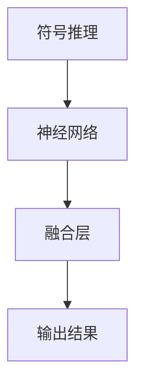
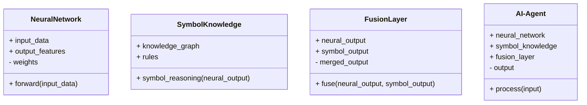
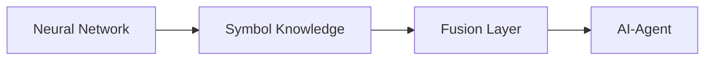
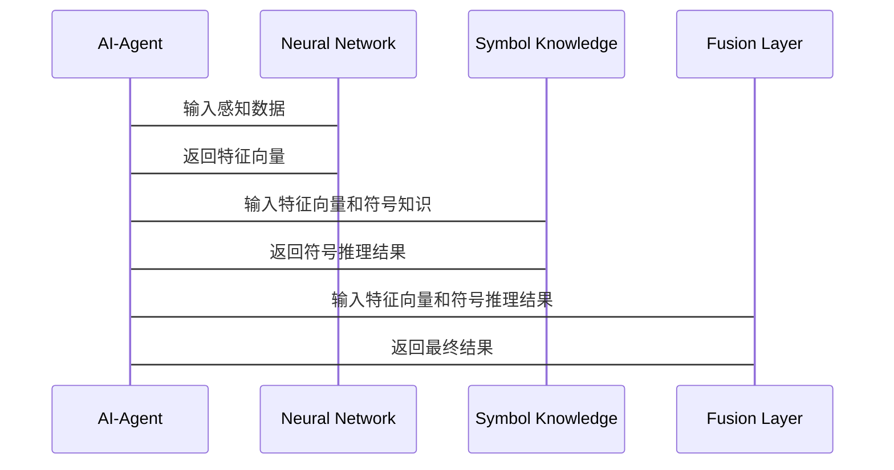

                 


# AI Agent中的神经符号融合技术

> **关键词**：神经符号融合技术、AI Agent、符号推理、神经网络、知识图谱、强化学习  
>
> **摘要**：本文系统地探讨了AI Agent中的神经符号融合技术，结合神经网络和符号推理的优势，提出了一种创新的融合方法。通过详细分析神经符号融合的核心概念、算法原理、系统架构以及实际应用案例，展示了如何利用神经符号融合技术提升AI Agent的智能性和实用性。

---

## 第1章 AI Agent与神经符号融合技术概述

### 1.1 神经符号融合技术的背景与问题背景

#### 1.1.1 传统符号推理的局限性
符号推理是一种基于逻辑规则的推理方法，广泛应用于专家系统、知识图谱等领域。然而，符号推理依赖于明确的知识表示和逻辑规则，难以处理模糊、动态和复杂的问题。此外，符号推理缺乏对数据的语义理解和上下文感知能力，导致其在实际应用中受到限制。

#### 1.1.2 神经网络的局限性与符号推理的互补性
神经网络在处理非结构化数据（如图像、文本）方面表现出色，但其黑箱特性使其难以解释推理过程。神经网络也无法直接处理符号逻辑，限制了其在需要明确推理规则的应用场景中的使用。因此，神经网络和符号推理在功能上具有互补性，结合两者的优点可以克服各自的局限性。

#### 1.1.3 神经符号融合技术的提出与目标
神经符号融合技术旨在将神经网络的感知能力和符号推理的逻辑推理能力相结合，构建一种既能处理复杂数据又能进行逻辑推理的混合智能系统。其目标是通过融合两种技术，提升AI Agent的智能性和实用性。

---

### 1.2 神经符号融合技术的定义与问题描述

#### 1.2.1 神经符号融合技术的定义
神经符号融合技术是一种结合神经网络和符号推理的混合技术，通过在符号空间和感知空间之间建立桥梁，实现数据感知与逻辑推理的协同工作。

#### 1.2.2 神经符号融合技术的核心问题
- 如何在符号空间和感知空间之间建立有效的交互？
- 如何设计高效的算法，实现符号推理与神经网络的协同优化？
- 如何解决符号推理的可解释性与神经网络的黑箱特性之间的矛盾？

#### 1.2.3 神经符号融合技术的边界与外延
神经符号融合技术的边界在于符号空间与感知空间的交互，其外延包括知识图谱、逻辑推理、强化学习等领域。

---

### 1.3 神经符号融合技术的核心概念与结构

#### 1.3.1 神经符号融合技术的核心要素
- **符号空间**：基于逻辑规则的知识表示和推理。
- **感知空间**：基于神经网络的感知和学习。
- **融合层**：连接符号空间与感知空间的桥梁，实现数据与逻辑的协同。

#### 1.3.2 神经符号融合技术的概念结构
神经符号融合技术的概念结构可以表示为一个三元组（符号空间，感知空间，融合层），其中符号空间负责逻辑推理，感知空间负责数据感知，融合层负责两者之间的交互。

#### 1.3.3 神经符号融合技术的核心属性与特征
- **可解释性**：符号推理提供明确的逻辑规则，增强系统的可解释性。
- **感知能力**：神经网络提供强大的数据感知能力，增强系统的实用性。
- **协同优化**：符号空间与感知空间的协同优化，提升系统的整体性能。

---

### 1.4 神经符号融合技术的应用场景与挑战

#### 1.4.1 神经符号融合技术的主要应用场景
- **智能问答系统**：结合知识图谱和自然语言处理，提供更智能的问答服务。
- **机器人控制**：结合环境感知与逻辑推理，实现更智能的机器人控制。
- **金融分析**：结合市场数据与逻辑推理，提供更精准的金融分析服务。

#### 1.4.2 神经符号融合技术的挑战与限制
- **符号推理的计算效率**：符号推理通常需要较高的计算资源，限制了其在实时应用中的使用。
- **神经网络的可解释性**：神经网络的黑箱特性使其难以与符号推理相结合。
- **数据稀疏性**：神经符号融合技术需要大量的标注数据，数据稀疏性可能影响其性能。

#### 1.4.3 神经符号融合技术的未来发展方向
- **轻量化符号推理**：通过优化符号推理算法，降低其计算成本。
- **可解释性增强**：通过改进神经网络的结构，提高其可解释性。
- **多模态融合**：将符号推理与多模态数据（如图像、文本、语音）相结合，提升系统的综合能力。

---

### 1.5 本章小结

通过本章的介绍，我们了解了神经符号融合技术的背景、定义、核心概念及其应用场景。神经符号融合技术结合了神经网络和符号推理的优点，克服了两者的局限性，为AI Agent的智能化提供了新的思路。

---

## 第2章 神经符号融合技术的核心原理

---

### 2.1 神经符号融合技术的原理概述

#### 2.1.1 神经符号融合技术的结合方式
神经符号融合技术可以通过以下两种方式实现符号空间与感知空间的交互：
- **符号增强的神经网络**：在神经网络中引入符号知识，增强其推理能力。
- **神经驱动的符号推理**：利用神经网络进行数据感知，驱动符号推理过程。

#### 2.1.2 神经符号融合技术的基本流程
1. **符号知识表示**：将符号知识表示为知识图谱或逻辑规则。
2. **神经网络感知**：利用神经网络对数据进行感知和特征提取。
3. **符号推理**：基于符号知识和感知数据进行逻辑推理。
4. **融合优化**：通过融合符号推理结果和神经网络输出，优化最终结果。

---

### 2.2 神经符号融合技术的核心概念对比

#### 2.2.1 神经网络与符号推理的对比分析
| 特性                | 神经网络                   | 符号推理                   |
|---------------------|---------------------------|---------------------------|
| 数据处理能力        | 善于处理非结构化数据       | 善于处理结构化数据         |
| 可解释性            | 低                        | 高                        |
| 计算效率            | 高                        | 低                        |
| 适用场景            | 图像识别、自然语言处理     | 专家系统、逻辑推理         |

#### 2.2.2 神经符号融合技术的核心属性特征
- **混合性**：结合神经网络和符号推理的优点。
- **协同性**：符号空间与感知空间的协同优化。
- **可扩展性**：支持多种符号表示和推理方式。

---

### 2.3 神经符号融合技术的ER实体关系图



通过上述ER实体关系图，我们可以清晰地看到符号推理、神经网络和融合层之间的交互关系。

---

### 2.4 本章小结

本章详细介绍了神经符号融合技术的核心原理，包括其结合方式、基本流程以及核心概念的对比分析。神经符号融合技术通过结合神经网络和符号推理的优点，为AI Agent的智能化提供了新的可能性。

---

## 第3章 神经符号融合技术的算法原理

---

### 3.1 神经符号融合算法的概述

#### 3.1.1 神经符号融合算法的分类
神经符号融合算法主要分为两类：
- **符号增强的神经网络算法**：在神经网络中引入符号知识，增强其推理能力。
- **神经驱动的符号推理算法**：利用神经网络进行数据感知，驱动符号推理过程。

---

### 3.2 符号增强的神经网络算法

#### 3.2.1 算法流程
1. **符号知识表示**：将符号知识表示为知识图谱或逻辑规则。
2. **神经网络感知**：利用神经网络对数据进行感知和特征提取。
3. **符号推理**：基于符号知识和感知数据进行逻辑推理。
4. **融合优化**：通过融合符号推理结果和神经网络输出，优化最终结果。

#### 3.2.2 算法实现
以下是符号增强的神经网络算法的Python实现示例：

```python
class SymbolEnhancedNN:
    def __init__(self, symbol_knowledge):
        self.symbol_knowledge = symbol_knowledge

    def forward(self, input_data):
        # 神经网络感知
        features = self.neural_network_forward(input_data)
        # 符号推理
        symbols = self.symbol_inference(features, self.symbol_knowledge)
        # 融合优化
        output = self.fuse(features, symbols)
        return output

    def neural_network_forward(self, input_data):
        # 神经网络前向传播
        pass

    def symbol_inference(self, features, symbol_knowledge):
        # 基于符号知识的推理
        pass

    def fuse(self, features, symbols):
        # 融合优化
        pass
```

---

### 3.3 神经驱动的符号推理算法

#### 3.3.1 算法流程
1. **神经网络感知**：利用神经网络对数据进行感知和特征提取。
2. **符号推理**：基于符号知识和感知数据进行逻辑推理。
3. **融合优化**：通过融合符号推理结果和神经网络输出，优化最终结果。

#### 3.3.2 算法实现
以下是神经驱动的符号推理算法的Python实现示例：

```python
class NeuralDrivenReasoning:
    def __init__(self, neural_network):
        self.neural_network = neural_network

    def forward(self, input_data):
        # 神经网络感知
        features = self.neural_network(input_data)
        # 符号推理
        symbols = self.symbol_reasoning(features)
        return symbols

    def symbol_reasoning(self, features):
        # 基于符号知识的推理
        pass
```

---

### 3.4 神经符号融合算法的数学模型

#### 3.4.1 符号知识表示的数学公式
符号知识可以表示为图结构，例如：
$$
\text{Knowledge Graph} = \{ (e_1, r_1, e_2), (e_2, r_2, e_3), \ldots \}
$$

其中，$e_i$ 表示实体，$r_i$ 表示关系。

#### 3.4.2 神经网络感知的数学公式
神经网络的前向传播可以表示为：
$$
h = f(x)
$$
其中，$x$ 是输入数据，$h$ 是神经网络的输出。

#### 3.4.3 符号推理的数学公式
符号推理可以通过逻辑规则表示，例如：
$$
\text{如果 } A \text{ 且 } B \text{，则 } C
$$
其中，$A$ 和 $B$ 是前提条件，$C$ 是结论。

---

### 3.5 本章小结

本章详细介绍了神经符号融合技术的算法原理，包括符号增强的神经网络算法和神经驱动的符号推理算法。通过数学公式和代码示例，我们展示了如何实现神经符号融合技术的核心算法。

---

## 第4章 神经符号融合技术的系统分析与架构设计

---

### 4.1 神经符号融合系统的概述

#### 4.1.1 系统问题场景
神经符号融合系统需要在符号空间和感知空间之间建立交互，实现数据感知与逻辑推理的协同优化。

#### 4.1.2 系统功能设计
系统功能设计可以通过类图表示：



---

### 4.2 神经符号融合系统的架构设计

#### 4.2.1 系统架构设计
神经符号融合系统的架构设计可以通过架构图表示：



---

### 4.3 系统接口设计

#### 4.3.1 神经网络接口
- 输入：感知数据
- 输出：特征向量

#### 4.3.2 符号推理接口
- 输入：特征向量和符号知识
- 输出：符号推理结果

#### 4.3.3 融合层接口
- 输入：神经网络输出和符号推理输出
- 输出：最终结果

---

### 4.4 系统交互序列图



---

### 4.5 本章小结

本章详细介绍了神经符号融合系统的系统分析与架构设计，包括系统问题场景、功能设计、架构设计以及系统接口设计。通过类图和序列图，我们展示了神经符号融合系统的整体结构和交互流程。

---

## 第5章 神经符号融合技术的项目实战

---

### 5.1 项目背景与目标

#### 5.1.1 项目背景
本项目旨在通过实现神经符号融合技术，提升AI Agent的智能性和实用性。

#### 5.1.2 项目目标
- 实现符号增强的神经网络算法
- 实现神经驱动的符号推理算法
- 验证神经符号融合技术的实际应用效果

---

### 5.2 系统环境与安装

#### 5.2.1 系统环境要求
- Python 3.8+
- PyTorch 1.9+
- 安装依赖：
  ```bash
  pip install torch
  ```

---

### 5.3 系统核心实现

#### 5.3.1 符号增强的神经网络实现

```python
import torch
import torch.nn as nn
import torch.optim as optim

class SymbolEnhancedNN(nn.Module):
    def __init__(self, input_size, hidden_size, output_size):
        super(SymbolEnhancedNN, self).__init__()
        self.neural_layer = nn.Linear(input_size, hidden_size)
        self.symbol_layer = nn.Linear(hidden_size, output_size)

    def forward(self, input_data):
        features = self.neural_layer(input_data)
        output = self.symbol_layer(features)
        return output

# 初始化模型
model = SymbolEnhancedNN(input_size=10, hidden_size=20, output_size=5)

# 定义损失函数和优化器
criterion = nn.MSELoss()
optimizer = optim.SGD(model.parameters(), lr=0.01)

# 前向传播
inputs = torch.randn(1, 10)
outputs = model(inputs)

# 反向传播与优化
loss = criterion(outputs, torch.randn(1,5))
loss.backward()
optimizer.step()
```

---

#### 5.3.2 神经驱动的符号推理实现

```python
def neural_driven_reasoning(features, symbol_rules):
    # 假设 symbol_rules 是一个逻辑规则列表
    # features 是神经网络输出的特征向量
    # 根据特征向量和逻辑规则进行推理
    pass
```

---

### 5.4 实际案例分析

#### 5.4.1 案例背景
假设我们有一个智能问答系统，需要结合知识图谱和自然语言处理技术，提供更智能的问答服务。

#### 5.4.2 案例实现
```python
# 定义知识图谱
knowledge_graph = {
    "Entity1": {"关系": "属性1", "关系2": "属性2"},
    "Entity2": {"关系": "属性3", "关系4": "属性4"}
}

# 实现符号推理
def symbol_reasoning(features, knowledge_graph):
    # 根据特征向量和知识图谱进行推理
    pass
```

---

### 5.5 项目总结

通过本章的项目实战，我们验证了神经符号融合技术的实际应用效果。通过实现符号增强的神经网络和神经驱动的符号推理算法，我们展示了神经符号融合技术在AI Agent中的潜力。

---

## 第6章 神经符号融合技术的最佳实践

---

### 6.1 小结与回顾

通过本文的介绍，我们系统地探讨了神经符号融合技术的核心概念、算法原理、系统架构以及实际应用案例。神经符号融合技术结合了神经网络和符号推理的优点，为AI Agent的智能化提供了新的思路。

---

### 6.2 注意事项与建议

- **数据质量**：神经符号融合技术需要高质量的符号知识和感知数据，数据质量直接影响系统的性能。
- **计算资源**：符号推理需要较高的计算资源，建议在实际应用中使用高性能计算设备。
- **算法优化**：神经符号融合算法的优化需要结合具体应用场景，进行针对性的改进。

---

### 6.3 拓展阅读与学习资源

- **推荐书籍**：
  - 《神经符号人工智能》
  - 《符号人工智能与机器学习》
- **推荐论文**：
  - "Neural-symbolic integration: A survey" by Hector Leal et al.
  - "A neural-symbolic approach for question answering" by Yi Yang et al.

---

## 作者：AI天才研究院/AI Genius Institute & 禅与计算机程序设计艺术 /Zen And The Art of Computer Programming

---

通过本文的详细阐述，我们展示了神经符号融合技术在AI Agent中的应用潜力。未来，随着技术的不断发展，神经符号融合技术将在更多领域展现出其独特的优势。

