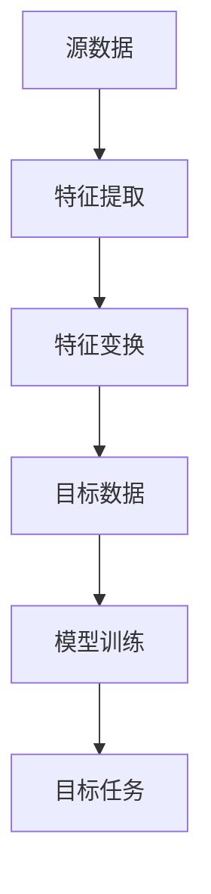
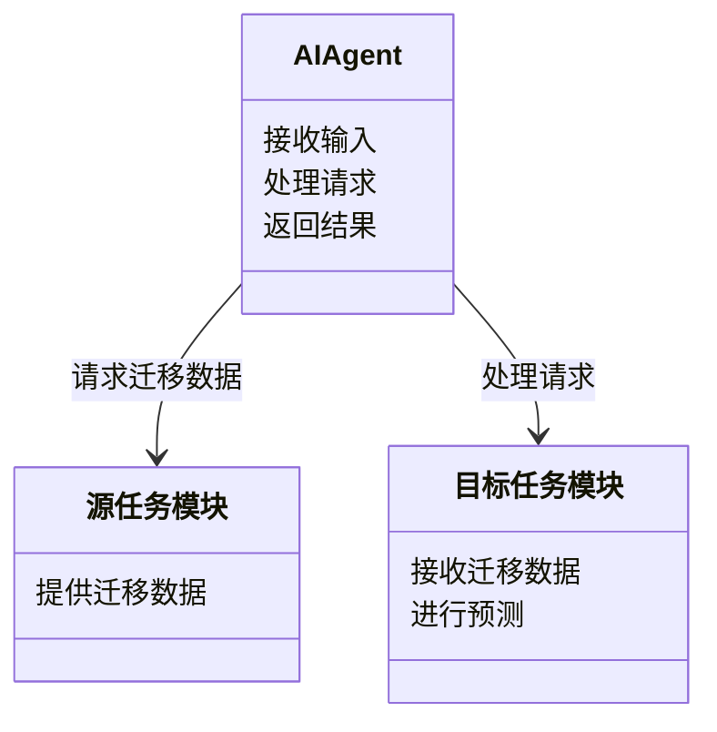
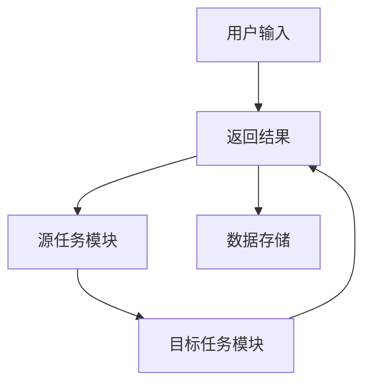
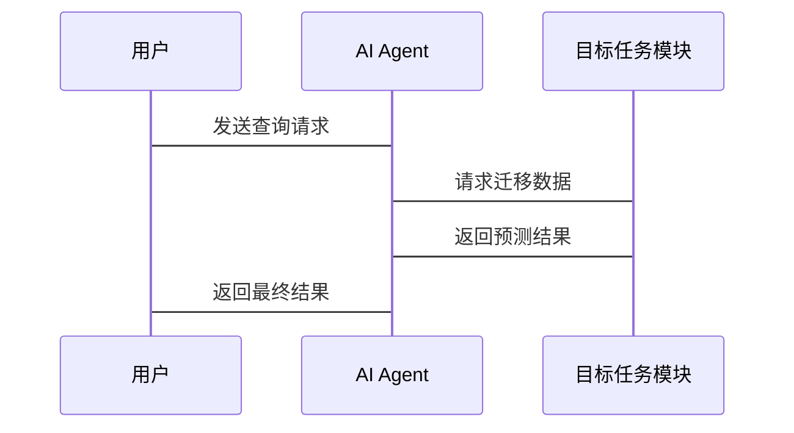

                 


# AI Agent中的迁移学习技术应用

## 关键词：AI Agent，迁移学习，算法原理，系统架构，项目实战

## 摘要：
AI Agent作为人工智能领域的核心技术，其性能在很大程度上依赖于数据和算法。迁移学习作为一种有效的技术手段，能够帮助AI Agent在不同任务之间进行知识迁移，提升模型的泛化能力和适应性。本文将从AI Agent的基本概念入手，深入探讨迁移学习的核心原理、算法实现以及系统架构设计，通过具体案例分析迁移学习在AI Agent中的实际应用，最后总结迁移学习在AI Agent中的优势与挑战。

---

## 第一部分: AI Agent与迁移学习基础

### 第1章: AI Agent的基本概念

#### 1.1 AI Agent的定义
AI Agent（人工智能代理）是指在计算机系统中，能够感知环境、自主决策并执行任务的智能实体。它通常具备以下特点：
- **自主性**：能够独立执行任务，无需外部干预。
- **反应性**：能够根据环境反馈实时调整行为。
- **目标导向**：基于目标驱动决策和行动。
- **学习能力**：通过经验或数据不断优化自身性能。

#### 1.2 AI Agent的应用场景
AI Agent在多个领域都有广泛应用，包括：
- **智能助手**：如Siri、Alexa等，用于信息查询、日程管理。
- **自动驾驶**：如自动驾驶汽车中的决策系统。
- **游戏AI**：在游戏开发中用于智能对手或队友的控制。
- **机器人控制**：用于工业机器人或服务机器人的智能控制。
- **推荐系统**：基于用户行为推荐个性化内容。

#### 1.3 迁移学习的定义与作用
迁移学习（Transfer Learning）是指将从一个任务上学到的知识应用到另一个相关任务上，从而减少目标任务所需的数据量和计算成本。其核心作用在于：
- **减少数据需求**：在数据不足的情况下，利用迁移学习提升模型性能。
- **提升泛化能力**：通过跨任务学习，增强模型的适应性。
- **加速训练过程**：减少从头训练所需的时间和资源。

---

### 第2章: 迁移学习的核心概念与原理

#### 2.1 迁移学习的核心概念
迁移学习的核心在于处理源任务和目标任务之间的关系，关键概念包括：
- **源任务（Source Task）**：已学习过且数据丰富的任务。
- **目标任务（Target Task）**：需要学习的新任务。
- **特征空间（Feature Space）**：数据的表示方式，影响迁移效果。
- **任务空间（Task Space）**：任务的语义空间，决定任务之间的相似性。

#### 2.2 迁移学习的原理
迁移学习的实现依赖于以下几个关键步骤：
1. **数据预处理**：对源数据和目标数据进行清洗和格式化。
2. **特征提取**：提取能够表征任务特征的低维表示。
3. **模型训练**：在源任务上训练模型，再将其迁移到目标任务。
4. **知识迁移**：通过调整模型参数或优化策略，实现任务间的知识共享。

#### 2.3 迁移学习的分类与对比
迁移学习可以根据不同维度进行分类，常见的分类方式包括：
- **基于样本的迁移学习**：直接利用源数据进行迁移，适用于数据量较小的目标任务。
- **基于特征的迁移学习**：通过提取特征进行迁移，适用于特征空间差异较大的任务。
- **基于模型的迁移学习**：通过共享模型参数或结构进行迁移，适用于复杂任务。

以下是一个对比分析表格：

| 分类维度 | 基于样本的迁移学习 | 基于特征的迁移学习 | 基于模型的迁移学习 |
|----------|--------------------|--------------------|--------------------|
| 数据需求 | 数据量小，目标任务数据不足 | 数据量较大，特征差异明显 | 数据量大，任务复杂 |
| 实现难度 | 较低，易于实现 | 中等，需要特征提取 | 较高，依赖模型结构 |
| 适用场景 | 小样本任务 | 特征差异大的任务 | 复杂任务 |

#### 2.4 迁移学习的ER图
以下是迁移学习的ER图，展示了源任务、目标任务、特征空间和任务空间之间的关系：

```mermaid
er
    title 迁移学习的ER图
    Entity 源任务
    Entity 目标任务
    Entity 特征空间
    Entity 任务空间
    源任务 --> 特征空间: 提供特征表示
    目标任务 --> 特征空间: 利用特征表示
    源任务 --> 任务空间: 语义映射
    目标任务 --> 任务空间: 语义映射
```

---

### 第3章: 迁移学习的算法原理

#### 3.1 常见的迁移学习算法
迁移学习的算法可以根据任务类型和数据分布进行分类，以下是几种典型的迁移学习算法：

##### 3.1.1 基于样本的迁移学习算法
- **直接迁移（Direct Transfer）**：直接将源任务的模型参数迁移到目标任务。
- **迁移聚类（Transfer Clustering）**：将源任务的聚类结果应用到目标任务。

##### 3.1.2 基于特征的迁移学习算法
- **特征变换（Feature Transformation）**：通过线性变换将源特征转换为目标特征。
- **联合特征学习（Joint Feature Learning）**：同时学习源和目标的特征表示。

##### 3.1.3 基于模型的迁移学习算法
- **参数共享（Parameter Sharing）**：共享模型的部分参数。
- **深度迁移学习（Deep Transfer Learning）**：利用深度神经网络进行迁移学习。

#### 3.2 迁移学习算法的流程图
以下是基于特征的迁移学习算法流程图：



#### 3.3 迁移学习算法的实现
以下是一个基于特征的迁移学习算法的Python实现示例：

```python
import numpy as np

def feature_transformation(X_source, X_target):
    # 特征提取
    X_source_embed = X_source.reshape(-1, 28, 28, 1)
    X_target_embed = X_target.reshape(-1, 28, 28, 1)
    
    # 特征变换
    X_source_transformed = np.mean(X_source_embed, axis=(1,2))
    X_target_transformed = np.mean(X_target_embed, axis=(1,2))
    
    return X_source_transformed, X_target_transformed

# 示例数据
X_source = np.random.rand(100, 28, 28)
X_target = np.random.rand(50, 28, 28)

# 执行特征变换
X_source_trans, X_target_trans = feature_transformation(X_source, X_target)

print("Source features shape:", X_source_trans.shape)
print("Target features shape:", X_target_trans.shape)
```

#### 3.4 迁移学习的数学模型
迁移学习的数学模型通常涉及源任务和目标任务的损失函数，以下是一个示例：

$$ L_{\text{source}} = \frac{1}{N}\sum_{i=1}^{N} (y_i - f(x_i))^2 $$
$$ L_{\text{target}} = \frac{1}{M}\sum_{j=1}^{M} (y'_j - f(x'_j))^2 $$

其中，$N$和$M$分别是源任务和目标任务的样本数量，$f$是模型函数。

---

### 第4章: AI Agent中的迁移学习应用

#### 4.1 项目背景
在医疗领域，AI Agent可以用于辅助医生进行疾病诊断。由于某些疾病的数据量较小，直接训练模型效果不佳，因此需要利用迁移学习技术，将已有的大规模医疗数据迁移到目标任务中。

#### 4.2 系统功能设计
以下是AI Agent的系统功能模块：



#### 4.3 系统架构设计
以下是AI Agent的系统架构图：



#### 4.4 接口设计
AI Agent的接口设计如下：
- 输入接口：接收用户查询请求。
- 输出接口：返回预测结果。

#### 4.5 交互流程
以下是AI Agent的交互流程图：



---

### 第5章: 项目实战

#### 5.1 环境配置
需要安装以下库：
- Python 3.8+
- TensorFlow 2.5+
- scikit-learn 0.24+

#### 5.2 核心代码实现
以下是迁移学习在AI Agent中的核心代码实现：

```python
import tensorflow as tf
from tensorflow.keras import layers

def create_model(input_shape):
    model = tf.keras.Sequential()
    model.add(layers.Conv2D(32, (3,3), activation='relu', input_shape=input_shape))
    model.add(layers.MaxPooling2D((2,2)))
    model.add(layers.Conv2D(64, (3,3), activation='relu'))
    model.add(layers.MaxPooling2D((2,2)))
    model.add(layers.Flatten())
    model.add(layers.Dense(128, activation='relu'))
    model.add(layers.Dense(10, activation='softmax'))
    return model

# 示例数据
input_shape = (28, 28, 1)
model = create_model(input_shape)

# 迁移学习策略
for layer in model.layers[:-1]:
    layer.trainable = False

model.compile(optimizer='adam', loss='sparse_categorical_crossentropy', metrics=['accuracy'])

# 训练模型
model.fit(X_train, y_train, epochs=5, validation_data=(X_test, y_test))
```

#### 5.3 代码应用解读
上述代码实现了迁移学习中的特征提取部分，通过冻结模型的前几层，仅训练最后一层全连接层，以适应目标任务。

---

### 第6章: 最佳实践与小结

#### 6.1 最佳实践
- **数据预处理**：确保源数据和目标数据的质量和一致性。
- **特征选择**：合理选择特征，避免维度灾难。
- **模型选择**：根据任务需求选择合适的迁移学习算法。

#### 6.2 小结
迁移学习在AI Agent中的应用显著提升了模型的性能和泛化能力，特别是在数据不足的情况下，迁移学习能够有效减少训练成本并提高准确率。

#### 6.3 注意事项
- 数据隐私：迁移学习需要处理敏感数据，需注意数据隐私保护。
- 模型泛化：迁移学习可能会导致模型过拟合源任务，需进行充分的验证和调整。

#### 6.4 拓展阅读
推荐阅读以下文献：
- Pan, Sinno J, et al. "A survey on transfer learning."
- Zhang, Z. "Transfer learning with deep neural networks."

---

## 作者：AI天才研究院 & 禅与计算机程序设计艺术

---

以上是《AI Agent中的迁移学习技术应用》的完整目录大纲和文章内容。

