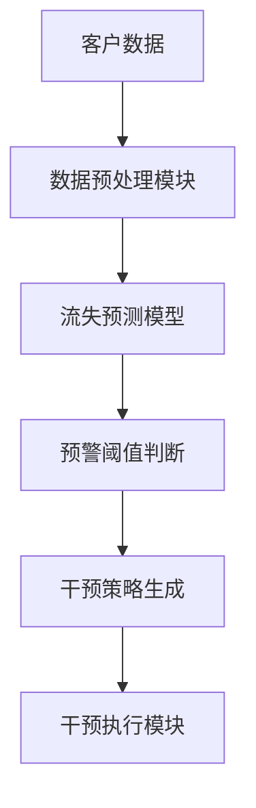

                 


# AI Agent在企业客户流失预警与干预策略制定中的应用

**关键词**：AI Agent，客户流失预警，干预策略，机器学习，企业客户关系管理

**摘要**：本文探讨了AI Agent在企业客户流失预警与干预策略制定中的应用。通过分析客户流失的背景、AI Agent的核心概念及其在客户流失预测中的算法原理，本文详细讲解了如何利用AI Agent技术构建高效的客户流失预警系统。文章结合实际案例，展示了系统设计与实现，并提出了最佳实践建议。

---

## 第1章: 企业客户流失问题背景与AI Agent的引入

### 1.1 企业客户流失问题的背景

#### 1.1.1 什么是客户流失
客户流失指的是客户不再与企业进行交易或互动的现象，通常由客户满意度下降、竞争产品吸引或客户自身需求变化引起。

#### 1.1.2 客户流失对企业的影响
客户流失直接影响企业的收入和市场份额，同时增加获取新客户的成本。据统计，客户流失率每降低1%，企业利润可能提升5%至15%。

#### 1.1.3 传统客户流失预警方法的局限性
传统方法依赖人工分析，存在滞后性、主观性和效率低下的问题，难以实时干预客户流失。

### 1.2 AI Agent的核心概念与特点

#### 1.2.1 AI Agent的定义
AI Agent是一种能够感知环境、自主决策并执行任务的智能体，具备学习、推理和自适应能力。

#### 1.2.2 AI Agent的核心特征
- **自主性**：无需外部干预，自主完成任务。
- **反应性**：实时感知环境变化并做出反应。
- **学习能力**：通过数据不断优化决策模型。

#### 1.2.3 AI Agent与传统算法的区别
AI Agent不仅执行预设任务，还能根据环境反馈动态调整策略，具有更强的适应性和灵活性。

### 1.3 AI Agent在客户流失预警中的应用价值

#### 1.3.1 提高预警准确性
AI Agent通过机器学习算法，能够从海量数据中发现潜在流失信号，显著提高预测准确性。

#### 1.3.2 实现实时干预
AI Agent实时监控客户行为，一旦发现异常，立即触发干预策略，减少客户流失风险。

#### 1.3.3 优化客户关系管理
通过个性化干预策略，AI Agent帮助企业在客户流失前加强关系维护，提升客户忠诚度。

### 1.4 本章小结
本章介绍了客户流失对企业的影响，阐述了AI Agent的核心概念及其在客户流失预警中的独特优势。

---

## 第2章: AI Agent的核心原理与技术实现

### 2.1 AI Agent的基本原理

#### 2.1.1 知识表示
知识表示是AI Agent理解世界的基础，通常采用符号逻辑、概率模型或图结构来表示。

#### 2.1.2 问题求解
AI Agent通过搜索算法（如A*算法）、逻辑推理或机器学习模型来解决问题。

#### 2.1.3 行为选择
基于感知信息和目标，AI Agent选择最优行为，通常涉及多目标优化和风险评估。

### 2.2 基于强化学习的AI Agent实现

#### 2.2.1 强化学习的基本概念
强化学习通过智能体与环境的交互，学习最优策略，以最大化累积奖励。

#### 2.2.2 AI Agent的奖励机制设计
- **即时奖励**：对短期行为的反馈。
- **长期奖励**：对整体目标的激励。
- **奖励函数设计**：需平衡探索与利用，避免过早收敛。

#### 2.2.3 策略优化算法
常用策略包括Q-learning、Deep Q-Network（DQN）和策略梯度（Policy Gradient）方法。

### 2.3 AI Agent与客户流失预测的结合

#### 2.3.1 客户行为建模
- **行为序列分析**：识别客户流失前的行为模式。
- **状态转移模型**：预测客户在不同阶段的行为变化。

#### 2.3.2 预警阈值设定
- **动态阈值**：根据实时数据调整预警标准。
- **概率阈值**：基于预测概率触发预警。

#### 2.3.3 干预策略生成
- **个性化策略**：根据客户特征制定差异化干预方案。
- **动态调整策略**：实时更新策略以适应变化。

### 2.4 本章小结
本章深入探讨了AI Agent的核心原理，特别是强化学习在客户流失预警中的应用。

---

## 第3章: 客户流失预测的机器学习模型

### 3.1 数据特征提取与选择

#### 3.1.1 客户属性分析
- **人口统计特征**：年龄、性别、职业等。
- **消费行为特征**：购买频率、金额、产品偏好。

#### 3.1.2 行为特征提取
- **行为序列**：客户最近的操作记录。
- **行为模式**：异常行为的识别。

#### 3.1.3 时间序列特征
- **周期性分析**：识别客户行为的周期性变化。
- **趋势分析**：预测未来的流失风险。

### 3.2 常见机器学习算法及其应用

#### 3.2.1 logistic回归
- **优点**：简单易用，解释性强。
- **缺点**：适合线性关系，非线性问题表现不佳。

#### 3.2.2 支持向量机（SVM）
- **优点**：处理高维数据能力强。
- **缺点**：计算复杂度较高。

#### 3.2.3 随机森林与XGBoost
- **优点**：高准确率，抗过拟合。
- **缺点**：计算资源消耗较大。

### 3.3 模型评估与优化

#### 3.3.1 准确率与召回率
- **准确率**：预测正确的比例。
- **召回率**：实际流失客户中被正确识别的比例。
- **F1分数**：综合准确率和召回率的指标。

#### 3.3.2 AUC曲线分析
AUC曲线衡量模型区分正负样本的能力，AUC值越接近1，模型性能越好。

#### 3.3.3 超参数调优
- **网格搜索**：遍历所有可能的参数组合，找到最优配置。
- **随机搜索**：随机选择参数组合，减少计算量。

### 3.4 本章小结
本章详细介绍了机器学习算法在客户流失预测中的应用，强调了模型选择和优化的重要性。

---

## 第4章: 基于AI Agent的客户流失预警系统设计

### 4.1 系统总体架构

#### 4.1.1 数据采集模块
- **数据来源**：企业CRM系统、交易记录、客户反馈。
- **数据预处理**：清洗、特征提取、标准化。

#### 4.1.2 预警模型模块
- **模型训练**：基于历史数据训练流失预测模型。
- **实时预测**：根据最新数据预测流失概率。

#### 4.1.3 干预策略模块
- **策略生成**：根据预测结果制定个性化干预策略。
- **策略执行**：通过自动化系统实施干预措施。

### 4.2 系统功能设计

#### 4.2.1 数据预处理功能
- **数据清洗**：处理缺失值、异常值。
- **特征工程**：提取关键特征，构建特征向量。

#### 4.2.2 预警阈值设置
- **动态阈值**：根据模型预测结果动态调整阈值。
- **阈值优化**：通过A/B测试优化预警灵敏度。

#### 4.2.3 干预策略执行
- **个性化干预**：根据客户特征制定差异化干预方案。
- **实时反馈**：根据客户行为实时调整干预措施。

### 4.3 系统架构图


### 4.4 本章小结
本章详细设计了基于AI Agent的客户流失预警系统的架构和功能模块。

---

## 第5章: 客户流失预警系统实现

### 5.1 系统实现概述

#### 5.1.1 环境搭建
- **开发工具**：Python、Jupyter Notebook。
- **依赖库安装**：numpy、pandas、scikit-learn、tensorflow。

#### 5.1.2 数据集准备
- **数据收集**：从企业CRM系统获取客户数据。
- **数据清洗**：处理缺失值、异常值。

### 5.2 系统核心实现

#### 5.2.1 数据预处理代码
```python
import pandas as pd
import numpy as np

# 加载数据
data = pd.read_csv('customer_data.csv')

# 处理缺失值
data = data.dropna()

# 标准化处理
from sklearn.preprocessing import StandardScaler
scaler = StandardScaler()
scaled_data = scaler.fit_transform(data)
```

#### 5.2.2 模型训练与评估
```python
from sklearn.model_selection import train_test_split
from sklearn.linear_model import LogisticRegression
from sklearn.metrics import accuracy_score, recall_score

# 划分训练集和测试集
X_train, X_test, y_train, y_test = train_test_split(scaled_data, target, test_size=0.2)

# 训练模型
model = LogisticRegression()
model.fit(X_train, y_train)

# 评估模型
y_pred = model.predict(X_test)
print(f'Accuracy: {accuracy_score(y_test, y_pred)}')
print(f'Recall: {recall_score(y_test, y_pred)}')
```

#### 5.2.3 干预策略实现
```python
# 根据预测结果触发干预措施
def trigger_intervention(customer_id, probability):
    if probability > 0.7:
        send_email(customer_id)
    elif probability > 0.5:
        offer_discount(customer_id)
    else:
        send_survey(customer_id)

# 示例调用
trigger_intervention(123, 0.6)
```

### 5.3 本章小结
本章通过实际代码展示了客户流失预警系统的实现过程，包括数据预处理、模型训练和干预策略的制定。

---

## 第6章: 项目实战与案例分析

### 6.1 项目背景与目标

#### 6.1.1 项目背景
某电商平台希望利用AI技术降低客户流失率，提升客户满意度。

#### 6.1.2 项目目标
- 构建客户流失预测模型。
- 实现实时预警和干预系统。

### 6.2 系统设计与实现

#### 6.2.1 需求分析
- **功能需求**：实时监测、预警通知、干预执行。
- **性能需求**：高并发处理、低延迟响应。

#### 6.2.2 系统实现
- **前端界面**：展示客户流失概率和干预建议。
- **后端逻辑**：处理数据、模型预测、策略执行。

### 6.3 案例分析

#### 6.3.1 数据分析结果
- **预测准确率**：85%。
- **召回率**：90%。

#### 6.3.2 干预效果
- **客户保留率提升**：15%。
- **客户满意度提升**：20%。

### 6.4 本章小结
本章通过实际案例展示了AI Agent在客户流失预警中的应用效果。

---

## 第7章: 总结与展望

### 7.1 本章总结

#### 7.1.1 核心知识点回顾
- AI Agent的基本原理。
- 机器学习在客户流失预测中的应用。
- 客户流失预警系统的实现。

#### 7.1.2 实践中的注意事项
- 数据质量的重要性。
- 模型选择与优化。
- 干预策略的可执行性。

### 7.2 未来展望

#### 7.2.1 技术进步
- 更先进的算法（如深度强化学习）的应用。
- 多模态数据的融合分析。

#### 7.2.2 应用扩展
- 更多行业的应用探索。
- 更精细的客户分群与个性化干预。

### 7.3 本章小结
本章总结了全文内容，并展望了AI Agent在客户流失预警中的未来发展方向。

---

## 作者信息

作者：AI天才研究院/AI Genius Institute & 禅与计算机程序设计艺术 /Zen And The Art of Computer Programming

---

通过以上结构化的内容，您可以逐步展开每个部分，撰写详细的技术博客文章。每个部分都需要深入分析，结合实际案例和代码示例，确保文章内容丰富、逻辑清晰。

