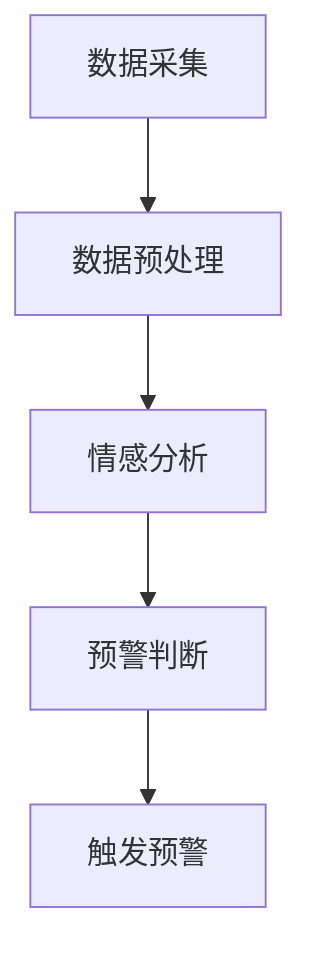
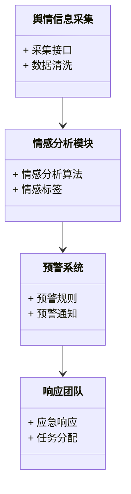
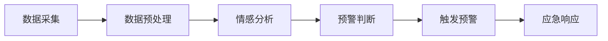
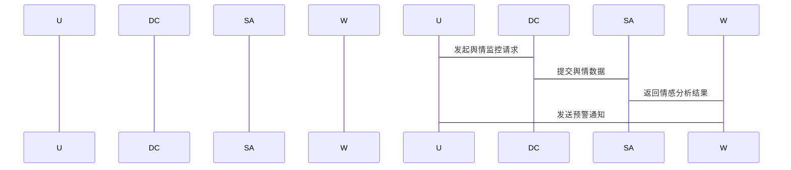

                 


# AI Agent在企业舆情危机预警与响应中的实时应用

> 关键词：AI Agent，企业舆情，实时预警，智能响应，自然语言处理，舆情分析

> 摘要：本文详细探讨了AI Agent在企业舆情危机预警与响应中的实时应用，分析了其核心原理、系统架构及实际案例，展示了AI技术在现代企业危机管理中的重要性。

---

# 第一部分: 背景介绍

## 第1章: 企业舆情危机与AI Agent概述

### 1.1 企业舆情危机的基本概念

#### 1.1.1 什么是企业舆情
企业舆情指的是企业在经营过程中，通过各种媒体渠道（如新闻、社交媒体、论坛等）所传播的信息，以及公众对这些信息的反应和评价。舆情包括正面、中性、负面等多种类型，其中负面舆情可能引发企业声誉受损、客户流失等问题。

#### 1.1.2 舆情危机的定义与特征
舆情危机是指由于负面信息的快速传播，对企业形象、市场地位、客户关系等造成严重威胁的突发公共关系事件。其主要特征包括突发性、扩散性、破坏性和公众关注度高等。

#### 1.1.3 舆情危机对企业的影响
- **声誉损失**：负面信息迅速传播可能导致企业形象受损，影响客户信任。
- **经济损失**：危机可能引发客户流失、销售额下降，甚至影响股价。
- **社会影响**：严重的舆情危机可能引发公众抗议或法律纠纷，对企业社会责任产生质疑。

### 1.2 AI Agent的核心概念

#### 1.2.1 AI Agent的定义与特点
AI Agent（人工智能代理）是指能够感知环境、自主决策并执行任务的智能实体。其特点包括：
- **自主性**：能够独立执行任务，无需人工干预。
- **反应性**：能够实时感知环境变化并做出响应。
- **学习能力**：通过机器学习技术不断优化自身的决策能力。
- **适应性**：能够根据环境变化调整自身行为。

#### 1.2.2 AI Agent在企业中的应用场景
AI Agent在企业中的应用场景广泛，包括：
- **舆情监控**：实时监测社交媒体、新闻网站等渠道的舆情信息。
- **风险预警**：通过自然语言处理技术分析文本情感，识别潜在危机。
- **智能响应**：在发现负面舆情时，自动启动应急响应机制，协调相关部门进行处理。

#### 1.2.3 AI Agent与传统舆情监控的区别
传统舆情监控主要依赖人工或基于规则的系统进行信息收集和分析，存在效率低、响应慢等问题。而AI Agent通过机器学习和自然语言处理技术，能够实现舆情的实时监控、智能分析和自动响应，显著提高了舆情管理的效率和准确性。

### 1.3 企业舆情危机与AI Agent的关系

#### 1.3.1 舆情危机的实时监测需求
企业舆情危机的发生往往具有突发性和不可预测性，传统的舆情监控系统难以满足实时监测的需求。AI Agent能够通过实时数据流处理技术，快速分析海量数据，实现舆情的实时监测。

#### 1.3.2 AI Agent在舆情预警中的作用
AI Agent通过自然语言处理和机器学习技术，能够从海量数据中识别出潜在的负面舆情，并通过预警系统及时通知企业相关部门，从而实现舆情的早期预警。

#### 1.3.3 舆情危机响应的智能化趋势
随着AI技术的不断发展，舆情危机的响应方式也在向智能化方向转变。AI Agent能够根据舆情的严重程度自动启动相应的应急响应机制，协调企业内部资源进行快速处理，从而有效降低舆情危机的影响。

---

## 第2章: 舆情危机预警与响应的背景与挑战

### 2.1 企业舆情监控的传统方式

#### 2.1.1 人工监控的局限性
- **效率低**：人工监控需要大量的人力资源，效率低下。
- **响应慢**：人工监控难以实现实时响应，容易错过最佳处理时机。
- **覆盖面有限**：人工监控难以覆盖所有可能的舆情来源。

#### 2.1.2 传统舆情监控工具的不足
- **规则依赖**：传统舆情监控工具主要基于关键词匹配和规则触发，难以应对复杂多变的舆情信息。
- **准确率低**：由于缺乏智能分析能力，传统工具的误报率和漏报率较高。

#### 2.1.3 舆情数据的实时性与全面性问题
- **实时性不足**：传统舆情监控工具难以实现数据的实时处理和分析。
- **数据来源单一**：传统工具通常只关注特定渠道的数据，忽视了其他可能的重要信息源。

### 2.2 舆情危机对企业的影响

#### 2.2.1 舆情危机对企业声誉的损害
- **信任丧失**：负面舆情可能导致客户对企业信任度下降。
- **品牌价值下降**：企业声誉受损会影响品牌价值，进而影响市场地位。

#### 2.2.2 舆情危机对企业经营的干扰
- **客户流失**：负面舆情可能导致客户转向竞争对手。
- **销售下降**：企业形象受损会影响销售业绩。

#### 2.2.3 舆情危机的连锁反应与社会影响
- **连锁反应**：负面舆情可能引发更多的负面信息，形成恶性循环。
- **社会影响**：严重的舆情危机可能引发公众抗议或法律纠纷，对企业社会责任产生质疑。

### 2.3 AI Agent在舆情预警中的优势

#### 2.3.1 高效性与实时性
AI Agent能够实现舆情信息的实时采集、分析和预警，显著提高了舆情监控的效率。

#### 2.3.2 智能性与精准性
通过机器学习和自然语言处理技术，AI Agent能够准确识别潜在的负面舆情，并提供精准的预警信息。

#### 2.3.3 可扩展性与灵活性
AI Agent可以根据企业需求灵活配置，适用于不同规模和类型的企业的舆情监控需求。

---

# 第二部分: 核心概念与联系

## 第3章: AI Agent的核心原理与机制

### 3.1 AI Agent的基本原理

#### 3.1.1 信息采集与处理机制
AI Agent通过多种数据源（如社交媒体、新闻网站等）采集舆情信息，并利用自然语言处理技术对文本进行清洗、分词、实体识别等预处理。

#### 3.1.2 情感分析与语义理解
AI Agent利用情感分析算法对舆情信息进行情感倾向分析，识别出潜在的负面信息。同时，通过语义理解技术，AI Agent能够理解文本的深层含义，进一步提高预警的准确性。

#### 3.1.3 预警规则与触发机制
AI Agent根据预设的预警规则，对分析结果进行判断，并在达到预警条件时触发预警机制，通知相关人员进行处理。

### 3.2 AI Agent的关键技术

#### 3.2.1 自然语言处理（NLP）技术
NLP技术是AI Agent实现舆情分析的核心技术之一，包括文本分词、实体识别、情感分析等功能。

#### 3.2.2 机器学习与深度学习
机器学习和深度学习技术用于训练舆情分类模型，提高AI Agent的预警准确率。常用的算法包括支持向量机（SVM）、随机森林（Random Forest）和深度学习模型（如LSTM、BERT等）。

#### 3.2.3 实时数据处理与分析
AI Agent通过实时数据流处理技术，对海量舆情数据进行实时分析，实现舆情的快速预警。

### 3.3 AI Agent的实体关系图


---

# 第三部分: 算法原理讲解

## 第4章: AI Agent的算法与数学模型

### 4.1 舆情分析的算法流程



### 4.2 情感分析算法

#### 4.2.1 基于机器学习的情感分析
- **训练数据**：需要标注的舆情数据，包括正面、中性、负面三类。
- **特征提取**：常用的特征包括词语频率、情感词典等。
- **模型训练**：使用训练数据训练情感分类模型，如支持向量机（SVM）或随机森林（Random Forest）。

#### 4.2.2 深度学习模型
- **模型选择**：常用模型包括LSTM、BERT等。
- **预训练与微调**：利用大规模预训练模型进行微调，适应特定领域的舆情分析任务。

### 4.3 预警规则与触发机制

#### 4.3.1 预警规则的设定
- **关键词匹配**：设定与企业相关的关键词，如公司名称、产品名称等。
- **情感阈值**：根据情感分析结果，设定预警触发的情感阈值，如负面情感强度超过一定值。

#### 4.3.2 预警触发机制
- **实时监控**：AI Agent持续监控舆情信息，实时更新情感分析结果。
- **多级预警**：根据情感强度和事件的严重程度，设置多级预警，如轻微负面、严重负面等。

---

## 第5章: 系统架构设计

### 5.1 问题场景介绍
企业需要实时监控社交媒体、新闻网站等渠道的舆情信息，及时发现潜在的负面舆情，并启动相应的应急响应机制。

### 5.2 系统功能设计

#### 5.2.1 领域模型设计


#### 5.2.2 系统架构设计


#### 5.2.3 系统接口设计
- **数据采集接口**：负责从社交媒体、新闻网站等渠道采集舆情信息。
- **情感分析接口**：提供情感分析服务，返回舆情信息的情感标签。
- **预警触发接口**：根据情感分析结果，触发相应的预警通知。

#### 5.2.4 系统交互设计


---

## 第6章: 项目实战

### 6.1 环境安装

#### 6.1.1 系统环境
- 操作系统：Linux/Windows/MacOS
- Python版本：3.6+

#### 6.1.2 依赖安装
- Python库：自然语言处理库（如jieba、spaCy）、机器学习库（如scikit-learn、xgboost）、深度学习框架（如TensorFlow、PyTorch）。

### 6.2 系统核心实现

#### 6.2.1 数据采集模块
```python
import requests
from bs4 import BeautifulSoup

def fetch_data(url):
    response = requests.get(url)
    soup = BeautifulSoup(response.text, 'html.parser')
    content = soup.find_all('div', class_='article')
    return [text.get_text() for text in content]
```

#### 6.2.2 情感分析模块
```python
from sklearn.feature_extraction.text import TfidfVectorizer
from sklearn.svm import SVC

# 数据预处理
def preprocess(text):
    return text.lower().split()

# 模型训练
vectorizer = TfidfVectorizer(preprocessor=preprocess)
X = vectorizer.fit_transform(train_texts)
model = SVC().fit(X, train_labels)

# 模型预测
test_X = vectorizer.transform(test_texts)
predicted_labels = model.predict(test_X)
```

#### 6.2.3 预警系统
```python
def trigger_warning(threshold, sentiment_score):
    if sentiment_score < threshold:
        send_notification("Negative sentiment detected")
```

### 6.3 案例分析
假设某企业发现社交媒体上出现大量负面评论，AI Agent通过情感分析模块识别出负面舆情，并触发预警机制，通知企业响应团队启动应急响应流程。

---

## 第7章: 最佳实践

### 7.1 小结
本文详细探讨了AI Agent在企业舆情危机预警与响应中的实时应用，分析了其核心原理、系统架构及实际案例，展示了AI技术在现代企业危机管理中的重要性。

### 7.2 注意事项
- **数据隐私**：在采集和处理舆情数据时，需注意保护用户隐私，遵守相关法律法规。
- **模型优化**：定期更新模型，确保情感分析的准确性和预警的及时性。
- **团队协作**：建立高效的应急响应团队，确保预警信息能够快速传递和处理。

### 7.3 拓展阅读
- **相关书籍**：《自然语言处理入门》、《深度学习实战》
- **技术博客**：Google AI Blog、TensorFlow官方博客
- **在线课程**：Coursera上的《自然语言处理专项课程》

---

# 作者：AI天才研究院/AI Genius Institute & 禅与计算机程序设计艺术 /Zen And The Art of Computer Programming

