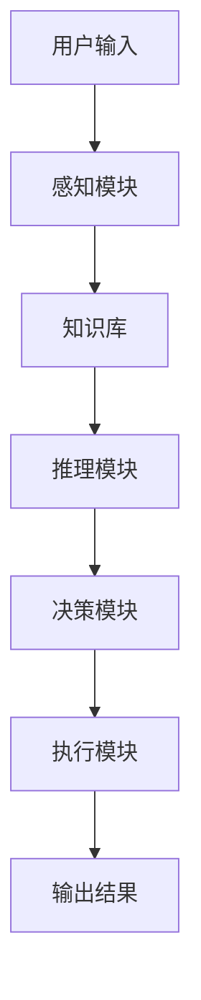
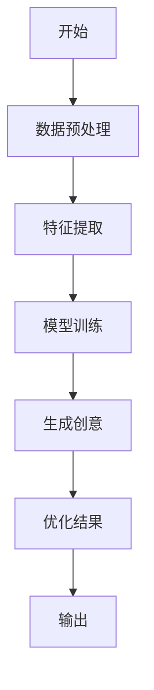

                 


# AI Agent在创意产业中的应用与限制

> 关键词：AI Agent、创意产业、生成式AI、自然语言处理、创意设计

> 摘要：本文探讨了AI Agent在创意产业中的应用与限制。通过分析AI Agent的核心概念、技术基础、应用案例、系统架构及实现，本文揭示了AI Agent在创意产业中的潜力与局限性。文章还讨论了AI Agent在创意产业中的伦理与法律挑战，并展望了未来的发展方向。

---

# 第1章: AI Agent与创意产业的背景介绍

## 1.1 AI Agent的基本概念

### 1.1.1 AI Agent的定义与核心要素
AI Agent（人工智能代理）是一种能够感知环境、自主决策并执行任务的智能系统。它具备以下核心要素：
1. **感知能力**：通过传感器或数据输入获取环境信息。
2. **推理能力**：基于知识库进行逻辑推理和问题求解。
3. **决策能力**：根据推理结果做出最优决策。
4. **执行能力**：通过执行器或接口完成实际操作。

### 1.1.2 创意产业的定义与特点
创意产业是指以创意为核心，通过艺术、设计、文学、音乐、影视等方式创造价值的产业。其特点包括：
1. **创造性**：依赖人类的创造力和灵感。
2. **多样性**：涵盖文学、音乐、艺术等多个领域。
3. **个性化**：作品通常具有独特的风格和表达方式。

### 1.1.3 AI Agent与创意产业结合的背景
随着AI技术的快速发展，AI Agent开始在创意产业中扮演重要角色。通过AI Agent，创作者可以借助智能工具辅助创作，提升效率并拓展创意边界。例如，AI Agent可以帮助音乐人生成旋律，协助设计师优化设计方案。

---

## 1.2 创意产业中的问题背景

### 1.2.1 创意产业的传统模式与挑战
传统创意产业依赖人工创作，存在以下挑战：
1. **效率低下**：创作过程耗时较长，尤其是复杂的艺术项目。
2. **灵感枯竭**：创作者有时会面临创意瓶颈。
3. **资源限制**：中小型企业难以负担专业创意团队的成本。

### 1.2.2 AI技术在创意产业中的潜在价值
AI技术为创意产业带来了新的可能性：
1. **提升效率**：AI可以快速生成创意草图或初稿。
2. **拓展创意边界**：通过算法生成全新的创意灵感。
3. **降低门槛**：非专业人员也可以借助AI工具进行创作。

### 1.2.3 AI Agent在创意产业中的应用场景
AI Agent在创意产业中的应用场景包括：
1. **文学创作**：辅助作者生成故事情节或优化文本。
2. **音乐创作**：生成旋律、编曲或混音。
3. **视觉艺术**：设计图像、插画或广告创意。
4. **影视制作**：生成剧本、场景设计或特效。

---

## 1.3 本章小结
本章介绍了AI Agent的基本概念、创意产业的特点以及两者结合的背景。AI Agent通过提升效率、拓展创意边界和降低门槛，正在逐步改变创意产业的传统模式。

---

# 第2章: AI Agent的核心概念与原理

## 2.1 AI Agent的定义与分类

### 2.1.1 AI Agent的定义
AI Agent是一种能够感知环境、自主决策并执行任务的智能实体。它可以根据任务需求动态调整行为策略。

### 2.1.2 基于任务的AI Agent分类
AI Agent可以根据任务类型分为以下几类：
1. **通用型AI Agent**：适用于多种任务，具有较强的适应性。
2. **专业型AI Agent**：专注于特定领域，如音乐创作或图像设计。
3. **协作型AI Agent**：能够与人类或其他AI Agent协作完成复杂任务。

### 2.1.3 创意产业中的AI Agent类型
在创意产业中，AI Agent主要分为以下几类：
1. **创作型AI Agent**：直接参与内容创作，如生成文本、图像或音乐。
2. **辅助型AI Agent**：为创作者提供工具或建议，如灵感生成工具。
3. **评估型AI Agent**：对创意作品进行评估和优化，如自动校对文本或优化图像效果。

---

## 2.2 AI Agent的工作原理

### 2.2.1 知识表示与推理
AI Agent通过知识库表示知识，并利用推理算法（如逻辑推理、概率推理）进行问题求解。

### 2.2.2 问题求解与规划
AI Agent通过任务分解、路径规划等方法，制定最优的执行策略。

### 2.2.3 自然语言处理与生成
AI Agent利用NLP技术进行文本理解与生成，如对话生成或创意文本创作。

---

## 2.3 AI Agent与传统AI的区别

### 2.3.1 传统AI的特点
传统AI主要依赖规则和模式匹配，缺乏自主性和适应性。

### 2.3.2 AI Agent的独特性
AI Agent具有自主性、反应性和社会性，能够动态适应环境变化。

### 2.3.3 两者在创意产业中的应用对比
在创意产业中，AI Agent更适用于需要动态调整和个性化定制的任务，而传统AI更适合标准化和规则化的场景。

---

## 2.4 本章小结
本章详细介绍了AI Agent的核心概念与分类，并分析了其在创意产业中的独特性与应用优势。

---

# 第3章: AI Agent在创意产业中的技术基础

## 3.1 自然语言处理（NLP）技术

### 3.1.1 NLP的基本概念
NLP是一种让计算机理解和生成人类语言的技术，广泛应用于文本分析、机器翻译等领域。

### 3.1.2 NLP在创意写作中的应用
AI Agent利用NLP技术辅助创意写作，如生成故事情节、优化文本结构等。

### 3.1.3 常用NLP模型介绍
目前常用的NLP模型包括BERT、GPT和Transformer等。

---

## 3.2 生成式AI技术

### 3.2.1 生成式AI的基本原理
生成式AI通过深度学习模型（如GAN、VAE）生成新的数据样本。

### 3.2.2 基于Transformer的生成模型
基于Transformer的模型（如GPT-3）在生成式AI中表现优异，具有强大的文本生成能力。

### 3.2.3 生成式AI在艺术创作中的应用
生成式AI可以用于创作图像、音乐和文学作品，如生成抽象画作或编写诗歌。

---

## 3.3 推荐系统与个性化创作

### 3.3.1 推荐系统的定义与作用
推荐系统通过分析用户行为和偏好，推荐个性化的内容或工具。

### 3.3.2 基于协同过滤的推荐算法
协同过滤算法通过用户相似性或物品相似性进行推荐。

### 3.3.3 个性化创作中的应用
推荐系统可以为创作者推荐灵感来源、创作工具或目标受众。

---

## 3.4 本章小结
本章介绍了AI Agent在创意产业中的技术基础，包括NLP、生成式AI和推荐系统等关键技术。

---

# 第4章: AI Agent在创意产业中的应用案例

## 4.1 文学创作中的应用

### 4.1.1 自动生成故事情节
AI Agent可以根据用户输入的主题生成故事情节和角色设定。

### 4.1.2 文本优化与润色
AI Agent可以协助作者优化文本结构、改善语言表达。

### 4.1.3 实际案例分析
例如，AI Agent可以帮助作家快速生成小说大纲，并提供改进建议。

---

## 4.2 音乐创作中的应用

### 4.2.1 生成音乐旋律
AI Agent可以根据用户输入的风格生成音乐旋律。

### 4.2.2 自动编曲与混音
AI Agent可以辅助音乐人完成编曲和混音工作。

### 4.2.3 实际案例分析
例如，AI Agent可以帮助独立音乐人快速生成 demo，并提供改进建议。

---

## 4.3 视觉艺术中的应用

### 4.3.1 生成数字图像
AI Agent可以通过生成模型生成抽象画、插画等视觉作品。

### 4.3.2 设计优化与灵感推荐
AI Agent可以为设计师提供配色方案、布局建议等。

### 4.3.3 实际案例分析
例如，AI Agent可以帮助广告公司快速生成广告创意，并优化设计效果。

---

## 4.4 影视制作中的应用

### 4.4.1 生成剧本大纲
AI Agent可以根据用户提供的主题生成剧本大纲。

### 4.4.2 场景设计与特效生成
AI Agent可以辅助制作团队设计场景并生成特效。

### 4.4.3 实际案例分析
例如，AI Agent可以帮助影视公司快速生成初步剧本，并提供视觉化建议。

---

## 4.5 本章小结
本章通过具体案例展示了AI Agent在文学、音乐、视觉艺术和影视等领域的广泛应用。

---

# 第5章: AI Agent在创意产业中的限制与挑战

## 5.1 技术局限性

### 5.1.1 生成内容的质量
AI生成的内容可能缺乏人类创作者的细腻情感和创意深度。

### 5.1.2 可解释性问题
AI Agent的决策过程往往缺乏透明性，难以解释生成结果的逻辑。

---

## 5.2 创意独特性

### 5.2.1 原创性争议
AI生成的内容是否具有原创性仍存在争议。

### 5.2.2 创意的多样性
AI Agent的生成能力受到训练数据的限制，可能导致创意的同质化。

---

## 5.3 伦理与法律问题

### 5.3.1 版权归属
AI生成的作品的版权归属尚未明确，引发法律争议。

### 5.3.2 道德伦理
AI Agent的使用可能引发伦理问题，如虚假创作或误导性内容。

---

## 5.4 用户接受度

### 5.4.1 创作者的抵触情绪
部分创作者担心AI会取代人类创作，影响就业。

### 5.4.2 用户信任问题
用户可能对AI生成内容的信任度较低，影响其市场接受度。

---

## 5.5 本章小结
本章分析了AI Agent在创意产业中的技术局限性、创意独特性、伦理法律问题以及用户接受度等挑战。

---

# 第6章: AI Agent的系统架构与实现

## 6.1 系统架构设计

### 6.1.1 系统模块划分
AI Agent系统通常包括感知模块、推理模块、决策模块和执行模块。

### 6.1.2 系统功能设计
系统功能包括数据采集、创意生成、结果优化和反馈交互。

### 6.1.3 系统架构图（Mermaid）


---

## 6.2 算法实现

### 6.2.1 算法流程图（Mermaid）


### 6.2.2 核心算法代码
以下是一个简单的生成式AI算法示例：
```python
import tensorflow as tf
from tensorflow.keras import layers

# 定义生成模型
def build_model():
    model = tf.keras.Sequential()
    model.add(layers.Dense(256, activation='relu', input_shape=(128,)))
    model.add(layers.Dense(256, activation='relu'))
    model.add(layers.Dense(128, activation='sigmoid'))
    return model

# 训练模型
def train_model(model, X_train, y_train, epochs=100):
    model.compile(optimizer='adam', loss='binary_crossentropy')
    model.fit(X_train, y_train, epochs=epochs)
    return model
```

---

## 6.3 本章小结
本章详细介绍了AI Agent的系统架构与实现过程，包括模块划分、算法流程和代码实现。

---

# 第7章: 项目实战

## 7.1 环境搭建

### 7.1.1 安装必要的库
安装必要的Python库，如TensorFlow、Keras、PyTorch等。

## 7.2 系统核心实现

### 7.2.1 文本生成代码
```python
import tensorflow as tf
from tensorflow.keras import layers

# 定义生成模型
def build_model():
    model = tf.keras.Sequential()
    model.add(layers.Dense(256, activation='relu', input_shape=(128,)))
    model.add(layers.Dense(256, activation='relu'))
    model.add(layers.Dense(128, activation='sigmoid'))
    return model

# 训练模型
def train_model(model, X_train, y_train, epochs=100):
    model.compile(optimizer='adam', loss='binary_crossentropy')
    model.fit(X_train, y_train, epochs=epochs)
    return model

# 生成文本
def generate_text(model, input_length=100):
    for _ in range(input_length):
        # 随机生成输入
        input_data = tf.random.normal((1, 128))
        # 预测输出
        output = model(input_data)
        # 解码输出
        decoded_output = output.numpy().tolist()[0]
        print(decoded_output)
```

### 7.2.2 代码应用解读
上述代码实现了一个简单的文本生成模型，可以用于生成创意文本。

---

## 7.3 案例分析

### 7.3.1 文本生成案例
使用上述代码生成一段小说情节：
```python
generate_text(model, input_length=100)
```

---

## 7.4 本章小结
本章通过实际项目展示了AI Agent的实现过程，包括环境搭建、代码实现和案例分析。

---

# 第8章: 总结与展望

## 8.1 本章总结
本文系统地探讨了AI Agent在创意产业中的应用与限制，分析了其在文学、音乐、视觉艺术和影视等领域的广泛应用。

## 8.2 未来展望
随着AI技术的不断进步，AI Agent在创意产业中的应用将更加广泛和深入。未来的研究方向包括：
1. 提升生成内容的质量和可解释性。
2. 解决创意独特性与版权归属问题。
3. 探索AI Agent与人类创作者的协作模式。

---

# 作者：AI天才研究院/AI Genius Institute & 禅与计算机程序设计艺术 /Zen And The Art of Computer Programming

---

以上是一个详细的目录和文章结构，涵盖了AI Agent在创意产业中的各个方面，包括背景介绍、核心概念、技术基础、应用案例、限制与挑战、系统架构与实现、项目实战以及总结与展望。希望这篇文章能够为读者提供全面而深入的见解。

