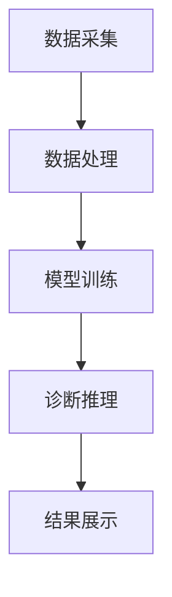

                 


# AI Agent在医疗诊断中的应用：挑战与机遇

---

## 关键词：
AI Agent, 医疗诊断, 人工智能, 算法原理, 系统架构, 医疗大数据

---

## 摘要：
本文深入探讨了AI Agent在医疗诊断中的应用，分析其带来的挑战与机遇。从AI Agent的基本概念到其在医疗诊断中的具体应用，再到算法原理和系统架构设计，文章详细阐述了AI Agent在医疗诊断中的核心作用。同时，通过实际项目案例分析，展示了AI Agent在医疗诊断中的潜力，并提出了未来发展的建议。

---

## 第一部分：AI Agent与医疗诊断的背景与概述

### 第1章：AI Agent的基本概念与背景

#### 1.1 AI Agent的核心概念
- **AI Agent**（人工智能代理）：一种能够感知环境、自主决策并执行任务的智能系统。
- **医疗诊断中的AI Agent**：辅助医生进行疾病诊断，提供个性化治疗建议。

#### 1.2 医疗诊断的挑战
- 数据复杂性：医疗数据包括图像、文本、结构化数据等多种形式。
- 病情多样性：不同患者病情不同，诊断需要高度个性化。
- 时间敏感性：诊断结果直接影响治疗决策，时间至关重要。

#### 1.3 AI Agent的优势
- **高效性**：AI Agent能够快速处理大量数据，提高诊断效率。
- **准确性**：通过深度学习算法，AI Agent能够提高诊断的准确性。
- **可扩展性**：AI Agent可以应用于多种疾病诊断，具有良好的扩展性。

### 第2章：AI Agent在医疗诊断中的应用现状

#### 2.1 当前的应用领域
- **影像诊断**：如X光、MRI图像的辅助诊断。
- **症状分析**：通过患者的症状和病史，辅助医生进行疾病判断。
- **治疗方案推荐**：基于患者数据，推荐个性化治疗方案。

#### 2.2 典型案例
- **IBM Watson Health**：利用自然语言处理技术，分析医学文献和患者数据，辅助医生进行诊断。
- **DeepMind Health**：通过AI算法，帮助医生诊断眼科疾病，如糖尿病视网膜病变。

---

## 第二部分：AI Agent的核心概念与原理

### 第3章：AI Agent的核心概念

#### 3.1 感知层
- **数据采集**：通过传感器、数据库等方式获取医疗数据。
- **特征提取**：从原始数据中提取有用的特征，如图像的边缘、纹理特征。

#### 3.2 决策层
- **算法选择**：根据任务选择合适的算法，如卷积神经网络（CNN）用于图像识别。
- **决策模型**：构建基于机器学习的决策模型，如支持向量机（SVM）或随机森林（Random Forest）。

#### 3.3 执行层
- **结果输出**：将决策结果以可视化或文本形式呈现给医生。
- **反馈机制**：根据医生的反馈调整模型参数，优化诊断效果。

### 第4章：AI Agent的算法原理

#### 4.1 强化学习算法
- **Q-learning算法**：通过状态-动作-奖励的机制，优化诊断策略。
  - 状态：患者的症状和病史。
  - 动作：诊断建议。
  - 奖励：诊断的准确率。

#### 4.2 监督学习算法
- **卷积神经网络（CNN）**：用于医学影像的分类任务。
  - 输入：医学影像。
  - 输出：疾病诊断结果。

#### 4.3 深度学习模型
- **Transformer模型**：用于医疗文本的处理，如病历分析。
  - 输入：患者的病历文本。
  - 输出：疾病预测和治疗建议。

---

## 第三部分：AI Agent的系统架构与设计

### 第5章：系统架构设计

#### 5.1 系统模块划分
- **数据采集模块**：负责采集患者的医疗数据。
- **数据处理模块**：对数据进行清洗、预处理和特征提取。
- **模型训练模块**：利用训练数据训练AI Agent的诊断模型。
- **诊断推理模块**：根据输入数据，生成诊断结果。
- **结果展示模块**：将诊断结果以用户友好的形式呈现给医生。

#### 5.2 系统架构图


### 第6章：系统接口设计

#### 6.1 数据接口
- **输入接口**：接收患者的医疗数据，如影像、病历。
- **输出接口**：返回诊断结果和建议。

#### 6.2 API设计
- **RESTful API**：提供标准接口，方便与其他医疗系统集成。

---

## 第四部分：项目实战与案例分析

### 第7章：AI Agent在糖尿病视网膜病变诊断中的应用

#### 7.1 项目背景
- 糖尿病视网膜病变是一种常见的眼部疾病，早期诊断至关重要。

#### 7.2 系统实现
- **数据预处理**：对眼底图像进行归一化处理。
- **模型训练**：使用CNN模型训练糖尿病视网膜病变的分类器。
- **结果分析**：通过混淆矩阵和ROC曲线评估模型性能。

#### 7.3 代码实现
```python
import tensorflow as tf
from tensorflow.keras import layers

model = tf.keras.Sequential([
    layers.Conv2D(32, (3,3), activation='relu', input_shape=(150, 150, 3)),
    layers.MaxPooling2D((2,2)),
    layers.Conv2D(64, (3,3), activation='relu'),
    layers.MaxPooling2D((2,2)),
    layers.Flatten(),
    layers.Dense(128, activation='relu'),
    layers.Dense(1, activation='sigmoid')
])

model.compile(optimizer='adam', loss='binary_crossentropy', metrics=['accuracy'])
model.fit(train_images, train_labels, epochs=10, batch_size=32)
```

---

## 第五部分：挑战与机遇

### 第8章：AI Agent在医疗诊断中的挑战

#### 8.1 数据隐私问题
- 医疗数据的隐私保护要求高，数据共享困难。

#### 8.2 模型泛化能力不足
- AI Agent在面对罕见病例时，诊断准确率可能下降。

#### 8.3 可解释性问题
- 复杂的AI模型往往缺乏可解释性，影响医生的信任。

### 第9章：未来的发展机遇

#### 9.1 多模态数据融合
- 结合影像、基因组学等多种数据，提高诊断的准确性。

#### 9.2 智能辅助决策系统
- 结合AI Agent和专家系统，提供更全面的诊断支持。

#### 9.3 可解释性AI
- 提升AI模型的可解释性，增强医生对AI诊断结果的信任。

---

## 第六部分：总结与展望

### 第10章：总结

#### 10.1 核心内容回顾
- AI Agent在医疗诊断中的核心作用。
- 算法原理和系统架构设计的关键点。
- 项目实战中的经验与教训。

#### 10.2 未来展望
- AI Agent在医疗诊断中的应用将更加广泛和深入。
- 技术的进步将推动AI Agent在医疗领域的发展。

---

## 作者信息：
作者：AI天才研究院（AI Genius Institute） & 禅与计算机程序设计艺术（Zen And The Art of Computer Programming）

---

通过以上目录结构，我们可以系统地探讨AI Agent在医疗诊断中的应用，从理论到实践，从挑战到机遇，全面分析这一领域的现状与未来发展方向。

