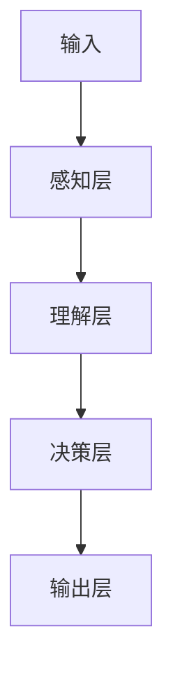
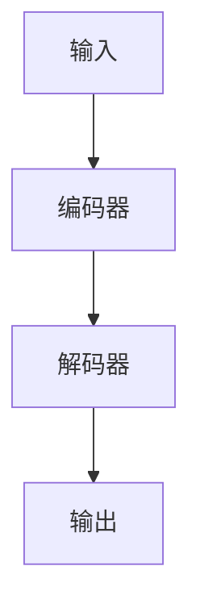
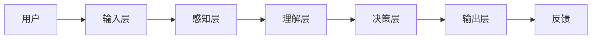

                 


# AI Agent在各行业中的应用场景

## 关键词：AI Agent, 人工智能, 大模型, 生成式AI, 行业应用, 系统架构

## 摘要：AI Agent作为人工智能领域的新兴技术，正逐渐在各个行业中展现其强大的应用潜力。本文将从AI Agent的基本概念、技术原理、系统架构到具体行业的应用场景进行详细分析，探讨其在金融、医疗、教育等领域的实际应用案例，同时结合算法原理和系统设计，为读者提供全面而深入的技术解析。

---

# 第一章: AI Agent 的背景与核心概念

## 1.1 AI Agent 的基本概念

### 1.1.1 什么是AI Agent
AI Agent（人工智能代理）是指能够感知环境、自主决策并执行任务的智能实体。它通过接收输入、理解意图、生成响应或执行操作来实现目标。

### 1.1.2 AI Agent 的特点
- **自主性**：能够自主决策和行动。
- **反应性**：能够实时感知环境并做出反应。
- **目标导向**：所有行为都以实现特定目标为导向。
- **可扩展性**：能够适应不同场景和任务需求。

### 1.1.3 AI Agent 与传统AI的区别
| 特性 | 传统AI | AI Agent |
|------|---------|----------|
| 智能水平 | 单一任务处理 | 多任务、复杂决策 |
| 交互方式 | 非实时 | 实时交互 |
| 自主性 | 无 | 高度自主 |

## 1.2 AI Agent 的发展背景

### 1.2.1 人工智能技术的演进
从专家系统到深度学习，再到当前的大模型技术，AI Agent的发展离不开这些技术的进步。

### 1.2.2 大模型技术的突破
大模型（如GPT系列）的出现，为AI Agent提供了强大的自然语言处理能力。

### 1.2.3 AI Agent 的应用场景
- **金融行业**：智能投顾、风险评估。
- **医疗行业**：疾病诊断、治疗方案推荐。
- **教育行业**：个性化教学、学习辅助。

## 1.3 AI Agent 的技术原理

### 1.3.1 AI Agent 的基本架构


### 1.3.2 大模型在 AI Agent 中的作用
大模型通过预训练掌握了大量知识，能够理解自然语言并生成合理的回复。

### 1.3.3 AI Agent 的核心算法
- **生成式AI**：基于Transformer架构，通过自注意力机制生成文本。
- **强化学习**：通过奖励机制优化AI Agent的决策过程。

---

# 第二章: AI Agent 的核心概念与联系

## 2.1 AI Agent 的核心概念

### 2.1.1 生成式 AI
生成式AI能够根据输入生成新的内容，如文本、图像等。

### 2.1.2 大模型的生成机制
大模型通过解码器结构生成文本，利用交叉注意力机制处理输入。

### 2.1.3 AI Agent 的目标函数
$$ P(y|x) = \text{模型生成的概率分布} $$

## 2.2 AI Agent 的功能模块

### 2.2.1 输入处理模块
负责接收用户的输入并进行预处理。

### 2.2.2 感知与理解模块
通过NLP技术理解用户的意图和需求。

### 2.2.3 决策与生成模块
根据理解生成合适的响应或执行操作。

## 2.3 AI Agent 的设计原则

### 2.3.1 可解释性
确保AI Agent的决策过程可被理解和追溯。

### 2.3.2 稳定性
保证系统在各种情况下都能稳定运行。

### 2.3.3 可扩展性
支持未来功能的扩展和升级。

## 2.4 AI Agent 与其他技术的关系

### 2.4.1 与大模型的关系
AI Agent依赖于大模型的生成能力，但不仅仅是生成模型。

### 2.4.2 与强化学习的关系
强化学习用于优化AI Agent的决策策略。

### 2.4.3 与人机交互的关系
良好的人机交互设计能够提升用户体验。

---

# 第三章: AI Agent 的算法原理

## 3.1 生成式 AI 的数学模型

### 3.1.1 Transformer架构
Transformer由编码器和解码器组成，广泛应用于生成式AI。

### 3.1.2 注意力机制
$$ \text{注意力权重} = \frac{e^{k_j q_i}}{\sum e^{k_j q_i}} $$

### 3.1.3 解码器结构
解码器通过自注意力机制生成输出序列。

## 3.2 大模型的训练目标

### 3.2.1 最大似然估计
通过最大化条件概率来优化模型参数。

### 3.2.2 损失函数
$$ \text{损失} = -\sum_{i=1}^{n} \log P(y_i|x) $$

### 3.2.3 梯度下降
使用Adam优化器进行参数更新。

## 3.3 算法流程图


---

# 第四章: AI Agent 的系统架构

## 4.1 系统分析与设计

### 4.1.1 应用场景
AI Agent可以应用于智能客服、智能助手等多种场景。

### 4.1.2 系统功能设计
- **输入处理**：接收用户输入并解析意图。
- **理解层**：通过NLP技术理解用户需求。
- **决策层**：根据理解生成响应或执行操作。

### 4.1.3 系统架构设计


### 4.1.4 接口设计
- **输入接口**：接收用户输入的文本或命令。
- **输出接口**：返回生成的文本或执行结果。

## 4.2 项目实战

### 4.2.1 项目背景
开发一个智能客服AI Agent，用于处理用户的咨询和问题。

### 4.2.2 环境安装
安装Python、TensorFlow、Keras等开发环境。

### 4.2.3 系统实现
```python
class AI-Agent:
    def __init__(self):
        self.model = load_model('ai_agent_model.h5')
    
    def process_input(self, input_text):
        # 输入处理
        pass
    
    def generate_response(self, input_text):
        # 生成响应
        pass
```

### 4.2.4 案例分析
通过实际案例展示AI Agent在智能客服中的应用。

## 4.3 本章小结

---

# 第五章: AI Agent 在各行业中的应用

## 5.1 金融行业

### 5.1.1 智能投顾
AI Agent可以根据用户需求提供个性化的投资建议。

### 5.1.2 风险评估
通过分析用户信息，评估潜在风险。

## 5.2 医疗行业

### 5.2.1 疾病诊断
AI Agent可以辅助医生进行疾病诊断和治疗方案推荐。

### 5.2.2 健康管理
提供个性化的健康管理方案。

## 5.3 教育行业

### 5.3.1 个性化教学
根据学生特点制定教学计划。

### 5.3.2 学习辅助
提供学习建议和辅导。

---

# 第六章: AI Agent 的未来发展趋势

## 6.1 技术趋势

### 6.1.1 更强的生成能力
通过改进模型结构和训练方法，提升生成质量。

### 6.1.2 更高的可解释性
开发更透明的模型，提升用户信任度。

## 6.2 应用趋势

### 6.2.1 多模态交互
结合视觉、听觉等多种交互方式，提升用户体验。

### 6.2.2 行业深度融合
AI Agent将与更多行业深度融合，提供更智能化的服务。

---

# 第七章: 总结与展望

## 7.1 本书总结
总结全书内容，回顾AI Agent的核心概念、算法原理和行业应用。

## 7.2 未来展望
展望AI Agent的发展前景，预测其在各行业中的应用趋势。

## 7.3 最佳实践 tips
- **持续学习**：保持对新技术的关注和学习。
- **注重伦理**：在开发和应用中注重伦理和合规性。
- **用户体验**：始终以用户体验为核心，优化交互设计。

---

# 作者

作者：AI天才研究院/AI Genius Institute  
联系邮箱：contact@aiguru.com  
官方网站：https://www.aiguru.com

---

以上是《AI Agent在各行业中的应用场景》的完整目录大纲，涵盖了从基础概念到行业应用的各个方面，结合了理论与实践，旨在为读者提供全面而深入的技术解析。

