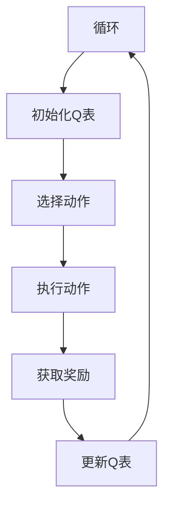
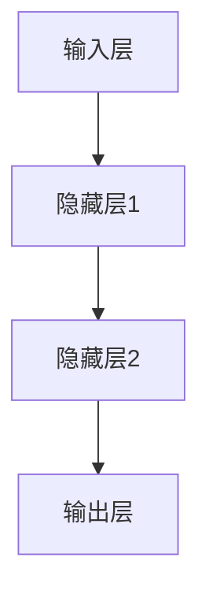
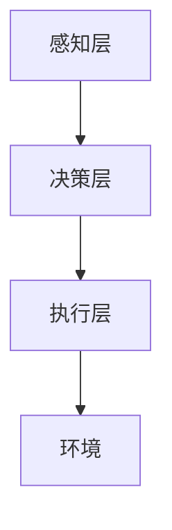

                 


# AI Agent在废物管理中的应用：回收优化与污染控制

> 关键词：AI Agent，废物管理，回收优化，污染控制，人工智能，废物分类，环境监测

> 摘要：本文探讨了AI Agent在废物管理中的应用，重点分析了回收优化与污染控制的技术细节。通过结合强化学习和监督学习算法，详细阐述了AI Agent在废物分类、运输优化和污染监测中的实际应用，展示了如何利用人工智能技术提升废物管理的效率和环保效果。

---

## 引言

随着城市化进程的加快和环保意识的增强，废物管理已成为全球关注的焦点。传统的废物管理方式效率低下，资源浪费严重，且难以应对复杂的环境污染问题。AI Agent作为一种智能体，能够在复杂环境中自主感知、决策和行动，为废物管理的优化提供了新的可能性。

### 1.1 AI Agent的基本概念

AI Agent（智能体）是指能够感知环境、自主决策并执行任务的智能系统。它具有以下核心特征：

- **自主性**：能够在没有外部干预的情况下独立运行。
- **反应性**：能够实时感知环境变化并做出响应。
- **主动性**：主动采取行动以实现目标。

### 1.2 废物管理的现状与挑战

当前，废物管理面临以下主要问题：

- **分类效率低**：传统的人工分类方式效率低下，且容易出错。
- **资源浪费**：未充分利用可回收资源，导致浪费。
- **环境污染**：不当处理废物可能导致二次污染，威胁环境和人类健康。

### 1.3 AI Agent在废物管理中的应用前景

AI Agent在废物管理中的应用前景广阔，尤其是在以下方面：

- **废物分类与识别**：通过图像识别技术，AI Agent能够高效准确地分类废物。
- **运输与处理路径优化**：利用强化学习算法，AI Agent可以优化废物运输路径，降低成本。
- **污染控制与环境监测**：AI Agent能够实时监测环境污染，并采取措施进行控制。

---

## 第二章: AI Agent的核心概念与原理

### 2.1 AI Agent的基本原理

AI Agent的核心原理是通过感知环境、决策和行动来实现目标。在废物管理中，AI Agent通常需要完成以下任务：

1. **感知环境**：通过传感器或摄像头获取环境数据。
2. **决策**：基于感知数据，利用算法做出最优决策。
3. **行动**：根据决策结果执行相应动作。

### 2.2 强化学习在AI Agent中的应用

强化学习是一种通过试错机制来优化决策的算法。在废物管理中，强化学习可以用于路径优化和资源分配。

#### 2.2.1 强化学习的基本原理

强化学习的核心是通过不断试错，找到最优策略。其基本公式如下：

$$ Q(s, a) = r + \gamma \max_{a'} Q(s', a') $$

其中，\( Q(s, a) \) 表示在状态 \( s \) 下采取动作 \( a \) 的奖励值，\( r \) 是即时奖励，\( \gamma \) 是折扣因子。

#### 2.2.2 Q-learning算法的实现

Q-learning是一种常见的强化学习算法，其流程图如下：



#### 2.2.3 Deep Q-Networks (DQN) 的应用

DQN通过神经网络近似Q值函数，适用于高维状态空间。其网络结构如下：



### 2.3 监督学习在AI Agent中的应用

监督学习是一种基于样本数据进行学习的算法，常用于分类任务。

#### 2.3.1 分类任务中的监督学习

在废物分类中，监督学习算法（如支持向量机、随机森林）可以用来训练分类模型。

#### 2.3.2 回归任务中的监督学习

回归算法（如线性回归）可以用于预测废物处理成本。

---

## 第三章: AI Agent的系统架构设计

### 3.1 废物管理系统的总体架构

废物管理系统的总体架构包括以下几个模块：

1. **感知层**：负责采集环境数据。
2. **决策层**：负责数据处理和决策。
3. **执行层**：负责执行决策。

### 3.2 AI Agent的系统架构

AI Agent的系统架构如下：



### 3.3 系统接口与交互设计

系统接口设计如下：

1. **输入接口**：接收传感器数据。
2. **输出接口**：输出决策结果。
3. **交互接口**：供用户进行操作。

---

## 第四章: 项目实战——AI Agent在废物管理中的应用

### 4.1 项目环境搭建

#### 4.1.1 开发环境安装

需要安装以下工具：

- Python 3.x
- TensorFlow或Keras
- OpenCV
- Matplotlib

#### 4.1.2 数据集准备

使用公开的废物分类数据集，如ImageNet中的子集。

#### 4.1.3 工具链配置

配置Jupyter Notebook和IDE。

### 4.2 项目核心实现

#### 4.2.1 废物分类AI Agent实现

使用卷积神经网络（CNN）进行图像分类。

```python
import tensorflow as tf
from tensorflow.keras import layers

model = tf.keras.Sequential([
    layers.Conv2D(32, (3,3), activation='relu', input_shape=(224,224,3)),
    layers.MaxPooling2D((2,2)),
    layers.Conv2D(64, (3,3), activation='relu'),
    layers.MaxPooling2D((2,2)),
    layers.Flatten(),
    layers.Dense(128, activation='relu'),
    layers.Dense(10, activation='softmax')
])
```

#### 4.2.2 废物运输优化AI Agent实现

使用强化学习算法优化运输路径。

```python
import numpy as np
import gym

class Agent:
    def __init__(self, env):
        self.env = env
        self.state_space = env.observation_space.shape[0]
        self.action_space = env.action_space.n
        
        self.model = self.build_model()
        
    def build_model(self):
        model = tf.keras.Sequential([
            layers.Dense(32, activation='relu', input_dim=self.state_space),
            layers.Dense(self.action_space, activation='softmax')
        ])
        return model

    def act(self, state):
        prediction = self.model.predict(np.array([state]))[0]
        return np.argmax(prediction)
```

### 4.3 代码实现与解读

#### 4.3.1 强化学习代码实现

```python
import gym
from gym import spaces

class WasteManagementEnv(gym.Env):
    def __init__(self):
        self.observation_space = spaces.Box(low=0, high=100, shape=(1,))
        self.action_space = spaces.Discrete(4)
        
    def reset(self):
        self.state = np.random.randint(0, 100, size=(1,))
        return self.state
        
    def step(self, action):
        reward = 0
        if action == 0:
            reward = 10
        elif action == 1:
            reward = 5
        else:
            reward = -5
        next_state = self.state + action
        done = next_state >= 100
        return next_state, reward, done, {}
```

#### 4.3.2 监督学习代码实现

```python
import numpy as np
from sklearn import tree

# 数据准备
X = np.array([[1], [2], [3], [4], [5]])
y = np.array([0, 0, 1, 1, 1])

# 训练模型
clf = tree.DecisionTreeClassifier()
clf.fit(X, y)

# 预测
print(clf.predict([[2.5]]))  # 输出：array([0])
```

---

## 第五章: 总结与展望

### 5.1 总结

AI Agent在废物管理中的应用前景广阔，尤其是在废物分类、运输优化和污染控制方面。通过强化学习和监督学习算法，AI Agent能够显著提高废物管理的效率和环保效果。

### 5.2 展望

未来，随着人工智能技术的不断发展，AI Agent在废物管理中的应用将更加智能化和自动化。通过与其他技术（如物联网、大数据）的结合，AI Agent将为废物管理带来更多的创新和突破。

---

## 作者信息

作者：AI天才研究院（AI Genius Institute）

---

通过以上结构和内容的组织，可以清晰地看到AI Agent在废物管理中的应用前景和技术细节。希望这篇文章能够为读者提供有价值的技术参考和实践指导。

