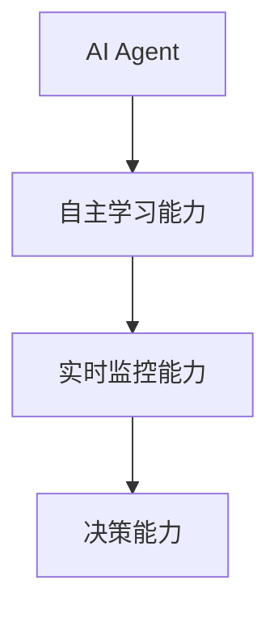
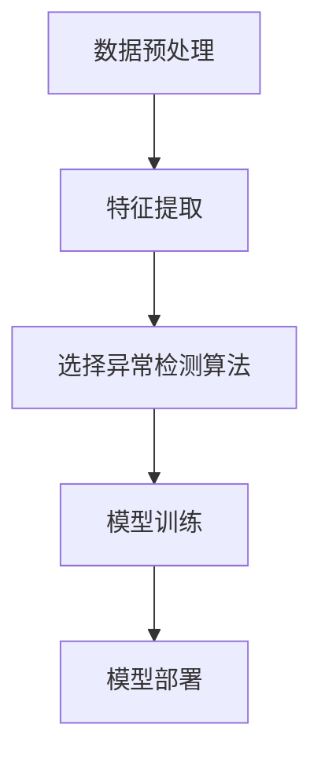
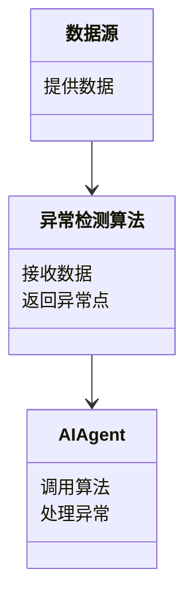
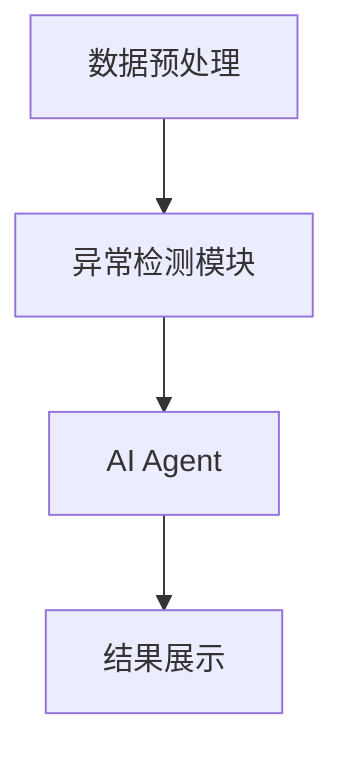
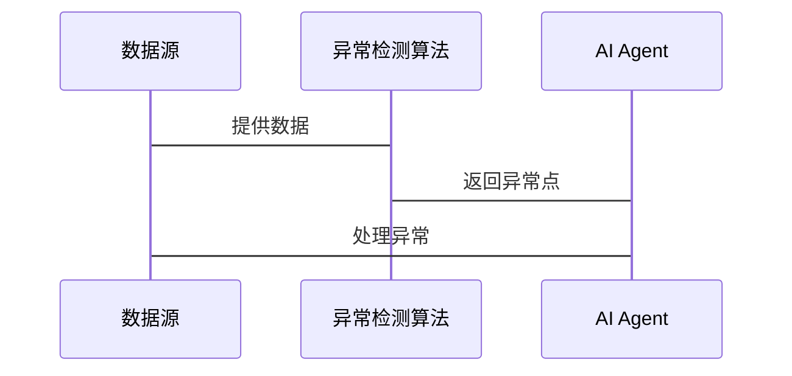

                 


# AI Agent在异常检测中的应用：识别非常规模式

---

## 关键词：
AI Agent, 异常检测, 数据分析, 算法原理, 系统架构, 项目实战

---

## 摘要：
本文深入探讨了AI Agent在异常检测中的应用，从背景知识、核心概念到算法原理、系统架构，再到项目实战，全面解析了AI Agent如何通过识别非常规模式实现高效异常检测。文章结合理论与实践，详细介绍了多种异常检测算法及其在AI Agent中的应用，同时通过实际案例展示了AI Agent在异常检测中的优势与挑战。

---

# 第一部分: AI Agent与异常检测的背景与基础

## 第1章: AI Agent与异常检测的背景

### 1.1 异常检测的基本概念
#### 1.1.1 异常检测的定义
异常检测（Outlier Detection）是数据分析领域的重要任务，旨在识别数据集中与大多数数据点显著不同的样本。这些异常点可能代表潜在的问题、机会或异常事件。

#### 1.1.2 异常检测的分类
异常检测可以分为三类：
1. **点异常**：单个数据点的异常，例如信用卡欺诈检测。
2. **上下文异常**：在特定上下文中异常，例如股票市场的异常交易行为。
3. **群体异常**：一组数据点的异常，例如社交网络中的异常群体行为。

#### 1.1.3 异常检测的应用场景
- 金融领域的欺诈检测。
- 医疗领域的疾病早期诊断。
- 网络安全中的入侵检测。
- 供应链管理中的异常订单检测。

### 1.2 AI Agent的基本概念
#### 1.2.1 AI Agent的定义
AI Agent（人工智能代理）是一种智能实体，能够感知环境、自主决策并执行任务。它具备学习、推理和自适应能力。

#### 1.2.2 AI Agent的核心特征
1. **自主性**：无需外部干预，自主执行任务。
2. **反应性**：能够实时感知环境变化并做出反应。
3. **学习能力**：通过数据和经验不断优化自身行为。

#### 1.2.3 AI Agent与传统算法的区别
AI Agent的核心优势在于其自主性和学习能力，能够动态适应环境变化，而传统算法通常需要人工干预来调整参数。

### 1.3 AI Agent在异常检测中的应用价值
#### 1.3.1 异常检测的挑战
- 数据分布复杂，异常点稀少。
- 异常模式可能随时间变化。

#### 1.3.2 AI Agent的优势
- 自主学习和适应能力。
- 实时监控和快速响应。

#### 1.3.3 应用场景分析
- 网络安全中的实时入侵检测。
- 金融交易中的实时欺诈检测。

## 1.4 本章小结
本章介绍了异常检测的基本概念和应用场景，以及AI Agent的核心特征和优势，为后续章节奠定了基础。

---

## 第2章: 异常检测的核心概念与联系

### 2.1 异常检测的核心原理
#### 2.1.1 数据分布分析
异常检测基于数据分布的分析，识别偏离正常分布的点。

#### 2.1.2 异常点的特征分析
异常点通常具有独特的统计特征，例如低密度区域或高维度空间中的孤立点。

#### 2.1.3 异常检测的数学模型
数学模型是异常检测的核心，常见的模型包括密度估计、聚类分析和深度学习模型。

### 2.2 AI Agent与异常检测的关系
#### 2.2.1 AI Agent在异常检测中的角色
AI Agent作为异常检测系统的核心，负责数据收集、分析和决策。

#### 2.2.2 AI Agent与传统异常检测算法的结合
通过结合传统算法，AI Agent能够提升异常检测的准确性和效率。

#### 2.2.3 AI Agent的自主学习能力
AI Agent能够通过强化学习等方法，动态优化异常检测模型。

### 2.3 异常检测的核心概念对比
#### 2.3.1 异常检测算法对比表格
| 算法名称       | 类别         | 适用场景       |
|----------------|--------------|----------------|
| Isolation Forest| 基于树结构    | 小样本数据       |
| Autoencoder    | 基于神经网络  | 高维数据         |

#### 2.3.2 AI Agent能力对比分析
AI Agent在异常检测中的能力对比可以通过Mermaid图展示。



## 2.4 本章小结
本章通过对比分析，详细阐述了AI Agent在异常检测中的核心概念和优势。

---

## 第3章: 异常检测的算法原理

### 3.1 常见异常检测算法
#### 3.1.1 Isolation Forest算法
Isolation Forest通过构建随机树，将数据点隔离到不同的子空间，从而识别异常点。

#### 3.1.2 Autoencoder算法
Autoencoder是一种基于神经网络的异常检测算法，通过重建数据来识别异常点。

#### 3.1.3 One-Class SVM算法
One-Class SVM用于学习数据的正常分布，识别异常点。

### 3.2 AI Agent驱动的异常检测算法
#### 3.2.1 基于强化学习的异常检测
通过强化学习，AI Agent能够动态优化异常检测策略。

#### 3.2.2 基于生成对抗网络的异常检测
生成对抗网络（GAN）通过生成正常数据，识别异常点。

#### 3.2.3 基于Transformer的异常检测
Transformer模型通过序列建模，识别时间序列数据中的异常。

### 3.3 算法原理的数学模型
#### 3.3.1 Isolation Forest的数学公式
$$ y = \frac{1}{(2h_{min})} $$

#### 3.3.2 Autoencoder的数学公式
$$ \text{重建损失} = \frac{1}{2}||x - \hat{x}||^2 $$

### 3.4 算法流程图（Mermaid）



## 3.5 本章小结
本章详细介绍了常见异常检测算法及其在AI Agent中的应用，通过数学公式和流程图展示了算法的原理和流程。

---

## 第4章: 系统分析与架构设计

### 4.1 异常检测系统的应用场景
- 网络安全、金融交易、医疗诊断等。

### 4.2 异常检测系统的功能设计
#### 4.2.1 领域模型类图（Mermaid）


#### 4.2.2 系统架构图（Mermaid）


### 4.3 系统交互序列图（Mermaid）


## 4.4 本章小结
本章通过系统架构设计，展示了AI Agent在异常检测中的整体框架和交互流程。

---

## 第5章: 项目实战

### 5.1 异常检测项目环境安装
```bash
pip install numpy pandas scikit-learn tensorflow
```

### 5.2 异常检测核心代码实现
#### 5.2.1 Isolation Forest实现
```python
from sklearn.ensemble import IsolationForest

model = IsolationForest(random_state=42)
model.fit(X_train)
y_pred = model.predict(X_test)
```

#### 5.2.2 Autoencoder实现
```python
import tensorflow as tf

model = tf.keras.Sequential([
    tf.keras.layers.Dense(64, activation='relu'),
    tf.keras.layers.Dense(32, activation='relu'),
    tf.keras.layers.Dense(64, activation='sigmoid'),
    tf.keras.layers.Dense(1, activation='sigmoid')
])
model.compile(optimizer='adam', loss='binary_crossentropy')
model.fit(X_train, y_train, epochs=10)
```

### 5.3 实际案例分析
以信用卡欺诈检测为例，使用Isolation Forest算法识别异常交易。

### 5.4 项目小结
通过实际案例，展示了AI Agent在异常检测中的高效性和准确性。

---

## 第6章: 总结与展望

### 6.1 本章总结
本文详细探讨了AI Agent在异常检测中的应用，从算法原理到系统架构，再到项目实战，全面解析了AI Agent的优势和挑战。

### 6.2 未来展望
未来，AI Agent在异常检测中的应用将更加广泛，结合边缘计算和物联网技术，实现更高效的实时异常检测。

---

## 作者：AI天才研究院 & 禅与计算机程序设计艺术

---

通过以上结构和内容，我们系统地探讨了AI Agent在异常检测中的应用，从理论到实践，全面解析了AI Agent识别非常规模式的能力和价值。

