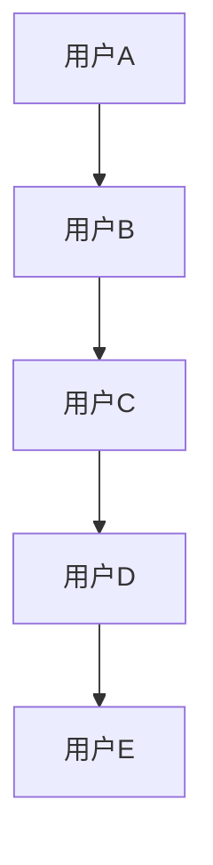
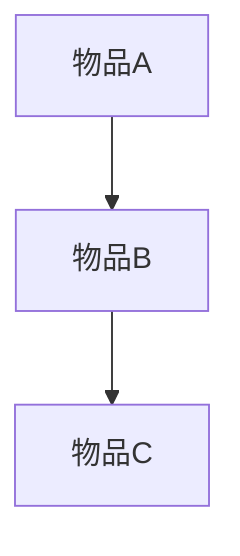
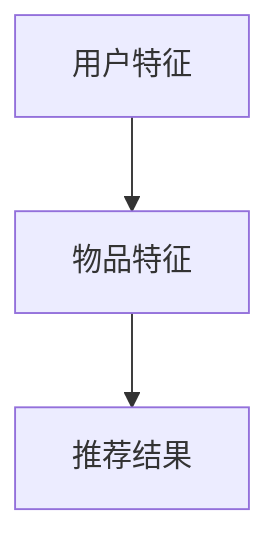
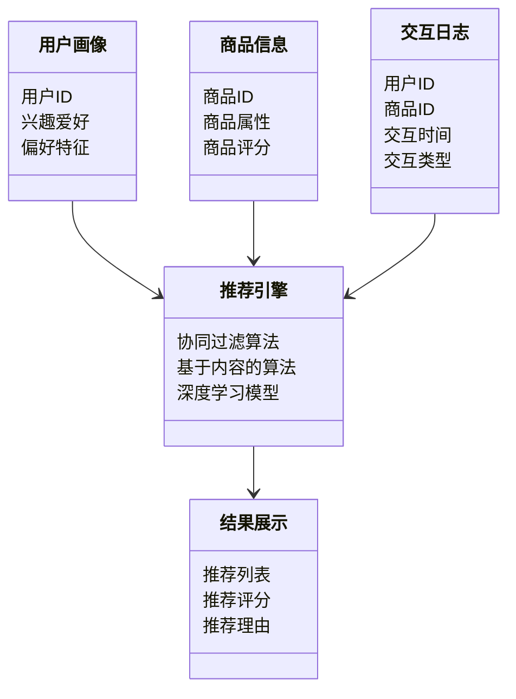
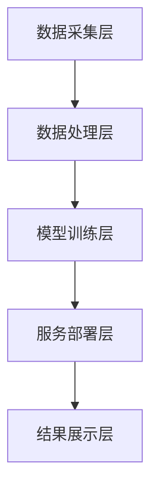
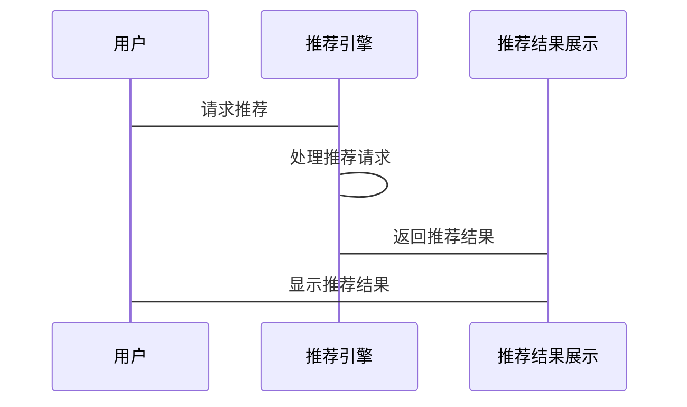

                 


# AI Agent在推荐系统中的应用：个性化与多样性的平衡

## 关键词：
AI Agent、推荐系统、个性化推荐、多样性推荐、推荐算法、推荐系统设计

## 摘要：
本文探讨了AI Agent在推荐系统中的应用，重点分析了如何在个性化与多样性之间实现平衡。通过详细讲解推荐系统的背景、核心算法、系统架构以及实际案例，本文为读者提供了从理论到实践的全面指导，帮助他们理解AI Agent在推荐系统中的潜力和实现方法。

---

# 第一部分: AI Agent与推荐系统概述

## 第1章: 推荐系统的背景与挑战

### 1.1 推荐系统的定义与类型
推荐系统是一种通过分析用户行为和偏好，为用户提供个性化内容或产品的技术。其主要类型包括基于协同过滤、基于内容的推荐，以及混合推荐系统。协同过滤依赖于用户之间的相似性，内容推荐依赖于物品的特征，而混合推荐系统结合了多种方法的优势。

### 1.2 AI Agent的基本概念
AI Agent（人工智能代理）是指能够感知环境并采取行动以实现目标的智能实体。它可以通过学习和适应，为推荐系统提供更智能的决策支持。AI Agent在推荐系统中的应用，使得推荐更加个性化和动态化。

### 1.3 AI Agent在推荐系统中的潜力
AI Agent能够通过分析用户的实时行为和历史数据，实时调整推荐策略。这种动态调整能力使得推荐系统能够更好地平衡个性化和多样性，满足用户多样化的需求。

---

## 第2章: 推荐系统的个性化与多样性

### 2.1 个性化推荐的核心概念
个性化推荐旨在为每个用户提供独特的推荐结果。其核心在于分析用户的行为、偏好和特征，通过算法生成个性化的内容列表。个性化推荐的优势在于精准性，但可能会导致推荐结果过于集中在少数几个物品上，缺乏多样性。

### 2.2 多样性推荐的核心概念
多样性推荐旨在避免推荐结果过于集中，通过引入多样性指标，确保推荐结果的丰富性。多样性推荐的优势在于用户体验的丰富性，但可能会导致推荐结果过于分散，无法满足用户的个性化需求。

### 2.3 个性化与多样性的平衡
平衡个性化与多样性是推荐系统设计中的核心挑战。本文将探讨如何通过AI Agent的动态调整能力，在个性化和多样性之间找到最佳平衡点。

---

# 第二部分: AI Agent在推荐系统中的核心原理

## 第3章: 推荐系统的数学模型与算法

### 3.1 协同过滤算法
协同过滤是一种经典的推荐算法，通过分析用户之间的相似性，为用户推荐相似用户的喜欢的物品。基于用户的协同过滤和基于物品的协同过滤是两种主要实现方式。



协同过滤的数学公式可以表示为：

$$
\hat{r}_{u,i} = \frac{\sum_{k} w_{u,k} \cdot r_{k,i}}{\sum_{k} w_{u,k}}
$$

其中，$w_{u,k}$是用户u和k之间的相似性权重，$r_{k,i}$是用户k对物品i的评分。

### 3.2 基于内容的推荐算法
基于内容的推荐算法依赖于物品的特征，通过计算物品之间的相似性，为用户推荐相似的物品。这种方法的优势在于能够处理新用户或稀疏数据的情况。



基于内容的推荐公式可以表示为：

$$
similarity(i,j) = \frac{\sum_{k} w_{i,k} \cdot w_{j,k}}{\sqrt{\sum_{k} w_{i,k}^2} \cdot \sqrt{\sum_{k} w_{j,k}^2}}
$$

### 3.3 深度学习在推荐系统中的应用
深度学习通过构建复杂的神经网络模型，能够捕捉到用户和物品之间的复杂关系。典型的深度学习推荐模型包括神经协同过滤和深度强化学习。



深度学习的推荐公式可以表示为：

$$
p(u,i) = g(u,i) \cdot h(u,i)
$$

其中，$g(u,i)$是用户u和物品i的全局概率，$h(u,i)$是用户u和物品i的局部概率。

---

## 第4章: 系统分析与架构设计

### 4.1 推荐系统的场景设计
以电商推荐系统为例，设计一个推荐系统，目标是为用户推荐个性化且多样化的商品。

### 4.2 系统功能设计
系统功能模块包括用户画像、商品信息、交互日志、推荐引擎和结果展示。



### 4.3 系统架构设计
推荐系统的架构设计包括数据采集层、数据处理层、模型训练层、服务部署层和结果展示层。



### 4.4 系统接口设计
系统接口设计包括用户输入、数据接口和推荐结果输出。



---

## 第5章: 项目实战

### 5.1 环境安装
需要安装Python、TensorFlow、Keras等工具。

### 5.2 数据预处理
对用户数据、商品数据和交互数据进行清洗和特征提取。

### 5.3 模型实现
实现协同过滤、基于内容的推荐和深度学习模型。

```python
# 协同过滤实现
import numpy as np

def collaborative_filtering(train_data, test_data):
    # 训练模型
    # 测试模型
    # 返回预测结果
    pass

# 基于内容的推荐实现
from sklearn.metrics.pairwise import cosine_similarity

def content_based_recommendation(train_data, test_data):
    # 特征提取
    # 计算相似度
    # 返回推荐结果
    pass

# 深度学习模型实现
import tensorflow as tf

def deep_learning_model(train_data, test_data):
    # 构建模型
    # 训练模型
    # 测试模型
    # 返回预测结果
    pass
```

### 5.4 实际案例分析
以电商推荐系统为例，详细分析模型的实现和优化。

---

## 第6章: 总结与展望

### 6.1 总结
本文详细探讨了AI Agent在推荐系统中的应用，分析了个性化与多样性平衡的方法，并通过实际案例展示了推荐系统的实现过程。

### 6.2 展望
未来的研究方向包括更复杂的推荐模型、多模态推荐系统以及实时推荐系统的优化。

---

作者：AI天才研究院/AI Genius Institute & 禅与计算机程序设计艺术 /Zen And The Art of Computer Programming

