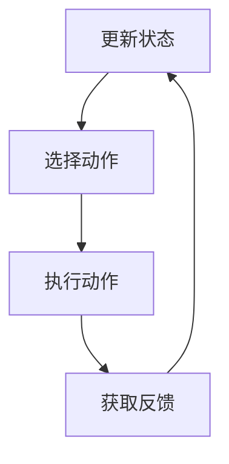
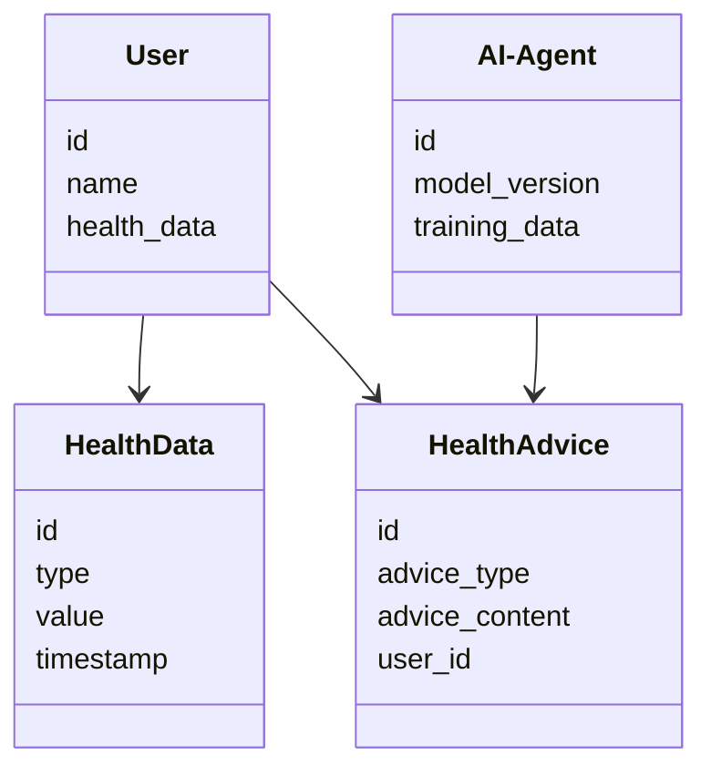
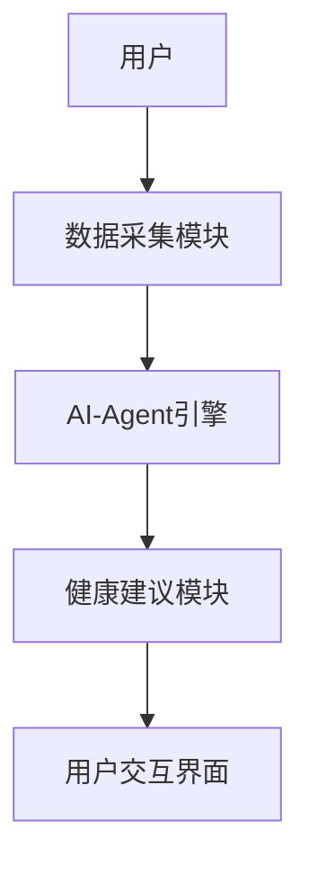
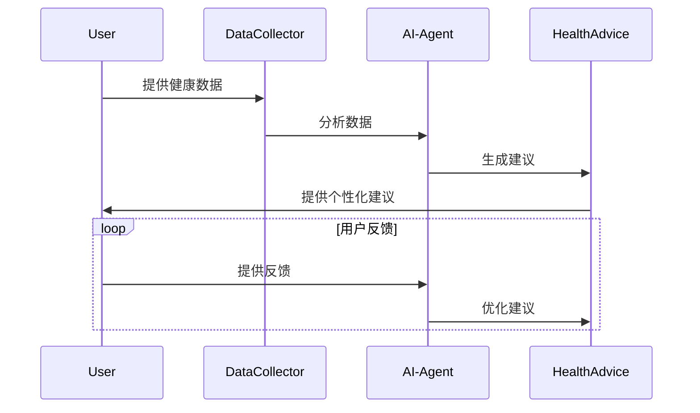

                 


# AI Agent在智能个性化健康建议中的应用

> 关键词：AI Agent，个性化健康建议，人工智能，医疗健康，系统架构

> 摘要：本文深入探讨了AI Agent在智能个性化健康建议中的应用，分析了其核心概念、算法原理、系统架构及实际案例。通过详细的技术分析和实际应用，展示了如何利用AI Agent技术为用户提供精准、个性化的健康建议，推动医疗健康领域的智能化发展。

---

# 第1章: 引言

AI Agent（人工智能代理）是一种能够感知环境、自主决策并执行任务的智能系统。在医疗健康领域，个性化健康建议是提升用户体验和医疗效果的重要手段。随着AI技术的快速发展，AI Agent在个性化健康建议中的应用日益广泛，为医疗健康行业带来了新的可能性。

本文将从AI Agent的核心原理出发，分析其在个性化健康建议中的应用场景，并结合实际案例，探讨如何通过AI Agent技术为用户提供智能化、个性化的健康建议。

---

# 第2章: 背景介绍

## 2.1 问题背景

### 2.1.1 当前医疗健康领域的挑战

医疗健康领域面临着诸多挑战，包括医疗资源分配不均、患者需求多样化、健康数据复杂化等。传统的健康建议往往基于通用的健康模型，难以满足个体差异化的健康需求。

### 2.1.2 个性化健康建议的重要性

个性化健康建议能够根据个体的健康状况、生活习惯和遗传背景等因素，提供针对性的健康指导，帮助用户更好地管理健康。

### 2.1.3 AI技术在医疗健康中的应用现状

AI技术在医疗健康领域的应用日益广泛，包括疾病诊断、药物研发、健康监测等方面。然而，如何利用AI技术实现个性化的健康建议，仍是当前研究的热点。

## 2.2 问题描述

### 2.2.1 个性化健康建议的核心问题

个性化健康建议的核心问题是如何根据个体的复杂数据，生成精准、可执行的健康方案。

### 2.2.2 AI Agent在个性化健康建议中的角色

AI Agent通过感知用户数据、分析健康模型、优化建议方案，成为个性化健康建议的核心技术。

### 2.2.3 当前技术的局限性与改进方向

当前技术在数据采集、模型优化、用户交互等方面仍存在不足，需要进一步提升AI Agent的智能化和个性化能力。

## 2.3 问题解决

### 2.3.1 AI Agent的解决方案

AI Agent通过多模态数据融合、强化学习优化、动态调整建议，为个性化健康建议提供技术支持。

### 2.3.2 个性化健康建议的实现路径

个性化健康建议的实现需要数据采集、模型构建、建议生成、实时反馈等多个环节的协同工作。

### 2.3.3 技术实现的关键点

关键技术包括多模态数据处理、强化学习算法、动态优化模型等。

## 2.4 边界与外延

### 2.4.1 AI Agent的边界定义

AI Agent的应用范围包括健康监测、疾病预防、健康指导等领域，但不涉及医疗诊断和治疗决策。

### 2.4.2 个性化健康建议的适用范围

个性化健康建议适用于慢性病管理、健康风险评估、健康教育等场景。

### 2.4.3 相关领域的扩展与联系

AI Agent在个性化健康建议中的应用可以与其他领域如健康管理、智能设备等深度融合，形成完整的健康生态。

## 2.5 概念结构与核心要素

### 2.5.1 AI Agent的核心要素

- 数据采集与处理
- 健康模型构建
- 建议生成与优化
- 用户反馈与调整

### 2.5.2 个性化健康建议的关键因素

- 用户健康数据
- 健康目标设定
- 个性化建议方案
- 实时反馈机制

### 2.5.3 系统架构的核心组件

- 数据采集模块
- AI Agent引擎
- 健康建议模块
- 用户交互界面

---

# 第3章: 核心概念与联系

## 3.1 核心概念原理

### 3.1.1 AI Agent的核心算法

AI Agent的核心算法包括强化学习、监督学习、无监督学习等。其中，强化学习（Reinforcement Learning）是实现动态优化的关键技术。

### 3.1.2 个性化健康建议的数学模型

个性化健康建议可以通过数学模型进行建模，例如基于强化学习的健康优化模型：

$$
V(s) = \max_{a} [r(s,a) + \gamma V(next\_state)]
$$

其中，$s$ 表示当前状态，$a$ 表示动作，$r(s,a)$ 表示奖励函数，$\gamma$ 表示折扣因子。

### 3.1.3 AI Agent与健康数据的关系

AI Agent通过感知和分析健康数据，生成个性化的健康建议。健康数据包括生理数据（如心率、血压）、行为数据（如运动量、饮食习惯）等。

## 3.2 概念对比与ER实体关系图

### 3.2.1 核心概念对比表

| 概念       | 特性                   |
|------------|------------------------|
| AI Agent    | 能够自主决策，基于数据优化建议 |
| 个性化健康建议 | 根据个体数据提供定制化建议      |

### 3.2.2 ER实体关系图

```mermaid
er
    %% ER Diagram for AI Agent and Personalized Health Advice
    %% Entities
    entity User {
        id: int
        name: string
        health_data: string
        }
    entity HealthData {
        id: int
        type: string
        value: float
        timestamp: datetime
        }
    entity HealthAdvice {
        id: int
        advice_type: string
        advice_content: string
        user_id: int
        }
    entity AI-Agent {
        id: int
        model_version: string
        training_data: string
        }
    %% Relationships
    User --> HealthData: 提供
    User --> HealthAdvice: 获取
    AI-Agent --> HealthAdvice: 生成
```

---

# 第4章: 算法原理讲解

## 4.1 强化学习算法

### 4.1.1 强化学习的定义与特点

强化学习是一种通过与环境交互，逐步优化策略的算法。其核心在于通过试错和奖励机制，找到最优动作序列。

### 4.1.2 基于强化学习的健康优化算法

以下是一个基于Q-learning的健康优化算法示例：



数学公式如下：

$$
Q(s,a) = Q(s,a) + \alpha [r(s,a) + \gamma \max Q(s',a') - Q(s,a)]
$$

其中，$\alpha$ 是学习率，$\gamma$ 是折扣因子。

### 4.1.3 算法实现代码示例

```python
class AI-Agent:
    def __init__(self):
        self.Q = {}  # Q值表
        self.alpha = 0.1  # 学习率
        self.gamma = 0.9  # 折扣因子

    def get_action(self, state):
        if state not in self.Q:
            self.Q[state] = 0
        max_action = max(self.Q.items(), key=lambda x: x[1])[0]
        return max_action

    def update_Q(self, state, action, reward, next_state):
        current_Q = self.Q.get((state, action), 0)
        next_max_Q = max(self.Q.get(next_state, 0), default=0)
        new_Q = current_Q + self.alpha * (reward + self.gamma * next_max_Q - current_Q)
        self.Q[(state, action)] = new_Q
```

---

# 第5章: 系统分析与架构设计

## 5.1 应用场景介绍

个性化健康建议系统适用于慢性病管理、健康风险评估、健康教育等多种场景。

## 5.2 系统功能设计

### 5.2.1 领域模型类图



### 5.2.2 系统架构图



### 5.2.3 系统接口设计

- 用户接口：API用于接收用户数据和健康建议请求。
- 数据接口：与健康设备和数据库交互。
- AI-Agent接口：处理健康数据并生成建议。

### 5.2.4 系统交互序列图



---

# 第6章: 项目实战

## 6.1 环境安装

### 6.1.1 安装Python和相关库

```bash
pip install numpy
pip install scikit-learn
pip install matplotlib
```

### 6.1.2 安装AI-Agent框架

```bash
git clone https://github.com/ai-agent/health-advice.git
cd health-advice
pip install -r requirements.txt
```

## 6.2 核心代码实现

### 6.2.1 数据预处理代码

```python
import numpy as np
import pandas as pd

def preprocess_data(data):
    # 数据清洗
    data = data.dropna()
    # 数据标准化
    data = (data - data.mean()) / data.std()
    return data
```

### 6.2.2 AI-Agent实现代码

```python
class AI-Agent:
    def __init__(self):
        self.model = self.build_model()

    def build_model(self):
        # 构建AI-Agent模型
        pass

    def predict(self, input_data):
        # 预测健康建议
        pass
```

## 6.3 实际案例分析

### 6.3.1 案例背景

假设一个用户有高血压风险，系统需要根据其饮食、运动等数据，提供个性化的降压建议。

### 6.3.2 系统实现

```python
user_data = {
    'age': 45,
    'weight': 80,
    'height': 170,
    'blood_pressure': 140,
    'daily_activity': 'low'
}

ai_agent = AI-Agent()
health_advice = ai_agent.generate_advice(user_data)
print(health_advice)
```

## 6.4 代码应用解读

### 6.4.1 数据预处理步骤

1. 数据清洗：去除缺失值。
2. 数据标准化：对数据进行归一化处理。

### 6.4.2 AI-Agent实现步骤

1. 数据采集：获取用户健康数据。
2. 数据分析：构建健康模型。
3. 建议生成：基于模型生成个性化建议。
4. 用户反馈：实时调整建议方案。

### 6.4.3 案例分析结果

通过AI-Agent生成的健康建议，用户能够更好地管理健康，降低疾病风险。

---

# 第7章: 总结

## 7.1 最佳实践

- 数据采集要全面，确保模型输入的准确性。
- 定期更新AI-Agent模型，提升建议的精准度。
- 提供友好的用户交互界面，提升用户体验。

## 7.2 小结

本文详细探讨了AI Agent在智能个性化健康建议中的应用，从核心概念到算法实现，再到系统设计，全面分析了其在医疗健康领域的潜力。

## 7.3 注意事项

- 保护用户隐私，确保数据安全。
- 定期验证模型的准确性，避免误诊风险。
- 提供多语言支持，扩大用户群体。

## 7.4 拓展阅读

- 《强化学习入门》
- 《机器学习在医疗健康中的应用》
- 《系统架构设计实战》

---

# 作者：AI天才研究院/AI Genius Institute & 禅与计算机程序设计艺术/Zen And The Art of Computer Programming

---

以上是《AI Agent在智能个性化健康建议中的应用》的完整目录和内容概要。如需进一步扩展或调整，请随时告知！

