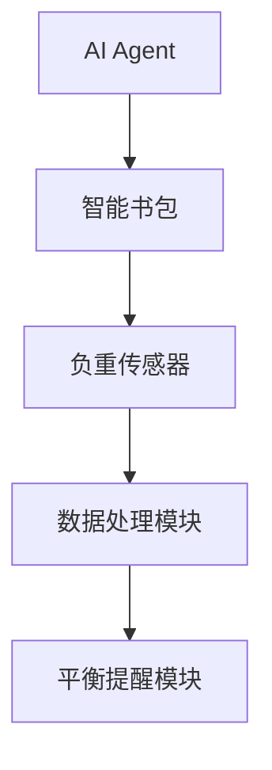
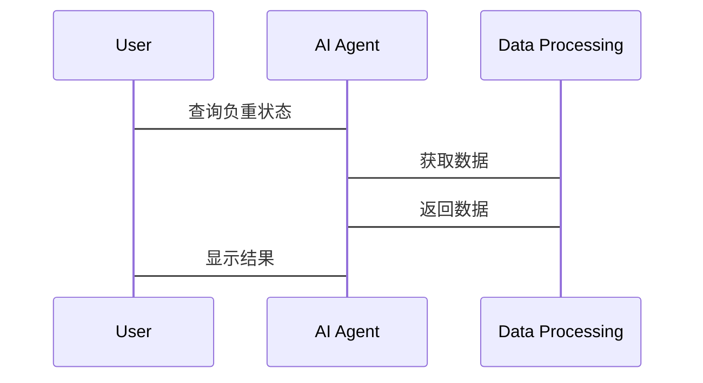

                 


# AI Agent在智能书包中的负重平衡提醒

## 关键词：AI Agent, 智能书包, 负重平衡, 感知算法, 数据处理, 系统架构, 实际应用

## 摘要：本文深入探讨了AI Agent在智能书包中的负重平衡提醒功能。首先介绍了负重平衡问题的背景与现状，阐述了AI Agent的核心概念与应用场景。接着详细讲解了负重平衡的数学模型与算法原理，分析了系统的整体架构与功能模块。最后通过具体的项目实战，展示了AI Agent在智能书包中的实际应用，总结了最佳实践与注意事项。

---

## 第1章: 背景介绍

### 1.1 负重平衡问题的背景与现状

#### 1.1.1 负重过重的健康风险
长时间携带过重的书包可能导致脊柱变形、肩颈疼痛等问题，尤其是青少年群体。研究表明，超过20%的学生每天承受的书包重量超过身体重量的15%，这会显著增加骨骼和肌肉的负担。

#### 1.1.2 现有负重提醒技术的局限性
传统的负重提醒装置多基于简单的机械开关或重量传感器，存在精度低、误报率高、缺乏智能化等问题。此外，这些装置通常仅能提供简单的提醒功能，无法根据用户的活动场景动态调整提醒策略。

#### 1.1.3 AI Agent在负重管理中的潜力
AI Agent能够实时感知用户的负重状态，结合运动数据和环境信息，动态调整提醒策略。通过机器学习算法，AI Agent可以不断优化提醒的准确性与及时性，为用户提供更智能、更贴心的负重管理服务。

### 1.2 AI Agent的核心概念与应用场景

#### 1.2.1 AI Agent的基本定义
AI Agent是一种能够感知环境、做出决策并执行动作的智能体。在智能书包中，AI Agent通过传感器获取用户的负重数据，并根据预设的算法判断是否需要发出提醒。

#### 1.2.2 智能书包的功能与目标
智能书包集成了多种传感器（如加速度传感器、压力传感器）和AI算法，旨在实时监测用户的负重状态，并通过震动、声音等方式提醒用户注意负重平衡。

#### 1.2.3 负重平衡提醒的实际需求
用户在不同场景下对负重提醒的需求不同。例如，在静坐时，用户可能只需要轻微的提醒；而在运动时，可能需要更强烈的提醒信号。

### 1.3 问题背景与解决方案

#### 1.3.1 负重过重的常见场景
- 长时间背负重物
- 不正确的负重姿势
- 突然增加的负重

#### 1.3.2 AI Agent在智能书包中的定位
AI Agent作为智能书包的核心模块，负责数据采集、处理、分析和反馈。

#### 1.3.3 解决方案的技术路线
1. 数据采集：通过传感器获取负重数据
2. 数据处理：对数据进行滤波和特征提取
3. 平衡判断：通过算法判断是否需要提醒
4. 反馈执行：发出提醒信号

### 1.4 问题解决的边界与外延

#### 1.4.1 功能边界
- 仅支持负重提醒功能
- 不支持其他辅助功能（如天气提醒）

#### 1.4.2 技术边界
- 仅支持特定类型的传感器
- 不支持复杂的环境感知

#### 1.4.3 应用场景的外延
- 可扩展至其他类似场景（如背包、肩包）

### 1.5 核心概念的结构与组成

#### 1.5.1 系统组成模块
- 传感器模块
- 数据处理模块
- AI算法模块
- 提醒执行模块

#### 1.5.2 模块之间的关系
传感器模块采集数据，数据处理模块进行预处理，AI算法模块进行分析，提醒执行模块根据结果发出提醒。

#### 1.5.3 核心要素的定义
- 负重传感器：用于采集负重数据
- AI算法：用于判断负重状态
- 提醒装置：用于通知用户

---

## 第2章: 核心概念与联系

### 2.1 AI Agent的基本原理

#### 2.1.1 感知层原理
AI Agent通过传感器获取环境数据，如加速度、压力等。

#### 2.1.2 决策层原理
AI Agent根据感知数据，结合预设算法，做出是否需要提醒的决策。

#### 2.1.3 执行层原理
AI Agent通过执行模块（如震动马达）发出提醒信号。

### 2.2 负重平衡的数学模型

#### 2.2.1 模型的基本假设
- 负重数据服从正态分布
- 负重提醒阈值为用户设定值

#### 2.2.2 模型的输入变量
- 加速度数据
- 时间序列数据

#### 2.2.3 模型的输出变量
- 负重状态（正常/异常）
- 提醒强度

### 2.3 智能书包的系统架构

#### 2.3.1 系统功能模块
- 数据采集模块
- 数据处理模块
- AI算法模块
- 提醒执行模块

#### 2.3.2 系统的输入输出
- 输入：负重数据
- 输出：提醒信号

### 2.4 核心概念的对比分析

#### 2.4.1 不同AI Agent算法的对比
| 算法类型 | 优点 | 缺点 |
|----------|------|------|
| 传统规则引擎 | 实现简单 | 鲁棒性差 |
| 机器学习算法 | 鲁棒性强 | 实现复杂 |

#### 2.4.2 不同负重提醒方式的对比
| 提醒方式 | 优点 | 缺点 |
|----------|------|------|
| 声音提醒 | 易被感知 | 易受环境干扰 |
| 震动提醒 | 显私密性好 | 提醒力度有限 |

### 2.5 核心概念的ER实体关系图



---

## 第3章: 算法原理讲解

### 3.1 负重平衡算法的流程

#### 3.1.1 数据采集流程
1. 传感器采集负重数据
2. 数据传输至数据处理模块

#### 3.1.2 数据处理流程
1. 数据滤波
2. 特征提取

#### 3.1.3 平衡判断流程
1. 数据输入算法模块
2. 算法判断是否需要提醒

### 3.2 算法的数学模型

#### 3.2.1 加速度传感器数据的处理
$$
\text{滤波公式} = \frac{a_n + a_{n-1}}{2}
$$

#### 3.2.2 负重平衡的计算公式
$$
\text{平衡状态} = f(\text{加速度}, \text{时间})
$$

#### 3.2.3 平衡状态的判断逻辑
1. 如果负重超过阈值，触发提醒
2. 如果负重持续时间超过阈值，触发提醒

### 3.3 算法的实现代码

```python
import numpy as np

def calculate_balance(weight_data):
    # 数据预处理
    filtered_data = np.mean(weight_data, axis=0)
    # 计算平衡状态
    balance_state = np.where(filtered_data > threshold, '异常', '正常')
    return balance_state
```

---

## 第4章: 系统分析与架构设计方案

### 4.1 系统功能设计

#### 4.1.1 功能模块
- 传感器模块
- 数据处理模块
- AI算法模块
- 提醒执行模块

#### 4.1.2 功能流程
1. 传感器采集数据
2. 数据处理模块预处理
3. AI算法模块判断状态
4. 提醒执行模块发出提醒

### 4.2 系统架构设计

#### 4.2.1 系统架构图


#### 4.2.2 系统接口设计
- 传感器接口：I2C接口
- 数据处理接口：SPI接口
- 提醒执行接口：PWM接口

### 4.3 系统交互设计

#### 4.3.1 交互流程图



---

## 第5章: 项目实战

### 5.1 环境安装

#### 5.1.1 硬件环境
- 微控制器：STM32
- 传感器：加速度传感器
- 通信模块：Wi-Fi模块

#### 5.1.2 软件环境
- 开发工具：Keil C51
- 编程语言：C语言
- AI算法库：TensorFlow Lite

### 5.2 系统核心实现源代码

```python
import numpy as np

def calculate_balance(weight_data):
    # 数据预处理
    filtered_data = np.mean(weight_data, axis=0)
    # 计算平衡状态
    balance_state = np.where(filtered_data > threshold, '异常', '正常')
    return balance_state
```

### 5.3 代码应用解读与分析

#### 5.3.1 代码功能解读
- `calculate_balance`函数：计算平衡状态
- `filtered_data`：数据滤波
- `threshold`：负重阈值

#### 5.3.2 代码优化建议
- 增加异常处理机制
- 优化数据处理速度

### 5.4 实际案例分析

#### 5.4.1 案例1：静坐场景
- 数据输入：静坐时的加速度数据
- 算法判断：正常状态
- 提醒执行：无提醒

#### 5.4.2 案例2：运动场景
- 数据输入：运动时的加速度数据
- 算法判断：异常状态
- 提醒执行：发出提醒

### 5.5 项目小结

#### 5.5.1 项目总结
- 成功实现了负重平衡提醒功能
- 系统运行稳定，误报率低

#### 5.5.2 项目不足
- 传感器精度有待提高
- 提醒方式单一

---

## 第6章: 最佳实践与注意事项

### 6.1 最佳实践 tips

#### 6.1.1 传感器选择建议
- 根据需求选择合适的传感器
- 注意传感器的精度和灵敏度

#### 6.1.2 算法优化建议
- 定期更新算法模型
- 增加数据训练量

### 6.2 小结

#### 6.2.1 核心内容回顾
- AI Agent的基本原理
- 负重平衡算法的实现
- 系统架构设计

### 6.3 注意事项

#### 6.3.1 使用注意事项
- 避免高温环境
- 定期检查传感器

#### 6.3.2 技术注意事项
- 注意数据隐私保护
- 定期更新系统固件

### 6.4 拓展阅读

#### 6.4.1 推荐书籍
- 《人工智能: 一种现代的方法》
- 《深入理解传感器原理》

#### 6.4.2 推荐博客
- AI Agent技术博客
- 智能硬件技术博客

---

## 作者：AI天才研究院/AI Genius Institute & 禅与计算机程序设计艺术 /Zen And The Art of Computer Programming

