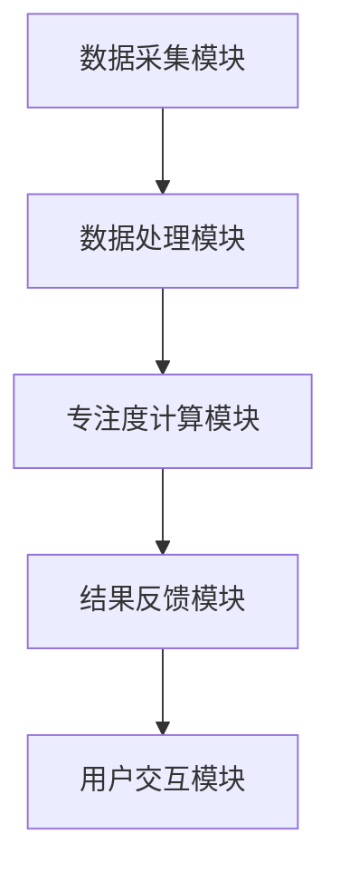

                 


# AI Agent在智能书桌中的专注度监测

> 关键词：AI Agent，专注度监测，智能书桌，算法原理，系统架构

> 摘要：本文探讨了AI Agent在智能书桌中的专注度监测应用，详细分析了专注度监测的重要性、AI Agent的核心原理、算法实现、系统架构设计以及项目实战。通过结合理论与实践，本文为AI Agent在专注度监测中的应用提供了全面的技术解析。

---

## 第一部分：背景介绍

### 第1章：专注度监测的重要性

#### 1.1 专注度监测的定义与作用
专注度监测是指通过技术手段实时监测用户在特定任务中的专注程度，帮助用户提高效率并优化工作或学习体验。在智能书桌场景中，专注度监测能够帮助用户更好地管理时间，提升学习或工作效率。

#### 1.2 智能书桌的定义与特点
智能书桌是一种集成多种智能设备的桌面系统，能够通过传感器、摄像头和AI算法实时监测用户的使用行为，提供智能化的反馈和建议。

#### 1.3 AI Agent在专注度监测中的角色
AI Agent（人工智能代理）是专注度监测的核心技术之一，它能够通过分析用户的行为数据，实时调整监测策略，并提供个性化的反馈。

---

### 第2章：问题背景与描述

#### 2.1 当前专注度监测的痛点
传统的专注度监测方法依赖于单一的传感器数据，缺乏多模态数据融合能力，导致监测结果不够准确。

#### 2.2 智能书桌专注度监测的必要性
在智能书桌场景中，用户需要一个能够实时监测专注度并提供反馈的系统，以帮助他们在学习或工作中保持高效状态。

#### 2.3 AI Agent如何解决这些问题
AI Agent能够通过多模态数据融合、实时分析和自适应调整，提供更准确的专注度监测结果，并为用户提供个性化的反馈和建议。

---

## 第二部分：核心概念与联系

### 第3章：AI Agent的核心原理

#### 3.1 AI Agent的基本原理
AI Agent通过感知环境、分析数据、做出决策并执行动作，帮助用户完成特定任务。在专注度监测中，AI Agent能够实时分析用户的注意力状态。

#### 3.2 AI Agent的分类与特点
AI Agent可以分为基于规则的Agent和基于学习的Agent。基于学习的Agent通过机器学习算法不断优化监测结果，是专注度监测的核心技术。

#### 3.3 AI Agent在专注度监测中的应用
AI Agent通过多模态数据融合技术，结合用户的生理数据、行为数据和环境数据，实现高精度的专注度监测。

---

## 第三部分：算法原理与实现

### 第4章：算法原理

#### 4.1 算法的核心步骤与流程
专注度监测算法通常包括数据采集、数据预处理、特征提取、模型训练和结果输出五个步骤。

#### 4.2 算法的数学模型与公式
专注度监测的数学模型可以通过注意力网络进行建模，模型公式如下：

$$
\text{Attention}(q, k, v) = \text{softmax}\left(\frac{q \cdot k^T}{\sqrt{d}}\right) \cdot v
$$

其中，$q$ 是查询向量，$k$ 是键向量，$v$ 是值向量，$d$ 是向量维度。

---

## 第四部分：系统分析与架构设计

### 第5章：系统架构设计

#### 5.1 项目场景介绍
智能书桌专注度监测系统旨在通过多模态数据融合，实时监测用户的专注状态，并提供个性化的反馈。

#### 5.2 系统功能设计
系统功能包括数据采集、数据处理、专注度计算、结果反馈和用户交互五个模块。

#### 5.3 系统架构图
以下是系统架构图的mermaid表示：



---

## 第五部分：项目实战

### 第6章：环境安装与代码实现

#### 6.1 环境安装
需要安装Python、TensorFlow、OpenCV等库。

#### 6.2 核心代码实现
以下是专注度监测的核心代码示例：

```python
import tensorflow as tf
import cv2

def attention(q, k, v):
    # 计算注意力权重
    attention_weights = tf.nn.softmax(tf.matmul(q, k, transpose_b=True))
    # 加权求和
    output = tf.matmul(attention_weights, v)
    return output

# 初始化模型
model = tf.keras.Sequential([
    tf.keras.layers.Input(shape=(128, 128, 3)),
    tf.keras.layers.Conv2D(64, (3, 3), activation='relu'),
    tf.keras.layers.MaxPooling2D((2, 2)),
    tf.keras.layers.Flatten(),
    tf.keras.layers.Dense(128, activation='relu'),
    tf.keras.layers.Dense(1, activation='sigmoid')
])

# 编译模型
model.compile(optimizer='adam', loss='binary_crossentropy', metrics=['accuracy'])
```

---

## 第六部分：最佳实践与总结

### 第7章：最佳实践与小结

#### 7.1 最佳实践
建议在实际应用中结合多模态数据，优化模型参数，并定期更新模型以提高监测精度。

#### 7.2 注意事项
使用AI Agent时需要注意数据隐私保护，确保用户数据的安全性。

#### 7.3 拓展阅读
推荐阅读相关领域的最新论文和技术文档，以获取更深入的技术细节。

---

作者：AI天才研究院 & 禅与计算机程序设计艺术

