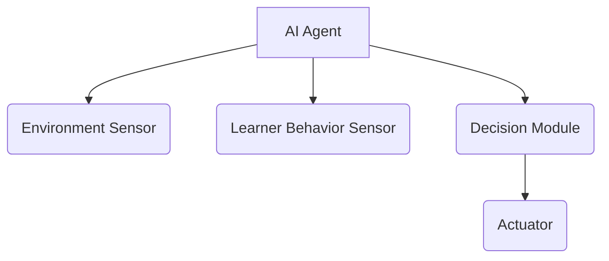

                 


# AI Agent在智能书桌中的学习氛围营造

> 关键词：AI Agent, 智能书桌, 学习氛围, 教育科技, 人工智能, 学习环境优化

> 摘要：本文深入探讨了AI Agent在智能书桌中的应用，分析了其在学习氛围营造中的核心作用。通过背景介绍、核心概念对比、算法原理、系统架构设计、项目实战和最佳实践等部分，详细阐述了如何利用AI技术优化学习环境，提升学习效率。

---

## 第一部分：AI Agent与学习氛围营造的背景介绍

### 第1章：AI Agent的基本概念与学习氛围的定义

#### 1.1 AI Agent的基本概念与特点
AI Agent是一种能够感知环境并采取行动以实现目标的智能实体。其特点包括自主性、反应性、目标导向和学习能力。

#### 1.2 学习氛围的定义与目标
学习氛围指的是影响学习者情绪和认知状态的环境因素。目标是通过优化环境因素，提升学习者的专注力和学习效果。

#### 1.3 AI Agent在学习氛围营造中的应用背景
当前学习环境中存在注意力分散、学习效率低等问题。AI Agent通过实时分析学习者的行为和环境数据，提供个性化的优化建议。

---

## 第二部分：AI Agent与学习氛围营造的核心概念与联系

### 第2章：AI Agent的核心原理与学习氛围营造的关联性分析

#### 2.1 AI Agent的核心原理
AI Agent通过感知（如摄像头、传感器）收集数据，利用机器学习算法进行决策，并通过执行器调整环境参数。

#### 2.2 学习氛围营造的核心要素
包括物理环境（光照、声音）和数字环境（个性化学习计划、实时反馈）。

#### 2.3 AI Agent与学习氛围营造的关联性分析
AI Agent通过实时调整环境因素，间接影响学习者的情绪和注意力，从而优化学习氛围。

---

## 第三部分：AI Agent在学习氛围营造中的算法原理

### 第3章：算法原理与实现

#### 3.1 算法原理概述
AI Agent使用强化学习算法，通过奖励机制优化环境参数，以提升学习者的学习效果。

#### 3.2 算法实现
```python
class AIAgent:
    def __init__(self):
        self.reward = 0
        self.learning_rate = 0.1

    def感知环境(self, 环境数据):
        self.环境状态 = 环境数据

    def 决策(self):
        if self.环境状态满足条件:
            返回优化后的环境参数
        else:
            返回当前环境参数

    def 更新奖励(self, 新奖励):
        self.reward = self.reward * (1 - self.learning_rate) + 新奖励
```

#### 3.3 数学模型与公式
优化模型：
$$ \text{优化目标} = \arg \max_{\theta} \sum_{i=1}^{n} r_i $$
其中，\( r_i \) 是第i次的奖励值。

---

## 第四部分：系统分析与架构设计

### 第4章：系统架构与实现

#### 4.1 系统功能设计
- 学习者行为分析模块
- 环境优化建议模块
- 个性化学习计划生成模块

#### 4.2 系统架构图


---

## 第五部分：项目实战与应用

### 第5章：项目实战

#### 5.1 环境安装
安装必要的Python库，如TensorFlow和OpenCV。

#### 5.2 核心代码实现
```python
def 优化学习环境(环境数据):
    分析环境数据
    生成优化建议
    返回优化后的环境参数
```

#### 5.3 案例分析
通过实际案例展示AI Agent如何优化学习环境，提升学习效率。

---

## 第六部分：最佳实践与小结

### 第6章：最佳实践与总结

#### 6.1 最佳实践
定期更新AI模型，根据学习者反馈优化算法。

#### 6.2 小结
通过AI Agent优化学习环境，可以显著提升学习效率，未来将探索更多AI技术在教育中的应用。

---

## 作者：AI天才研究院  
本文由AI天才研究院撰写，转载请注明出处。

