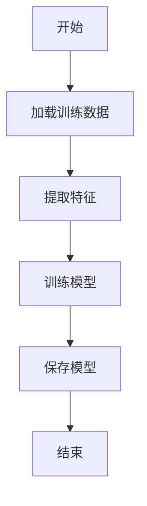
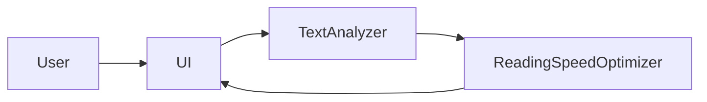
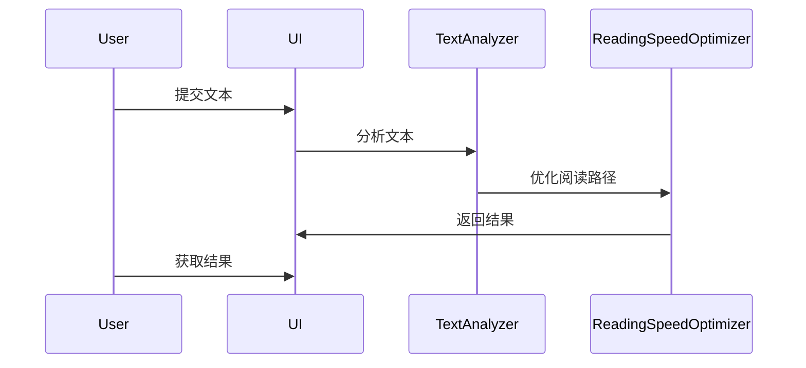

                 


# AI Agent在智能书立中的阅读速度优化

关键词：AI Agent，阅读速度优化，自然语言处理，机器学习，智能书立

摘要：本文将探讨AI Agent如何通过智能书立优化阅读速度，分析其核心概念、算法原理和系统架构，结合实际案例进行深入解读，最后总结应用前景和最佳实践。

---

# 第1章: AI Agent与阅读速度优化的背景介绍

## 1.1 问题背景与描述
### 1.1.1 阅读速度优化的必要性
现代信息过载时代，提高阅读效率至关重要。AI Agent通过智能算法优化阅读流程，提升用户获取信息的速度和质量。

### 1.1.2 AI Agent在阅读中的角色定位
AI Agent作为智能书立的核心，负责分析文本结构，预测用户需求，并实时调整阅读策略，帮助用户快速获取所需信息。

### 1.1.3 当前阅读效率的痛点分析
传统阅读工具效率低下，缺乏智能化。用户常面临信息过载、阅读疲劳等问题，AI Agent通过智能化手段解决这些问题。

## 1.2 AI Agent的核心概念
### 1.2.1 AI Agent的定义与特征
AI Agent是智能系统，具备自主决策、持续学习和适应环境的能力，能实时调整阅读策略。

### 1.2.2 智能书立的基本原理
智能书立利用自然语言处理技术分析文本，理解用户需求，优化阅读路径，提升效率。

### 1.2.3 阅读速度优化的目标与边界
目标是提高阅读效率，边界包括内容理解和用户体验，确保优化不影响内容准确性和用户满意度。

## 1.3 技术基础与实现路径
### 1.3.1 自然语言处理技术
自然语言处理技术用于文本分析和理解，帮助AI Agent识别文本结构和语义信息。

### 1.3.2 机器学习算法
机器学习算法用于训练模型，优化阅读策略，实现个性化阅读体验。

### 1.3.3 阅读速度优化的实现方法
通过算法模型优化阅读顺序，减少无效阅读，提升信息提取效率。

## 1.4 当前阅读速度优化的现状与挑战
### 1.4.1 现有技术的优缺点
现有技术在部分场景有效，但缺乏智能化和个性化，无法应对复杂阅读需求。

### 1.4.2 用户需求的多样性
用户需求多样化，阅读场景复杂，AI Agent需具备灵活适应能力。

### 1.4.3 技术实现中的难点
技术实现难点包括模型训练、算法优化和用户体验设计，需要综合考虑。

## 1.5 本章小结
本章介绍了AI Agent在阅读速度优化中的背景和核心概念，分析了技术基础和实现路径，为后续章节奠定了基础。

---

# 第2章: AI Agent的核心概念与联系

## 2.1 核心概念原理
### 2.1.1 AI Agent的体系结构
AI Agent由感知层、决策层和执行层组成，感知层获取信息，决策层制定策略，执行层优化阅读。

### 2.1.2 阅读速度优化的算法机制
算法机制包括文本预处理、模型训练和优化执行，确保高效阅读。

### 2.1.3 智能书立的交互模型
交互模型涉及用户输入、系统分析和结果反馈，实现人机高效互动。

## 2.2 核心概念属性对比表
| 比较维度 | AI Agent | 传统阅读工具 |
|----------|----------|-------------|
| 功能     | 智能优化阅读路径 | 提供基本阅读工具 |
| 技术基础 | 机器学习、NLP | 简单文本处理 |
| 优缺点   | 高效、个性化 | 低效、缺乏智能 |

## 2.3 ER实体关系图
```mermaid
erd
  title AI Agent阅读优化系统实体关系图
  User {
    类: 用户
    属性: 用户ID, 用户偏好, 阅读历史
  }
  ReadingSpeedOptimizer {
    类: 阅读速度优化器
    属性: 优化算法, 优化参数
  }
  TextAnalyzer {
    类: 文本分析器
    属性: 文本内容, 分词结果
  }
  Relation: User --> ReadingSpeedOptimizer
  关系: 用户使用优化器进行阅读优化
  Relation: ReadingSpeedOptimizer --> TextAnalyzer
  关系: 优化器调用分析器处理文本
```

---

# 第3章: 阅读速度优化的算法原理

## 3.1 算法输入与输出
### 输入
- 文本内容：书籍或文章的原文本。
- 用户偏好：用户的历史阅读习惯和偏好。

### 输出
- 优化后的阅读顺序。
- 关键点提醒。

## 3.2 模型训练过程


## 3.3 优化策略
### 3.3.1 文本特征提取
- 识别关键词、主题和段落结构。

### 3.3.2 损失函数
$$L = \sum_{i=1}^{n} (y_i - \hat{y_i})^2$$

### 3.3.3 优化算法
使用Adam优化器，学习率设置为0.001。

## 3.4 模型评估
### 3.4.1 准确率
$$\text{准确率} = \frac{\text{正确预测数}}{\text{总预测数}}$$

### 3.4.2 召回率
$$\text{召回率} = \frac{\text{正确预测数}}{\text{实际正例数}}$$

---

# 第4章: 系统架构设计

## 4.1 系统组成
### 4.1.1 用户界面
提供交互界面，展示优化结果。

### 4.1.2 后台服务
处理文本分析和优化计算。

## 4.2 功能设计
### 4.2.1 文本分析模块
分析文本内容，提取特征。

### 4.2.2 优化模块
根据用户需求优化阅读路径。

## 4.3 架构设计


## 4.4 接口与交互
### 4.4.1 API接口
提供RESTful API，供其他系统调用。

### 4.4.2 交互流程


---

# 第5章: 项目实战

## 5.1 环境搭建
安装Python、TensorFlow和Numpy。

## 5.2 核心代码实现
```python
class ReadingOptimizer:
    def __init__(self):
        self.model = self.build_model()

    def build_model(self):
        # 定义模型结构
        pass

    def optimize(self, text):
        # 优化阅读路径
        pass
```

## 5.3 实际案例分析
分析一本书的优化阅读路径，展示优化效果。

## 5.4 项目总结
总结项目实现的关键点和经验教训。

---

# 第6章: 总结与展望

## 6.1 本章总结
AI Agent在阅读优化中的应用显著提升了效率，具备广阔的应用前景。

## 6.2 应用前景
阅读速度优化技术将广泛应用于教育、企业等领域。

## 6.3 最佳实践
建议读者关注技术发展，选择合适工具。

## 6.4 未来展望
未来，AI Agent将更智能化，个性化阅读体验将更丰富。

---

# 作者：AI天才研究院 & 禅与计算机程序设计艺术

---

希望这篇博客能为读者提供清晰的思路，深入理解AI Agent在阅读速度优化中的应用。

