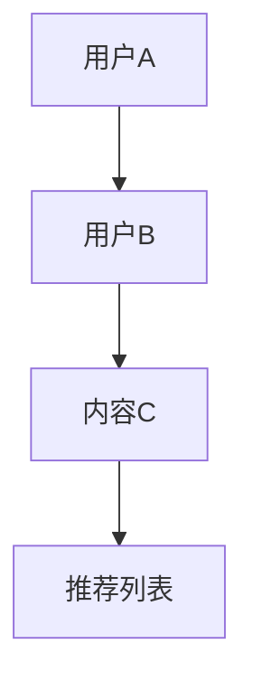
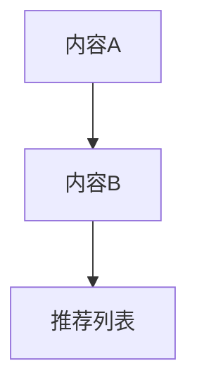
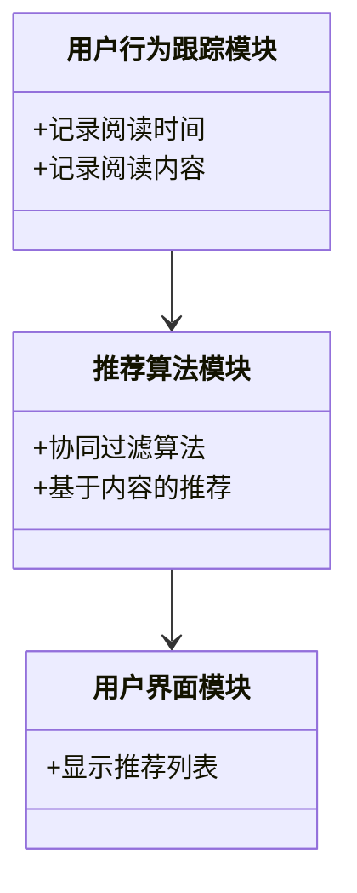
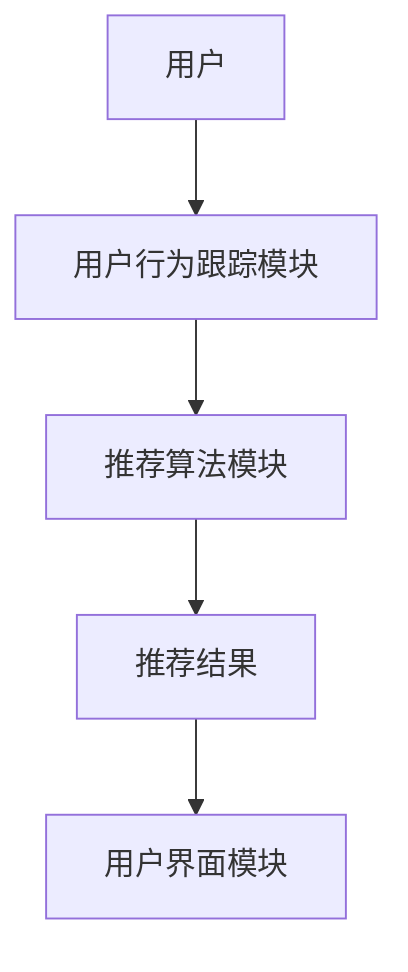

                 


# AI Agent在智能书签中的阅读习惯优化

> 关键词：AI Agent，阅读习惯，智能书签，推荐算法，用户行为分析

> 摘要：本文探讨了AI Agent在智能书签中的应用，详细分析了其如何优化用户的阅读习惯。通过介绍AI Agent的核心概念、推荐算法、系统架构设计，以及项目实战和最佳实践，展示了如何利用AI技术提升阅读体验。

---

## 第一部分：AI Agent的核心概念与原理

### 第2章：AI Agent的核心概念与原理

#### 2.1 AI Agent的类型与特点

| 类型       | 特点                                                                 |
|------------|----------------------------------------------------------------------|
| 知识型AI Agent | 依赖知识库进行推理，适合需要大量信息处理的场景。                 |
| 行为型AI Agent | 通过感知环境并执行动作，适合动态交互场景。                     |
| 混合型AI Agent | 结合知识型和行为型的特点，适用于复杂任务。                     |

#### 2.2 AI Agent的工作原理

**2.2.1 信息感知与数据收集**

AI Agent通过以下方式感知用户行为：

1. **用户行为跟踪**：记录用户的阅读时间、频率和偏好。
2. **内容分析**：分析用户阅读的内容，提取关键词和主题。

**2.2.2 行为决策与执行**

基于收集的数据，AI Agent决策推荐内容：

1. **协同过滤算法**：通过相似用户的阅读历史推荐内容。
2. **基于内容的推荐**：分析内容特征，推荐相似文章。

**2.2.3 反馈学习与优化**

AI Agent通过用户反馈优化推荐模型：

1. **实时反馈**：用户标记喜欢或不喜欢的内容。
2. **模型优化**：更新推荐算法，提高准确率。

#### 2.3 AI Agent在智能书签中的应用

**2.3.1 个性化推荐**

AI Agent根据用户阅读习惯推荐书籍，例如：

1. **用户A**：喜欢科技类文章，推荐《AI革命》。
2. **用户B**：喜欢历史小说，推荐《三国志》。

**2.3.2 阅读习惯分析**

AI Agent分析用户的阅读习惯，生成报告：

- **用户A**：每天阅读30分钟，偏好科技和编程类书籍。
- **用户B**：每周阅读5小时，偏好历史和文学类书籍。

---

## 第三部分：阅读习惯优化的算法原理

### 第3章：阅读习惯优化的算法原理

#### 3.1 协同过滤算法

**3.1.1 基于用户的协同过滤**

**步骤：**

1. **数据收集**：收集用户阅读历史和评分。
2. **计算相似度**：使用余弦相似度计算用户相似度。
3. **推荐内容**：基于相似用户的高评分内容推荐。

**公式：**

$$ \text{相似度} = \frac{\sum_{i=1}^{n} (r_{ui} \cdot r_{uj})}{\sqrt{\sum_{i=1}^{n} r_{ui}^2} \cdot \sqrt{\sum_{i=1}^{n} r_{uj}^2}}} $$

**流程图：**



#### 3.2 基于内容的推荐

**3.2.1 算法实现**

**步骤：**

1. **特征提取**：提取文章的关键词和主题。
2. **计算相似度**：使用TF-IDF计算文章间的相似度。
3. **推荐内容**：基于相似度推荐相关文章。

**公式：**

$$ \text{相似度} = \frac{\sum_{i=1}^{n} w_i \cdot (TF_{ui} \cdot ID_{ui})}{\sqrt{\sum_{i=1}^{n} w_i^2}} $$

**流程图：**



---

## 第四部分：系统架构与设计

### 第4章：系统架构与设计

#### 4.1 系统功能设计

**功能模块：**

1. **用户行为跟踪模块**：记录用户的阅读行为。
2. **推荐算法模块**：实现协同过滤和基于内容的推荐。
3. **用户界面模块**：展示推荐结果。

**类图：**



#### 4.2 系统架构设计

**架构图：**



---

## 第五部分：项目实战与实现

### 第5章：项目实战与实现

#### 5.1 环境安装

**安装依赖：**

1. **Python**：3.8+
2. **库**：pandas, numpy, scikit-learn

#### 5.2 核心代码实现

**协同过滤实现：**

```python
from sklearn.metrics.pairwise import cosine_similarity

# 示例数据
user_ratings = {
    '用户A': [4, 3, 2],
    '用户B': [3, 4, 5]
}

# 转换为数组
ratings = pd.DataFrame(user_ratings)

# 计算相似度
similarity = cosine_similarity(ratings)
```

**基于内容的推荐实现：**

```python
from sklearn.feature_extraction.text import TfidfVectorizer

# 示例文本
texts = ['AI技术 人工智能 算法', '机器学习 深度学习 神经网络']
vectorizer = TfidfVectorizer()
tfidf = vectorizer.fit_transform(texts)
```

#### 5.3 案例分析

**案例：**

- **用户C**：阅读过《机器学习入门》和《Python编程基础》。
- **推荐结果**：推荐《人工智能基础》和《高级Python编程》。

---

## 第六部分：最佳实践与未来展望

### 第6章：最佳实践与未来展望

#### 6.1 最佳实践

1. **数据隐私**：确保用户数据的安全性。
2. **模型优化**：定期更新模型，保持推荐的准确性。
3. **用户反馈**：收集用户反馈，持续改进推荐算法。

#### 6.2 未来展望

1. **多模态推荐**：结合图像和视频内容，提供更丰富的推荐。
2. **增强学习**：利用强化学习优化推荐策略。
3. **实时推荐**：实现动态推荐，提升用户体验。

---

## 作者信息

作者：AI天才研究院/AI Genius Institute & 禅与计算机程序设计艺术 /Zen And The Art of Computer Programming

---

通过以上结构，文章详细介绍了AI Agent在智能书签中的应用，从背景、原理到实现，为读者提供了全面的知识和实用的指导。

