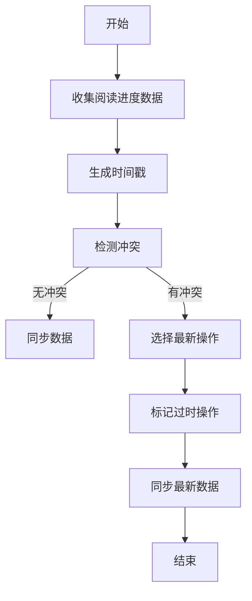
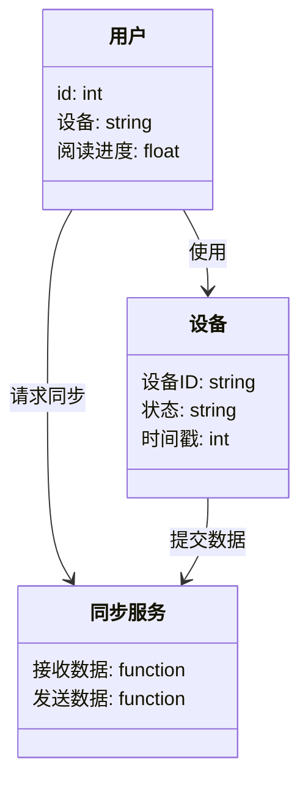
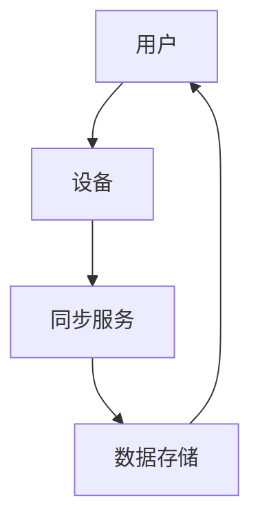
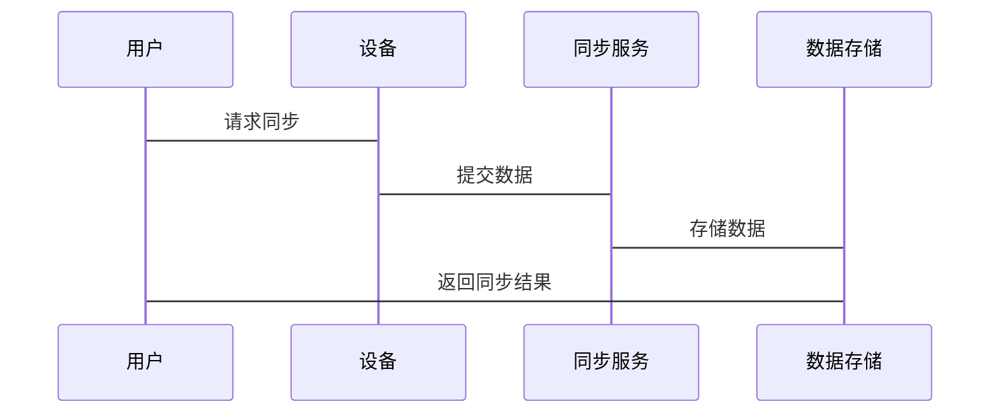

                 


# AI Agent在智能书签中的阅读进度同步

> 关键词：AI Agent, 智能书签, 阅读进度同步, 状态管理, 事件驱动, 时间戳机制

> 摘要：本文详细探讨了AI Agent在智能书签中的阅读进度同步技术。通过分析AI Agent的核心概念、同步算法的原理、系统架构设计，以及实际项目的实现，展示了如何利用AI技术实现跨设备的高效阅读进度同步。文章结合理论与实践，为开发者提供了从理解到实现的完整指南。

---

## 第一部分: AI Agent在智能书签中的阅读进度同步概述

### 第1章: AI Agent的基本概念与阅读进度同步的背景

#### 1.1 AI Agent的定义与特点

- **AI Agent的定义**  
  AI Agent（人工智能代理）是指一种能够感知环境、执行任务并做出决策的智能体。它能够通过传感器获取信息，利用算法处理数据，并通过执行器与环境交互。

- **AI Agent的核心特点**  
  | 特性 | 描述 |
  |------|------|
  | 智能性 | 能够自主决策和学习 |
  | 反应性 | 能够实时感知并响应环境变化 |
  | 目标导向 | 具有明确的目标和优先级 |

- **AI Agent与传统代理的区别**  
  AI Agent通过机器学习算法不断优化行为，而传统代理通常基于固定的规则进行操作。

#### 1.2 阅读进度同步的背景与问题

- **阅读进度同步的背景**  
  随着多设备阅读习惯的普及，用户希望在不同设备上保持一致的阅读进度，例如在手机、平板和电脑之间同步书签位置、阅读进度条等信息。

- **阅读进度同步的核心问题**  
  1. 数据一致性：确保所有设备上的阅读进度一致。
  2. 实时性：同步过程需要快速响应，避免延迟。
  3. 事件驱动：支持用户操作（如翻页）触发同步。

- **AI Agent在阅读进度同步中的优势**  
  AI Agent能够通过事件驱动的方式实时处理同步请求，并通过智能算法解决数据冲突问题。

#### 1.3 AI Agent在智能书签中的应用

- **智能书签的定义与特点**  
  智能书签是一种结合AI技术的电子书签管理工具，能够通过AI Agent实现跨设备的阅读进度同步。

- **AI Agent在智能书签中的作用**  
  1. 数据采集：实时采集用户的阅读进度数据。
  2. 同步管理：通过AI算法实现数据同步。
  3. 个性化推荐：基于阅读数据提供个性化内容推荐。

---

## 第2章: AI Agent的核心概念与工作原理

### 2.1 AI Agent的核心概念

- **状态管理**  
  AI Agent通过维护状态信息（如阅读进度、设备信息）来实现同步功能。

- **行为决策**  
  AI Agent根据当前状态和环境信息做出决策，例如是否需要触发同步操作。

- **事件驱动**  
  AI Agent通过订阅事件（如用户翻页）来触发同步逻辑。

### 2.2 AI Agent的工作原理

- **信息收集与处理**  
  AI Agent通过传感器或API获取阅读进度数据，并进行预处理。

- **决策与执行**  
  基于预处理的数据，AI Agent做出决策并执行操作（如发送同步请求）。

- **反馈与优化**  
  AI Agent根据反馈优化算法，提高同步效率和准确性。

### 2.3 AI Agent与阅读进度同步的联系

- **阅读进度数据的采集**  
  AI Agent通过API或SDK采集用户的阅读进度信息。

- **阅读进度的同步机制**  
  AI Agent通过事件驱动的方式，实时或按需同步数据。

- **同步过程中的AI决策**  
  AI Agent能够自动检测数据冲突并进行优化，确保数据一致性。

---

## 第3章: AI Agent的同步算法原理

### 3.1 同步算法的核心原理

- **时间戳机制**  
  每次操作生成时间戳，用于判断数据的新旧。

- **冲突检测与解决**  
  当不同设备上的数据发生冲突时，AI Agent通过时间戳和优先级规则进行处理。

- **数据一致性保证**  
  通过一致性算法（如两阶段提交）确保所有设备上的数据一致。

### 3.2 同步算法的数学模型

- **时间戳同步模型**  
  每个操作都有唯一的时间戳，$t_i$ 表示第i个操作的时间戳，满足$t_i < t_j$表示操作i发生在操作j之前。

- **冲突检测模型**  
  冲突发生时，AI Agent选择具有最新时间戳的操作进行保留，其余操作被标记为过时。

- **数据一致性模型**  
  通过一致性哈希算法，确保所有设备上的数据最终一致。

### 3.3 同步算法的流程图



---

## 第4章: 系统分析与架构设计

### 4.1 问题场景介绍

- **用户需求**  
  用户希望在不同设备上保持一致的阅读进度，例如在阅读电子书时，书签位置、阅读进度条等信息能够实时同步。

- **系统功能**  
  智能书签系统需要实现跨设备的阅读进度同步，支持多平台、高并发、低延迟的特性。

### 4.2 系统架构设计

#### 4.2.1 系统功能设计

- **领域模型**  
  使用Mermaid类图描述系统的核心实体和关系。



#### 4.2.2 系统架构设计

- **系统架构图**  
  使用Mermaid图展示系统架构。



#### 4.2.3 系统接口设计

- **接口描述**  
  设备通过API调用同步服务，同步服务负责数据的存储和分发。

- **交互流程图**  
  使用Mermaid序列图展示用户与系统的交互流程。



---

## 第5章: 项目实战

### 5.1 环境安装

- **安装Python环境**  
  需要Python 3.6及以上版本，可以通过Anaconda或Pyenv安装。

- **安装依赖库**  
  需要安装以下库：`requests`, `mermaid`, `matplotlib`。

### 5.2 核心代码实现

#### 5.2.1 同步算法实现

```python
import time

def generate_timestamp():
    return int(time.time() * 1000)

def detect_conflict(data1, data2):
    timestamp1 = data1['timestamp']
    timestamp2 = data2['timestamp']
    if timestamp1 > timestamp2:
        return data1
    else:
        return data2

def synchronize_progress(progress1, progress2):
    latest_data = detect_conflict(progress1, progress2)
    return latest_data
```

#### 5.2.2 系统接口实现

```python
import requests

def send_request(data):
    url = "http://localhost:8000/sync"
    response = requests.post(url, json=data)
    return response.json()
```

### 5.3 案例分析

#### 5.3.1 案例1: 单设备同步

```python
progress1 = {
    'book_id': 1,
    'progress': 0.5,
    'timestamp': generate_timestamp()
}

synchronized_progress = synchronize_progress(progress1, None)
print(synchronized_progress)  # 输出同步后的进度
```

#### 5.3.2 案例2: 多设备冲突

```python
progress1 = {
    'book_id': 1,
    'progress': 0.5,
    'timestamp': 1000
}

progress2 = {
    'book_id': 1,
    'progress': 0.6,
    'timestamp': 1500
}

synchronized_progress = synchronize_progress(progress1, progress2)
print(synchronized_progress)  # 输出同步后的进度
```

---

## 第6章: 总结与注意事项

### 6.1 最佳实践

- 定期备份数据，防止数据丢失。
- 使用CDN加速，提高同步速度。
- 优化算法，减少同步延迟。

### 6.2 小结

本文详细介绍了AI Agent在智能书签中的阅读进度同步技术，涵盖了从核心概念到系统架构的各个方面，并通过实际案例展示了如何实现这一技术。

### 6.3 注意事项

- 数据安全性：确保用户数据的隐私和安全。
- 系统性能：优化算法和架构设计，提高同步效率。
- 用户体验：提供直观的界面和及时的反馈。

### 6.4 拓展阅读

- [书籍推荐]《人工智能：一种现代的方法》
- [在线资源]https://www.mermaid-js.com/

---

**作者：AI天才研究院/AI Genius Institute & 禅与计算机程序设计艺术 /Zen And The Art of Computer Programming**

