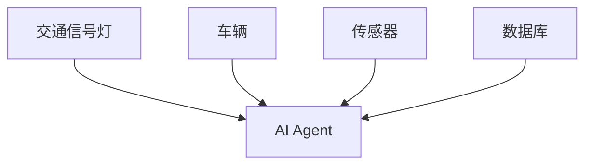
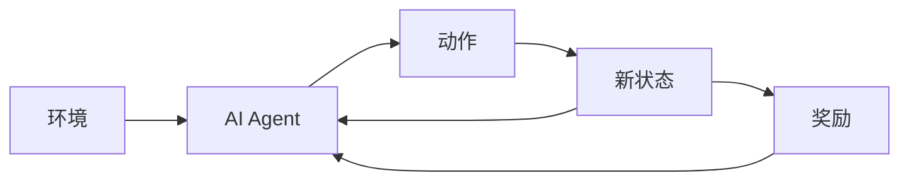
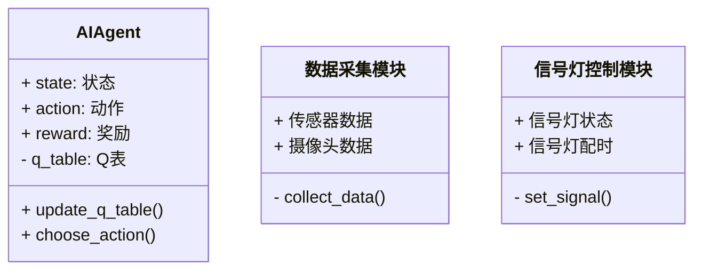
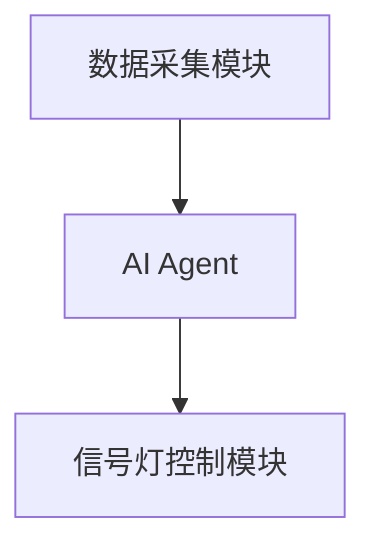
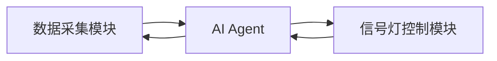

                 


# AI Agent在智能交通流量控制中的角色

**关键词**：AI Agent, 智能交通系统, 交通流量控制, 强化学习, 深度学习, 系统架构设计

**摘要**：本文探讨了AI Agent在智能交通流量控制中的角色与应用，详细分析了AI Agent的核心概念、算法原理、系统架构设计以及实际项目中的应用场景。文章从背景介绍到项目实战，全面解析了AI Agent在交通管理中的优势与挑战，为读者提供了深入的技术洞察和实践指导。

---

# 第1章: AI Agent 与智能交通流量控制的背景介绍

## 1.1 AI Agent 的基本概念
AI Agent（人工智能代理）是指能够感知环境、自主决策并执行任务的智能实体。它具备以下核心特点：
- **自主性**：无需外部干预，自主完成任务。
- **反应性**：能够实时感知环境变化并做出反应。
- **目标导向**：基于目标驱动行为，优化决策过程。
- **学习能力**：通过数据和经验不断优化性能。

AI Agent的类型包括基于规则的代理、基于模型的代理和基于强化学习的代理。不同类型代理适用于不同的场景，例如，基于规则的代理适用于规则明确的交通信号灯控制，而基于强化学习的代理则适用于复杂的动态环境。

## 1.2 智能交通系统的发展历程
传统交通管理系统依赖人工操作，效率低下且难以应对复杂场景。随着人工智能技术的发展，智能交通系统（ITS）逐渐成为交通管理的主流方向。

### 1.2.1 传统交通管理系统
传统系统依赖固定的信号灯周期和人工干预，难以适应交通流量的动态变化。

### 1.2.2 智能交通系统
智能交通系统通过传感器、摄像头和AI算法实时收集和分析数据，优化交通流量控制。其特点包括：
- **实时性**：快速响应交通变化。
- **数据驱动**：基于实时数据进行决策。
- **智能化**：通过AI技术优化交通流量。

### 1.2.3 发展趋势
未来的智能交通系统将更加依赖AI Agent，实现从局部优化到全局优化的转变。

## 1.3 AI Agent 在交通流量控制中的作用
AI Agent在交通流量控制中的作用主要体现在以下几个方面：
- **实时决策**：基于实时数据做出最优决策。
- **动态调整**：根据交通状况动态调整信号灯周期。
- **预测与优化**：通过预测交通流量，优化信号灯配时。

AI Agent的优势在于其能够处理复杂的动态环境，但其局限性在于需要依赖大量的实时数据和高性能计算能力。

## 1.4 本章小结
本章介绍了AI Agent的基本概念、智能交通系统的发展历程以及AI Agent在交通流量控制中的作用。通过对比传统系统与智能系统，明确了AI Agent在交通管理中的重要性。

---

# 第2章: AI Agent 的核心概念与原理

## 2.1 AI Agent 的核心概念
AI Agent的核心概念包括：
- **状态**：AI Agent对环境的感知。
- **动作**：AI Agent基于状态做出的决策。
- **奖励**：AI Agent行动后获得的反馈。

### 2.1.1 实体关系图
以下是AI Agent在交通系统中的实体关系图：



## 2.2 AI Agent 的类型与分类
AI Agent可以根据决策方式分为以下几类：
- **基于规则的AI Agent**：通过预设规则进行决策，适用于简单场景。
- **基于模型的AI Agent**：基于环境模型进行决策，适用于复杂场景。
- **基于强化学习的AI Agent**：通过试错学习优化决策，适用于动态环境。

### 2.2.1 对比分析
以下是三种AI Agent类型的对比表格：

| 类型                | 决策方式          | 适用场景       |
|---------------------|------------------|----------------|
| 基于规则的AI Agent  | 预设规则          | 简单场景       |
| 基于模型的AI Agent  | 基于环境模型      | 复杂场景       |
| 基于强化学习的AI Agent | 试错学习          | 动态环境       |

## 2.3 AI Agent 的核心算法原理
AI Agent的核心算法包括强化学习和深度学习。

### 2.3.1 强化学习算法
强化学习是一种通过试错学习优化决策的算法。其核心在于通过与环境的交互获得奖励，并根据奖励调整策略。

#### Q-learning 算法
Q-learning是一种经典的强化学习算法，其数学公式如下：
$$ Q(s, a) = Q(s, a) + \alpha (r + \gamma \max Q(s', a') - Q(s, a)) $$

其中：
- \( Q(s, a) \)：状态s下动作a的Q值。
- \( \alpha \)：学习率。
- \( r \)：奖励。
- \( \gamma \)：折扣因子。
- \( s' \)：下一个状态。
- \( a' \)：下一个动作。

### 2.3.2 深度学习算法
深度学习通过神经网络模型学习复杂特征，适用于高维数据的处理。

## 2.4 本章小结
本章详细介绍了AI Agent的核心概念、类型与算法原理，为后续章节的分析奠定了基础。

---

# 第3章: AI Agent 在交通流量控制中的算法原理

## 3.1 强化学习算法在 AI Agent 中的应用
### 3.1.1 Q-learning 算法
Q-learning算法通过与环境交互学习最优策略。以下是其实现步骤：
1. 初始化Q表。
2. 选择动作。
3. 执行动作并获得奖励。
4. 更新Q值。

### 3.1.2 DQN 算法
DQN（Deep Q-Network）通过深度神经网络近似Q值函数。以下是其算法流程：



### 3.1.3 算法实现的步骤与流程
以下是Q-learning算法的Python代码示例：

```python
import numpy as np

class QLearning:
    def __init__(self, state_space, action_space, learning_rate=0.1, gamma=0.9):
        self.state_space = state_space
        self.action_space = action_space
        self.learning_rate = learning_rate
        self.gamma = gamma
        self.q_table = np.zeros((state_space, action_space))
    
    def choose_action(self, state):
        return np.argmax(self.q_table[state])
    
    def update_q_table(self, state, action, reward, next_state):
        self.q_table[state, action] += self.learning_rate * (reward + self.gamma * np.max(self.q_table[next_state]) - self.q_table[state, action])
```

## 3.2 基于强化学习的 AI Agent 实现
### 3.2.1 状态空间的定义
状态空间是AI Agent对环境的感知。在交通流量控制中，状态可以包括：
- 每个信号灯周期的流量情况。
- 车辆到达率和等待时间。

### 3.2.2 动作空间的定义
动作空间是AI Agent可以执行的操作。在交通流量控制中，动作可以包括：
- 调整信号灯周期。
- 改变信号灯配时。

### 3.2.3 奖励函数的设计
奖励函数是AI Agent行动后的反馈。在交通流量控制中，奖励可以定义为：
$$ r = -\text{平均等待时间} + \text{交通流量} $$

## 3.3 算法实现的数学模型与公式
### 3.3.1 Q-learning 算法的数学公式
$$ Q(s, a) = Q(s, a) + \alpha (r + \gamma \max Q(s', a') - Q(s, a)) $$

### 3.3.2 DQN 算法的数学公式
DQN算法通过深度神经网络近似Q值函数。其损失函数为：
$$ L = \mathbb{E}[(r + \gamma Q(s', a') - Q(s, a))^2] $$

## 3.4 本章小结
本章详细讲解了强化学习算法在AI Agent中的应用，重点分析了Q-learning和DQN算法的实现原理和数学模型。

---

# 第4章: 系统分析与架构设计方案

## 4.1 问题场景介绍
交通流量控制的核心问题在于如何优化信号灯配时，减少拥堵和等待时间。

## 4.2 系统功能设计
### 4.2.1 系统功能模块
- 数据采集模块：收集交通数据。
- AI Agent模块：执行决策。
- 信号灯控制模块：执行决策。

### 4.2.2 领域模型类图
以下是系统功能的领域模型类图：



## 4.3 系统架构设计
### 4.3.1 系统架构图
以下是系统架构设计图：



### 4.3.2 接口设计
系统接口包括：
- 数据采集模块与AI Agent之间的接口。
- AI Agent与信号灯控制模块之间的接口。

### 4.3.3 交互流程图
以下是系统交互流程图：



## 4.4 本章小结
本章通过系统分析与架构设计，明确了AI Agent在交通流量控制中的角色和实现方式。

---

# 第5章: 项目实战

## 5.1 环境安装
### 5.1.1 安装Python
安装Python 3.8及以上版本。

### 5.1.2 安装依赖
安装必要的库：
```bash
pip install numpy matplotlib
```

## 5.2 系统核心实现
### 5.2.1 数据采集模块
数据采集模块通过传感器和摄像头收集交通数据。

### 5.2.2 AI Agent实现
以下是AI Agent的Python代码：

```python
import numpy as np

class TrafficAgent:
    def __init__(self, state_space, action_space, learning_rate=0.1, gamma=0.9):
        self.state_space = state_space
        self.action_space = action_space
        self.learning_rate = learning_rate
        self.gamma = gamma
        self.q_table = np.zeros((state_space, action_space))
    
    def choose_action(self, state):
        return np.argmax(self.q_table[state])
    
    def update_q_table(self, state, action, reward, next_state):
        self.q_table[state, action] += self.learning_rate * (reward + self.gamma * np.max(self.q_table[next_state]) - self.q_table[state, action])
```

### 5.2.3 信号灯控制模块
信号灯控制模块根据AI Agent的决策调整信号灯状态。

## 5.3 代码应用解读与分析
以下是AI Agent的训练过程：

```python
agent = TrafficAgent(state_space=4, action_space=2)
for _ in range(1000):
    state = collect_data()
    action = agent.choose_action(state)
    next_state = collect_data()
    reward = calculate_reward(state, action, next_state)
    agent.update_q_table(state, action, reward, next_state)
```

## 5.4 实际案例分析
通过训练后的AI Agent可以优化信号灯配时，减少交通拥堵。

## 5.5 项目小结
本章通过项目实战，展示了AI Agent在交通流量控制中的具体实现。

---

# 第6章: 最佳实践与总结

## 6.1 最佳实践 tips
- 数据质量至关重要。
- 算法选择需要根据场景。
- 系统优化需要持续迭代。

## 6.2 小结
AI Agent在智能交通流量控制中具有重要应用，通过强化学习算法和系统架构设计，可以显著优化交通流量。

## 6.3 注意事项
- 数据隐私问题。
- 系统稳定性。
- 算法的可解释性。

## 6.4 拓展阅读
推荐阅读《强化学习入门》和《深度学习实战》。

---

# 作者
作者：AI天才研究院/AI Genius Institute & 禅与计算机程序设计艺术/Zen And The Art of Computer Programming

---

以上是文章的完整内容，涵盖了从背景介绍到项目实战的各个方面，符合技术博客的深度和广度要求。

