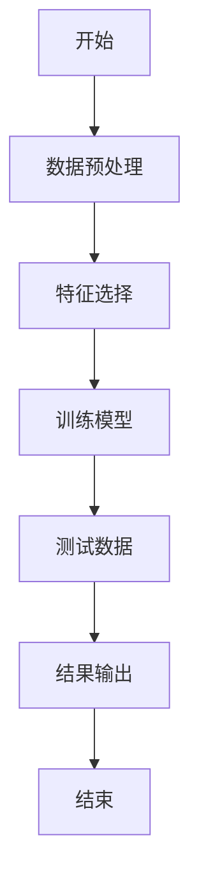
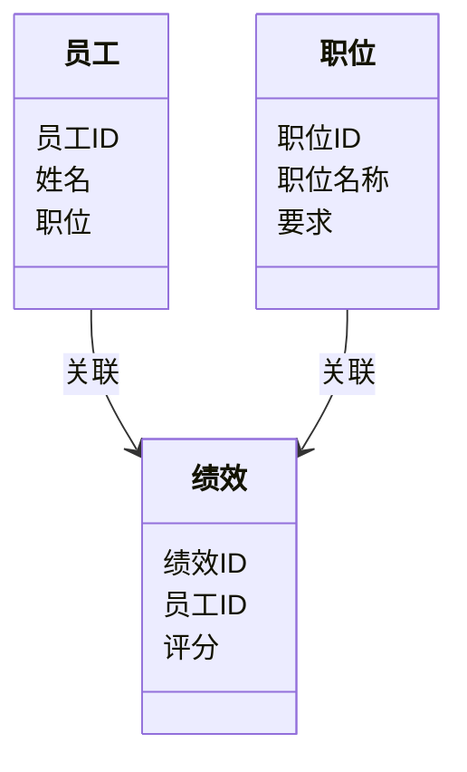
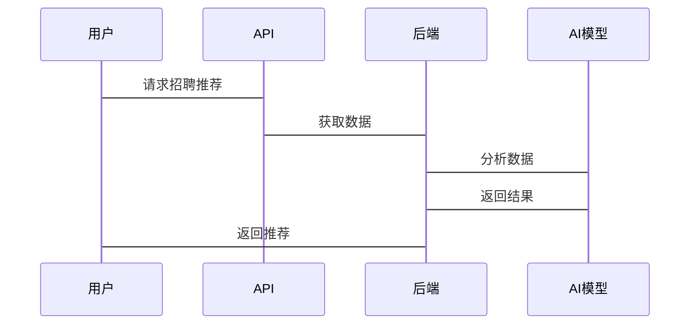

                 


# AI Agent在智能人力资源管理中的实践

> 关键词：AI Agent, 智能人力资源管理, 算法原理, 系统架构设计, 项目实战

> 摘要：本文探讨AI Agent在智能人力资源管理中的应用，涵盖背景介绍、核心概念、算法原理、系统架构设计、项目实战及最佳实践。通过详细分析，展示AI Agent如何提升HR管理效率和精准度。

---

## 第一部分: 背景介绍

### 1.1 AI Agent与智能HR的定义

#### 1.1.1 AI Agent的基本概念
AI Agent（人工智能代理）是指能够感知环境、自主决策并执行任务的智能实体。在HR领域，AI Agent可以自动化处理招聘、培训、绩效评估等任务。

#### 1.1.2 智能人力资源管理的定义
智能人力资源管理是通过AI技术优化HR流程，提升效率和决策能力。AI Agent在其中扮演关键角色，提供实时数据处理和智能决策支持。

#### 1.1.3 两者的结合与重要性
AI Agent与智能HR的结合使企业能够快速响应员工需求，优化资源配置，提升员工体验，从而增强企业的竞争力。

### 1.2 问题背景

#### 1.2.1 传统HR管理的痛点
传统HR管理存在效率低、数据分散、难以预测员工行为等问题，导致决策滞后且不准确。

#### 1.2.2 企业对智能化HR的需求
企业亟需智能化解决方案，以提高HR流程的效率和精准度，降低成本，提升员工满意度。

### 1.3 问题描述

#### 1.3.1 HR管理中的主要问题
- 招聘效率低
- 培训效果难评估
- 绩效管理复杂

#### 1.3.2 AI Agent如何解决这些问题
AI Agent通过自动化处理和智能分析，优化招聘流程、提升培训效果、简化绩效管理。

### 1.4 问题解决

#### 1.4.1 AI Agent的核心功能
- 数据整合与分析
- 智能决策支持
- 自动化执行

### 1.5 边界与外延

#### 1.5.1 AI Agent在HR中的应用范围
- 招聘
- 培训
- 绩效管理

#### 1.5.2 与其他技术的关系
AI Agent依赖大数据和机器学习，与企业系统集成，形成智能化HR生态。

### 1.6 核心要素组成

#### 1.6.1 数据源
- 员工数据
- 职位信息
- 绩效数据

#### 1.6.2 算法模型
- 机器学习模型
- 自然语言处理

#### 1.6.3 执行模块
- 自动化工具
- 通知系统

---

## 第二部分: 核心概念与联系

### 2.1 AI Agent的原理

#### 2.1.1 感知层
AI Agent通过收集员工数据、职位需求等信息，感知环境状态。

#### 2.1.2 决策层
基于感知数据，AI Agent利用算法生成最优决策，如推荐候选人。

#### 2.1.3 执行层
AI Agent通过自动化工具执行决策，如发送招聘通知。

### 2.2 概念对比

| 特性        | 传统HR      | AI Agent驱动的HR |
|-------------|-------------|------------------|
| 效率        | 低效        | 高效             |
| 精准度      | 低          | 高               |
| 实时性      | 滞后        | 实时             |

### 2.3 ER实体关系图

```mermaid
er
  rectangle HRSystem {
    + 员工表(Employee)
    + 职位表(Job)
    + 绩效表(Performance)
    + AI Agent
  }
  AI Agent --> 员工表: 读取数据
  AI Agent --> 职位表: 分析需求
  AI Agent --> 绩效表: 评估表现
```

---

## 第三部分: 算法原理讲解

### 3.1 算法选择

#### 3.1.1 决策树算法
用于招聘推荐，通过特征筛选优化候选人匹配度。

#### 3.1.2 随机森林
用于分类问题，如绩效预测。

### 3.2 决策树算法流程图



### 3.3 Python代码实现

```python
from sklearn.tree import DecisionTreeClassifier
import pandas as pd

# 数据加载与处理
data = pd.read_csv('employee_data.csv')
X = data[['经验', '教育', '技能匹配度']]
y = data['绩效']

# 模型训练
model = DecisionTreeClassifier()
model.fit(X, y)

# 预测
new_employee = [[5, '本科', 80]]
print(model.predict(new_employee))
```

### 3.4 数学模型

分类公式：
$$
f(x) = \text{sign}(\sum_{i=1}^{n} w_i x_i + b)
$$

---

## 第四部分: 系统分析与架构设计

### 4.1 问题场景

#### 4.1.1 招聘流程优化
企业希望AI Agent优化招聘流程，提高招聘效率。

### 4.2 系统功能设计

#### 4.2.1 领域模型类图



### 4.3 系统架构设计

#### 4.3.1 架构图

```mermaid
graph LR
    A[前端] --> B[后端]
    B --> C[数据库]
    B --> D[AI模型]
    C --> D: 数据输入
    D --> B: 结果输出
```

### 4.4 系统接口设计

#### 4.4.1 API接口

- `/api/v1/招聘推荐`
- `/api/v1/绩效评估`

### 4.5 系统交互序列图



---

## 第五部分: 项目实战

### 5.1 环境安装

- 安装Python和相关库：
  ```bash
  pip install numpy pandas scikit-learn
  ```

### 5.2 核心代码实现

#### 5.2.1 招聘推荐系统

```python
import pandas as pd
from sklearn.model import DecisionTreeClassifier

def train_model(data_path):
    data = pd.read_csv(data_path)
    X = data[['经验', '教育', '技能匹配度']]
    y = data['绩效']
    model = DecisionTreeClassifier()
    model.fit(X, y)
    return model

def predict(model, new_data):
    return model.predict(new_data)

# 示例
model = train_model('employee_data.csv')
new_employee = [[5, '本科', 80]]
print(predict(model, new_employee))
```

### 5.3 实际案例分析

#### 5.3.1 某公司招聘优化

通过AI Agent分析简历，筛选出最佳候选人，提高招聘效率。

### 5.4 项目小结

AI Agent显著提升了招聘效率，减少了人为错误，提升了整体绩效。

---

## 第六部分: 最佳实践

### 6.1 小结

AI Agent在智能HR中的应用显著提升了效率和精准度，是未来趋势。

### 6.2 注意事项

- 数据隐私保护
- 模型泛化能力
- 系统可解释性

### 6.3 拓展阅读

- 推荐书籍：《机器学习实战》
- 在线课程：Coursera的AI课程

---

## 作者

作者：AI天才研究院/AI Genius Institute & 禅与计算机程序设计艺术/Zen And The Art of Computer Programming

