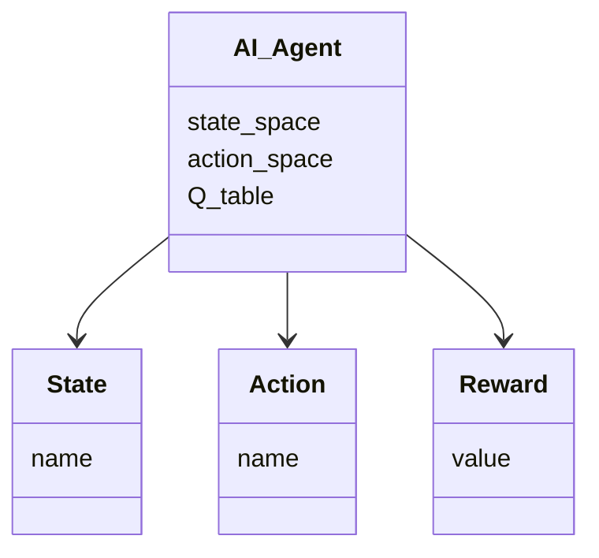
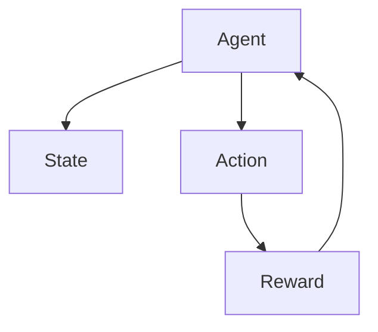
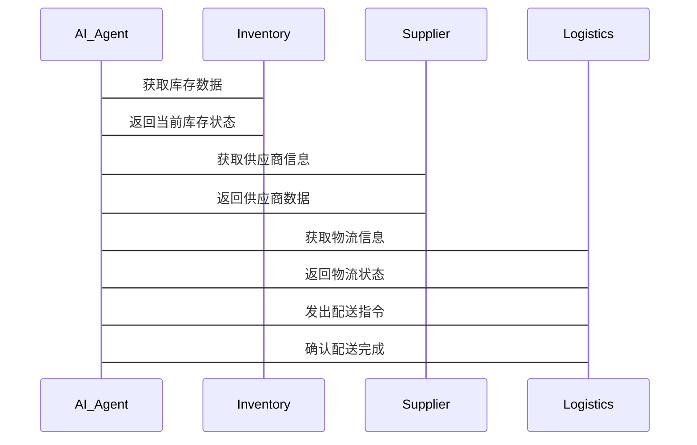

                 


# AI Agent在智能供应链优化中的应用

> 关键词：AI Agent，供应链优化，强化学习，物流路径优化，库存管理

> 摘要：本文深入探讨AI Agent在智能供应链优化中的应用，从理论基础到实际案例，详细分析其在库存管理、采购优化、物流路径规划等关键环节中的作用。通过数学模型和算法实现，展示AI Agent如何提升供应链的整体效率与竞争力。

---

## 第一章: AI Agent与智能供应链概述

### 1.1 AI Agent的基本概念

#### 1.1.1 AI Agent的定义与特点
- 定义：AI Agent是一种能够感知环境并采取行动以实现目标的智能实体。
- 特点：
  - 自主性：能够在无外部干预下执行任务。
  - 反应性：能够实时感知环境并做出反应。
  - 智能性：通过学习和推理优化决策。

#### 1.1.2 AI Agent的核心功能
- 感知环境：通过传感器或数据输入获取信息。
- 制定策略：基于当前状态和历史数据，制定最优决策。
- 执行行动：根据策略采取具体行动，并反馈结果。

#### 1.1.3 AI Agent与传统供应链的区别
- 传统供应链依赖人工决策和固定规则。
- AI Agent通过机器学习和强化学习实现动态优化。

---

### 1.2 智能供应链优化的背景与挑战

#### 1.2.1 传统供应链的局限性
- 信息孤岛：各部门间数据不共享，导致效率低下。
- 反应迟缓：面对市场变化时，决策周期长，难以快速响应。
- 成本高昂：库存积压和物流浪费导致资源浪费。

#### 1.2.2 智能化供应链的需求与趋势
- 数据驱动决策：利用大数据和AI技术优化供应链管理。
- 实时优化：通过实时数据分析，快速调整供应链策略。
- 智能协同：实现供应链各环节的无缝协作。

#### 1.2.3 AI Agent在供应链优化中的作用
- 提供实时决策支持。
- 优化库存管理。
- 提高物流效率。

---

### 1.3 本章小结

本章介绍了AI Agent的基本概念及其在智能供应链中的作用，分析了传统供应链的局限性和智能化供应链的发展趋势。

---

## 第二章: AI Agent的核心原理与数学模型

### 2.1 AI Agent的决策机制

#### 2.1.1 多智能体系统（MAS）的基本概念
- 定义：由多个智能体组成的协作系统，共同完成复杂任务。
- 特点：
  - 分布式决策：每个智能体独立决策。
  - 协作性：智能体之间通过通信协同完成任务。

#### 2.1.2 基于强化学习的决策模型
- 强化学习简介：
  - 通过试错学习，智能体通过与环境交互获得奖励或惩罚。
  - 目标：最大化累计奖励。

#### 2.1.3 状态、动作、奖励的数学表达
- 状态空间：S = {s₁, s₂, ..., sₙ}
- 动作空间：A = {a₁, a₂, ..., aₘ}
- 奖励函数：r(s, a) = 奖励值

---

### 2.2 AI Agent的优化算法

#### 2.2.1 强化学习算法（如Q-Learning）
- Q-Learning算法步骤：
  1. 初始化Q表。
  2. 选择动作。
  3. 执行动作，观察新状态。
  4. 更新Q值：Q(s, a) = Q(s, a) + α(r + γ·max Q(s', a')) - Q(s, a)

#### 2.2.2 遗传算法与模拟退火
- 遗传算法：
  - 编码：将问题转化为基因序列。
  - 适应度函数：评估解的优劣。
  - 选择、交叉、变异操作。
- 模拟退火：
  - 类似于物理退火过程，跳出局部最优。

#### 2.2.3 贪婪算法与动态规划
- 贪婪算法：每一步选择当前最优解。
- 动态规划：将问题分解为子问题，递归求解。

---

### 2.3 AI Agent的数学模型

#### 2.3.1 状态空间模型
- 状态表示：s = (s₁, s₂, ..., sₙ)
- 状态转移：s' = f(s, a)

#### 2.3.2 动作空间模型
- 动作选择：a = argmax(Q(s))
- 动作执行：执行动作a，观察新状态s'

#### 2.3.3 奖励函数的构建
- 奖励设计原则：奖励函数应能引导智能体向目标方向优化。
- 示例：库存管理中的奖励函数设计。

---

### 2.4 本章小结

本章详细介绍了AI Agent的决策机制和优化算法，重点分析了强化学习、遗传算法等方法，并通过数学模型描述了其工作原理。

---

## 第三章: AI Agent在供应链优化中的应用场景

### 3.1 供应链优化的核心问题

#### 3.1.1 库存管理与优化
- 库存成本：库存过多或过少都会增加成本。
- 库存预测：基于历史数据和外部因素预测需求。

#### 3.1.2 采购与供应商选择
- 供应商评估：基于质量、交货时间、成本等多因素选择供应商。
- 采购计划优化：通过AI Agent动态调整采购策略。

#### 3.1.3 运输与物流优化
- 物流路径优化：通过AI Agent找到最优配送路径。
- 运输成本控制：优化运输方式和时间安排。

---

### 3.2 AI Agent在供应链优化中的应用

#### 3.2.1 基于AI Agent的库存预测与补货策略
- 库存预测模型：使用时间序列分析或机器学习模型预测需求。
- 补货策略：根据预测结果动态调整库存水平。

#### 3.2.2 基于AI Agent的供应商动态优化
- 供应商评估：实时评估供应商的表现，动态调整供应商选择。
- 采购计划优化：基于供应商能力和需求预测制定采购计划。

#### 3.2.3 基于AI Agent的物流路径优化
- 物流路径优化算法：使用强化学习或遗传算法优化配送路径。
- 运输成本控制：通过动态调整运输方式和时间降低物流成本。

---

### 3.3 本章小结

本章分析了AI Agent在库存管理、采购优化和物流路径规划等供应链核心环节中的应用，展示了其在实际场景中的巨大潜力。

---

## 第四章: AI Agent的算法实现与数学模型

### 4.1 AI Agent算法的实现

#### 4.1.1 Q-Learning算法的实现步骤
1. 初始化Q表：Q(s, a) = 0。
2. 选择动作：ε-greedy策略选择动作。
3. 执行动作，观察新状态。
4. 更新Q值：Q(s, a) = Q(s, a) + α(r + γ·max Q(s', a')) - Q(s, a)

#### 4.1.2 状态转移矩阵的构建
- 状态转移概率：P(s' | s, a)
- 状态转移矩阵表示：矩阵形式表示状态转移关系。

#### 4.1.3 奖励函数的设计与优化
- 奖励函数设计原则：奖励函数应能引导智能体向目标方向优化。
- 示例：物流路径优化中的奖励函数设计。

---

### 4.2 基于强化学习的供应链优化算法

#### 4.2.1 算法的数学模型与公式
- 状态空间：S = {s₁, s₂, ..., sₙ}
- 动作空间：A = {a₁, a₂, ..., aₘ}
- 奖励函数：r(s, a) = 奖励值
- 动作值函数：Q(s, a) = 奖励值 + γ·max Q(s', a')

#### 4.2.2 算法的实现代码与流程图
- Python代码示例：
```python
import numpy as np

class AI_Agent:
    def __init__(self, state_space, action_space):
        self.state_space = state_space
        self.action_space = action_space
        self.Q = np.zeros((state_space, action_space))
    
    def choose_action(self, state, epsilon):
        if np.random.random() < epsilon:
            return np.random.randint(self.action_space)
        else:
            return np.argmax(self.Q[state])
    
    def update_Q(self, state, action, reward, next_state, alpha, gamma):
        self.Q[state, action] = self.Q[state, action] + alpha * (reward + gamma * np.max(self.Q[next_state]) - self.Q[state, action])
```

---

### 4.3 算法的优化与改进

#### 4.3.1 超参数的调优
- 学习率α：0.01到0.1之间。
- 折扣率γ：0.9到0.99之间。
- 探索率ε：0.1到0.3之间。

#### 4.3.2 算法收敛性的分析
- 收敛条件：Q值的变化小于预设阈值。
- 收敛速度：与问题规模和算法参数有关。

#### 4.3.3 算法的并行化与分
- 分布式计算：多智能体协作优化。
- 并行训练：利用多核或多GPU加速训练。

---

### 4.4 本章小结

本章详细讲解了AI Agent的算法实现，包括Q-Learning算法的代码实现和数学模型，并分析了算法的优化与改进方法。

---

## 第五章: 系统分析与架构设计方案

### 5.1 项目场景介绍

#### 5.1.1 项目背景
- 某大型制造企业希望优化其供应链管理，降低运营成本。

#### 5.1.2 项目目标
- 实现库存预测与补货优化。
- 优化供应商选择与采购计划。
- 提高物流配送效率。

---

### 5.2 系统功能设计

#### 5.2.1 领域模型类图


#### 5.2.2 系统架构设计


#### 5.2.3 系统接口设计
- 输入接口：接收库存、供应商、物流数据。
- 输出接口：输出优化策略和执行计划。

#### 5.2.4 系统交互流程图


---

## 第六章: 项目实战

### 6.1 环境安装与配置

#### 6.1.1 安装Python环境
- 安装Python 3.x。
- 安装必要的库：numpy, matplotlib, seaborn。

#### 6.1.2 安装AI框架
- 安装TensorFlow或Keras。
- 安装强化学习库：gym, stable-baselines。

---

### 6.2 系统核心实现源代码

#### 6.2.1 AI Agent实现
```python
class AI_Agent:
    def __init__(self, state_space, action_space):
        self.state_space = state_space
        self.action_space = action_space
        self.Q = np.zeros((state_space, action_space))
    
    def choose_action(self, state, epsilon):
        if np.random.random() < epsilon:
            return np.random.randint(self.action_space)
        else:
            return np.argmax(self.Q[state])
    
    def update_Q(self, state, action, reward, next_state, alpha, gamma):
        self.Q[state, action] = self.Q[state, action] + alpha * (reward + gamma * np.max(self.Q[next_state]) - self.Q[state, action])
```

#### 6.2.2 供应链优化实现
```python
def supply_chain_optimization(agent, env, episodes=1000, epsilon=0.1, alpha=0.1, gamma=0.99):
    for episode in range(episodes):
        state = env.reset()
        total_reward = 0
        while True:
            action = agent.choose_action(state, epsilon)
            next_state, reward, done = env.step(action)
            agent.update_Q(state, action, reward, next_state, alpha, gamma)
            total_reward += reward
            state = next_state
            if done:
                break
        print(f"Episode {episode}: Total Reward = {total_reward}")
```

---

### 6.3 案例分析与详细讲解

#### 6.3.1 库存管理案例
- 数据准备：历史销售数据、库存记录。
- 模型训练：使用强化学习训练AI Agent进行库存预测与补货。
- 结果分析：库存成本降低，缺货率减少。

#### 6.3.2 供应商选择案例
- 数据准备：供应商历史表现数据。
- 模型训练：训练AI Agent进行供应商评估与选择。
- 结果分析：供应商选择更优，采购成本降低。

#### 6.3.3 物流路径优化案例
- 数据准备：配送地址、交通状况数据。
- 模型训练：训练AI Agent进行物流路径优化。
- 结果分析：配送时间缩短，成本降低。

---

### 6.4 本章小结

本章通过实际案例展示了AI Agent在供应链优化中的应用，并详细讲解了系统的实现过程和优化效果。

---

## 第七章: 总结与展望

### 7.1 总结

- 本文详细探讨了AI Agent在智能供应链优化中的应用，从理论到实践，分析了其在库存管理、采购优化和物流路径规划中的作用。
- 通过数学模型和算法实现，展示了AI Agent如何提升供应链的整体效率与竞争力。

---

### 7.2 展望

- AI Agent在供应链优化中的应用前景广阔，未来可以通过以下方向进一步研究：
  - 更复杂的多智能体协作优化。
  - 结合区块链技术实现供应链透明化。
  - 运用边缘计算提升实时决策能力。

---

## 作者：AI天才研究院/AI Genius Institute & 禅与计算机程序设计艺术 /Zen And The Art of Computer Programming

