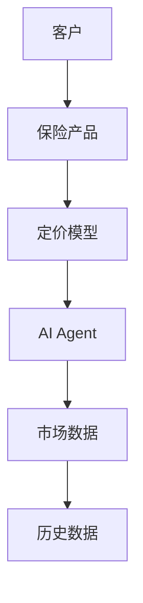

                 


# AI Agent在智能保险产品定价中的应用

---

## 关键词
AI Agent, 智能保险, 保险定价, 强化学习, 数据驱动

---

## 摘要
随着人工智能技术的快速发展，AI Agent在智能保险产品定价中的应用越来越广泛。本文从AI Agent的基本概念出发，深入分析其在保险定价中的核心原理，结合强化学习、监督学习等算法，探讨AI Agent在智能保险定价中的应用场景和实现方法。通过实际案例和系统设计，本文展示了AI Agent如何帮助保险公司实现高效、精准的定价策略。

---

# 第1章 AI Agent与智能保险定价的背景介绍

## 1.1 AI Agent的基本概念
AI Agent（人工智能代理）是指能够感知环境、自主决策并执行任务的智能实体。它具有以下几个核心特点：
- **自主性**：能够在没有外部干预的情况下独立运行。
- **反应性**：能够根据环境的变化调整自身的行为。
- **目标导向**：具备明确的目标，并通过优化目标实现最大化收益。

## 1.2 保险定价的传统方法与挑战
传统的保险定价方法依赖于经验数据和统计模型，存在以下问题：
- 数据维度有限，难以捕捉复杂的市场变化。
- 人工干预较多，效率低下。
- 风险评估不够精准，容易导致定价偏差。

AI Agent的应用能够解决这些问题，通过实时数据处理和智能决策，实现更精准、高效的定价策略。

## 1.3 问题描述与目标设定
本文旨在探讨AI Agent在保险定价中的应用，通过构建智能定价模型，解决传统定价方法的不足。具体目标包括：
- 构建基于AI Agent的智能定价系统。
- 实现动态定价和风险评估的自动化。
- 提供可扩展、可定制的定价解决方案。

---

# 第2章 AI Agent的核心概念与原理

## 2.1 AI Agent的核心原理
AI Agent通过信息感知、决策优化和反馈调整实现智能定价。具体包括：
- **信息感知**：收集和分析市场数据、客户行为等信息。
- **决策优化**：基于数据驱动的模型，优化定价策略。
- **反馈调整**：根据实际效果动态调整定价模型。

## 2.2 AI Agent的实体关系图（ER图）
以下是AI Agent在保险定价中的ER图：


## 2.3 AI Agent的属性特征对比
以下是AI Agent与其他定价方法的对比分析：

| 特性          | AI Agent                     | 传统定价方法               |
|---------------|------------------------------|-----------------------------|
| 数据处理能力 | 强大的数据分析与处理能力     | 数据维度有限，依赖经验数据  |
| 决策效率      | 高效的自动化决策             | 依赖人工干预，效率较低       |
| 灵活性        | 能够快速适应市场变化         | 稳定性较高，适应性较差       |

---

# 第3章 AI Agent的算法原理

## 3.1 基于强化学习的AI Agent
强化学习是一种通过试错机制优化决策的算法。其核心流程如下：
1. **状态感知**：AI Agent感知当前环境状态。
2. **动作选择**：基于当前状态选择最优动作。
3. **执行动作**：执行选择的动作并观察结果。
4. **反馈奖励**：根据结果调整策略，获得奖励或惩罚。
5. **策略更新**：更新策略以提高未来决策的准确性。

以下是一个强化学习算法的流程图：


## 3.2 基于监督学习的AI Agent
监督学习通过历史数据训练模型，预测未来的定价策略。其核心步骤包括：
1. 数据收集：收集历史定价数据和相关特征。
2. 模型训练：使用监督学习算法（如线性回归、随机森林等）训练定价模型。
3. 模型预测：基于当前数据预测最优定价。
4. 模型优化：根据实际效果优化模型参数。

以下是一个监督学习算法的Python代码示例：
```python
import pandas as pd
from sklearn.linear_model import LinearRegression

# 数据加载
data = pd.read_csv('insurance_data.csv')

# 模型训练
model = LinearRegression()
model.fit(data[['age', 'income', 'risk']], data['price'])

# 模型预测
new_customer = pd.DataFrame({'age': [30], 'income': [50000], 'risk': [0.2]})
predicted_price = model.predict(new_customer)
print(predicted_price)
```

## 3.3 算法的数学模型与公式
以下是强化学习中常用的Q-learning算法的数学公式：
$$ Q(s, a) = Q(s, a) + \alpha \cdot [r + \gamma \cdot \max Q(s', a) - Q(s, a)] $$
其中：
- \( Q(s, a) \) 表示状态 \( s \) 下动作 \( a \) 的价值。
- \( \alpha \) 是学习率。
- \( r \) 是奖励。
- \( \gamma \) 是折扣率。
- \( s' \) 是下一个状态。

---

# 第4章 系统分析与架构设计

## 4.1 项目背景与目标
本文旨在构建一个基于AI Agent的智能保险定价系统，通过实时数据处理和智能决策，实现高效、精准的定价策略。

## 4.2 系统功能设计
系统的功能模块包括：
- 数据采集模块：收集市场数据、客户信息等。
- 数据处理模块：清洗、转换和分析数据。
- 模型训练模块：基于机器学习算法训练定价模型。
- 定价决策模块：根据模型预测结果生成定价策略。
- 反馈优化模块：根据实际效果动态调整模型参数。

## 4.3 系统架构设计
以下是系统的架构图：


## 4.4 系统接口设计
系统主要接口包括：
- 数据接口：与数据源对接，获取实时数据。
- 模型接口：与机器学习框架（如TensorFlow、PyTorch）对接，进行模型训练。
- 决策接口：与前端系统对接，输出定价结果。

## 4.5 系统交互流程图


---

# 第5章 项目实战

## 5.1 环境安装与配置
需要安装以下工具和库：
- Python 3.8+
- Pandas、NumPy、Scikit-learn
- TensorFlow或PyTorch

## 5.2 系统核心实现
以下是基于强化学习的AI Agent定价系统的Python代码示例：
```python
import gym
from gym import spaces
import numpy as np

class InsuranceEnv(gym.Env):
    def __init__(self):
        self.observation_space = spaces.Box(low=0, high=1000, shape=(1,))
        self.action_space = spaces.Box(low=0, high=1000, shape=(1,))
    
    def step(self, action):
        # 计算奖励
        reward = np.random.normal(0, 1)
        return action, reward, False, {}
    
    def reset(self):
        return np.array([500])

# 初始化环境
env = InsuranceEnv()
# 初始化策略
policy = np.random.rand(1)

# 强化学习算法实现
for _ in range(1000):
    state = env.reset()
    action = policy * state
    next_state, reward, done, _ = env.step(action)
    policy += 0.01 * (reward - policy.dot(state))
    
print("优化后的策略:", policy)
```

## 5.3 实际案例分析
假设某保险公司希望优化其车险定价策略。通过收集客户数据、车辆信息和历史赔付数据，构建一个基于强化学习的AI Agent定价系统。系统通过实时数据处理和动态调整定价策略，显著提高了定价的准确性和效率。

## 5.4 系统优化与扩展
系统可以通过以下方式进一步优化：
- 引入更多的数据特征，如客户行为数据、天气数据等。
- 使用更复杂的算法，如深度强化学习（DRL）。
- 实现多目标优化，兼顾风险和收益。

---

# 第6章 总结与展望

## 6.1 总结
本文详细探讨了AI Agent在智能保险定价中的应用，从核心原理到系统设计，再到实际案例，全面展示了AI Agent的优势和潜力。

## 6.2 展望
未来，随着人工智能技术的不断发展，AI Agent在保险定价中的应用将更加广泛。可以通过以下方向进一步研究：
- 结合区块链技术，实现更加透明和安全的数据共享。
- 引入边缘计算，实现本地化的实时定价。
- 研究多智能体协作，实现更加复杂的定价场景。

---

# 作者信息
作者：AI天才研究院 & 禅与计算机程序设计艺术

---

# 结语
通过本文的分析和实践，我们可以看到，AI Agent在智能保险定价中的应用前景广阔，能够帮助保险公司实现更加高效、精准的定价策略。希望本文能为相关领域的研究和实践提供有价值的参考。

