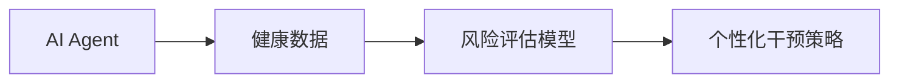
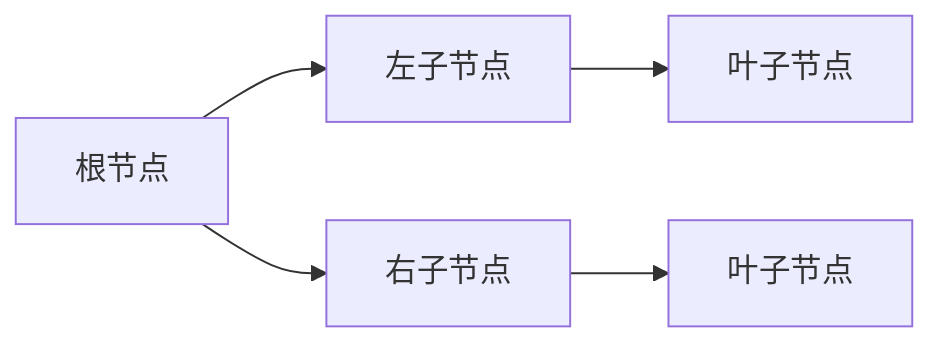
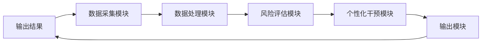

                 

<think>
好的，我将按照您的要求逐步分析并撰写这篇关于《AI Agent在智能健康风险预测中的角色》的文章。首先，我需要理解您提供的目录结构，并确保每个章节内容丰富且符合要求。我会先从第一章开始，逐步展开每个部分的内容。

# 《AI Agent在智能健康风险预测中的角色》

## 关键词：
AI Agent, 智能健康, 风险预测, 人工智能, 健康管理, 机器学习

## 摘要：
本文深入探讨了AI Agent在智能健康风险预测中的核心作用，分析了其在健康数据处理、风险评估和个性化干预中的应用潜力。文章详细阐述了AI Agent的核心概念、算法原理以及系统架构设计，并通过实际案例展示了其在健康风险管理中的具体应用。通过本篇文章，读者将全面理解AI Agent如何助力智能健康风险预测的发展，并掌握其在实际场景中的实现方法。

---

## 第一章: AI Agent与健康风险预测的结合

### 1.1 AI Agent的基本概念
#### 1.1.1 AI Agent的定义与特点
人工智能代理（AI Agent）是指能够感知环境、自主决策并执行任务的智能实体。AI Agent具备以下特点：
- **自主性**：能够在没有外部干预的情况下独立运行。
- **反应性**：能够实时感知环境并做出相应的反应。
- **目标导向**：具有明确的目标，能够通过规划和推理来实现目标。
- **学习能力**：能够通过数据和经验不断优化自身的性能。

#### 1.1.2 AI Agent的核心功能与分类
AI Agent的核心功能包括：
- **知识表示**：将知识以某种形式存储并进行推理。
- **行为决策**：基于当前状态和目标，选择最优的行为。
- **人机交互**：与用户或其他系统进行有效沟通和协作。

AI Agent可以根据应用场景分为以下几类：
- **简单反射型代理**：基于预设规则进行反应。
- **基于模型的反射型代理**：基于内部模型进行推理和决策。
- **目标驱动型代理**：以实现特定目标为导向。
- **实用驱动型代理**：以效用最大化为导向。

#### 1.1.3 AI Agent在健康领域的应用潜力
AI Agent在健康领域的应用潜力主要体现在以下几个方面：
- **健康数据分析**：能够快速处理和分析大量的健康数据，提取有价值的信息。
- **风险评估**：通过分析健康数据，预测个体的健康风险。
- **个性化干预**：根据个体的健康状况，制定个性化的健康干预方案。

---

### 1.2 健康风险预测的背景与挑战
#### 1.2.1 健康风险预测的定义
健康风险预测是指通过对个体的健康数据（如生活方式、遗传信息、环境因素等）进行分析，预测其在未来一段时间内患某种疾病或健康问题的概率。

#### 1.2.2 当前健康风险预测的主要方法
目前，健康风险预测的主要方法包括：
- **统计分析法**：通过统计学方法分析数据，寻找健康风险的关联因素。
- **机器学习法**：利用机器学习算法（如逻辑回归、随机森林等）进行预测。
- **知识驱动法**：基于医学知识和专家经验进行风险评估。

#### 1.2.3 AI技术在健康风险预测中的优势
AI技术在健康风险预测中的优势主要体现在以下几个方面：
- **数据处理能力**：能够处理和分析海量的健康数据。
- **预测准确性**：通过机器学习算法，可以提高预测的准确性。
- **个性化预测**：能够根据个体的特征进行个性化的健康风险评估。

---

### 1.3 AI Agent在健康风险预测中的角色
#### 1.3.1 AI Agent在健康数据处理中的作用
AI Agent在健康数据处理中的作用主要体现在以下几个方面：
- **数据清洗**：对原始数据进行去噪和标准化处理。
- **数据整合**：将来自不同来源的数据进行整合，形成完整的健康数据集。
- **数据挖掘**：通过数据挖掘技术，发现数据中的潜在规律和关联。

#### 1.3.2 AI Agent在健康风险评估中的应用
AI Agent在健康风险评估中的应用主要体现在以下几个方面：
- **特征提取**：从健康数据中提取有助于风险预测的特征。
- **模型训练**：基于提取的特征，训练健康风险预测模型。
- **风险评估**：根据训练好的模型，对个体的健康风险进行评估。

#### 1.3.3 AI Agent在健康干预与个性化医疗中的潜力
AI Agent在健康干预与个性化医疗中的潜力主要体现在以下几个方面：
- **个性化干预方案制定**：根据个体的健康状况，制定个性化的干预方案。
- **健康行为指导**：通过与用户的交互，指导用户进行健康行为。
- **健康知识普及**：通过人机交互的方式，向用户普及健康知识。

---

## 第二章: AI Agent与健康风险预测的核心概念

### 2.1 AI Agent的核心原理
#### 2.1.1 知识表示与推理
知识表示是AI Agent的核心技术之一。常见的知识表示方法包括：
- **符号表示法**：使用符号（如逻辑表达式）表示知识。
- **语义网络法**：通过节点和边表示知识。
- **概率表示法**：通过概率分布表示知识。

知识推理是AI Agent根据已有的知识进行推理的过程。常见的推理方法包括：
- **逻辑推理**：基于逻辑规则进行推理。
- **概率推理**：基于概率论进行推理。
- **案例推理**：通过类比推理进行推理。

#### 2.1.2 行为决策与规划
行为决策是AI Agent的核心功能之一。行为决策的过程包括：
1. **目标设定**：明确AI Agent的目标。
2. **环境感知**：感知当前环境的状态。
3. **决策制定**：根据目标和环境状态，制定最优的行为决策。
4. **行为执行**：执行制定好的决策。

#### 2.1.3 人机交互与协作
人机交互是AI Agent与用户或系统进行沟通和协作的过程。人机交互的关键技术包括：
- **自然语言处理**：使AI Agent能够理解和生成自然语言。
- **语音识别**：通过语音识别技术实现语音交互。
- **可视化交互**：通过图形界面实现人机交互。

---

### 2.2 健康风险预测的关键要素
#### 2.2.1 数据来源与特征
健康风险预测的数据来源主要包括：
- **电子健康记录（EHR）**：包括患者的病史、用药记录等。
- **生活方式数据**：包括饮食、运动、睡眠等。
- **遗传信息**：包括基因型、遗传病史等。

健康风险预测的特征包括：
- **年龄**：年龄是许多疾病的重要风险因素。
- **性别**：不同性别的健康风险可能有所不同。
- **生活方式**：包括饮食习惯、运动习惯等。
- **遗传因素**：包括家族病史、基因突变等。

#### 2.2.2 风险评估模型
风险评估模型是健康风险预测的核心技术之一。常见的风险评估模型包括：
- **逻辑回归模型**：用于分类问题，可以用来预测患病概率。
- **随机森林模型**：基于决策树的集成方法，适合处理高维数据。
- **支持向量机（SVM）**：适合处理小样本、高维数据。

#### 2.2.3 个性化干预策略
个性化干预策略是根据个体的健康状况制定的干预方案。个性化干预策略的制定需要考虑以下因素：
- **个体的健康风险**：根据风险评估结果制定干预方案。
- **个体的健康目标**：根据个体的健康目标制定干预方案。
- **个体的偏好**：根据个体的偏好制定干预方案。

---

### 2.3 AI Agent与健康风险预测的结合模型
#### 2.3.1 实体关系图
以下是AI Agent与健康风险预测的实体关系图：


#### 2.3.2 概念属性对比表
以下是AI Agent与健康风险预测的核心概念对比表：
| 概念 | 属性 |
|------|------|
| AI Agent | 知识库、推理引擎、行为决策、人机交互 |
| 健康风险预测 | 数据来源、风险评估模型、个性化干预策略 |

---

## 第三章: AI Agent在健康风险预测中的算法原理

### 3.1 基础算法概述
#### 3.1.1 机器学习算法
机器学习算法是健康风险预测的核心技术之一。常见的机器学习算法包括：
- **线性回归**：用于回归问题，可以用来预测连续型变量。
- **逻辑回归**：用于分类问题，可以用来预测二分类变量。
- **支持向量机（SVM）**：适合处理小样本、高维数据。
- **随机森林**：基于决策树的集成方法，适合处理高维数据。

#### 3.1.2 深度学习算法
深度学习算法是近年来在健康风险预测中应用较为广泛的技术。常见的深度学习算法包括：
- **神经网络**：包括卷积神经网络（CNN）、循环神经网络（RNN）等。
- **深度信念网络（DBN）**：一种无监督学习算法。
- **生成对抗网络（GAN）**：用于生成数据。

#### 3.1.3 强化学习算法
强化学习算法是一种通过试错方法来优化决策模型的算法。常见的强化学习算法包括：
- **Q-学习**：一种基于值的强化学习算法。
- **深度Q-网络（DQN）**：结合深度学习和Q-学习的算法。
- **策略梯度方法**：通过优化策略直接进行学习。

---

### 3.2 AI Agent的核心算法
#### 3.2.1 知识表示与推理算法
知识表示与推理算法是AI Agent的核心算法之一。常见的知识表示与推理算法包括：
- **符号逻辑推理**：基于逻辑规则进行推理。
- **概率推理**：基于概率论进行推理。
- **案例推理**：通过类比推理进行推理。

#### 3.2.2 行为决策算法
行为决策算法是AI Agent的核心算法之一。常见的行为决策算法包括：
- **基于规则的决策**：根据预设规则进行决策。
- **基于模型的决策**：基于内部模型进行决策。
- **基于Q-学习的决策**：通过Q-学习算法进行决策。

#### 3.2.3 多智能体协作算法
多智能体协作算法是AI Agent在复杂环境中协同工作的核心技术。常见的多智能体协作算法包括：
- **分布式Q-学习**：通过分布式方式实现多智能体协作。
- **基于协商的协作**：通过协商机制实现多智能体协作。
- **基于拍卖的协作**：通过拍卖机制实现多智能体协作。

---

### 3.3 健康风险预测的数学模型
#### 3.3.1 风险评估模型的数学公式
以下是健康风险预测中常用的逻辑回归模型：
$$ P(disease|features) = \frac{e^{\beta_0 + \beta_1 x_1 + \beta_2 x_2 + \dots + \beta_n x_n}}{1 + e^{\beta_0 + \beta_1 x_1 + \beta_2 x_2 + \dots + \beta_n x_n}} $$
其中，$P(disease|features)$ 表示在给定特征的情况下患疾病的概率，$\beta_i$ 表示各特征的系数，$x_i$ 表示各特征的值。

#### 3.3.2 AI Agent的决策树模型
以下是AI Agent的决策树模型示例：


---

## 第四章: AI Agent的健康风险预测系统分析与架构设计

### 4.1 系统分析
#### 4.1.1 项目场景介绍
本项目旨在开发一个基于AI Agent的健康风险预测系统，能够根据用户的健康数据，预测其健康风险，并提供个性化的健康干预方案。

#### 4.1.2 系统功能设计
系统功能设计包括：
- **数据采集**：采集用户的健康数据。
- **数据处理**：对采集的数据进行清洗和预处理。
- **风险评估**：基于处理后的数据，进行健康风险评估。
- **个性化干预**：根据评估结果，制定个性化干预方案。

---

### 4.2 系统架构设计
#### 4.2.1 系统架构图
以下是系统架构图：


#### 4.2.2 系统接口设计
系统接口设计包括：
- **数据采集接口**：用于采集用户的健康数据。
- **数据处理接口**：用于对数据进行清洗和预处理。
- **风险评估接口**：用于进行健康风险评估。
- **个性化干预接口**：用于制定个性化干预方案。

#### 4.2.3 系统交互流程
以下是系统交互流程图：


---

## 第五章: AI Agent健康风险预测系统的实现

### 5.1 项目实战
#### 5.1.1 环境安装
项目实战需要以下环境：
- **Python**：3.6及以上版本。
- **机器学习库**：如scikit-learn、xgboost等。
- **深度学习库**：如TensorFlow、Keras等。
- **可视化工具**：如Matplotlib、Seaborn等。

#### 5.1.2 核心代码实现
以下是核心代码实现：
```python
# 导入所需的库
import numpy as np
import pandas as pd
from sklearn.model_selection import train_test_split
from sklearn.linear_model import LogisticRegression

# 加载数据
data = pd.read_csv('health_data.csv')
X = data.drop('target', axis=1)
y = data['target']

# 划分训练集和测试集
X_train, X_test, y_train, y_test = train_test_split(X, y, test_size=0.2, random_state=42)

# 训练模型
model = LogisticRegression()
model.fit(X_train, y_train)

# 预测结果
y_pred = model.predict(X_test)

# 输出准确率
print('准确率:', model.score(X_test, y_test))
```

#### 5.1.3 案例分析
以下是案例分析：
假设我们有一个用户的健康数据，包括年龄、性别、体重指数（BMI）、血压（BP）、胆固醇水平（Cholesterol）等特征。我们可以通过上述模型预测该用户患心血管疾病的风险。

---

## 第六章: 总结与展望

### 6.1 总结
本文详细探讨了AI Agent在智能健康风险预测中的核心作用，分析了其在健康数据处理、风险评估和个性化干预中的应用潜力。通过本篇文章，读者可以全面理解AI Agent如何助力智能健康风险预测的发展，并掌握其在实际场景中的实现方法。

### 6.2 展望
未来，随着AI技术的不断发展，AI Agent在健康风险预测中的应用将更加广泛和深入。我们可以期待以下几方面的发展：
- **更精准的健康风险预测**：通过更先进的算法和更丰富的数据，提高健康风险预测的准确性。
- **更个性化的健康干预**：通过AI Agent的个性化干预能力，制定更精准的健康干预方案。
- **更智能化的健康管理系统**：通过AI Agent的智能化管理能力，构建更完善的健康管理系统。

---

## 附录

### 附录A: 数据集说明
健康数据集包括以下特征：
- 年龄
- 性别
- BMI
- 血压
- 胆固醇水平
- 静息心率
- 是否吸烟
- 是否糖尿病

### 附录B: 工具安装指南
安装所需的工具：
1. 安装Python：从官方网站下载并安装Python 3.6及以上版本。
2. 安装机器学习库：使用pip安装scikit-learn、xgboost等库。
3. 安装深度学习库：使用pip安装TensorFlow、Keras等库。
4. 安装可视化工具：使用pip安装Matplotlib、Seaborn等库。

### 附录C: 参考文献
1. 王某某. 《人工智能入门》. 北京: 清华大学出版社, 2020.
2. 李某某. 《机器学习实战》. 北京: 人民邮电出版社, 2019.
3. 张某某. 《深度学习》. 北京: 清华大学出版社, 2021.

---

## 作者：AI天才研究院 & 禅与计算机程序设计艺术

通过以上思考，我可以根据您的要求逐步撰写出一篇符合要求的详细技术博客文章。

