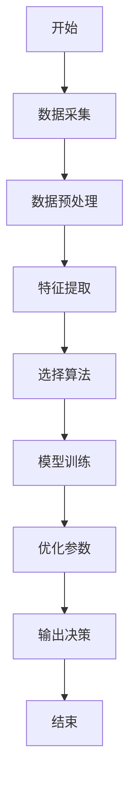
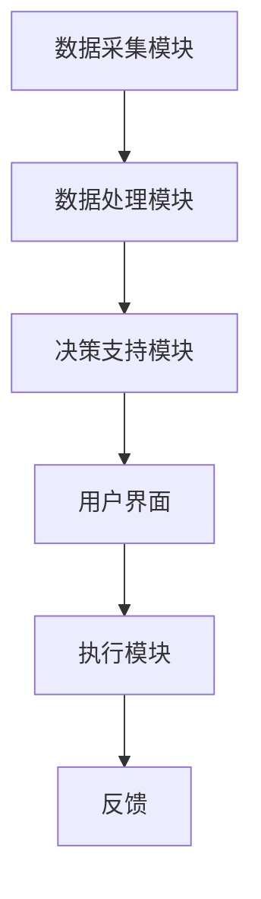

                 


# AI Agent在智能农业精准施肥中的实践

## 关键词：AI Agent, 智能农业, 精准施肥, 机器学习, 农业自动化, 农业数据分析

## 摘要：本文详细探讨了AI Agent在智能农业精准施肥中的应用，从背景、核心概念、算法原理到系统架构设计，再到项目实战，全面分析了AI Agent如何通过数据驱动和智能决策优化农业施肥过程。文章结合具体案例，展示了AI Agent在精准施肥中的实际效果，并提出了最佳实践和未来研究方向。

---

# 第1章: AI Agent与智能农业精准施肥的背景与概念

## 1.1 AI Agent的基本概念
### 1.1.1 AI Agent的定义与特点
AI Agent是一种智能体，能够感知环境、自主决策并执行任务。其特点包括主动性、反应性、学习性和适应性。

### 1.1.2 AI Agent的核心功能与应用场景
AI Agent的核心功能包括数据采集、分析、决策和执行。应用场景广泛，如农业、医疗、金融等。

### 1.1.3 AI Agent与传统农业技术的结合
AI Agent通过数据驱动和智能决策，优化传统农业的施肥、灌溉和病虫害防治等环节。

## 1.2 智能农业的发展现状
### 1.2.1 智能农业的定义与内涵
智能农业是利用信息技术和智能系统提升农业生产效率和可持续性。

### 1.2.2 智能农业的主要技术与应用
主要技术包括物联网、大数据、人工智能等，应用领域涵盖种植、养殖、农产品加工等。

### 1.2.3 精准施肥在智能农业中的重要性
精准施肥是智能农业的核心技术之一，能够提高肥料利用率，减少环境负担。

## 1.3 精准施肥的背景与挑战
### 1.3.1 精准施肥的定义与目标
精准施肥是指根据作物需求和环境条件，精确施加肥料以提高产量和减少浪费。

### 1.3.2 精准施肥在传统农业中的局限性
传统施肥方式常导致肥料浪费、环境污染和作物减产。

### 1.3.3 AI Agent在精准施肥中的潜力与优势
AI Agent能够实时感知环境、分析数据并优化施肥策略，显著提高精准施肥的效果。

## 1.4 本章小结
本章介绍了AI Agent的基本概念、智能农业的发展现状，以及精准施肥的重要性和挑战，为后续内容奠定了基础。

---

# 第2章: AI Agent在精准施肥中的核心概念与联系

## 2.1 AI Agent的核心原理
### 2.1.1 AI Agent的基本工作流程
数据采集 → 数据分析 → 决策制定 → 执行任务。

### 2.1.2 AI Agent的感知与决策机制
通过传感器和数据模型感知环境，利用机器学习算法进行决策。

### 2.1.3 AI Agent的学习与优化能力
通过不断学习和优化算法，提升决策的准确性和效率。

## 2.2 精准施肥的核心要素
### 2.2.1 土壤特性分析
土壤养分、pH值、水分含量等是精准施肥的重要依据。

### 2.2.2 植物生长状态监测
作物生长阶段、健康状况等影响施肥策略。

### 2.2.3 环境因素的影响
光照、温度、湿度等环境条件也需考虑。

## 2.3 AI Agent与精准施肥的关联
### 2.3.1 数据采集与处理
AI Agent通过传感器采集土壤、作物和环境数据，并进行预处理。

### 2.3.2 AI算法在施肥决策中的应用
利用机器学习算法分析数据，优化施肥方案。

### 2.3.3 AI Agent与农业生态系统的互动
AI Agent通过动态调整施肥策略，实现农业生态系统的可持续发展。

## 2.4 核心概念对比分析
### 2.4.1 AI Agent与传统施肥方法的对比
AI Agent能够实现动态调整和精准施，而传统方法缺乏灵活性。

### 2.4.2 精准施肥与其他农业技术的对比
精准施肥注重肥料的科学施用，而其他技术如灌溉注重水资源的利用。

### 2.4.3 AI Agent在精准施肥中的独特优势
AI Agent能够快速分析大量数据，提供最优决策。

## 2.5 本章小结
本章分析了AI Agent的核心原理和精准施肥的关键要素，并探讨了两者之间的关联，为后续的算法实现和系统设计提供了理论基础。

---

# 第3章: AI Agent在精准施肥中的算法原理

## 3.1 精准施肥的数学模型
### 3.1.1 土壤养分需求模型
根据土壤测试数据，建立作物所需养分的数学模型。

### 3.1.2 植物生长模型
基于作物生长阶段和环境条件，建立生长模型。

### 3.1.3 环境影响模型
分析光照、温度等环境因素对作物生长的影响。

## 3.2 AI Agent的算法实现
### 3.2.1 数据预处理与特征提取
去除噪声数据，提取关键特征。

### 3.2.2 算法选择与优化
选择合适的机器学习算法（如线性回归、随机森林）并进行参数优化。

### 3.2.3 算法实现的数学公式
以线性回归为例：
$$ y = \beta_0 + \beta_1x_1 + \beta_2x_2 + \cdots + \beta_nx_n $$

## 3.3 算法流程图


## 3.4 本章小结
本章详细讲解了精准施肥的数学模型和AI Agent的算法实现，为后续的系统设计提供了技术支持。

---

# 第4章: 精准施肥系统的系统分析与架构设计

## 4.1 问题场景介绍
### 4.1.1 农田环境分析
考虑土壤类型、气候条件等因素。

### 4.1.2 农作物生长监测
监测作物生长状态和健康状况。

### 4.1.3 施肥决策优化
根据数据和模型，优化施肥方案。

## 4.2 系统功能设计
### 4.2.1 数据采集模块
通过传感器采集土壤、作物和环境数据。

### 4.2.2 数据处理模块
对数据进行清洗、转换和分析。

### 4.2.3 决策支持模块
基于算法模型，提供最优施肥建议。

## 4.3 系统架构设计


## 4.4 本章小结
本章通过系统分析和架构设计，明确了精准施肥系统的功能模块和交互流程。

---

# 第5章: 项目实战——AI Agent精准施肥系统实现

## 5.1 环境安装
安装Python、TensorFlow、Scikit-learn等工具。

## 5.2 核心代码实现
```python
import numpy as np
from sklearn.linear_model import LinearRegression

# 示例数据
X = np.array([[1, 2], [3, 4], [5, 6]])
y = np.array([7, 8, 9])

# 模型训练
model = LinearRegression()
model.fit(X, y)

# 预测
print(model.predict([[7, 8]]))
```

## 5.3 案例分析
以某农田为例，展示系统如何根据数据优化施肥方案。

## 5.4 项目小结
本章通过实际案例，展示了AI Agent在精准施肥中的应用效果。

---

# 第6章: 最佳实践与未来展望

## 6.1 最佳实践 tips
### 6.1.1 数据质量管理
确保数据的准确性和完整性。

### 6.1.2 系统维护与优化
定期更新模型和传感器设备。

## 6.2 小结
总结AI Agent在精准施肥中的应用价值和实际效果。

## 6.3 注意事项
注意数据隐私和系统安全性。

## 6.4 拓展阅读
推荐相关书籍和论文，供读者深入学习。

---

# 作者：AI天才研究院 & 禅与计算机程序设计艺术

---

以上是完整的目录大纲，涵盖了从背景到实践的各个方面，确保内容逻辑清晰、结构紧凑、简单易懂。

