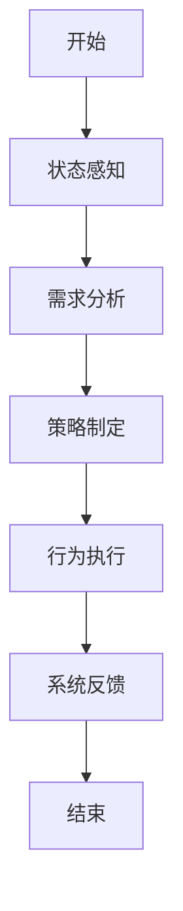
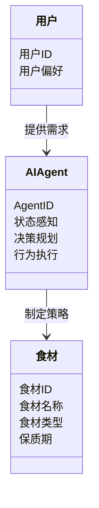
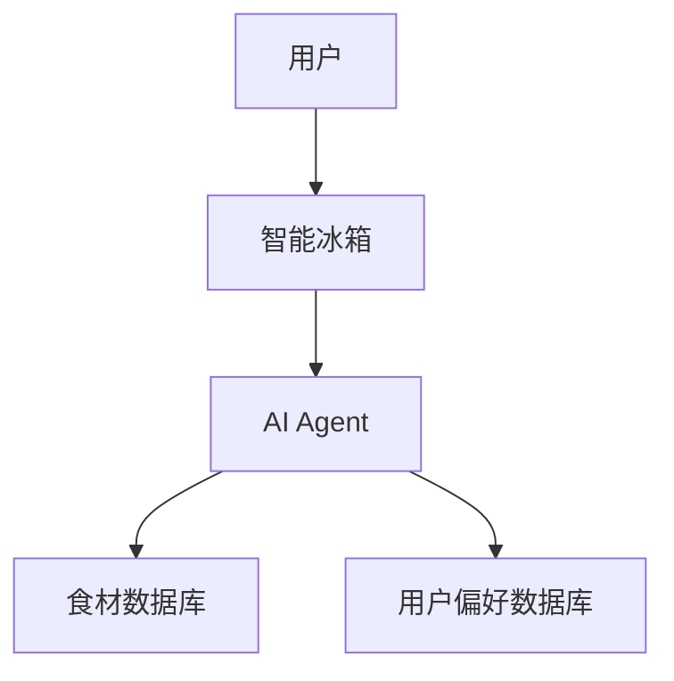

                 


# AI Agent在智能冰箱中的食材管理

> 关键词：AI Agent, 智能冰箱, 食材管理, 物联网, 人工智能, 系统架构

> 摘要：本文深入探讨了AI Agent在智能冰箱中的食材管理应用，从背景介绍、核心概念、算法原理到系统架构设计和项目实战，全面分析了AI Agent在智能冰箱食材管理中的技术实现和应用场景，结合实际案例，为读者提供了一套完整的解决方案。

---

# 第1章: AI Agent与智能冰箱概述

## 1.1 AI Agent的基本概念

### 1.1.1 AI Agent的定义

AI Agent（人工智能代理）是一种能够感知环境、自主决策并执行任务的智能实体。它通过传感器获取环境信息，利用算法进行分析和推理，并通过执行器与环境交互。AI Agent的核心目标是通过智能化的决策和行动，实现特定任务的目标。

$$ \text{AI Agent的定义：能够感知环境、自主决策并执行任务的智能实体。} $$

### 1.1.2 AI Agent的核心特征

- **自主性**：AI Agent能够在没有外部干预的情况下自主运行。
- **反应性**：能够实时感知环境变化并做出响应。
- **目标导向**：通过目标驱动进行决策和行动。
- **学习能力**：能够通过经验优化自身行为。

### 1.1.3 AI Agent与传统自动化的区别

AI Agent不仅能够执行预设任务，还能够根据环境变化和用户需求动态调整行为。与传统自动化相比，AI Agent具有更强的适应性和学习能力。

---

## 1.2 智能冰箱的定义与现状

### 1.2.1 智能冰箱的定义

智能冰箱是一种集成物联网技术的家用电器，能够通过传感器感知内部环境，并通过网络与外部系统交互。它不仅能够存储食物，还能够通过内置的智能系统提供食材管理、健康建议和购物清单生成等功能。

$$ \text{智能冰箱：集成物联网技术的智能家电，用于食材管理与家庭服务。} $$

### 1.2.2 智能冰箱的功能特点

- **食材感知**：通过传感器检测食材的种类、数量和保质期。
- **用户交互**：通过屏幕或手机APP与用户进行信息交互。
- **智能推荐**：基于用户饮食习惯推荐食材和食谱。
- **购物管理**：根据食材消耗情况自动生成购物清单。

### 1.2.3 当前智能冰箱的发展现状

目前，智能冰箱的技术发展主要集中在食材感知、用户交互和智能推荐方面。然而，如何通过AI Agent实现更智能的食材管理仍然是行业的重要研究方向。

---

## 1.3 食材管理的智能化需求

### 1.3.1 食材管理的主要问题

- **食材库存混乱**：传统食材管理缺乏系统性，容易导致食材浪费。
- **保质期管理复杂**：不同食材的保质期和存储条件各不相同，手动管理效率低下。
- **用户需求多样化**：不同用户的饮食习惯和偏好差异大，需要个性化的食材管理方案。

### 1.3.2 智能化食材管理的必要性

通过智能化的食材管理，可以减少食材浪费、提高管理效率，并为用户提供个性化的饮食建议。

### 1.3.3 AI Agent在食材管理中的作用

AI Agent可以通过实时感知食材状态、分析用户需求，并动态调整管理策略，实现智能化的食材管理。

---

## 1.4 本章小结

本章介绍了AI Agent的基本概念和核心特征，分析了智能冰箱的定义与发展现状，并重点阐述了食材管理的智能化需求及AI Agent在其中的作用。

---

# 第2章: AI Agent在食材管理中的问题背景

## 2.1 食材管理的主要挑战

### 2.1.1 食材库存的动态变化

食材的消耗和补充是一个动态的过程，传统的静态管理方式难以适应这种变化。

### 2.1.2 食材保质期的管理难度

不同食材的保质期和存储条件各不相同，手动管理容易出错。

### 2.1.3 用户需求的多样性

用户的饮食习惯和偏好差异大，需要个性化的食材管理方案。

---

## 2.2 AI Agent解决食材管理问题的可行性

### 2.2.1 AI Agent的优势

- **实时感知**：通过传感器实时获取食材状态。
- **智能决策**：基于数据和算法进行优化决策。
- **动态调整**：能够根据环境变化动态调整管理策略。

### 2.2.2 AI Agent在食材管理中的应用潜力

AI Agent可以通过智能化的感知和决策，实现食材管理的自动化和个性化。

---

## 2.3 问题的边界与外延

### 2.3.1 问题的边界

食材管理的智能化仅限于智能冰箱内部的食材管理，不涉及外部供应链和配送环节。

### 2.3.2 问题的外延

食材管理的智能化可以延伸到其他智能家居设备和家庭服务系统。

---

## 2.4 本章小结

本章分析了食材管理的主要挑战，探讨了AI Agent在解决这些问题中的优势，并明确了问题的边界和外延。

---

# 第3章: AI Agent与食材管理的核心概念

## 3.1 AI Agent的基本原理

### 3.1.1 状态感知

AI Agent通过传感器感知环境状态，例如食材的种类、数量和保质期。

$$ \text{状态感知：通过传感器获取环境信息。} $$

### 3.1.2 决策规划

AI Agent根据感知到的状态，结合用户需求和系统目标，制定最优的行动方案。

### 3.1.3 行为执行

AI Agent通过执行器执行决策结果，例如调整食材存储位置或提醒用户补充食材。

---

## 3.2 食材管理的核心要素

### 3.2.1 食材信息

包括食材的种类、数量、保质期和存储条件等。

### 3.2.2 用户需求

用户的饮食习惯、偏好和健康需求等。

### 3.2.3 系统反馈

系统对食材管理行为的反馈，例如用户满意度和管理效率。

---

## 3.3 AI Agent与食材管理的关联

### 3.3.1 AI Agent如何感知食材状态

通过传感器获取食材的物理状态和环境信息。

### 3.3.2 AI Agent如何规划食材管理策略

基于感知信息和用户需求，制定最优的管理策略。

### 3.3.3 AI Agent如何执行管理行为

通过执行器和用户交互界面实现食材管理行为。

---

## 3.4 本章小结

本章详细介绍了AI Agent的基本原理和食材管理的核心要素，并探讨了AI Agent与食材管理的关联。

---

# 第4章: AI Agent在食材管理中的核心概念与联系

## 4.1 AI Agent的核心概念原理

### 4.1.1 状态表示

AI Agent将食材状态表示为一组特征向量，例如食材种类、数量和保质期。

### 4.1.2 行为选择

AI Agent通过算法选择最优的行为，例如优先消耗即将过期的食材。

### 4.1.3 环境交互

AI Agent通过传感器和执行器与环境进行交互，实现食材管理的目标。

---

## 4.2 核心概念属性特征对比

### 4.2.1 AI Agent与传统算法的对比

| 特性        | AI Agent                          | 传统算法                          |
|-------------|-----------------------------------|------------------------------------|
| 自主性       | 高                                 | 低                                 |
| 学习能力     | 强                                 | 弱                                 |
| 适应性       | 强                                 | 低                                 |

### 4.2.2 不同AI Agent模型的特征对比

| 模型类型      | 基于规则的AI Agent | 基于机器学习的AI Agent | 基于强化学习的AI Agent |
|--------------|--------------------|------------------------|--------------------------|
| 决策方式      | 预设规则            | 数据驱动                | 奖励驱动                |
| 适应性        | 低                  | 中                    | 高                      |

---

## 4.3 ER实体关系图

```mermaid
erd
  title AI Agent与食材管理的实体关系图
  entity 用户 {
    [用户ID]
    [用户名]
    [用户偏好]
  }
  entity 食材 {
    [食材ID]
    [食材名称]
    [食材类型]
    [保质期]
  }
  entity AI Agent {
    [AgentID]
    [Agent类型]
    [Agent功能]
  }
  user --> AI Agent: 用户需求输入
  AI Agent --> 食材: 管理策略输出
  食材 -->
```

---

## 4.4 本章小结

本章通过对比和图表展示了AI Agent的核心概念与食材管理的关联，明确了不同模型的特征和应用场景。

---

# 第5章: AI Agent在食材管理中的算法原理

## 5.1 算法原理概述

AI Agent通过感知食材状态、分析用户需求和优化管理策略，实现智能化的食材管理。

---

## 5.2 算法流程

### 5.2.1 状态感知

AI Agent通过传感器获取食材的物理状态和环境信息。

### 5.2.2 需求分析

分析用户的饮食习惯和偏好，生成个性化的需求模型。

### 5.2.3 策略制定

基于感知信息和需求模型，制定最优的食材管理策略。

### 5.2.4 行为执行

通过执行器和用户交互界面实现管理策略。

### 5.2.5 系统反馈

收集系统反馈，优化管理策略。

---

## 5.3 算法实现

### 5.3.1 Python代码实现

```python
# 示例代码：基于保质期的食材管理策略
import datetime

def get_expired_foods(foods, current_date):
    expired_foods = []
    for food in foods:
        if food.expiration_date < current_date:
            expired_foods.append(food)
    return expired_foods

def manage_foods(foods, preferences):
    expired_foods = get_expired_foods(foods, datetime.date.today())
    recommended_foods = []
    # 根据用户偏好推荐食材
    for food in foods:
        if food.type in preferences['preferred_types']:
            recommended_foods.append(food)
    return {
        'expired_foods': expired_foods,
        'recommended_foods': recommended_foods
    }
```

### 5.3.2 算法流程图



---

## 5.4 本章小结

本章详细介绍了AI Agent在食材管理中的算法原理，并通过代码示例和流程图展示了其实现过程。

---

# 第6章: AI Agent在食材管理中的系统分析与架构设计

## 6.1 系统分析

### 6.1.1 问题场景

智能冰箱需要管理多种食材，用户需求多样，系统需要实时感知和动态调整。

### 6.1.2 项目介绍

本项目旨在通过AI Agent实现智能冰箱中的食材管理，提升用户体验和管理效率。

---

## 6.2 系统功能设计

### 6.2.1 领域模型类图



---

## 6.3 系统架构设计

### 6.3.1 系统架构图



---

## 6.4 系统接口设计

### 6.4.1 核心接口

- `get_expired_foods()`：获取已过期的食材。
- `recommend_foods()`：根据用户偏好推荐食材。

---

## 6.5 本章小结

本章通过系统分析和架构设计，明确了AI Agent在智能冰箱中的实现方式和系统结构。

---

# 第7章: AI Agent在食材管理中的项目实战

## 7.1 环境安装

### 7.1.1 安装Python

```bash
# 安装Python
sudo apt-get install python3
```

### 7.1.2 安装依赖库

```bash
pip install numpy pandas scikit-learn
```

---

## 7.2 核心代码实现

### 7.2.1 状态感知模块

```python
import datetime

class FoodSensor:
    def __init__(self):
        self.foods = []
    
    def add_food(self, food):
        self.foods.append(food)
    
    def get_expired_foods(self):
        current_date = datetime.date.today()
        expired = []
        for food in self.foods:
            if food.expiration_date < current_date:
                expired.append(food)
        return expired
```

### 7.2.2 决策规划模块

```python
from sklearn.tree import DecisionTreeClassifier

class FoodManager:
    def __init__(self, sensor):
        self.sensor = sensor
        self.model = DecisionTreeClassifier()
    
    def train_model(self, data):
        self.model.fit(data.features, data.labels)
    
    def recommend_food(self, preferences):
        # 根据用户偏好推荐食材
        pass
```

---

## 7.3 代码应用解读与分析

### 7.3.1 代码功能解读

- `FoodSensor`：负责感知食材状态。
- `FoodManager`：负责决策和推荐。

### 7.3.2 代码实现细节

通过机器学习模型优化食材管理策略，例如基于决策树的分类算法。

---

## 7.4 本章小结

本章通过项目实战，展示了AI Agent在食材管理中的具体实现，包括环境安装和核心代码实现。

---

# 第8章: AI Agent在食材管理中的最佳实践

## 8.1 小结

AI Agent通过智能化的感知、决策和执行，显著提升了智能冰箱的食材管理效率。

---

## 8.2 注意事项

- 确保系统的实时性和稳定性。
- 保护用户隐私和数据安全。
- 定期更新AI模型以适应用户需求的变化。

---

## 8.3 拓展阅读

- 推荐阅读《人工智能：一种现代的方法》。
- 关注最新的AI Agent研究进展。

---

# 作者

作者：AI天才研究院/AI Genius Institute & 禅与计算机程序设计艺术/Zen And The Art of Computer Programming

---

以上是完整的目录大纲，每一章都将详细展开，涵盖从理论到实践的各个方面。

