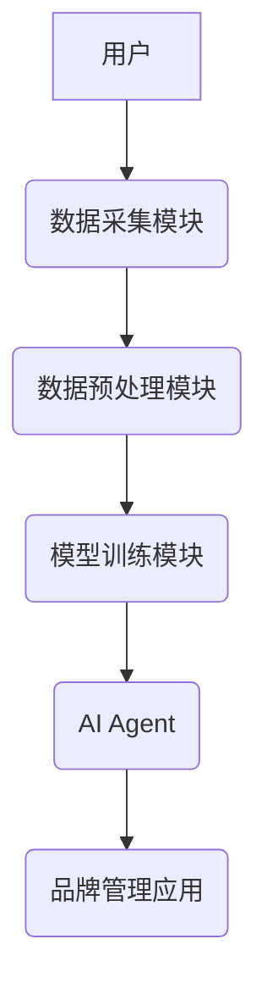

                 


# AI Agent在智能品牌管理中的应用

## 关键词：AI Agent、智能品牌管理、生成式AI、强化学习、系统架构

## 摘要：
随着人工智能技术的快速发展，AI Agent（人工智能代理）在品牌管理中的应用越来越广泛。本文将深入探讨AI Agent在智能品牌管理中的应用，从概念、算法、系统架构到实际案例，全面解析如何利用AI Agent提升品牌管理效率和精准度。通过分析AI Agent的核心原理和应用场景，本文将为读者提供一个全面的技术视角，帮助品牌管理者更好地理解和应用这一前沿技术。

---

# 第1章：AI Agent与智能品牌管理的背景

## 1.1 AI Agent的基本概念

### 1.1.1 AI Agent的定义
AI Agent（人工智能代理）是一种能够感知环境、自主决策并执行任务的智能实体。它通过传感器获取信息，利用算法处理数据，并通过执行器与环境交互。AI Agent的核心在于其智能化和自主性，能够适应复杂多变的环境。

### 1.1.2 AI Agent的核心特征
AI Agent具有以下核心特征：
1. **自主性**：能够独立决策和行动。
2. **反应性**：能够实时感知环境并做出反应。
3. **目标导向**：通过设定目标来驱动行为。
4. **学习能力**：能够通过数据和经验不断优化自身性能。

### 1.1.3 AI Agent与传统自动化工具的区别
AI Agent与传统自动化工具的主要区别在于其智能化和自主性。传统自动化工具基于固定的规则执行任务，而AI Agent能够通过学习和适应环境，动态调整行为以实现目标。

| 特性 | AI Agent | 传统自动化工具 |
|------|----------|----------------|
| 决策能力 | 高       | 无             |
| 学习能力 | 高       | 无             |
| 环境适应性 | 高       | 低             |

## 1.2 智能品牌管理的背景

### 1.2.1 品牌管理的传统模式
传统品牌管理依赖于人工分析和经验判断，存在效率低、决策滞后等问题。品牌管理者需要处理海量数据，但缺乏高效工具支持。

### 1.2.2 数字化品牌管理的兴起
随着大数据、云计算和AI技术的发展，品牌管理逐渐从人工化向数字化转型。数字化品牌管理利用技术手段提升效率和精准度，但仍然面临复杂性高的挑战。

### 1.2.3 AI技术在品牌管理中的应用现状
当前，AI技术已经在品牌定位、推广和维护等领域得到广泛应用。例如，AI可以通过分析用户行为数据，帮助品牌制定精准的营销策略。

## 1.3 AI Agent在品牌管理中的应用前景

### 1.3.1 AI Agent在品牌管理中的潜在价值
AI Agent能够通过实时数据分析，帮助品牌管理者快速制定决策，提升品牌推广和维护的效率。

### 1.3.2 市场趋势与技术进步
随着AI技术的不断进步，AI Agent在品牌管理中的应用将更加广泛。市场对智能化品牌管理工具的需求也在不断增加。

### 1.3.3 未来发展方向
未来，AI Agent在品牌管理中的应用将更加智能化和个性化，能够根据用户需求动态调整品牌策略。

---

# 第2章：AI Agent的核心概念与品牌管理的结合

## 2.1 AI Agent的核心概念

### 2.1.1 感知模块
感知模块是AI Agent获取环境信息的关键部分。它通过传感器或数据接口收集数据，并进行初步处理。

### 2.1.2 决策模块
决策模块是AI Agent的核心，负责根据感知到的信息做出决策。它通常基于预设的规则和学习模型进行推理。

### 2.1.3 执行模块
执行模块负责将决策转化为实际操作。它通过执行器与环境交互，完成任务。

## 2.2 品牌管理的核心要素

### 2.2.1 品牌定位
品牌定位是品牌管理的基础，决定了品牌在市场中的位置和目标用户群体。

### 2.2.2 品牌推广
品牌推广是品牌管理的重要环节，通过广告、营销活动等方式提升品牌知名度。

### 2.2.3 品牌维护
品牌维护是确保品牌长期稳定发展的关键，包括品牌形象管理、危机公关等。

## 2.3 AI Agent与品牌管理的结合

### 2.3.1 数据驱动的品牌决策
AI Agent可以通过分析海量数据，帮助品牌管理者制定科学的决策。

### 2.3.2 智能化品牌推广策略
AI Agent可以根据用户行为数据，动态调整营销策略，提升推广效果。

### 2.3.3 实时品牌维护与反馈
AI Agent能够实时监控品牌口碑，及时发现并处理负面信息，维护品牌形象。

---

# 第3章：AI Agent的算法原理与数学模型

## 3.1 AI Agent的算法原理

### 3.1.1 生成式AI的基本原理
生成式AI（如GPT）通过大规模预训练模型生成文本内容。其核心是Transformer模型，利用自注意力机制捕捉上下文信息。

### 3.1.2 大模型的训练流程
大模型的训练流程包括数据预处理、模型训练和微调。通过海量数据训练，模型能够学习语言的规律和语义信息。

### 3.1.3 基于强化学习的决策机制
强化学习通过奖励机制训练模型，使其在与环境交互中不断优化决策策略。

## 3.2 数学模型与公式

### 3.2.1 Transformer模型的结构
Transformer模型由编码器和解码器组成，编码器负责将输入序列编码为向量，解码器负责根据编码向量生成输出序列。

$$ \text{编码器结构：} \quad \text{LayerNorm}( \text{MultiHead}( \text{FFN}(x) ) ) $$

### 3.2.2 注意力机制的数学表达
注意力机制通过计算输入序列中每个位置的权重，生成加权后的表示。

$$ \text{注意力权重计算：} \quad a_{ij} = \frac{e^{q_i k_j}}{\sum_{k} e^{q_i k_j}} $$

### 3.2.3 损失函数与优化算法
常用的损失函数包括交叉熵损失和KL散度。优化算法通常采用Adam或SGD。

$$ \text{交叉熵损失：} \quad \mathcal{L} = -\sum_{i=1}^{n} y_i \log p_i $$

---

# 第4章：系统架构与设计

## 4.1 系统架构概述

### 4.1.1 分层架构
分层架构将系统分为数据层、业务逻辑层和表示层，便于模块化开发和维护。

### 4.1.2 微服务架构
微服务架构将系统功能分解为多个独立的服务，通过API进行通信，提高系统的扩展性和灵活性。

### 4.1.3 可扩展性设计
系统设计应考虑未来的扩展需求，例如增加新的功能模块或扩展数据存储。

## 4.2 系统功能设计

### 4.2.1 数据采集模块
数据采集模块负责从各种来源获取数据，包括用户行为数据和市场数据。

### 4.2.2 数据预处理模块
数据预处理模块对采集的数据进行清洗和格式转换，确保数据质量。

### 4.2.3 模型训练模块
模型训练模块负责训练AI Agent的模型，优化模型参数以提高性能。

## 4.3 系统架构图



---

# 第5章：项目实战

## 5.1 环境安装

### 5.1.1 安装Python
需要安装Python 3.8或更高版本。

### 5.1.2 安装依赖库
安装必要的依赖库，如TensorFlow、Keras和Hugging Face的库。

## 5.2 核心代码实现

### 5.2.1 数据预处理代码
```python
import pandas as pd

def preprocess_data(data):
    # 假设data是一个DataFrame
    data.dropna(inplace=True)
    data = data.sample(frac=0.8)
    return data
```

### 5.2.2 模型训练代码
```python
from tensorflow.keras import layers

def build_model(input_shape):
    model = layers.Sequential()
    model.add(layers.Dense(64, activation='relu', input_shape=input_shape))
    model.add(layers.Dense(1, activation='sigmoid'))
    model.compile(optimizer='adam', loss='binary_crossentropy', metrics=['accuracy'])
    return model
```

## 5.3 案例分析
通过实际案例分析，展示AI Agent在品牌管理中的具体应用，例如精准营销和品牌风险预警。

## 5.4 项目小结
总结项目的成功经验，分析遇到的问题，并提出改进建议。

---

# 第6章：总结与展望

## 6.1 最佳实践 tips
- 数据质量是AI Agent性能的关键，需重视数据清洗和特征工程。
- 在实际应用中，应结合业务需求选择合适的模型和算法。

## 6.2 小结
本文全面介绍了AI Agent在智能品牌管理中的应用，从概念、算法、系统架构到实际案例，为读者提供了系统的知识体系。

## 6.3 注意事项
- AI Agent的应用需要结合具体业务场景，避免盲目使用。
- 数据隐私和安全问题需引起高度重视。

## 6.4 拓展阅读
推荐相关书籍和论文，供读者深入学习。

---

# 作者：AI天才研究院/AI Genius Institute & 禅与计算机程序设计艺术 /Zen And The Art of Computer Programming

---

通过以上结构和内容，本文系统地介绍了AI Agent在智能品牌管理中的应用，从理论到实践，为读者提供了全面的技术视角。

