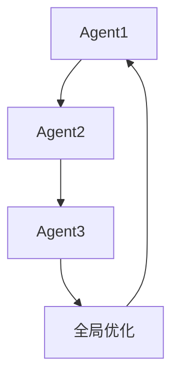
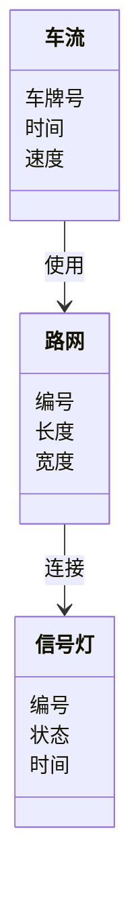
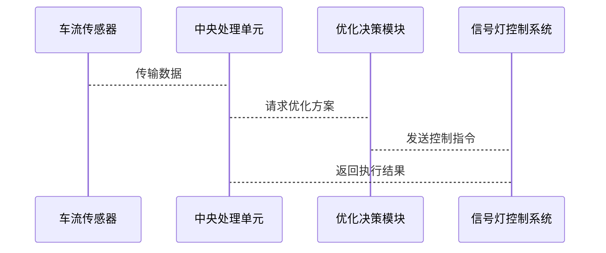

                 


# AI Agent在智能城市交通规划中的角色

> **关键词**: AI Agent, 智能城市, 交通规划, 强化学习, 多智能体协作, 系统架构设计

> **摘要**: 本文探讨了AI Agent在智能城市交通规划中的角色，分析了AI Agent的基本概念、核心原理及其在交通规划中的应用。通过具体案例，展示了AI Agent如何通过强化学习和多智能体协作算法优化交通流量，并设计了相应的系统架构。最后，总结了AI Agent在交通规划中的优势与挑战，展望了未来的研究方向。

---

## 第1章: AI Agent与智能城市交通规划的背景

### 1.1 AI Agent的基本概念

#### 1.1.1 AI Agent的定义

AI Agent（人工智能代理）是一种能够感知环境、自主决策并采取行动的智能实体。它可以是一个软件程序，也可以是一个物理设备，通过传感器和执行器与环境交互。

#### 1.1.2 AI Agent的核心特征

- **自主性**: AI Agent能够自主决策，无需人工干预。
- **反应性**: 能够实时感知环境变化并做出反应。
- **学习能力**: 通过数据和经验不断优化自身行为。

#### 1.1.3 AI Agent与传统交通规划的区别

传统交通规划依赖于人工分析和静态模型，而AI Agent能够动态调整规划策略，适应实时变化的交通状况。

### 1.2 智能城市交通规划的背景

#### 1.2.1 智能城市的发展趋势

随着城市化进程的加快，交通拥堵、资源浪费等问题日益严重。智能城市通过数字化和智能化手段，优化资源配置，提高城市运行效率。

#### 1.2.2 传统交通规划的局限性

- **静态性**: 传统规划难以应对交通需求的动态变化。
- **低效性**: 依赖人工分析，效率低下。
- **缺乏实时性**: 无法实时调整规划策略。

#### 1.2.3 智能交通系统的概念

智能交通系统（ITS）通过先进的信息技术，优化交通管理，提高交通效率。

### 1.3 AI Agent在智能城市交通规划中的角色

#### 1.3.1 AI Agent在交通规划中的应用场景

- **交通流量预测**: 利用历史数据和实时信息，预测交通流量。
- **路径优化**: 为车辆提供最优路径，减少拥堵。
- **信号灯控制**: 根据实时交通状况调整信号灯配时。

#### 1.3.2 AI Agent的优势与挑战

- **优势**: 提高交通效率，减少能源消耗，提升驾驶体验。
- **挑战**: 数据隐私问题，算法复杂性，系统可靠性。

#### 1.3.3 本章小结

AI Agent通过实时感知和自主决策，能够显著提升智能城市交通规划的效率和效果。

---

## 第2章: AI Agent的核心概念与原理

### 2.1 AI Agent的原理

#### 2.1.1 知识表示与推理

知识表示是AI Agent理解和处理信息的基础。常见的知识表示方法包括语义网络和逻辑推理。

#### 2.1.2 行为决策机制

基于感知信息，AI Agent通过决策算法选择最优行为。常用的行为决策机制包括规则驱动和学习驱动。

#### 2.1.3 学习与自适应能力

AI Agent通过机器学习算法不断优化自身的决策模型，适应复杂多变的环境。

### 2.2 AI Agent在交通规划中的应用原理

#### 2.2.1 数据采集与处理

AI Agent通过传感器、摄像头等设备采集交通数据，并进行预处理和特征提取。

#### 2.2.2 交通需求预测

利用历史数据和机器学习模型，预测未来的交通需求，为规划提供依据。

#### 2.2.3 优化方案生成

基于预测结果，AI Agent生成交通优化方案，如信号灯配时、路线优化等。

### 2.3 AI Agent与智能交通系统的关联

#### 2.3.1 系统架构分析

智能交通系统由多个子系统组成，包括数据采集、处理、分析和控制。

#### 2.3.2 功能模块划分

- **数据采集模块**: 负责采集交通数据。
- **分析模块**: 对数据进行分析和预测。
- **控制模块**: 根据分析结果调整交通信号灯等。

#### 2.3.3 交互流程设计

数据采集→数据处理→分析预测→优化控制→反馈调整。

### 2.4 核心概念对比表

| **特征**       | **传统交通规划** | **AI Agent交通规划** |
|----------------|------------------|-----------------------|
| 决策方式       | 人工决策         | 自主决策             |
| 数据处理       | 静态数据         | 动态数据             |
| 灵活性         | 较低             | 较高                 |

### 2.5 ER实体关系图

```mermaid
erd
    entity 车流 {
        key 车牌号
        属性: 流量, 速度, 时间
    }

    entity 信号灯 {
        key 信号灯编号
        属性: 状态, 时间
    }

    entity 路网 {
        key 路段编号
        属性: 长度, 宽度
    }

    车流 --> 路网: 使用
    路网 --> 信号灯: 连接
```

---

## 第3章: AI Agent算法原理与实现

### 3.1 算法原理

#### 3.1.1 强化学习算法

强化学习是一种通过试错方式优化决策策略的算法。AI Agent通过与环境交互，获得奖励，逐步优化自身行为。

#### 3.1.2 多智能体协作算法

多智能体协作算法研究多个AI Agent如何在协作中实现全局优化。

### 3.2 算法实现

#### 3.2.1 强化学习代码示例

```python
import numpy as np
import gym

env = gym.make('CartPole-v0')
env.seed(1)

learning_rate = 0.01
epsilon = 0.1
discount_factor = 0.99

# 状态空间和动作空间
state_space = env.observation_space.shape[0]
action_space = env.action_space.n

# 初始化参数
weights = np.zeros((state_space, action_space))

def perceive(state):
    return state

def choose_action(state):
    global epsilon
    if np.random.random() < epsilon:
        return np.random.randint(action_space)
    else:
        q_values = np.dot(perceive(state), weights)
        return np.argmax(q_values)

def learn(state, action, reward, next_state):
    global epsilon
    q_next = np.dot(perceive(next_state), weights)
    target = reward + discount_factor * np.max(q_next)
    target = target.reshape(-1, 1)
    current_q = np.dot(perceive(state).T, weights[action])
    weights[action] += learning_rate * (target - current_q)
    epsilon = max(epsilon * 0.99, 0.01)

# 训练过程
for episode in range(1000):
    state = env.reset()
    for step in range(1000):
        action = choose_action(state)
        next_state, reward, done, _ = env.step(action)
        learn(state, action, reward, next_state)
        state = next_state
        if done:
            break
```

#### 3.2.2 多智能体协作流程图



---

## 第4章: 系统分析与架构设计

### 4.1 问题场景介绍

在城市交通中，AI Agent需要实时处理大量的交通数据，优化信号灯配时，减少拥堵。

### 4.2 系统功能设计

#### 4.2.1 领域模型



### 4.3 系统架构设计


### 4.4 系统接口设计

- 数据采集接口：与传感器连接，获取实时数据。
- 信号灯控制接口：与交通信号灯连接，发送控制指令。
- 用户接口：供用户查看实时交通状况。

### 4.5 系统交互流程图



---

## 第5章: 项目实战

### 5.1 环境安装

安装Python和必要的库，如NumPy、Gym等。

### 5.2 核心代码实现

```python
# 强化学习算法实现（与第3章相同）
```

### 5.3 案例分析

通过模拟实验，验证AI Agent在交通规划中的有效性。

### 5.4 项目小结

项目展示了AI Agent在优化交通流量方面的潜力。

---

## 第6章: 总结与展望

### 6.1 总结

AI Agent通过实时感知和自主决策，显著提升了智能城市交通规划的效率和效果。

### 6.2 注意事项

- 数据隐私问题需重视。
- 算法复杂性可能影响实时性。
- 系统可靠性需加强。

### 6.3 未来研究方向

- 更高效的算法设计。
- 多智能体协作优化。
- 高度智能的城市交通系统。

---

## 参考文献

[1] Russell, S., & Norvig, P. (2010). Artificial Intelligence: A Modern Approach.

[2] LeCun, Y., Bengio, Y., & Hinton, G. (2015). Deep learning.

[3] Sutton, R. S., & Barto, A. G. (2018). Reinforcement learning: An introduction.

---

## 作者

作者：AI天才研究院 & 禅与计算机程序设计艺术

