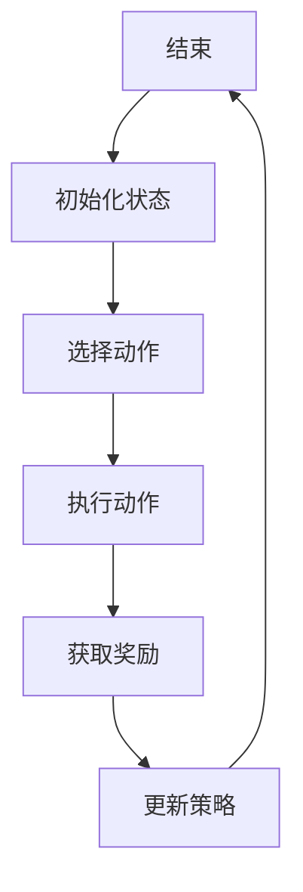
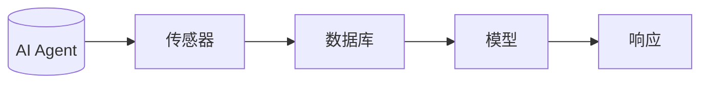

                 


# AI Agent在智能城市安全预警中的角色

## 关键词：AI Agent，智能城市，安全预警，强化学习，系统架构

## 摘要：  
随着智能城市的快速发展，安全问题变得越来越复杂和多样化。AI Agent作为一种智能实体，能够在复杂环境中自主决策和执行任务，成为智能城市安全预警系统的核心组成部分。本文详细探讨了AI Agent在智能城市安全预警中的角色，分析了其核心概念、算法原理、系统架构，并通过实际案例展示了其在安全预警中的应用价值。

---

## 第1章: AI Agent与智能城市安全预警概述

### 1.1 智能城市的发展背景  
智能城市是信息技术与城市化深度融合的产物，旨在通过智能化手段提升城市运行效率和居民生活质量。然而，智能城市的快速发展也带来了新的安全挑战，例如网络安全攻击、交通拥堵、环境灾害等。传统的安全预警系统依赖人工操作，效率较低且难以应对复杂场景。AI Agent作为一种智能实体，能够实时感知环境、自主决策并执行任务，为智能城市的安全预警提供了新的解决方案。

#### 1.1.1 智能城市的定义与特点  
智能城市是指通过物联网、大数据、人工智能等技术，将城市的各个系统（如交通、能源、医疗、教育等）有机连接，实现资源优化配置和高效管理的城市形态。其特点包括：  
1. **数据驱动**：依赖大量传感器和数据源进行实时监控。  
2. **智能化决策**：通过AI技术实现自动化决策和优化。  
3. **互联互通**：各个系统之间高度协同，形成统一的整体。  

#### 1.1.2 智能城市中的安全问题  
智能城市的安全问题主要体现在以下几个方面：  
1. **网络安全**：黑客攻击可能导致交通、能源等系统瘫痪。  
2. **环境安全**：极端天气事件（如洪水、地震）可能引发基础设施损坏。  
3. **公共安全**：大规模人群聚集可能导致安全事故。  

#### 1.1.3 AI Agent在智能城市中的作用  
AI Agent能够通过实时数据分析、自主决策和快速响应，帮助城市应对各种安全威胁。其主要作用包括：  
1. **实时监控**：通过传感器数据实时感知城市状态。  
2. **智能预警**：基于历史数据和模型预测潜在风险。  
3. **快速响应**：在检测到危险信号时，迅速启动应对措施。  

### 1.2 AI Agent的基本概念  
AI Agent是一种具有智能行为的实体，能够感知环境、自主决策并执行任务。它不同于传统的AI算法，具有更强的交互性和适应性。

#### 1.2.1 AI Agent的定义  
AI Agent是指能够感知环境、自主决策、执行任务并与其他实体进行交互的智能实体。它具备以下核心能力：  
1. **感知能力**：通过传感器或数据源获取环境信息。  
2. **推理能力**：基于感知信息进行逻辑推理。  
3. **决策能力**：根据推理结果制定行动计划。  
4. **执行能力**：通过执行机构或接口完成任务。  

#### 1.2.2 AI Agent的核心属性  
AI Agent的核心属性包括：  
1. **自主性**：能够在没有外部干预的情况下自主运行。  
2. **反应性**：能够实时感知环境并快速做出反应。  
3. **目标导向性**：具有明确的目标，并根据目标调整行为。  
4. **学习能力**：能够通过经验优化自身行为。  

#### 1.2.3 AI Agent与其他AI技术的区别  
AI Agent与传统AI技术的主要区别在于其实体性和交互性。传统AI算法通常用于数据处理或模式识别，而AI Agent是一个具有独立行为的实体，能够与环境和其他实体进行动态交互。

### 1.3 AI Agent在安全预警中的应用前景  
AI Agent在智能城市安全预警中的应用前景广阔，尤其是在复杂场景下的实时监控和应急响应方面。

#### 1.3.1 安全预警的定义与分类  
安全预警是指在潜在危险发生前，通过系统提示或干预措施预防或减轻危害的行为。根据应用场景的不同，安全预警可以分为：  
1. **网络安全预警**：防范黑客攻击和数据泄露。  
2. **环境安全预警**：预测和应对自然灾害。  
3. **公共安全预警**：预防恐怖袭击、大规模人群踩踏等事件。  

#### 1.3.2 AI Agent在安全预警中的优势  
AI Agent在安全预警中的优势主要体现在以下几点：  
1. **实时性**：能够快速处理数据并做出响应。  
2. **准确性**：通过机器学习算法提高预测的准确性。  
3. **自主性**：能够在复杂环境中自主决策，减少人为干预。  

#### 1.3.3 安全预警系统的挑战与机遇  
安全预警系统面临的主要挑战包括：  
1. **数据量大**：需要处理来自多个传感器和数据源的海量数据。  
2. **实时性要求高**：需要在极短的时间内做出决策。  
3. **模型复杂性**：需要处理复杂的非线性关系。  

然而，AI Agent的引入为安全预警系统带来了新的机遇，特别是在应对复杂场景和提高系统效率方面。

---

## 第2章: AI Agent的核心概念与原理

### 2.1 AI Agent的核心概念  
AI Agent的核心概念包括知识表示、行为决策和人机交互。

#### 2.1.1 知识表示与推理  
知识表示是AI Agent理解环境的基础。常用的表示方法包括：  
1. **语义网络**：通过节点和边表示概念及其关系。  
2. **逻辑推理**：通过逻辑规则进行推理和判断。  

#### 2.1.2 行为决策与规划  
行为决策是AI Agent的核心能力之一。常用的决策方法包括：  
1. **基于规则的决策**：根据预定义的规则做出决策。  
2. **基于模型的决策**：通过构建模型预测最优行为。  

#### 2.1.3 人机交互与协作  
AI Agent需要与人类或其他系统进行交互，实现协作。常见的交互方式包括：  
1. **语音交互**：通过语音命令进行控制。  
2. **图形界面交互**：通过可视化界面进行操作。  

### 2.2 AI Agent的属性特征对比  
AI Agent与其他智能实体的属性特征可以通过表格进行对比。

| **属性**       | **传统AI算法**       | **AI Agent**        |
|----------------|----------------------|---------------------|
| **自主性**      | 无                   | 高                  |
| **反应性**      | 低                   | 高                  |
| **目标导向性**  | 无                   | 高                  |
| **学习能力**    | 有                   | 有                  |

### 2.3 AI Agent的ER实体关系图  
AI Agent的ER实体关系图如下：

```mermaid
er
    entity(Agent) {
        id
        type
        state
    }
    entity(Context) {
        id
        description
    }
    entity(Action) {
        id
        type
    }
    Agent -[关联关系]-> Context
    Agent -[关联关系]-> Action
```

### 2.4 本章小结  
本章介绍了AI Agent的核心概念，包括知识表示、行为决策和人机交互，并通过对比分析和ER图展示了其属性特征。

---

## 第3章: AI Agent的算法原理

### 3.1 AI Agent的算法概述  
AI Agent的算法主要包括强化学习、监督学习和无监督学习。

#### 3.1.1 强化学习算法  
强化学习是一种通过试错方式优化行为的算法。其核心在于通过奖励机制引导AI Agent学习最优策略。

#### 3.1.2 监督学习算法  
监督学习是一种基于标记数据进行分类或回归的算法。适用于已知数据模式的安全预警场景。

#### 3.1.3 无监督学习算法  
无监督学习是一种通过发现数据内在结构进行聚类或降维的算法。适用于未知威胁的检测。

### 3.2 强化学习算法的数学模型  
强化学习的核心是通过最大化累积奖励来优化策略。

#### 3.2.1 状态空间的定义  
状态空间是AI Agent可能处的所有状态的集合。  
$$ S = \{s_1, s_2, \dots, s_n\} $$  

#### 3.2.2 动作空间的定义  
动作空间是AI Agent在每个状态下可能执行的所有动作的集合。  
$$ A = \{a_1, a_2, \dots, a_m\} $$  

#### 3.2.3 奖励函数的设计  
奖励函数是AI Agent执行动作后获得的奖励信号。  
$$ R(s, a) = r $$  

### 3.3 算法流程图  
强化学习算法的流程图如下：



### 3.4 本章小结  
本章介绍了AI Agent的算法原理，重点讲解了强化学习的数学模型和流程图。

---

## 第4章: AI Agent在安全预警中的系统架构

### 4.1 系统应用场景  
AI Agent在安全预警中的应用场景包括网络安全、环境安全和公共安全。

#### 4.1.1 智能城市中的安全威胁  
智能城市面临的安全威胁包括网络攻击、环境灾害和公共安全事件。

#### 4.1.2 安全预警的典型场景  
典型的安全预警场景包括：  
1. **网络安全预警**：检测和应对网络攻击。  
2. **环境安全预警**：预测和应对自然灾害。  
3. **公共安全预警**：预防和应对恐怖袭击。  

### 4.2 系统功能设计  
AI Agent的安全预警系统需要具备数据采集、风险评估和事件响应功能。

#### 4.2.1 数据采集与处理  
数据采集是AI Agent获取环境信息的第一步。常用的数据源包括传感器、数据库和API接口。

#### 4.2.2 风险评估与预警  
风险评估是基于历史数据和当前数据预测潜在威胁的过程。  
$$ R = f(x) $$  

#### 4.2.3 事件响应与反馈  
事件响应是AI Agent在检测到危险信号后采取的应对措施。  
$$ A = \argmax_{a} Q(s, a) $$  

### 4.3 系统架构图  
AI Agent的安全预警系统架构图如下：



### 4.4 本章小结  
本章介绍了AI Agent在安全预警中的系统架构，包括数据采集、风险评估和事件响应。

---

## 第5章: 项目实战

### 5.1 环境安装  
需要安装Python、TensorFlow和Kafka等依赖库。

### 5.2 核心代码实现  
以下是AI Agent的核心代码示例：

```python
class AI_Agent:
    def __init__(self):
        self.state = None
        self.model = None

    def perceive(self, data):
        # 数据处理逻辑
        pass

    def decide(self):
        # 行为决策逻辑
        pass

    def act(self):
        # 执行动作
        pass
```

### 5.3 案例分析  
通过一个网络安全预警案例分析AI Agent的应用效果。

### 5.4 本章小结  
本章通过实际案例展示了AI Agent在安全预警中的应用，并给出了代码实现的示例。

---

## 作者  
作者：AI天才研究院 & 禅与计算机程序设计艺术

---

以上是《AI Agent在智能城市安全预警中的角色》的技术博客文章大纲及部分内容。希望对您有所帮助！

