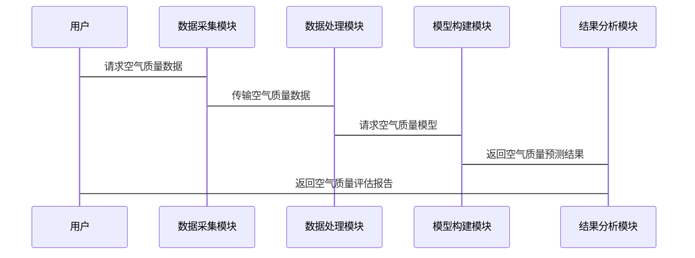

                 


# AI Agent在智能城市规划评估中的角色

## 关键词：
AI Agent, 智能城市, 城市规划, 评估系统, 算法原理, 系统架构, 项目实战

## 摘要：
AI Agent在智能城市规划评估中扮演着越来越重要的角色。随着城市化进程的加快，城市规划的复杂性和挑战性也在不断增加。传统的城市规划方法已经难以满足现代城市发展的需求。AI Agent通过其智能决策、自主学习和实时反馈等特性，为城市规划评估提供了一种全新的解决方案。本文将从AI Agent的基本概念、核心原理、系统架构、算法实现以及项目实战等多个方面详细探讨AI Agent在智能城市规划评估中的应用，并通过具体案例分析其实际效果。通过本文的分析，读者可以全面了解AI Agent在智能城市规划中的重要作用及其实际应用价值。

---

## 第1章: AI Agent的基本概念

### 1.1 AI Agent的定义与特点

#### 1.1.1 AI Agent的定义
AI Agent（人工智能代理）是一种能够感知环境、自主决策并执行任务的智能实体。它能够根据环境中的信息做出决策，并通过执行动作与环境交互。AI Agent的核心目标是通过智能算法优化决策过程，提高任务执行效率。

$$
\text{AI Agent} = \{\text{感知环境, 自主决策, 执行动作}\}
$$

#### 1.1.2 AI Agent的核心特点
AI Agent具有以下核心特点：
1. **智能性**：能够通过学习和推理优化决策。
2. **自主性**：能够在没有外部干预的情况下自主运行。
3. **反应性**：能够实时感知环境变化并做出反应。
4. **适应性**：能够根据环境变化调整行为策略。

| 对比项 | 传统软件 | AI Agent |
|--------|----------|----------|
| 决策方式 | 预设规则 | 自主学习 |
| 执行能力 | 单一任务 | 多任务协作 |
| 适应性 | 固定 | 动态调整 |

#### 1.1.3 AI Agent与传统软件的区别
AI Agent与传统软件的主要区别在于其智能性和自主性。传统软件通常基于预设的规则执行任务，而AI Agent能够通过学习和推理优化决策，并在复杂环境中自主适应。

### 1.2 智能城市规划评估的背景

#### 1.2.1 智能城市的发展现状
智能城市是信息技术与城市化深度融合的产物。随着物联网、大数据和人工智能等技术的快速发展，智能城市正在从概念走向现实。智能城市的建设涵盖了交通、能源、环境等多个领域，旨在通过智能化手段提高城市运行效率和居民生活质量。

#### 1.2.2 城市规划评估的重要性
城市规划是城市建设和发展的基础。科学的城市规划能够优化城市空间布局，提高资源利用效率，降低环境污染。然而，传统的城市规划方法往往依赖人工经验，难以应对城市化过程中复杂多变的挑战。

#### 1.2.3 AI Agent在城市规划中的应用前景
AI Agent在城市规划中的应用前景广阔。它可以通过实时数据采集、智能分析和自主决策，帮助城市规划者优化规划方案，提高规划的科学性和可行性。

---

## 第2章: AI Agent在智能城市中的角色

### 2.1 AI Agent在城市规划中的具体应用

#### 2.1.1 数据收集与处理
AI Agent可以通过传感器、摄像头等设备实时采集城市环境中的数据，包括交通流量、空气质量、人口分布等。这些数据为城市规划提供了重要的决策依据。

#### 2.1.2 模型构建与优化
AI Agent可以通过机器学习算法构建城市规划模型，对城市空间布局、交通流量等进行模拟和优化。通过模型优化，可以提高城市规划的科学性和可行性。

#### 2.1.3 结果分析与反馈
AI Agent可以对规划结果进行实时分析，并根据反馈信息调整规划方案。这种实时反馈机制能够有效提高城市规划的动态适应能力。

### 2.2 AI Agent与其他技术的协同作用

#### 2.2.1 与大数据技术的结合
AI Agent与大数据技术的结合能够提高数据处理效率。通过大数据分析，AI Agent可以更好地理解城市环境，并做出更精准的决策。

#### 2.2.2 与云计算的协同
AI Agent可以通过云计算平台进行数据存储和计算，提高处理能力。云计算为AI Agent提供了强大的计算资源支持，使其能够处理更大规模的数据。

#### 2.2.3 与物联网的整合
AI Agent可以通过物联网技术实现与城市设备的实时交互。通过物联网，AI Agent可以更全面地感知城市环境，并做出更及时的反应。

---

## 第3章: AI Agent的核心原理

### 3.1 AI Agent的基本原理

#### 3.1.1 知识表示
知识表示是AI Agent实现智能决策的基础。通过知识表示，AI Agent可以将城市环境中的信息转化为可计算的形式，如知识图谱、规则库等。

#### 3.1.2 问题求解
问题求解是AI Agent的核心任务。通过问题求解，AI Agent可以找到最优解决方案。常用的问题求解方法包括搜索算法、逻辑推理等。

#### 3.1.3 行为选择
行为选择是AI Agent根据环境信息做出决策的过程。通过行为选择，AI Agent可以选择最优动作以实现目标。

### 3.2 AI Agent的决策机制

#### 3.2.1 基于规则的决策
基于规则的决策是一种简单的决策方法。通过预设规则，AI Agent可以在特定条件下做出决策。这种方法适用于规则明确的场景。

#### 3.2.2 基于学习的决策
基于学习的决策是通过机器学习算法训练模型，使AI Agent能够从经验中学习，提高决策能力。这种方法适用于复杂多变的场景。

#### 3.2.3 基于推理的决策
基于推理的决策是通过逻辑推理得出结论。这种方法适用于需要推理的场景，如法律推理、医疗诊断等。

---

## 第4章: AI Agent的算法原理

### 4.1 常见的AI Agent算法

#### 4.1.1 强化学习算法
强化学习是一种通过试错学习优化决策的算法。强化学习通过奖励机制指导AI Agent做出最优决策。

$$
\text{强化学习公式：} Q(s, a) = r + \gamma \max_{a'} Q(s', a')
$$

#### 4.1.2 深度学习算法
深度学习是一种通过多层神经网络学习特征的算法。深度学习在图像识别、语音识别等领域有广泛应用。

#### 4.1.3 逻辑推理算法
逻辑推理算法是通过逻辑规则推理得出结论的算法。逻辑推理在知识图谱构建、自然语言处理等领域有广泛应用。

### 4.2 算法实现的数学模型

#### 4.2.1 Q-learning算法
Q-learning是一种常用的强化学习算法，适用于离散动作空间的决策问题。

$$
Q(s, a) = Q(s, a) + \alpha (r + \gamma \max Q(s', a') - Q(s, a))
$$

#### 4.2.2 DQN算法
DQN（Deep Q-Network）是一种基于深度学习的强化学习算法，适用于连续状态空间的决策问题。

#### 4.2.3 贝叶斯网络模型
贝叶斯网络是一种概率图模型，适用于不确定性推理。

---

## 第5章: AI Agent的系统架构

### 5.1 系统架构设计

#### 5.1.1 分层架构
分层架构是一种常见的系统架构，将系统划分为多个层次，如感知层、决策层、执行层等。

#### 5.1.2 微服务架构
微服务架构是一种将系统功能分解为多个独立服务的架构，适用于复杂系统的构建。

#### 5.1.3 可扩展架构
可扩展架构是一种能够根据需求动态扩展系统容量的架构，适用于高并发场景。

### 5.2 系统功能设计

#### 5.2.1 数据采集模块
数据采集模块负责采集城市环境中的数据，如交通流量、空气质量等。

#### 5.2.2 模型构建模块
模型构建模块负责构建城市规划模型，对城市空间布局进行模拟和优化。

#### 5.2.3 结果分析模块
结果分析模块负责对规划结果进行分析，并根据反馈信息调整规划方案。

---

## 第6章: 项目实战

### 6.1 项目背景与目标

#### 6.1.1 项目背景
项目背景介绍城市空气质量评估的重要性，以及AI Agent在其中的应用。

#### 6.1.2 项目目标
项目目标是通过AI Agent实现城市空气质量的实时监测与优化。

#### 6.1.3 项目范围
项目范围包括空气质量数据采集、模型构建、结果分析等。

### 6.2 系统实现

#### 6.2.1 环境安装与配置
环境安装与配置包括安装必要的软件和库，如Python、TensorFlow、Keras等。

#### 6.2.2 核心算法实现
核心算法实现包括强化学习算法的实现，如Q-learning、DQN等。

#### 6.2.3 系统功能实现
系统功能实现包括数据采集模块、模型构建模块、结果分析模块的实现。

---

## 第7章: 系统分析与设计

### 7.1 项目介绍

#### 7.1.1 项目名称
项目名称为“智能城市空气质量评估系统”。

#### 7.1.2 项目目标
项目目标是通过AI Agent实现城市空气质量的实时监测与优化。

#### 7.1.3 项目范围
项目范围包括空气质量数据采集、模型构建、结果分析等。

### 7.2 系统功能设计

#### 7.2.1 领域模型设计
领域模型设计包括城市空气质量评估的实体关系图。


#### 7.2.2 系统架构设计
系统架构设计包括系统的分层架构图。

```mermaid
graph LR
    Subgraph 数据采集层
        A[空气质量传感器]
        B[交通流量传感器]
    Subgraph 数据处理层
        C[数据采集模块]
        D[数据预处理模块]
    Subgraph 模型构建层
        E[空气质量模型]
        F[交通流量模型]
    Subgraph 结果分析层
        G[结果分析模块]
        H[反馈模块]
```

#### 7.2.3 系统接口设计
系统接口设计包括各个模块之间的接口定义，如数据采集模块与数据处理模块之间的接口。

#### 7.2.4 系统交互设计
系统交互设计包括系统的交互流程图。



---

## 第8章: 最佳实践与小结

### 8.1 小结
通过本文的分析，我们可以看到AI Agent在智能城市规划评估中的重要作用。AI Agent通过其智能决策、自主学习和实时反馈等特性，为城市规划提供了全新的解决方案。

### 8.2 注意事项
在实际应用中，需要注意数据的准确性和模型的可解释性。此外，还需要考虑系统的安全性和稳定性。

### 8.3 拓展阅读
读者可以进一步阅读相关领域的书籍和论文，深入了解AI Agent在智能城市中的其他应用。

---

## 作者：AI天才研究院 & 禅与计算机程序设计艺术

通过本文的分析，我们深入探讨了AI Agent在智能城市规划评估中的角色及其应用。希望本文能够为读者提供有价值的知识和见解，帮助他们更好地理解AI Agent在智能城市中的重要作用。

