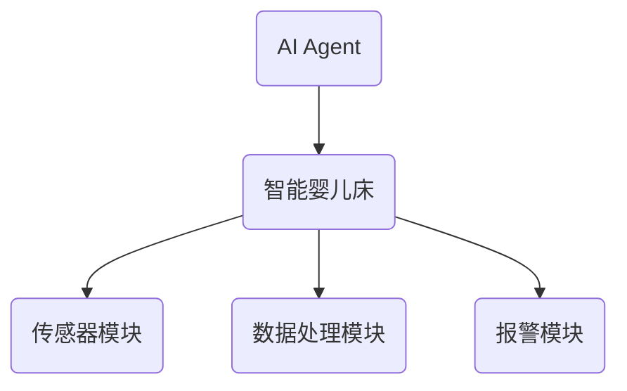
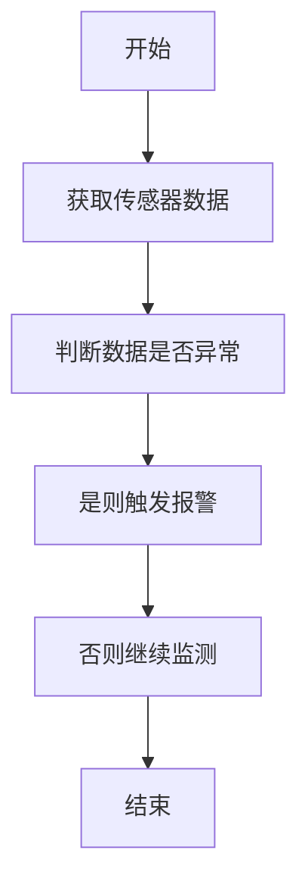
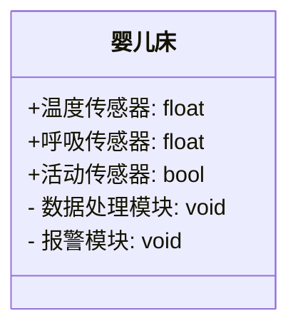

                 


# AI Agent在智能婴儿床中的安全监控

> 关键词：AI Agent，智能婴儿床，安全监控，机器学习，自然语言处理

> 摘要：本文探讨了AI Agent在智能婴儿床中的安全监控应用，从核心概念、算法原理到系统架构，再到实战项目，全面分析了AI Agent如何提升婴儿床的安全监控能力。

---

# 第一部分: AI Agent与智能婴儿床安全监控的背景与概念

## 第1章: AI Agent与智能婴儿床概述

### 1.1 AI Agent的基本概念

#### 1.1.1 AI Agent的定义
AI Agent（人工智能代理）是指能够感知环境、执行任务、与用户交互的智能实体。它通过传感器获取数据，利用算法进行分析，并通过执行器完成操作。

#### 1.1.2 AI Agent的核心特征
- **自主性**：无需人工干预，自主完成任务。
- **反应性**：能够实时感知环境变化并做出反应。
- **学习能力**：通过数据不断优化自身的决策能力。
- **交互性**：支持与用户和其他系统的交互。

#### 1.1.3 AI Agent的分类与应用场景
- **基于规则的AI Agent**：适用于简单任务，如条件判断。
- **基于机器学习的AI Agent**：适用于复杂任务，如图像识别、自然语言处理。
- **混合型AI Agent**：结合规则和机器学习，适用于复杂场景。

### 1.2 智能婴儿床的定义与特点

#### 1.2.1 智能婴儿床的功能模块
- **传感器模块**：监测婴儿的呼吸、体温、活动状态。
- **数据处理模块**：对传感器数据进行分析和处理。
- **报警模块**：在检测到异常时触发报警。

#### 1.2.2 智能婴儿床的技术实现
- **硬件技术**：使用红外传感器、温度传感器等。
- **软件技术**：利用AI算法进行数据分析和异常检测。

#### 1.2.3 智能婴儿床的市场现状
智能婴儿床市场快速增长，主要应用于家庭和医疗机构，市场需求主要集中在安全性和智能化方面。

### 1.3 AI Agent在智能婴儿床中的应用背景

#### 1.3.1 婴儿安全监控的重要性
婴儿安全是家庭和医疗机构的重要关注点，传统监控方式存在效率低、误报率高的问题。

#### 1.3.2 现有婴儿床监控技术的局限性
- 数据采集单一，缺乏智能分析。
- 报警机制不够精准，容易误报或漏报。

#### 1.3.3 AI Agent在婴儿床监控中的优势
- 提高数据采集和分析的准确性。
- 实现实时监控和智能报警。

## 1.4 本章小结

---

## 第2章: AI Agent与智能婴儿床的安全监控需求

### 2.1 婴儿安全监控的核心需求

#### 2.1.1 婴儿呼吸监测
通过传感器实时监测婴儿的呼吸频率，及时发现异常情况。

#### 2.1.2 婴儿体温监测
监测婴儿体温，防止体温过低或过高。

#### 2.1.3 婴儿活动状态监测
通过传感器监测婴儿的活动状态，判断是否存在异常。

### 2.2 AI Agent在安全监控中的任务分解

#### 2.2.1 数据采集与处理
- 从传感器获取数据，进行预处理和特征提取。

#### 2.2.2 数据分析与异常检测
- 使用机器学习算法分析数据，检测异常情况。

#### 2.2.3 报警与反馈机制
- 在检测到异常时，触发报警，并通过反馈机制优化算法。

### 2.3 安全监控系统的边界与外延

#### 2.3.1 系统的输入边界
- 传感器数据输入接口。

#### 2.3.2 系统的输出边界
- 报警信号输出接口。

#### 2.3.3 系统与其他模块的交互
- 与用户交互，提供报警信息。
- 与医疗机构交互，提供实时数据。

## 2.4 本章小结

---

## 第3章: AI Agent与智能婴儿床的核心概念与联系

### 3.1 AI Agent的核心原理

#### 3.1.1 基于规则的推理机制
- 定义规则，如“如果呼吸频率低于正常值，则触发报警”。

#### 3.1.2 基于机器学习的决策机制
- 使用机器学习算法，如随机森林、神经网络，训练模型进行预测。

#### 3.1.3 基于自然语言处理的交互机制
- 支持语音交互，如家长询问婴儿状态。

### 3.2 智能婴儿床的系统架构

#### 3.2.1 硬件模块
- 传感器模块：包括温度传感器、红外传感器等。
- 执行器模块：包括报警器、LED指示灯等。

#### 3.2.2 软件模块
- 数据采集模块：负责采集和预处理数据。
- 数据分析模块：负责异常检测和报警决策。
- 交互模块：负责与用户交互，提供实时反馈。

#### 3.2.3 网络通信模块
- 负责数据的传输和与外部系统的通信。

### 3.3 AI Agent与智能婴儿床的实体关系图



## 3.4 本章小结

---

## 第4章: AI Agent在智能婴儿床中的算法原理

### 4.1 基于规则的推理算法

#### 4.1.1 算法原理
- 通过预定义的规则进行判断，如“如果体温低于35℃，则触发报警”。

#### 4.1.2 算法流程图



#### 4.1.3 Python代码示例

```python
def monitor_baby():
    import传感器数据
    如果呼吸频率 < 正常值：
        报警()
    如果体温 < 正常值 或 体温 > 正常值：
        报警()
    如果活动状态异常：
        报警()
    返回正常

monitor_baby()
```

### 4.2 基于机器学习的异常检测算法

#### 4.2.1 算法原理
- 使用机器学习算法，如随机森林，对历史数据进行训练，预测异常情况。

#### 4.2.2 算法实现步骤
1. 数据预处理：清洗数据，提取特征。
2. 训练模型：使用训练数据训练随机森林模型。
3. 测试模型：使用测试数据验证模型的准确性。
4. 部署模型：将模型部署到智能婴儿床中，实时检测异常。

#### 4.2.3 Python代码示例

```python
import numpy as np
from sklearn.ensemble import RandomForestClassifier

# 假设X_train是训练数据，y_train是标签
model = RandomForestClassifier()
model.fit(X_train, y_train)

# 预测
预测值 = model.predict(X_test)
```

### 4.3 本章小结

---

## 第5章: AI Agent与智能婴儿床中的数学模型

### 5.1 基于概率论的异常检测

#### 5.1.1 概率模型
- 使用概率分布模型，计算数据的概率密度，判断是否异常。

#### 5.1.2 示例
$$P(y=1|x) = \frac{1}{1 + e^{-wx - b}}$$

### 5.2 基于回归分析的异常检测

#### 5.2.1 回归模型
- 使用线性回归模型，预测正常值范围，判断数据是否异常。

#### 5.2.2 示例
$$y = w_1x_1 + w_2x_2 + ... + w_nx_n + b$$

### 5.3 本章小结

---

## 第6章: AI Agent与智能婴儿床中的系统分析与架构设计

### 6.1 问题场景介绍
- 系统需要实时监控婴儿的呼吸、体温和活动状态。
- 在检测到异常时，触发报警并通知家长或医护人员。

### 6.2 系统功能设计

#### 6.2.1 领域模型



#### 6.2.2 系统架构设计


#### 6.2.3 系统接口设计
- 传感器接口：采集婴儿的数据。
- 报警接口：在检测到异常时，触发报警。

#### 6.2.4 系统交互流程图

```mermaid
sequenceDiagram
    parent 系统交互
    婴儿床->>传感器模块: 获取数据
    传感器模块->>数据处理模块: 传输数据
    数据处理模块->>AI Agent: 分析数据
    AI Agent->>报警模块: 报警
    报警模块->>家长/医护人员: 通知
```

## 6.3 本章小结

---

## 第7章: AI Agent与智能婴儿床中的项目实战

### 7.1 环境安装
- 安装Python、传感器模块、机器学习库（如scikit-learn）。

### 7.2 系统核心实现源代码

#### 7.2.1 数据采集模块

```python
import serial

ser = serial.Serial('COM3', 9600)
while True:
    data = ser.readline()
    处理数据()
```

#### 7.2.2 数据分析模块

```python
import numpy as np
from sklearn.ensemble import RandomForestClassifier

model = RandomForestClassifier()
model.fit(X_train, y_train)

预测值 = model.predict(X_test)
```

### 7.3 代码应用解读与分析
- 数据采集模块负责从传感器获取数据。
- 数据分析模块负责对数据进行分析，判断是否异常。

### 7.4 实际案例分析
- 案例一：体温异常检测。
- 案例二：呼吸频率异常检测。

### 7.5 项目小结

---

## 第8章: 最佳实践、小结、注意事项与拓展阅读

### 8.1 最佳实践
- 定期更新模型，提高准确性。
- 保证系统的安全性，防止数据泄露。

### 8.2 小结
本文详细介绍了AI Agent在智能婴儿床中的应用，从核心概念到算法原理，再到系统架构和项目实战，全面分析了如何利用AI Agent提升婴儿床的安全监控能力。

### 8.3 注意事项
- 确保系统的稳定性和可靠性。
- 定期维护和更新系统。

### 8.4 拓展阅读
- 推荐阅读《机器学习实战》、《深度学习》等书籍。

---

# 作者：AI天才研究院 & 禅与计算机程序设计艺术

---

以上是文章的完整目录大纲和内容框架，希望对您有所帮助！

