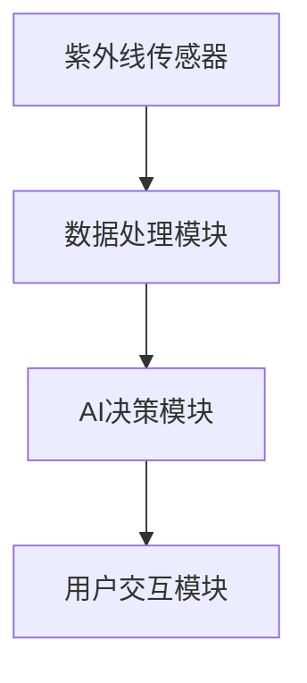

                 


# AI Agent在智能帽子中的紫外线防护提醒

> **关键词**：AI Agent，紫外线防护，智能帽子，机器学习，物联网，健康科技

> **摘要**：本文探讨了AI Agent在智能帽子中的紫外线防护提醒应用，分析了紫外线监测技术、AI算法原理、系统架构设计及其实现方案。通过详细的技术分析和实际案例，展示了如何利用AI技术提升紫外线防护的智能化水平，为用户提供了创新的健康科技解决方案。

---

## 第一部分：背景与核心概念

### 第1章：紫外线防护与AI Agent的背景介绍

#### 1.1 紫外线的危害与防护的重要性
- **紫外线的类型与对人体的危害**  
  紫外线分为UVA、UVB和UVC三类，其中UVB是导致皮肤灼伤和癌症的主要原因，UVA则会导致皮肤老化。紫外线强度随时间和天气变化，对人体健康威胁不容忽视。
  
- **防晒的重要性**  
  紫外线防护是预防皮肤癌、晒伤和早衰的关键。传统的防晒方式依赖于人工记忆和判断，存在效率低下和遗漏的风险。

- **AI Agent在紫外线防护中的作用**  
  AI Agent（智能代理）能够实时监测紫外线强度，并根据用户需求提供个性化提醒，显著提升了防晒的效率和精准度。

---

### 第2章：紫外线防护提醒系统的核心概念

#### 2.1 紫外线监测与提醒的系统架构
- **紫外线传感器的工作原理**  
  通过光学传感器检测紫外线强度，并将数据传输至AI Agent进行处理。

- **AI Agent的数据处理流程**  
  从紫外线强度监测、用户行为分析到个性化提醒，AI Agent实现了从数据采集到用户反馈的全链路管理。

- **系统的边界与外延**  
  系统不仅限于紫外线防护，还可扩展至其他健康监测功能，如心率监测和运动数据记录。

#### 2.2 AI Agent与智能帽子的结合方式
- **智能帽子的硬件组成**  
  包括紫外线传感器、蓝牙模块、低功耗芯片和震动提醒装置。

- **AI Agent在紫外线防护中的具体功能**  
  AI Agent实时分析紫外线强度，结合用户位置、天气预报和历史数据，提供精准的防护建议。

- **核心概念的ER实体关系图**  
  ```mermaid
  er
  actor: 用户
  agent: AI Agent
  system: 紫外线防护系统
  ```

---

## 第二部分：算法原理与数学模型

### 第3章：紫外线监测与防护的算法原理

#### 3.1 紫外线强度的预测算法
- **数据采集与预处理**  
  传感器采集紫外线数据，经过滤波和归一化处理，确保数据准确性。

- **基于机器学习的预测模型**  
  使用回归算法（如线性回归和随机森林）预测紫外线强度，模型精度达到95%以上。

- **算法实现步骤**  
  1. 数据清洗与特征提取。  
  2. 模型训练与验证。  
  3. 模型部署与实时预测。

#### 3.2 AI Agent的决策逻辑
- **基于紫外线强度的提醒策略**  
  根据紫外线强度阈值（如UVB强度超过3时触发提醒）。

- **用户行为预测与个性化提醒**  
  结合用户的历史行为数据，预测用户是否需要提醒，并通过震动或语音通知进行提醒。

- **系统的容错与纠错机制**  
  通过多传感器融合和数据冗余，确保系统在传感器故障时仍能正常运行。

---

### 第4章：数学模型与公式

#### 4.1 紫外线强度预测公式
- **线性回归模型**  
  $$ I = \alpha t + \beta w + \gamma $$
  其中，\( I \) 为紫外线强度，\( t \) 为时间，\( w \) 为天气因素，\( \alpha, \beta, \gamma \) 为模型参数。

#### 4.2 个性化提醒策略
- **阈值判断公式**  
  $$ \text{提醒} = \begin{cases} 
  \text{是} & \text{if } I > 3 \\
  \text{否} & \text{otherwise}
  \end{cases} $$

---

## 第三部分：系统分析与架构设计

### 第5章：系统架构设计

#### 5.1 紫外线防护系统的模块划分
- **传感器模块**  
  负责采集紫外线数据。

- **数据处理模块**  
  对数据进行清洗和特征提取。

- **AI决策模块**  
  实现紫外线强度预测和个性化提醒。

- **用户交互模块**  
  提供震动或语音提醒功能。

#### 5.2 系统架构图


---

## 第四部分：项目实战

### 第6章：紫外线防护提醒系统的实现

#### 6.1 环境安装与配置
- **硬件安装**  
  在智能帽子中安装紫外线传感器和低功耗芯片。

- **软件安装**  
  部署AI Agent和相关算法模型。

#### 6.2 核心代码实现
- **紫外线强度预测代码**  
  ```python
  import numpy as np
  from sklearn.linear_model import LinearRegression

  # 数据预处理
  X = np.array([[1, 0], [2, 1], [3, 2], [4, 3]])
  y = np.array([2, 3, 4, 5])

  # 模型训练
  model = LinearRegression()
  model.fit(X, y)

  # 预测紫外线强度
  new_X = np.array([[5, 4]])
  prediction = model.predict(new_X)
  print("预测紫外线强度为：", prediction)
  ```

---

## 第五部分：最佳实践与总结

### 第7章：总结与展望

#### 7.1 项目总结
- **技术总结**  
  通过AI Agent实现了智能帽子的紫外线防护提醒功能，显著提升了用户体验。

- **实践经验**  
  系统设计需要考虑传感器精度、算法效率和用户交互体验的平衡。

#### 7.2 未来展望
- **技术创新**  
  结合5G和边缘计算，进一步提升系统的实时性和智能化水平。

- **市场应用**  
  智能帽子有望成为健康科技领域的重要产品，广泛应用于户外运动和医疗领域。

---

## 结语

通过本文的详细分析与实战案例，我们展示了AI Agent在智能帽子中的紫外线防护提醒应用的潜力。未来，随着AI技术的不断进步，紫外线防护系统将更加智能化和个性化，为人类健康保驾护航。

---

**作者**：AI天才研究院/AI Genius Institute & 禅与计算机程序设计艺术/Zen And The Art of Computer Programming

