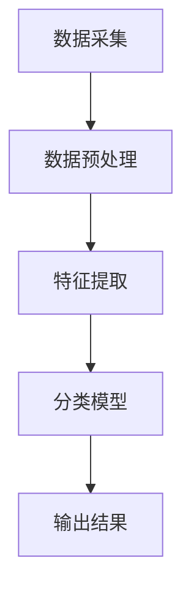
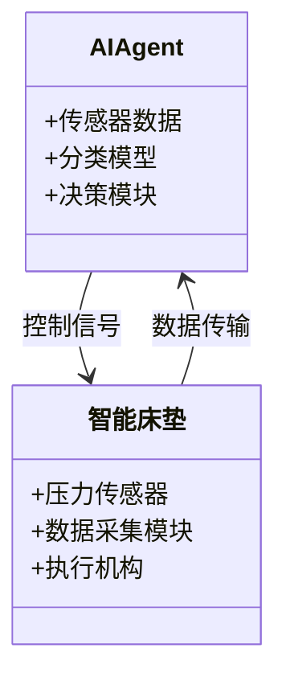

                 


# AI Agent在智能床垫中的睡眠姿势分析

## 关键词：AI Agent, 智能床垫, 睡眠姿势分析, 数据采集, 机器学习, 应用实践

## 摘要：本文探讨了AI Agent在智能床垫中的应用，重点分析了睡眠姿势的检测与分类。文章详细介绍了AI Agent的基本原理、智能床垫的技术特点，以及如何通过数据采集、特征提取和机器学习算法实现睡眠姿势的智能化分析。通过实际案例，展示了AI Agent在改善睡眠质量中的潜力和应用价值。

---

# 第1章：背景介绍

## 1.1 AI Agent的基本概念

### 1.1.1 AI Agent的定义与特点
AI Agent（人工智能代理）是一种智能体，能够感知环境、自主决策并执行任务。它具有以下特点：
- **自主性**：无需外部干预，自主完成任务。
- **反应性**：能实时感知环境并做出反应。
- **目标导向**：以特定目标为导向，优化决策。

### 1.1.2 智能床垫的发展历程
智能床垫通过集成传感器和智能算法，逐步从简单的数据采集向智能化分析迈进。当前，其主要功能包括监测心率、呼吸频率和体动频率等。

## 1.2 问题背景与描述

### 1.2.1 睡眠姿势分析的重要性
睡眠姿势直接影响睡眠质量，不良姿势可能导致健康问题。传统方法依赖问卷调查，数据主观且不准确。

### 1.2.2 当前睡眠姿势分析的挑战
- **数据采集困难**：需多传感器协同工作。
- **数据处理复杂**：需实时分析大量数据。
- **用户隐私保护**：数据采集和处理需确保隐私安全。

## 1.3 问题解决与边界

### 1.3.1 AI Agent在睡眠姿势分析中的作用
AI Agent通过实时数据采集、特征提取和分类，帮助智能床垫实现睡眠姿势的智能化分析。

### 1.3.2 睡眠姿势分析的边界与外延
- **边界**：限于体动和姿势变化的分析，不涉及健康诊断。
- **外延**：未来可能扩展到健康监测和个性化建议。

## 1.4 核心概念与结构

### 1.4.1 AI Agent与智能床垫的结合
AI Agent负责数据处理和决策，智能床垫负责数据采集和执行。

### 1.4.2 睡眠姿势分析的核心要素
- 数据采集：床垫传感器收集数据。
- 数据处理：AI Agent进行特征提取和分类。

---

# 第2章：AI Agent与智能床垫的核心原理

## 2.1 AI Agent的原理

### 2.1.1 感知与推理机制
AI Agent通过传感器获取数据，利用算法进行推理和决策。

### 2.1.2 行为决策模型
基于推理结果，AI Agent决定执行的动作，如调整床垫硬度。

## 2.2 智能床垫的技术原理

### 2.2.1 压力传感器与数据采集
床垫内置压力传感器，采集用户体动、呼吸等数据。

### 2.2.2 数据处理与分析
AI Agent对数据进行预处理、特征提取和分类，判断睡眠姿势。

## 2.3 核心概念的联系

### 2.3.1 AI Agent与智能床垫的交互流程
1. 数据采集：床垫传感器收集数据。
2. 数据传输：数据发送给AI Agent。
3. 数据处理：AI Agent提取特征并分类。
4. 行为决策：调整床垫参数或发出提醒。

### 2.3.2 睡眠姿势分析的系统架构
系统由传感器、数据处理模块和AI Agent组成，协同工作实现分析。

---

# 第3章：睡眠姿势分析的算法原理

## 3.1 数据采集与预处理

### 3.1.1 数据采集方法
通过压力传感器采集用户的体重分布数据，反映睡眠姿势变化。

### 3.1.2 数据预处理流程
- 数据清洗：去除噪声和异常值。
- 数据标准化：统一数据格式和单位。

## 3.2 特征提取与分类

### 3.2.1 基于AI Agent的特征提取
提取压力分布特征，如压力中心位置、压力变化速率等。

### 3.2.2 分类算法的选择与实现
采用支持向量机（SVM）或随机森林（RF）进行分类，准确率高。

## 3.3 算法流程图



## 3.4 数学模型

### 3.4.1 分类模型公式
$$ y = f(x) $$
其中，x是输入特征，y是分类结果。

### 3.4.2 分类结果示例
分类结果可能包括仰卧、侧卧和俯卧三种姿势。

---

# 第4章：系统分析与架构设计

## 4.1 问题场景介绍

### 4.1.1 使用场景分析
用户在睡眠时，床垫实时监测并调整参数，改善睡眠质量。

### 4.1.2 用户需求分析
用户希望床垫能自动调整姿势，预防健康问题。

## 4.2 系统功能设计

### 4.2.1 领域模型设计



### 4.2.2 功能模块划分
- 数据采集模块：负责传感器数据采集。
- 数据处理模块：进行特征提取和分类。
- 决策模块：根据分类结果调整床垫参数。

## 4.3 系统架构设计

### 4.3.1 分层架构
系统分为感知层、数据处理层和决策层，各层协同工作。

### 4.3.2 架构图


## 4.4 系统接口设计

### 4.4.1 接口描述
- 传感器数据接口：负责数据采集和传输。
- 分类结果接口：传递分类结果到执行机构。

## 4.5 系统交互

### 4.5.1 交互序列图

```mermaid
sequenceDiagram
参与者 用户
智能床垫 -> AI Agent: 采集数据
AI Agent -> 数据处理模块: 提取特征
数据处理模块 -> 分类模型: 分类
分类模型 -> AI Agent: 返回结果
AI Agent -> 智能床垫: 调整参数
```

---

# 第5章：项目实战

## 5.1 环境安装

### 5.1.1 安装Python和相关库
安装Python 3.x，numpy，scikit-learn，tensorflow。

## 5.1.2 环境配置
配置Jupyter Notebook，确保库版本兼容。

## 5.2 核心代码实现

### 5.2.1 数据预处理代码

```python
import numpy as np
from sklearn.preprocessing import StandardScaler

# 数据预处理
def preprocess(data):
    scaler = StandardScaler()
    data_normalized = scaler.fit_transform(data)
    return data_normalized
```

### 5.2.2 特征提取代码

```python
from sklearn.feature_selection import SelectKBest

def extract_features(data, labels):
    selector = SelectKBest(k=5)
    features = selector.fit_transform(data, labels)
    return features
```

### 5.2.3 分类模型实现

```python
from sklearn import svm

def train_classifier(features, labels):
    clf = svm.SVC()
    clf.fit(features, labels)
    return clf

# 示例数据
X = np.array([[1, 2, 3], [4, 5, 6], [7, 8, 9]])
y = np.array([0, 1, 0])

clf = train_classifier(X, y)
```

## 5.3 实际案例分析

### 5.3.1 数据采集与分析
采集用户睡眠数据，预处理后提取特征，分类模型预测姿势。

### 5.3.2 模型性能评估
使用准确率、召回率和F1分数评估模型性能，优化参数提升效果。

## 5.4 代码应用解读与分析
解释代码实现，说明每部分的功能和作用，展示实际应用效果。

## 5.5 项目小结
总结项目实现过程，指出优点和不足，提出改进建议。

---

# 第6章：总结与展望

## 6.1 最佳实践 tips
- 数据采集要准确，避免噪声干扰。
- 特征提取要选择关键特征，提高分类效果。
- 模型优化要结合实际，选择合适算法。

## 6.2 小结
本文详细探讨了AI Agent在智能床垫中的应用，展示了如何通过数据处理和机器学习实现睡眠姿势分析。

## 6.3 注意事项
- 保护用户隐私，确保数据安全。
- 定期更新模型，适应不同用户需求。

## 6.4 拓展阅读
推荐相关书籍和论文，鼓励读者深入学习。

---

# 作者：AI天才研究院/AI Genius Institute & 禅与计算机程序设计艺术 /Zen And The Art of Computer Programming

---

通过以上目录大纲，我们可以看到，文章内容涵盖了AI Agent在智能床垫中的应用，从基础概念到实际应用，结构清晰，内容详实。

