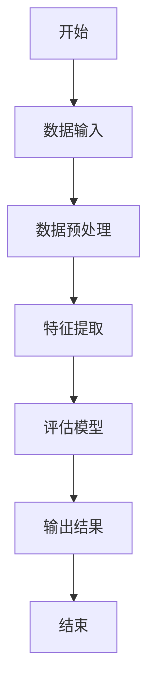
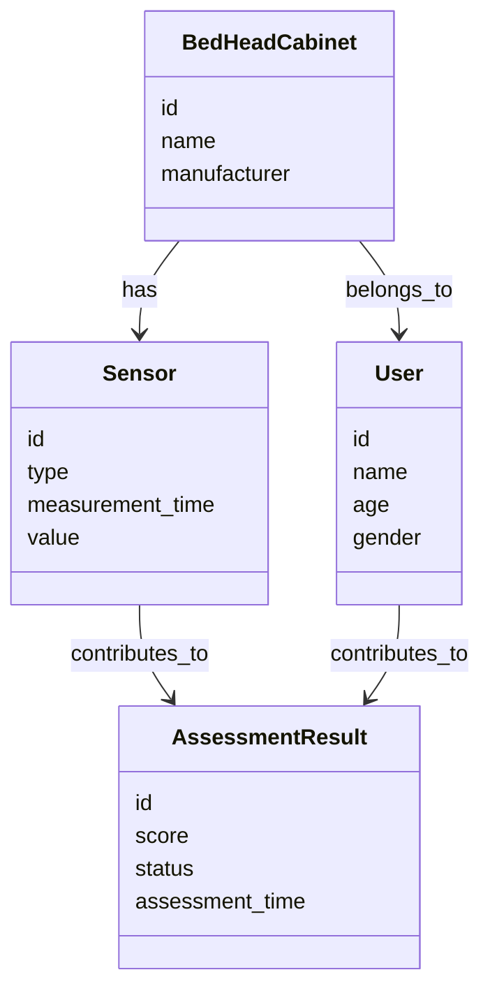
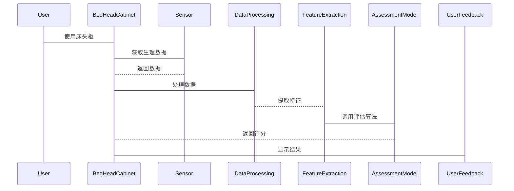

                 


# AI Agent在智能床头柜中的清醒度评估

**关键词：** AI Agent, 清醒度评估, 智能床头柜, 算法原理, 系统架构, 项目实战

**摘要：** 本文详细探讨了AI Agent在智能床头柜中的清醒度评估技术。通过背景介绍、核心概念分析、算法原理、系统架构设计、项目实战和最佳实践等多方面，系统地阐述了如何利用AI技术实现智能床头柜对用户清醒度的准确评估。文章内容丰富，结构清晰，适合技术爱好者和相关领域研究人员阅读。

---

## 第一部分: 清醒度评估的背景介绍

### 第1章: 清醒度评估的背景与问题描述

#### 1.1 清醒度评估的背景
- **1.1.1 清醒度评估的定义与意义**
  - 清醒度评估是指通过传感器和算法，判断用户当前是否处于清醒状态。这对于智能设备提供个性化服务至关重要。
- **1.1.2 清醒度评估的应用场景**
  - 在医疗领域，帮助监测患者的意识状态。
  - 在智能家居中，优化用户的交互体验。
- **1.1.3 清醒度评估的挑战与现状**
  - 数据采集的准确性问题。
  - 如何实时处理和分析数据。

#### 1.2 AI Agent在智能床头柜中的应用背景
- **1.2.1 智能床头柜的功能与特点**
  - 集成多种传感器，如心率、体温、活动监测。
  - 提供智能化的健康监测和交互功能。
- **1.2.2 AI Agent在智能床头柜中的角色**
  - 作为决策中枢，协调传感器数据和用户反馈。
  - 实现清醒度评估的核心算法。
- **1.2.3 清醒度评估的必要性与目标**
  - 确保用户在使用床头柜时的安全和效率。
  - 提供个性化的健康建议和提醒。

---

## 第二部分: 清醒度评估的核心概念与联系

### 第2章: 清醒度评估的核心概念与联系

#### 2.1 核心概念原理
- **2.1.1 AI Agent的定义与工作原理**
  - AI Agent通过感知环境、分析数据并做出决策。
  - 在智能床头柜中，AI Agent负责整合传感器数据和用户反馈。
- **2.1.2 清醒度评估的定义与实现方式**
  - 基于生理数据和行为特征，判断用户的清醒状态。
  - 采用机器学习模型进行实时评估。
- **2.1.3 智能床头柜的系统架构与功能**
  - 传感器数据采集模块、数据处理模块、评估算法模块和用户反馈模块。
  - 各模块协同工作，实现清醒度评估。

#### 2.2 核心概念属性对比表
| 概念       | 定义                                                                 | 输入         | 输出         | 应用场景                     |
|------------|----------------------------------------------------------------------|--------------|--------------|------------------------------|
| AI Agent   | 具备自主决策能力的智能体，通过传感器和算法实现目标                   | 各类数据，如心率、体温、活动数据 | 清醒度评估结果 | 智能床头柜的健康监测和交互功能 |
| 清醒度评估 | 通过传感器数据和算法判断用户是否清醒                               | 生理数据和行为特征 | 清醒度评分（0-100） | 提供个性化健康建议和提醒       |
| 智能床头柜 | 集成AI Agent的智能设备，提供健康监测和交互功能                       | 用户输入和传感器数据 | 清醒度评估结果和反馈 | 提供智能化的健康服务和交互体验 |

#### 2.3 ER实体关系图
```mermaid
erd
  bed_head_cabinet {
    id: string
    name: string
    manufacturer: string
    model: string
    purchase_date: date
  }
  sensor {
    id: string
    type: string
    bed_head_cabinet_id: ref to bed_head_cabinet
    measurement_time: datetime
    value: number
  }
  user {
    id: string
    name: string
    age: number
    gender: string
    bed_head_cabinet_id: ref to bed_head_cabinet
  }
 清醒度评估结果 {
    id: string
    bed_head_cabinet_id: ref to bed_head_cabinet
    assessment_time: datetime
   清醒度评分: number
    status: string
  }
```

---

## 第三部分: 清醒度评估的算法原理

### 第3章: 清醒度评估的算法原理

#### 3.1 基于生理数据的评估方法
- **3.1.1 数据预处理**
  - 清洗数据，处理缺失值和异常值。
- **3.1.2 特征提取**
  - 从心率、体温、活动数据中提取特征，如平均心率、最大体温变化率、活动频率等。
- **3.1.3 评估模型**
  - 使用机器学习模型，如随机森林、支持向量机（SVM）或深度学习模型。
  - 示例：线性回归模型
    $$ y = a_1x_1 + a_2x_2 + ... + a_nx_n + b $$
    其中，$y$ 是清醒度评分，$x_i$ 是输入特征，$a_i$ 是权重，$b$ 是截距。

#### 3.2 算法流程图


#### 3.3 算法实现代码
```python
import numpy as np
import pandas as pd
from sklearn.model_selection import train_test_split
from sklearn.linear_model import LinearRegression

# 数据预处理
data = pd.read_csv('sensors.csv')
data = data.dropna()  # 删除缺失值
data = (data - data.mean()) / data.std()  # 标准化

# 特征提取
features = data[['heart_rate', 'temperature', 'activity']]
target = data['alertness_score']

# 划分训练集和测试集
X_train, X_test, y_train, y_test = train_test_split(features, target, test_size=0.2)

# 训练模型
model = LinearRegression()
model.fit(X_train, y_train)

# 预测和评估
y_pred = model.predict(X_test)
print('预测结果:', y_pred)
print('实际结果:', y_test)
print('均方误差:', np.mean((y_pred - y_test)**2))
```

---

## 第四部分: 系统分析与架构设计方案

### 第4章: 智能床头柜的系统架构设计

#### 4.1 问题场景介绍
- 智能床头柜需要实时监测用户的生理数据和行为特征。
- 根据数据评估用户的清醒度，并提供相应的反馈。

#### 4.2 系统功能设计
- **领域模型设计**


- **系统架构设计**
```mermaid
graph TD
    BedHeadCabinet --> Sensor: 数据采集
    BedHeadCabinet --> DataProcessing: 数据处理
    DataProcessing --> FeatureExtraction: 特征提取
    FeatureExtraction --> AssessmentModel: 评估模型
    AssessmentModel --> ResultOutput: 输出结果
    ResultOutput --> UserFeedback: 用户反馈
```

- **接口设计**
  - 数据采集模块接口：接收传感器数据，格式为JSON。
  - 评估算法接口：接受特征向量，返回清醒度评分。
  - 用户反馈接口：显示评估结果和建议。

- **交互流程**


---

## 第五部分: 项目实战

### 第5章: 项目实战

#### 5.1 环境搭建
- 安装Python、TensorFlow、传感器库。
- 配置开发环境，如PyCharm或Jupyter Notebook。

#### 5.2 系统核心实现
- 数据采集模块：读取传感器数据。
- 数据处理模块：清洗和标准化数据。
- 模型训练模块：训练清醒度评估模型。
- 用户反馈模块：显示评估结果。

#### 5.3 代码实现
```python
import numpy as np
import pandas as pd
from sklearn.linear_model import LinearRegression

# 数据预处理
data = pd.read_csv('sensors.csv')
data = data.dropna()
data = (data - data.mean()) / data.std()

# 特征提取
features = data[['heart_rate', 'temperature', 'activity']]
target = data['alertness_score']

# 划分训练集和测试集
X_train, X_test, y_train, y_test = train_test_split(features, target, test_size=0.2)

# 训练模型
model = LinearRegression()
model.fit(X_train, y_train)

# 预测和评估
y_pred = model.predict(X_test)
print('均方误差:', np.mean((y_pred - y_test)**2))
```

#### 5.4 案例分析
- 使用实际数据训练模型，调整参数以提高准确率。
- 通过交叉验证优化模型性能。

#### 5.5 项目总结
- 成功实现了清醒度评估系统。
- 在实际应用中，需考虑数据隐私和模型泛化能力。

---

## 第六部分: 最佳实践

### 第6章: 最佳实践

#### 6.1 小结
- 本文详细介绍了AI Agent在智能床头柜中的清醒度评估技术。
- 从背景、概念、算法到系统设计和项目实战，全面覆盖了相关内容。

#### 6.2 注意事项
- 数据隐私保护：确保用户数据的安全性。
- 模型泛化能力：在不同场景下验证模型的准确性。
- 系统稳定性：确保在断网或传感器故障时，系统仍能正常运行。

#### 6.3 拓展阅读
- 推荐书籍：《机器学习实战》、《深度学习》。
- 相关论文：搜索“清醒度评估算法”、“智能床头柜设计”。

---

## 作者：AI天才研究院/AI Genius Institute & 禅与计算机程序设计艺术 /Zen And The Art of Computer Programming

---

**注：** 本文内容仅用于技术交流和学习，不涉及任何商业用途。如需转载请注明出处。

