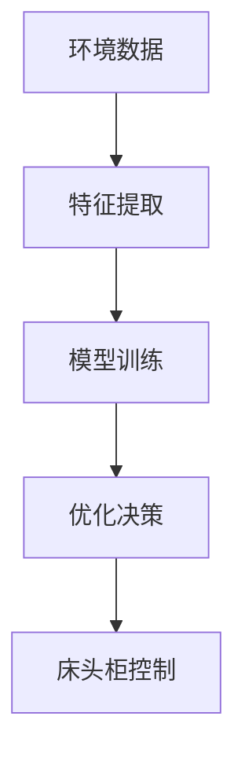
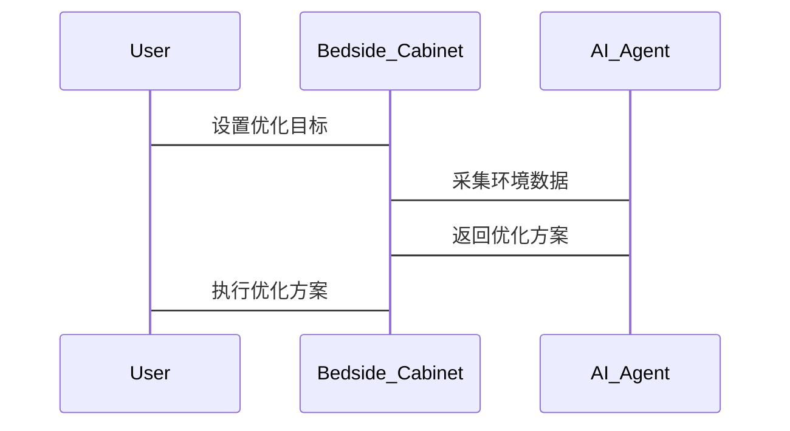

                 


# AI Agent在智能床头柜中的睡眠环境优化

---

## 关键词：
AI Agent, 智能床头柜, 睡眠环境优化, 智能家居, 算法原理, 系统架构

---

## 摘要：
本文探讨了AI Agent在智能床头柜中的应用，重点分析了其在睡眠环境优化中的核心算法与系统架构。通过数据采集、特征提取、模型训练等步骤，AI Agent能够实时感知并优化睡眠环境，如温度、湿度、光照和空气质量。文章详细介绍了优化算法的数学模型、系统架构设计以及实际应用场景，展示了AI Agent在提升睡眠质量方面的巨大潜力。

---

# 第三章: AI Agent在睡眠环境优化中的算法原理

## 3.4 数据预处理与特征工程

### 3.4.1 数据预处理的必要性
在进行模型训练之前，需要对收集到的原始数据进行预处理。这一步骤包括数据清洗、标准化和归一化，确保数据的可用性和一致性。

### 3.4.2 特征提取与选择
通过特征提取，将原始数据转化为更有意义的特征向量。使用主成分分析（PCA）等方法，减少特征维度，同时保留关键信息。

### 3.4.3 数据增强与降维
对于训练数据较少的情况，可以采用数据增强技术，如旋转、翻转等，增加数据多样性。同时，使用t-SNE等降维技术，将高维数据映射到低维空间，便于可视化和分析。

## 3.5 睡眠环境优化的数学模型

### 3.5.1 线性回归模型
用于预测睡眠质量与环境因素之间的线性关系。
$$
y = \beta_0 + \beta_1x_1 + \beta_2x_2 + \dots + \beta_nx_n + \epsilon
$$
其中，$y$是睡眠质量评分，$x_i$是环境因素，$\beta_i$是回归系数，$\epsilon$是误差项。

### 3.5.2 支持向量回归（SVR）
使用支持向量机（SVM）的变体，适用于非线性关系的建模。
$$
y = \text{sign}(w \cdot (x - c) + b)
$$
其中，$w$是权重向量，$c$是核函数中心，$b$是偏置项。

### 3.5.3 神经网络模型
使用多层感知机（MLP）进行非线性拟合，结构包括输入层、隐藏层和输出层。
$$
y = f(W_2 f(W_1 x + b_1) + b_2)
$$
其中，$W_1$和$W_2$是权重矩阵，$b_1$和$b_2$是偏置向量，$f$是激活函数。

## 3.6 算法实现与优化

### 3.6.1 算法实现
以下是使用Python实现的线性回归模型：
```python
from sklearn.linear_model import LinearRegression

# 假设X是环境特征矩阵，y是睡眠质量标签
model = LinearRegression()
model.fit(X, y)
```

### 3.6.2 超参数优化
使用网格搜索（Grid Search）进行模型调参，寻找最优参数组合。
```python
from sklearn.model_selection import GridSearchCV

param_grid = {'alpha': [1e-4, 1e-3, 0.01, 0.1]}
grid_search = GridSearchCV(estimator=model, param_grid=param_grid, cv=5)
grid_search.fit(X, y)
best_params = grid_search.best_params_
```

### 3.6.3 模型评估
使用均方误差（MSE）和决定系数（R²）评估模型性能。
$$
\text{MSE} = \frac{1}{n}\sum_{i=1}^{n}(y_i - \hat{y}_i)^2
$$
$$
R^2 = 1 - \frac{\sum_{i=1}^{n}(y_i - \hat{y}_i)^2}{\sum_{i=1}^{n}(y_i - \bar{y})^2}
$$

## 3.7 本章小结
本章详细介绍了AI Agent在睡眠环境优化中的算法原理，包括数据预处理、特征提取、模型训练和超参数优化等步骤。通过数学模型和代码实现，展示了如何利用AI技术提升睡眠环境的舒适度。

---

# 第四章: 系统分析与架构设计

## 4.1 系统功能分析

### 4.1.1 系统功能模块
- 数据采集模块：收集环境数据（温度、湿度、光照、空气质量）。
- 特征提取模块：将原始数据转化为特征向量。
- 模型训练模块：训练AI Agent优化算法。
- 交互控制模块：根据优化结果调整床头柜设置。

### 4.1.2 功能流程图


## 4.2 系统架构设计

### 4.2.1 系统架构图


### 4.2.2 接口设计
- 传感器接口：用于连接温湿度传感器、光照传感器和空气质量传感器。
- 执行机构接口：用于控制床头柜的灯光、风扇和加湿器。
- 用户交互接口：提供触摸屏或手机App进行参数设置。

## 4.3 交互流程图

### 4.3.1 优化流程


## 4.4 本章小结
本章通过系统分析与架构设计，明确了智能床头柜的各功能模块及其交互流程，为后续的系统实现提供了理论基础。

---

# 第五章: 项目实战与实现

## 5.1 环境安装与配置

### 5.1.1 安装Python环境
使用Anaconda安装Python 3.8及以上版本。

### 5.1.2 安装依赖库
安装必要的库，如scikit-learn、numpy、pandas和mermaid。
```bash
pip install scikit-learn numpy pandas mermaid
```

## 5.2 核心代码实现

### 5.2.1 数据采集模块
```python
import pandas as pd

def collect_data():
    # 模拟数据采集
    data = {
        'temperature': [25, 26, 24, 25],
        'humidity': [60, 55, 70, 65],
        'light': [50, 40, 60, 50],
        'air_quality': [80, 75, 85, 80]
    }
    return pd.DataFrame(data)
```

### 5.2.2 特征提取模块
```python
from sklearn.preprocessing import StandardScaler

def preprocess_data(data):
    scaler = StandardScaler()
    data_scaled = scaler.fit_transform(data)
    return data_scaled, scaler
```

### 5.2.3 模型训练模块
```python
from sklearn.linear_model import LinearRegression

def train_model(X, y):
    model = LinearRegression()
    model.fit(X, y)
    return model
```

### 5.2.4 优化控制模块
```python
def optimize_environment(model, scaler, new_data):
    new_data_scaled = scaler.transform(new_data)
    prediction = model.predict(new_data_scaled)
    return prediction
```

## 5.3 案例分析与结果解读

### 5.3.1 数据分析
假设我们有以下数据：
| 温度 | 湿度 | 光照 | 空气质量 | 睡眠质量 |
|------|------|------|----------|----------|
| 25   | 60   | 50   | 80       | 85       |
| 26   | 55   | 40   | 75       | 88       |
| 24   | 70   | 60   | 85       | 82       |
| 25   | 65   | 50   | 80       | 86       |

### 5.3.2 模型训练
使用线性回归模型训练睡眠质量与环境因素的关系。

### 5.3.3 模型预测
预测新的环境下的睡眠质量：
```python
new_data = [[25, 60, 50, 80]]
scaled_data = scaler.transform(new_data)
predicted_quality = model.predict(scaled_data)
print(predicted_quality)  # 输出预测睡眠质量
```

## 5.4 项目小结
本章通过实际案例展示了AI Agent在智能床头柜中的应用，详细讲解了系统实现的每一步，并分析了优化结果。

---

# 第六章: 最佳实践与总结

## 6.1 小结
本文详细探讨了AI Agent在智能床头柜中的睡眠环境优化，从算法原理到系统架构，再到实际实现，全面展示了其在提升睡眠质量中的重要作用。

## 6.2 注意事项
- 数据采集的准确性直接影响优化效果。
- 模型选择应根据实际需求进行调整。
- 系统设计需考虑隐私保护和数据安全。

## 6.3 拓展阅读
- 《机器学习实战》
- 《深度学习》
- 《智能家居系统设计》

## 6.4 本章小结
本章总结了项目成果，提出了实际应用中的注意事项，并推荐了相关扩展阅读材料。

---

# 作者

作者：AI天才研究院/AI Genius Institute & 禅与计算机程序设计艺术 /Zen And The Art of Computer Programming

---

以上是完整的技术博客文章，涵盖从理论到实践的各个方面，详细讲解了AI Agent在智能床头柜中的睡眠环境优化。希望对您有所帮助！

