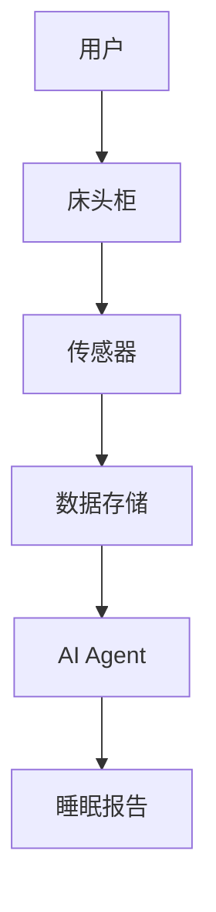
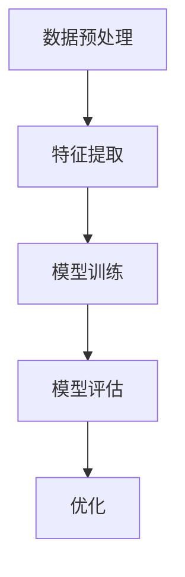
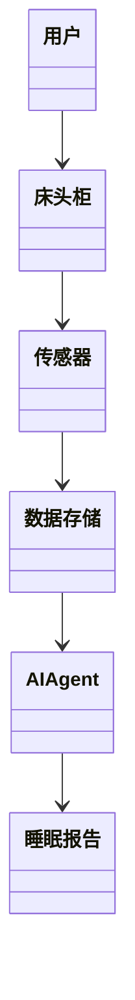
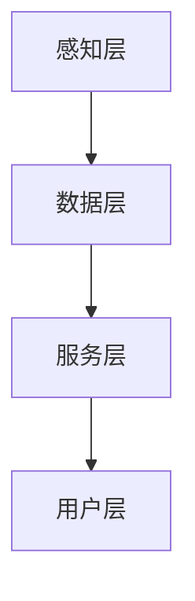

                 


# AI Agent在智能床头柜中的睡眠质量报告

**关键词**：AI Agent, 智能床头柜, 睡眠质量报告, 机器学习, 物联网, 健康监测

**摘要**：本文探讨AI Agent在智能床头柜中的应用，详细分析其如何通过感知、决策和执行层来生成睡眠质量报告。结合算法原理、系统架构和实际案例，展示AI技术如何提升睡眠健康管理。

---

## 第一部分：AI Agent在智能床头柜中的睡眠质量报告

### 第1章：背景介绍

#### 1.1 AI Agent的基本概念
- **1.1.1 什么是AI Agent**：AI Agent是智能主体，能感知环境并采取行动以实现目标。
- **1.1.2 AI Agent的核心功能**：感知、决策、执行。
- **1.1.3 AI Agent与传统软件的区别**：具备自主性、反应性和主动性。

#### 1.2 智能床头柜的功能与应用场景
- **1.2.1 智能床头柜的定义**：整合AI技术，监测睡眠数据，提供个性化建议。
- **1.2.2 智能床头柜的主要功能**：数据采集、分析、报告生成。
- **1.2.3 睡眠质量报告的意义**：帮助用户改善睡眠，预防健康问题。

#### 1.3 睡眠质量报告的核心要素
- **1.3.1 睡眠周期的定义**：浅睡、深睡、REM阶段。
- **1.3.2 影响睡眠质量的因素**：环境、健康状况、生活习惯。
- **1.3.3 睡眠质量报告的指标体系**：持续时间、深度、效率。

### 第2章：AI Agent的核心概念与联系

#### 2.1 AI Agent的原理与实现
- **2.1.1 AI Agent的感知层**：收集数据（如心率、体温）。
- **2.1.2 AI Agent的决策层**：分析数据，生成报告。
- **2.1.3 AI Agent的执行层**：调整环境（如亮度、温度）。

#### 2.2 AI Agent与智能床头柜的关系
- **2.2.1 AI Agent在智能床头柜中的角色**：数据处理与决策。
- **2.2.2 智能床头柜的数据输入与输出**：传感器输入，报告输出。
- **2.2.3 AI Agent与睡眠质量报告的交互流程**：数据收集、分析、反馈。

#### 2.3 AI Agent的核心概念对比（表格）
| 类型       | 描述                          | 示例                   |
|------------|-------------------------------|------------------------|
| 基于规则   | 预定义规则                   | 时间表提醒             |
| 基于知识   | 使用知识库                   | 天气预报               |
| 基于学习   | 从数据中学习                 | 个性化推荐             |

#### 2.4 实体关系图（Mermaid）


### 第3章：算法原理讲解

#### 3.1 睡眠质量评估的算法选择
- **3.1.1 基于机器学习的睡眠质量评估**：监督学习，分类问题。
- **3.1.2 基于深度学习的睡眠质量预测**：神经网络，处理复杂数据。
- **3.1.3 算法的优缺点对比**：机器学习简单，深度学习更准确。

#### 3.2 算法实现的详细步骤
- **3.2.1 数据预处理**：清洗、归一化。
- **3.2.2 模型训练**：训练分类器，如随机森林。
- **3.2.3 模型评估与优化**：准确率、召回率，调整参数。

#### 3.3 算法的数学模型与公式
- **线性回归模型**：$$ y = \beta_0 + \beta_1x_1 + \beta_2x_2 + ... + \beta_nx_n $$
- **神经网络模型**：$$ y = \text{softmax}(Wx + b) $$

#### 3.4 算法流程图（Mermaid）


### 第4章：系统分析与架构设计方案

#### 4.1 问题场景介绍
- **4.1.1 用户需求分析**：用户希望改善睡眠质量。
- **4.1.2 系统功能目标**：监测睡眠，生成报告。
- **4.1.3 边界与外延**：床头柜与外部系统（如手机App）的交互。

#### 4.2 系统功能设计
- **4.2.1 领域模型（Mermaid类图）**


#### 4.3 系统架构设计
- **4.3.1 分层架构**：感知层、数据层、服务层、用户层。
- **4.3.2 组件图（Mermaid）**


#### 4.4 系统接口设计
- **4.4.1 接口定义**：REST API，如`/api/sleep/data`。
- **4.4.2 交互流程（Mermaid序列图）**
```mermaid
sequenceDiagram
    用户 ->+> 床头柜: 查询睡眠报告
    床头柜 ->+> 传感器: 获取数据
    传感器 ->+> 数据存储: 存储数据
    数据存储 ->+> AI Agent: 分析数据
    AI Agent ->+> 睡眠报告: 生成报告
    睡眠报告 ->+> 用户: 返回报告
```

### 第5章：项目实战

#### 5.1 环境安装
- **5.1.1 安装Python和必要的库**：如TensorFlow、Scikit-learn。
- **5.1.2 安装床头柜硬件**：传感器、通信模块。

#### 5.2 核心代码实现
- **数据预处理**：清洗和归一化。
- **模型训练**：使用随机森林分类器。
- **代码示例**：
```python
from sklearn.ensemble import RandomForestClassifier
from sklearn.model_selection import train_test_split
import pandas as pd

# 加载数据
data = pd.read_csv('sleep_data.csv')
X = data.drop('quality', axis=1)
y = data['quality']

# 划分训练集和测试集
X_train, X_test, y_train, y_test = train_test_split(X, y, test_size=0.2)

# 训练模型
model = RandomForestClassifier()
model.fit(X_train, y_train)

# 评估模型
score = model.score(X_test, y_test)
print(f'模型准确率：{score}')
```

#### 5.3 实际案例分析
- **数据收集**：收集多天睡眠数据。
- **模型训练**：训练睡眠质量分类器。
- **结果分析**：评估模型性能，调整参数。

#### 5.4 项目总结
- **项目小结**：成功实现睡眠质量报告。
- **经验与教训**：数据质量影响模型性能。

### 第6章：最佳实践

#### 6.1 小结
- AI Agent在智能床头柜中的应用前景广阔。
- 技术实现需要多学科知识结合。

#### 6.2 注意事项
- 数据隐私保护。
- 系统稳定性和安全性。

#### 6.3 拓展阅读
- 推荐书籍：《机器学习实战》、《物联网开发入门》。
- 建议学习：深度学习、实时数据处理。

---

**作者**：AI天才研究院 & 禅与计算机程序设计艺术

