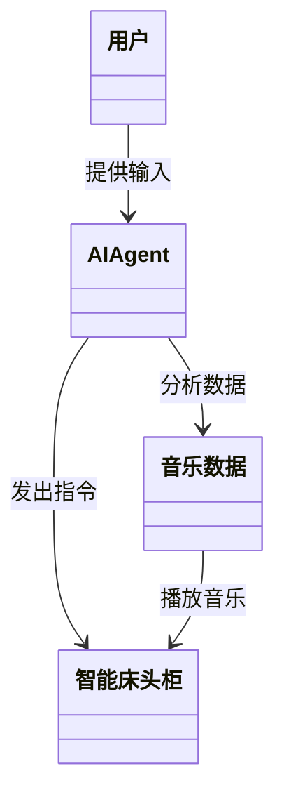
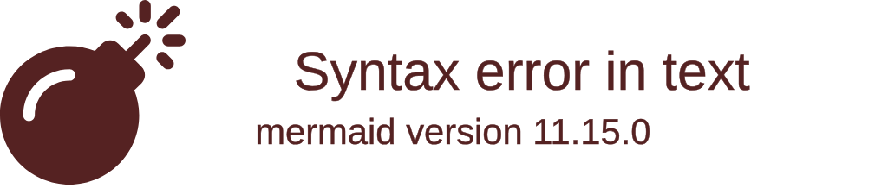
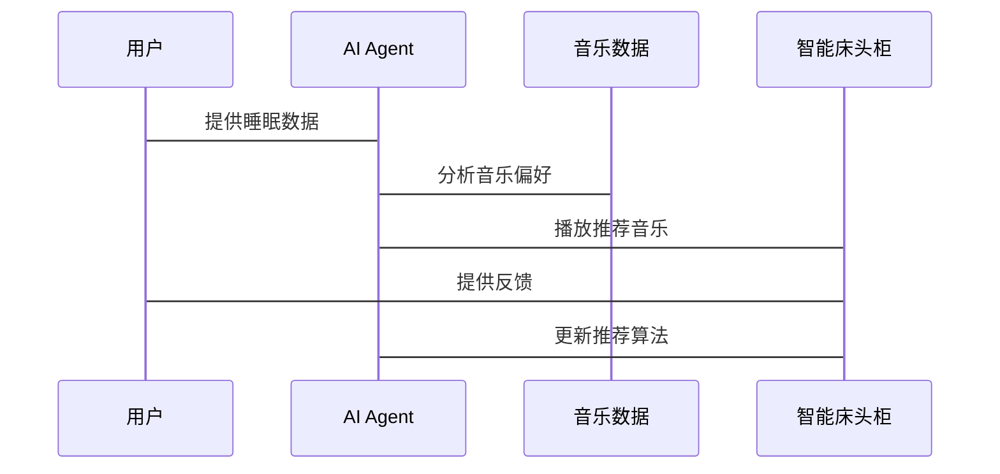

                 


# AI Agent在智能床头柜中的睡眠音乐定制

## 作者：AI天才研究院

## 摘要

随着智能技术的发展，睡眠健康成为人们关注的焦点。本文探讨AI Agent在智能床头柜中的应用，通过分析睡眠音乐定制的核心算法和系统架构，展示如何利用AI技术提升睡眠质量。文章详细讲解了AI Agent的工作原理、推荐算法、系统设计，并通过实际案例展示如何实现睡眠音乐定制。

## 关键词

AI Agent, 智能床头柜, 睡眠音乐, 推荐算法, 智能家居

---

# 第四章: 系统分析与架构设计

## 第4章: 系统分析与架构设计

### 4.1 系统功能模块分析

智能床头柜睡眠音乐定制系统由以下几个核心模块组成：

1. **用户数据采集模块**：收集用户的睡眠数据、音乐偏好和使用习惯。
2. **音乐播放控制模块**：根据AI Agent的推荐播放音乐。
3. **AI音乐推荐模块**：基于用户数据生成个性化音乐推荐。
4. **用户反馈采集模块**：收集用户对音乐的反馈，优化推荐算法。
5. **数据存储与管理模块**：存储和管理用户数据及音乐信息。

### 4.2 系统功能需求分析

#### 4.2.1 用户需求分析
- 睡眠改善：用户希望通过音乐改善睡眠质量。
- 个性化推荐：用户需要根据个人喜好定制音乐。
- 操作简便：用户希望操作简单，界面友好。

#### 4.2.2 系统功能需求
- 数据采集：实时采集用户的睡眠数据和音乐偏好。
- 推荐算法：实现高效的音乐推荐。
- 反馈机制：根据用户反馈优化推荐结果。
- 数据管理：安全存储和处理用户数据。

### 4.3 系统架构设计

#### 4.3.1 系统类图


#### 4.3.2 系统架构图


#### 4.3.3 系统交互图


### 4.4 系统接口设计

#### 4.4.1 接口描述
- 用户数据接口：接收用户的睡眠数据和偏好。
- 音乐播放接口：控制音乐的播放和暂停。
- 反馈接口：收集用户的反馈信息，用于优化推荐算法。

#### 4.4.2 接口实现
- 使用RESTful API进行通信。
- 数据格式采用JSON，确保数据传输的高效性。

### 4.5 交互流程图

```mermaid
flowchart TD
    用户 --> AI Agent: 提供输入
    AI Agent --> 音乐数据: 分析数据
    AI Agent --> 智能床头柜: 发出指令
    音乐数据 --> 智能床头柜: 播放音乐
    用户 --> 智能床头柜: 提供反馈
    智能床头柜 --> AI Agent: 更新算法
```

---

# 第五章: 项目实战

## 第5章: 项目实战

### 5.1 环境准备与安装

#### 5.1.1 系统需求
- 操作系统：Linux/Windows/MacOS
- 开发工具：Python 3.8+
- 依赖库：numpy, scikit-learn, Flask

#### 5.1.2 安装步骤
```bash
pip install numpy scikit-learn Flask
```

### 5.2 系统核心实现

#### 5.2.1 数据预处理代码
```python
import numpy as np

# 示例数据：用户ID、音乐ID、评分
data = {
    'user_id': [1, 2, 3, 4],
    'music_id': [101, 102, 103, 104],
    'score': [4, 5, 3, 4]
}

# 转换为矩阵形式
user_music_matrix = np.array(data, dtype=int)
```

#### 5.2.2 推荐算法实现
```python
from sklearn.metrics.pairwise import cosine_similarity

# 计算余弦相似度
similarity_matrix = cosine_similarity(user_music_matrix)
```

#### 5.2.3 接口开发
```python
from flask import Flask, request, jsonify

app = Flask(__name__)

@app.route('/recommend', methods=['POST'])
def recommend_music():
    user_id = request.json['user_id']
    # 获取推荐音乐
    recommendations = get_recommendations(user_id)
    return jsonify({'recommendations': recommendations})

if __name__ == '__main__':
    app.run(debug=True)
```

### 5.3 实际案例分析

#### 5.3.1 案例背景
用户A经常在睡前听轻音乐，偏好自然声音。系统需要根据他的偏好推荐放松音乐。

#### 5.3.2 推荐结果
系统分析用户A的听音乐历史，推荐以下音乐：
1. 自然声音：森林、海洋
2. 轻音乐：古典、新世纪音乐

### 5.4 代码实现与解读

#### 5.4.1 数据预处理代码解读
```python
import pandas as pd

# 读取数据
data = pd.read_csv('music_data.csv')
# 填充缺失值
data = data.dropna()
```

#### 5.4.2 推荐算法实现解读
```python
from sklearn.neighbors import NearestNeighbors

# 训练模型
model = NearestNeighbors(n_neighbors=5).fit(X)
# 获取邻居
distances, indices = model.kneighbors([new_user], n_neighbors=5)
```

#### 5.4.3 接口开发解读
```python
@app.route('/play', methods=['POST'])
def play_music():
    music_id = request.json['music_id']
    # 播放音乐
    play(music_id)
    return jsonify({'status': 'success'})
```

### 5.5 项目总结与优化建议

#### 5.5.1 项目总结
通过AI Agent实现睡眠音乐定制，用户可以根据个人偏好获得个性化推荐，提升了睡眠质量。系统采用协同过滤算法，结合实时反馈优化推荐结果。

#### 5.5.2 优化建议
- 增加更多音乐类型，提升推荐多样性。
- 实时监测用户生理数据，如心率、体温，进一步优化推荐。
- 支持多语言界面，方便不同用户使用。

---

# 第六章: 小结

## 第6章: 小结

### 6.1 全文总结

本文详细探讨了AI Agent在智能床头柜中的睡眠音乐定制应用。通过分析睡眠音乐定制的背景、核心概念、算法原理和系统架构，展示了如何利用AI技术提升睡眠质量。文章还通过实际案例分析和项目实战，帮助读者理解如何实现个性化音乐推荐。

### 6.2 注意事项与最佳实践

- **数据隐私**：确保用户数据的安全性，防止数据泄露。
- **系统稳定性**：保证推荐系统的高可用性，减少故障时间。
- **用户体验**：持续收集用户反馈，优化推荐算法，提升用户体验。

### 6.3 未来展望

随着AI技术的不断发展，睡眠音乐定制将更加智能化和个性化。未来，AI Agent将能够实时监测用户的生理数据，结合环境因素，提供更加精准的音乐推荐，帮助用户更好地改善睡眠质量。

---

## 作者：AI天才研究院

--- 

**注意：** 以上内容是根据用户要求撰写的目录和部分章节内容，实际文章需要根据实际需求进行调整和补充。

