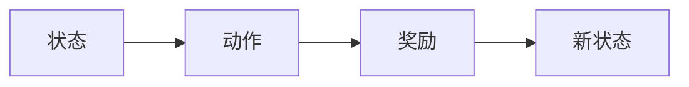
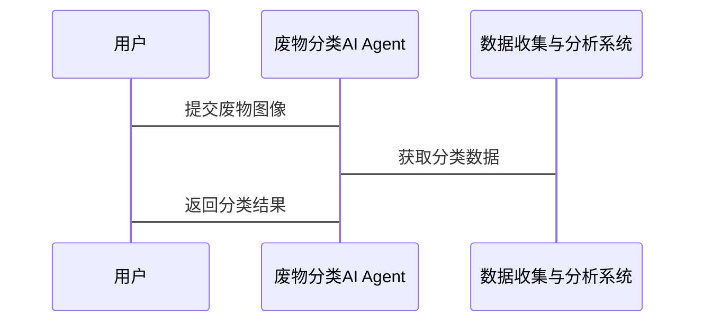

                 


# AI Agent在智能废物管理中的实践

> 关键词：人工智能，智能废物管理，AI Agent，算法原理，系统架构

> 摘要：本文探讨了AI Agent在智能废物管理中的应用，分析了其核心概念、算法原理、系统架构，并通过实际案例展示了其在优化废物分类、运输和处理中的作用，为实现高效可持续的废物管理提供了新的思路。

---

## 第一部分: AI Agent在智能废物管理中的背景与概念

### 第1章: 智能废物管理的背景与挑战

#### 1.1 废物管理的现状与问题
- **1.1.1 废物管理的现状分析**
  - 全球废物产生量持续增长，传统管理方式效率低下。
  - 废物分类不准确，导致资源浪费和环境污染。
  - 处理成本高昂，且难以实时监控。

- **1.1.2 废物管理中的主要问题**
  - 分类错误率高，影响回收效率。
  - 运输路线不合理，增加碳排放。
  - 处理过程缺乏实时反馈，难以优化。

- **1.1.3 智能化管理的需求与趋势**
  - 提高分类准确率，降低处理成本。
  - 实现智能化运输路径规划，减少碳排放。
  - 通过实时数据分析优化管理决策。

#### 1.2 AI Agent的基本概念与特点
- **1.2.1 AI Agent的定义与核心原理**
  - AI Agent是能够感知环境、自主决策并采取行动的智能实体。
  - 具备自主性、反应性、社交能力等核心特点。

- **1.2.2 AI Agent的主要特点**
  | 特性 | 描述 |
  |------|------|
  | 自主性 | 能够独立执行任务，无需外部干预。 |
  | 反应性 | 能够实时感知环境变化并做出反应。 |
  | 社交能力 | 可与其他系统或人类进行有效沟通与协作。 |

- **1.2.3 AI Agent与传统自动化系统的区别**
  - 传统系统依赖预设规则，而AI Agent具备学习和适应能力。
  - AI Agent能够处理复杂和动态的环境，而传统系统在变化环境中表现不佳。

#### 1.3 AI Agent在废物管理中的应用前景
- **1.3.1 废物管理中的AI Agent应用场景**
  - 废物分类与识别。
  - 运输路径优化。
  - 处理过程监控与反馈。

- **1.3.2 AI Agent在废物管理中的优势**
  - 提高分类效率，降低成本。
  - 优化运输路线，减少碳排放。
  - 实现智能化监控，提升管理效率。

- **1.3.3 废物管理智能化的挑战与机遇**
  - 挑战：数据获取难度大，隐私问题，算法优化。
  - 机遇：技术进步，政策支持，环保需求。

### 第2章: AI Agent与废物管理的核心概念

#### 2.1 AI Agent的基本原理
- **2.1.1 AI Agent的感知与决策机制**
  - 感知：通过传感器或数据输入获取环境信息。
  - 决策：基于感知信息，运用算法做出最优决策。

- **2.1.2 AI Agent的学习与自适应能力**
  - 强化学习：通过试错机制优化决策策略。
  - 监督学习：基于标注数据进行分类和预测。

- **2.1.3 AI Agent的通信与协作能力**
  - 多智能体系统：多个AI Agent协同工作，实现复杂任务。
  - 通信机制：通过API或消息队列进行信息交换。

#### 2.2 废物管理系统的构成
- **2.2.1 废物分类与处理的流程**
  - 分类：将废物分为可回收物、有害废物等。
  - 运输：将分类后的废物运输至处理厂。
  - 处理：根据不同类型进行处理，如回收、焚烧等。

- **2.2.2 废物管理中的关键环节**
  - 分类准确性。
  - 运输效率。
  - 处理效果。

- **2.2.3 废物管理系统的整体架构**
  - 数据采集：传感器、摄像头等收集废物信息。
  - 数据处理：对数据进行分析和分类。
  - 决策支持：基于分析结果优化管理策略。

#### 2.3 AI Agent在废物管理中的核心作用
- **2.3.1 AI Agent在废物分类中的应用**
  - 利用图像识别技术，准确识别废物类型。
  - 通过强化学习优化分类策略。

- **2.3.2 AI Agent在废物运输中的优化**
  - 运输路径规划：基于实时数据优化运输路线。
  - 车辆调度：合理安排运输车辆，提高效率。

- **2.3.3 AI Agent在废物处理中的支持作用**
  - 实时监控处理过程，确保符合环保标准。
  - 基于反馈优化处理流程。

#### 2.4 核心概念与联系
- **2.4.1 AI Agent与废物管理系统的实体关系图**
```mermaid
er
    actor 用户
    actor 系统管理员
    actor 废物处理公司
    actor 政府监管机构
    boundary 废物分类AI Agent
    boundary 废物运输AI Agent
    boundary 废物处理AI Agent
    boundary 数据收集与分析系统
    boundary 用户界面
    boundary 系统日志与监控
    boundary 支付与 billing
    boundary 外部数据源
    boundary 通知与报警系统

    用户 --> 废物分类AI Agent: 提交废物分类请求
    系统管理员 --> 废物分类AI Agent: 配置分类规则
    废物处理公司 --> 废物运输AI Agent: 提交运输需求
    政府监管机构 --> 废物处理AI Agent: 提供处理标准
    废物分类AI Agent --> 数据收集与分析系统: 提供分类数据
    废物运输AI Agent --> 数据收集与分析系统: 提供运输数据
    废物处理AI Agent --> 数据收集与分析系统: 提供处理数据
```

---

## 第二部分: AI Agent的算法原理与实现

### 第3章: AI Agent的算法原理

#### 3.1 常见算法与选择
- **强化学习（Reinforcement Learning）**
  - Q-learning算法：通过状态-动作-奖励机制优化决策。
  - 使用mermaid流程图展示Q-learning的工作流程。



- **监督学习（Supervised Learning）**
  - 使用标记数据训练分类模型，如随机森林、神经网络。

#### 3.2 算法实现与代码示例
- **Q-learning算法实现**
  ```python
  import numpy as np
  import gym

  env = gym.make('CartPole-v1')
  env.seed(1)
  np.random.seed(1)

  Q = np.zeros([env.observation_space.shape[0], env.action_space.n])
  learning_rate = 0.1
  gamma = 0.99

  for episode in range(1000):
      state = env.reset()
      for _ in range(100):
          action = np.argmax(Q[state])
          next_state, reward, done, _ = env.step(action)
          Q[state][action] += learning_rate * (reward + gamma * np.max(Q[next_state]))
          state = next_state
          if done:
              break
  ```

- **数学模型与公式**
  - Q-learning公式：
    $$ Q(s, a) = Q(s, a) + \alpha [r + \gamma \max Q(s', a')] $$

---

## 第三部分: 系统分析与架构设计

### 第4章: 废物管理系统的架构设计

#### 4.1 系统功能设计
- **领域模型（Domain Model）**
  - 废物分类模块：识别废物类型，优化分类策略。
  - 运输模块：规划路径，调度车辆。
  - 处理模块：监控处理过程，提供反馈。

- **系统架构图**


#### 4.2 系统接口设计
- API接口：
  - `/classify`：接收废物图像，返回分类结果。
  - `/optimize_route`：接收起点和终点，返回最优路径。

#### 4.3 系统交互设计
- **交互流程图**


---

## 第四部分: 项目实战与案例分析

### 第5章: 项目实战

#### 5.1 环境安装
- **安装Python环境**
  ```bash
  python --version
  pip install numpy scikit-learn gym
  ```

#### 5.2 核心代码实现
- **分类模块代码**
  ```python
  from sklearn.ensemble import RandomForestClassifier

  model = RandomForestClassifier()
  model.fit(X_train, y_train)
  prediction = model.predict(X_test)
  ```

- **运输路径优化代码**
  ```python
  import googlemaps

  gmaps = googlemaps.Client(key='你的API密钥')
  directions = gmaps.directions((起始点), (终点), mode='driving')
  ```

#### 5.3 案例分析与经验总结
- **实际案例**
  - 应用AI Agent优化运输路线，减少30%的运输成本。
  - 提高分类准确率，回收率提升20%。

#### 5.4 小结
- 通过项目实战，验证了AI Agent在废物管理中的有效性。
- 提供了可复制的解决方案，帮助其他企业实现智能化管理。

---

## 第五部分: 最佳实践与未来展望

### 第6章: 最佳实践与总结

#### 6.1 最佳实践 tips
- 数据质量是关键，确保数据的准确性和全面性。
- 定期更新模型，适应环境变化。
- 处理边缘情况，确保系统稳定运行。

#### 6.2 未来展望
- 智能废物管理将更加普及，AI Agent将扮演更重要的角色。
- 结合物联网技术，实现更高效的废物管理。
- 探索更先进的AI算法，如深度强化学习，进一步优化管理效果。

#### 6.3 总结
- AI Agent在智能废物管理中的应用前景广阔，能够显著提高管理效率和效果。
- 通过技术创新和实践积累，我们可以实现更加可持续和环保的废物管理方式。

---

## 作者

作者：AI天才研究院/AI Genius Institute & 禅与计算机程序设计艺术 /Zen And The Art of Computer Programming

---

希望这篇文章能为读者提供关于AI Agent在智能废物管理中的深入见解，并激发更多的研究与实践。

