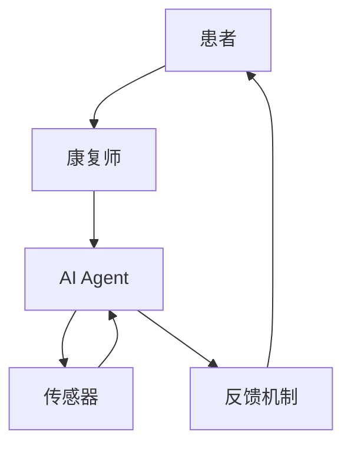
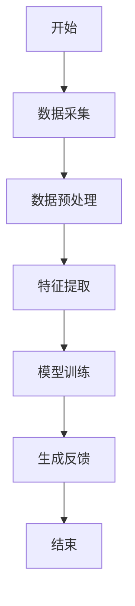
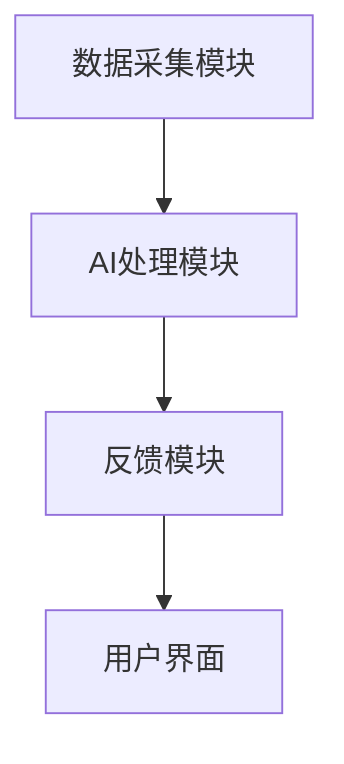
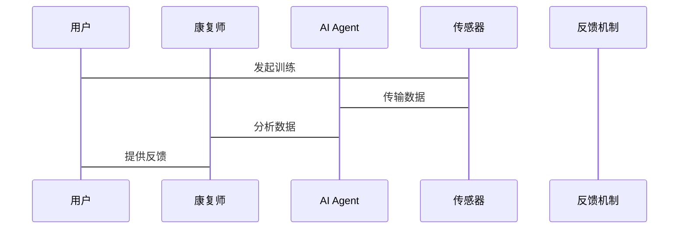

                 


# AI Agent在智能手套中的手部康复训练

## 关键词：AI Agent，智能手套，手部康复，康复训练，机器学习

## 摘要：本文探讨AI Agent在智能手套中的应用，特别是在手部康复训练中的作用。通过分析系统架构、算法原理和实际案例，详细讲解如何利用AI技术提升康复效果，实现个性化、高效的康复方案。

---

## 第一部分：背景介绍

### 第1章：问题背景与描述

#### 1.1 手部康复的重要性
- 1.1.1 手部功能在日常生活中的作用：手部是人类完成精细动作的关键部位，影响生活质量。
- 1.1.2 康复训练的传统方法及其局限性：传统康复依赖人工指导，缺乏个性化和实时反馈，效果有限。

#### 1.2 问题描述
- 1.2.1 手部康复训练的主要挑战：患者依从性低，康复进度难以量化，传统方法效率低。
- 1.2.2 患者在康复过程中的常见问题：动作不规范，容易受伤，缺乏及时反馈。

#### 1.3 问题解决
- 1.3.1 AI Agent在智能手套中的应用优势：实时反馈，个性化训练计划，提高患者参与度。
- 1.3.2 智能手套如何提升康复效果：通过传感器和AI算法，提供精准指导和反馈。

#### 1.4 系统边界与外延
- 1.4.1 系统的功能范围：数据采集、分析、反馈。
- 1.4.2 系统的扩展可能性：集成更多传感器，连接云平台。

#### 1.5 概念结构与核心要素
- 1.5.1 核心组成部分：传感器、AI算法、反馈机制。
- 1.5.2 系统的输入、处理和输出流程：数据采集 → AI处理 → 反馈用户。

---

## 第二部分：核心概念与联系

### 第2章：AI Agent的原理与特征

#### 2.1 AI Agent的基本原理
- 2.1.1 感知、决策、执行的三阶段模型：
  - **感知**：通过传感器收集数据。
  - **决策**：AI算法分析数据，制定康复计划。
  - **执行**：通过反馈机制指导用户完成动作。

#### 2.2 核心特征对比
- 2.2.1 与传统康复训练的对比表格：

| 特性             | 传统康复训练         | AI Agent辅助训练         |
|------------------|--------------------|--------------------------|
| **效果评估**     | 依赖康复师经验       | 实时数据驱动，精准评估   |
| **个性化**       | 基于经验，可能缺乏针对性 | 完全个性化，动态调整     |
| **实时性**       | 反馈延迟             | 实时反馈，即时指导       |

#### 2.3 实体关系图


---

## 第三部分：算法原理讲解

### 第3章：AI Agent的算法流程

#### 3.1 算法流程图


#### 3.2 算法实现
```python
# 示例代码：基于运动数据的分类算法
import numpy as np
from sklearn.svm import SVC

# 假设X为训练数据，y为标签
X = np.array([[1, 2], [3, 4], [5, 6], [7, 8]])
y = np.array([0, 1, 0, 1])

# 训练模型
model = SVC()
model.fit(X, y)

# 预测新数据
new_data = np.array([[9, 10]])
print("预测结果：", model.predict(new_data))
```

#### 3.3 数学模型
- 马尔可夫链用于预测康复进度：
  $$ P(状态转移) = \text{基于历史数据的概率矩阵} $$
- 强化学习优化训练计划：
  $$ Q-learning：Q(s, a) = r + \gamma \max Q(s', a') $$

---

## 第四部分：系统分析与架构设计方案

### 第4章：系统架构设计

#### 4.1 系统功能设计
- 模块化设计：数据采集模块、AI处理模块、反馈模块。

#### 4.2 系统架构图


#### 4.3 系统接口设计
- 传感器接口：连接手套传感器，获取数据。
- 用户界面接口：显示反馈和训练计划。

#### 4.4 系统交互序列图


---

## 第五部分：项目实战

### 第5章：环境搭建与核心代码实现

#### 5.1 环境搭建
- 安装必要的库：Python、NumPy、Scikit-learn、Mermaid。

#### 5.2 核心代码实现
```python
# 示例代码：传感器数据处理
import numpy as np

# 传感器数据
data = np.array([[10, 20, 30], [40, 50, 60]])

# 数据预处理
def preprocess(data):
    return data / np.max(data)

processed_data = preprocess(data)
print("处理后的数据：", processed_data)
```

#### 5.3 项目小结
- 代码实现的关键点：数据预处理、模型训练、反馈生成。
- 项目的价值：提高康复效率，增强患者参与度。

---

## 第六部分：最佳实践、小结、注意事项和拓展阅读

### 第6章：最佳实践

#### 6.1 小结
- AI Agent在智能手套中的应用显著提升了康复效果。
- 系统设计的关键在于模块化和实时反馈。

#### 6.2 注意事项
- 数据隐私保护：确保患者数据的安全。
- 系统维护：定期更新算法，优化性能。

#### 6.3 拓展阅读
- 推荐书籍：《机器学习实战》、《深度学习》。
- 在线资源：推荐学习AI和康复医学的交叉应用。

---

## 作者：AI天才研究院 & 禅与计算机程序设计艺术

---

通过以上大纲，文章系统地介绍了AI Agent在智能手套中的应用，从理论到实践，详细讲解了每个环节，帮助读者全面理解这一技术的潜力和应用价值。

