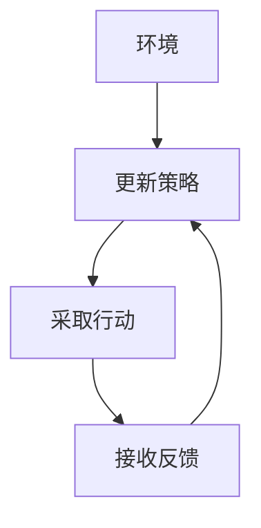
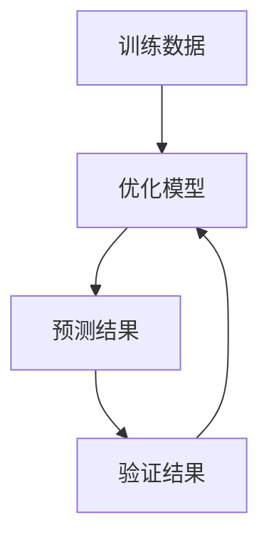
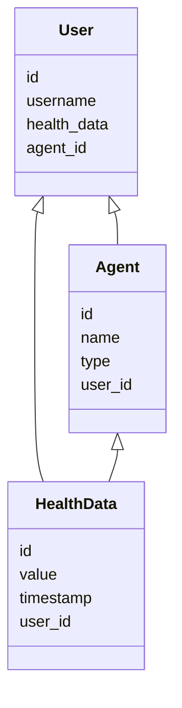

                 


# AI Agent在智能手机中的数字健康管理系统

**关键词：** 数字健康管理、AI Agent、智能手机、健康数据分析、人工智能算法、移动健康监测

**摘要：**  
随着智能手机的普及和人工智能技术的发展，AI Agent（人工智能代理）在数字健康管理中的应用越来越广泛。本文将从AI Agent的基本概念、数字健康管理的需求出发，系统地介绍AI Agent在智能手机中的实现原理、算法设计、系统架构，并通过实际案例分析其在健康数据分析中的应用场景。本文旨在为读者提供一个全面的技术视角，帮助他们理解AI Agent在智能手机数字健康管理中的核心作用及其未来发展趋势。

---

## 第1章 AI Agent与数字健康管理概述

### 1.1 AI Agent的基本概念与背景

#### 1.1.1 AI Agent的定义与特点
AI Agent（人工智能代理）是一种能够感知环境、自主决策并执行任务的智能实体。它能够通过传感器、用户输入或外部数据源获取信息，并基于预设的目标和规则，选择最优行动方案以实现特定任务。AI Agent的核心特点包括：
- **自主性**：无需外部干预即可运行。
- **反应性**：能够实时感知环境变化并做出响应。
- **目标导向**：所有行动均以实现特定目标为导向。
- **学习能力**：通过数据反馈不断优化自身行为。

#### 1.1.2 智能手机中的数字健康管理需求
随着人们对健康的关注日益增加，智能手机成为数字健康管理的核心工具。通过AI Agent，用户可以实现：
- **健康数据的实时监测**：如心率、血压、睡眠质量等。
- **健康行为的智能提醒**：如提醒用户定时锻炼、服药提醒等。
- **健康数据分析与建议**：基于历史数据，提供个性化健康建议。

#### 1.1.3 AI Agent在数字健康管理中的作用
AI Agent通过以下方式在智能手机中实现数字健康管理：
- **数据采集与处理**：实时采集用户的健康数据，并进行初步分析。
- **行为决策**：根据健康数据，判断用户的健康状态并提供相应的建议。
- **用户交互**：通过手机界面与用户交互，实现健康目标的可视化和个性化设置。

---

### 1.2 数字健康管理的背景与目标

#### 1.2.1 数字健康管理的定义
数字健康管理是指通过数字化工具和技术，对个人的健康状况进行监测、分析和管理的过程。它旨在通过数据驱动的方式，帮助用户更好地了解自己的健康状况并采取相应的健康管理措施。

#### 1.2.2 当前数字健康管理的主要挑战
- **数据碎片化**：健康数据分散在不同的设备和平台中，难以统一管理。
- **数据隐私问题**：健康数据的隐私保护需求高，数据泄露风险大。
- **个性化不足**：传统健康管理方式难以实现个性化服务。

#### 1.2.3 AI Agent在数字健康管理中的目标与边界
AI Agent的目标是通过智能化的健康数据分析和行为决策，帮助用户实现个性化的健康管理。其边界包括：
- **数据采集范围**：仅限于智能手机支持的健康监测功能。
- **服务范围**：仅提供健康数据分析和行为建议，不涉及医疗诊断。

---

### 1.3 本书的核心内容与结构

#### 1.3.1 本书的主要章节安排
- **第1章**：介绍AI Agent的基本概念与数字健康管理的需求。
- **第2章**：讲解AI Agent的核心概念与原理。
- **第3章**：详细分析AI Agent的算法原理。
- **第4章**：探讨AI Agent在智能手机中的系统架构设计。
- **第5章**：通过实际案例分析AI Agent在数字健康管理中的应用。
- **第6章**：总结AI Agent在数字健康管理中的最佳实践与未来展望。

#### 1.3.2 本书的核心知识点
- AI Agent的基本原理与实现机制。
- 数字健康管理的需求分析与系统设计。
- AI Agent的算法实现与优化方法。
- 智能手机数字健康管理系统的架构设计。

#### 1.3.3 本书的阅读方法与建议
- 建议读者从基础概念入手，逐步深入学习AI Agent的算法与系统设计。
- 结合实际案例，理解AI Agent在数字健康管理中的具体应用场景。

---

## 第2章 AI Agent的核心概念与联系

### 2.1 AI Agent的原理与机制

#### 2.1.1 AI Agent的基本工作原理
AI Agent的工作流程包括以下步骤：
1. **感知环境**：通过传感器或数据接口获取健康数据。
2. **分析数据**：基于机器学习模型对数据进行分析和预测。
3. **决策制定**：根据分析结果制定行动方案。
4. **执行行动**：通过智能手机界面或第三方服务实现行动。

#### 2.1.2 AI Agent的感知与决策过程
- **感知环境**：AI Agent通过智能手机的传感器获取健康数据（如心率、步数、睡眠质量等）。
- **数据分析**：利用机器学习算法（如强化学习、监督学习）对数据进行分析和预测。
- **决策制定**：基于分析结果，AI Agent会生成相应的健康建议或行为提醒。

#### 2.1.3 AI Agent的执行与反馈机制
- **执行行动**：AI Agent通过智能手机的UI界面提醒用户进行健康行为（如运动提醒、服药提醒）。
- **反馈优化**：根据用户的反馈（如完成情况、偏好调整）优化AI Agent的决策模型。

---

### 2.2 AI Agent的核心概念对比

#### 2.2.1 AI Agent与传统算法的对比
| **特性**       | **AI Agent**          | **传统算法**          |
|----------------|----------------------|-----------------------|
| 自主性         | 高                   | 无                   |
| 决策能力       | 强                   | 无                   |
| 学习能力       | 有                   | 无                   |
| 环境适应性     | 强                   | 弱                   |

#### 2.2.2 AI Agent与规则引擎的对比
| **特性**       | **AI Agent**          | **规则引擎**          |
|----------------|----------------------|-----------------------|
| 决策方式       | 基于机器学习模型     | 基于预设规则          |
| 复杂性         | 高                   | 低                   |
| 可扩展性       | 强                   | 弱                   |

#### 2.2.3 AI Agent与机器学习模型的对比
| **特性**       | **AI Agent**          | **机器学习模型**      |
|----------------|----------------------|-----------------------|
| 自主性         | 高                   | 无                   |
| 任务目标       | 明确                 | 无                   |
| 执行能力       | 强                   | 无                   |

---

### 2.3 AI Agent的ER实体关系图

```mermaid
erDiagram
    user {
        id : integer
        username : string
        health_data : string
        agent_id : integer
    }
    agent {
        id : integer
        name : string
        type : string
        user_id : integer
    }
    health_data {
        id : integer
        value : float
        timestamp : datetime
        user_id : integer
    }
    user}o--{agent : "Has"
    user}o--{health_data : "Has"
    agent}o--{health_data : "Monitors"
```

---

## 第3章 AI Agent的算法原理

### 3.1 强化学习算法

#### 3.1.1 强化学习的基本原理
强化学习是一种通过试错机制优化决策模型的算法。其核心是通过奖励机制，使AI Agent在与环境的交互中逐步优化自己的行为策略。

#### 3.1.2 强化学习的工作流程


#### 3.1.3 强化学习的数学模型
强化学习的核心公式是Q-learning算法：
$$ Q(s, a) = Q(s, a) + \alpha \cdot (r + \gamma \cdot \max Q(s', a') - Q(s, a)) $$
其中：
- $s$ 表示状态。
- $a$ 表示动作。
- $r$ 表示奖励。
- $\gamma$ 表示折扣因子。
- $\alpha$ 表示学习率。

---

### 3.2 监督学习算法

#### 3.2.1 监督学习的基本原理
监督学习是一种通过标记数据训练模型的算法。AI Agent可以通过监督学习模型对健康数据进行分类或回归分析。

#### 3.2.2 监督学习的工作流程


#### 3.2.3 监督学习的数学模型
线性回归模型的数学公式为：
$$ y = \theta_0 x + \theta_1 $$

---

## 第4章 系统分析与架构设计

### 4.1 系统功能设计

#### 4.1.1 领域模型


---

### 4.2 系统架构设计

#### 4.2.1 系统架构图


---

## 第5章 项目实战

### 5.1 环境安装与配置

#### 5.1.1 安装Python环境
- 使用Anaconda或PyCharm安装Python 3.8及以上版本。

#### 5.1.2 安装依赖库
- 安装numpy、pandas、scikit-learn等机器学习库。

---

### 5.2 核心功能实现

#### 5.2.1 强化学习算法实现
```python
import numpy as np

# 初始化Q表
Q = np.zeros((state_space, action_space))

# 定义奖励函数
def reward_function(current_state, action):
    if action == desired_action:
        return 1
    else:
        return 0

# Q-learning算法实现
for episode in range(episodes):
    current_state = get_current_state()
    while not is_terminal_state(current_state):
        action = choose_action(current_state)
        next_state = get_next_state(current_state, action)
        reward = reward_function(current_state, action)
        Q[current_state][action] += alpha * (reward + gamma * np.max(Q[next_state]) - Q[current_state][action])
        current_state = next_state
```

---

### 5.3 实际案例分析

#### 5.3.1 应用场景
- 健康数据监测与分析。
- 健康行为提醒与优化。

---

## 第6章 总结与展望

### 6.1 最佳实践
- 定期更新AI Agent的决策模型。
- 加强数据隐私保护。

### 6.2 未来展望
- AI Agent在数字健康管理中的应用将更加智能化和个性化。

---

## 作者信息
作者：AI天才研究院/AI Genius Institute  
联系邮箱：contact@aigenius.com

