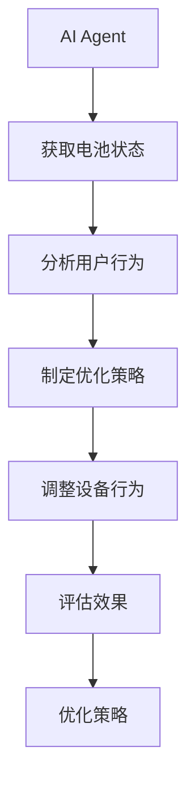
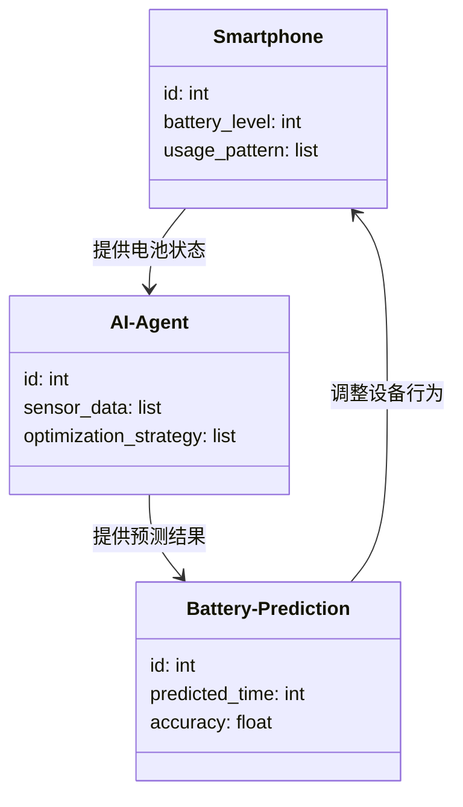

                 


# AI Agent在智能手机中的电池寿命优化系统

> 关键词：AI Agent，智能手机，电池寿命，优化系统，强化学习，自适应算法

> 摘要：本文探讨了如何利用AI Agent技术优化智能手机的电池寿命。通过分析电池消耗的主要因素，提出了一种基于AI Agent的智能电池管理方案，结合强化学习和自适应算法，实现动态调整设备行为，延长电池续航时间，提升用户体验。文章详细介绍了系统架构、算法原理和实际案例，为智能手机的电池优化提供了新的思路。

---

# 第1章: 问题背景与目标

## 1.1 问题背景

### 1.1.1 智能手机电池寿命问题的现状

随着智能手机的普及，电池寿命问题日益凸显。现代智能手机集成了高性能处理器、大屏幕、多摄像头和5G通信等功能，这些功能的运行需要大量电力支持。然而，电池技术的进步速度远不及处理器性能的提升，导致用户频繁充电，影响使用体验。

### 1.1.2 用户对电池续航的需求

用户对智能手机的续航能力有较高期望，尤其是在移动办公、视频娱乐等场景下，长时间的续航能力直接影响用户的满意度。然而，传统电池优化技术在复杂场景下的表现有限，难以满足用户的多样化需求。

### 1.1.3 传统电池优化技术的局限性

传统电池优化技术主要依赖硬件改进和软件省电模式，例如降低屏幕亮度、关闭后台进程等。这些方法在一定程度上可以延长续航时间，但在复杂场景下效果有限，且无法根据用户行为和环境变化动态调整，导致优化效果不佳。

## 1.2 问题描述

### 1.2.1 电池消耗的主要因素

智能手机的电池消耗主要来自以下几个方面：

1. **显示屏**：高分辨率屏幕在亮屏时消耗大量电力。
2. **处理器**：高性能处理器在运行复杂任务时耗电量大。
3. **网络通信**：5G通信和高频数据传输增加了功耗。
4. **用户行为**：用户的使用习惯（如频繁使用摄像头、视频播放等）直接影响电池寿命。

### 1.2.2 不同场景下的电池消耗差异

不同使用场景下的电池消耗差异显著：

- **待机状态**：电池消耗较低。
- **亮屏状态**：电池消耗急剧上升。
- **复杂任务（如游戏、视频通话）**：电池消耗激增。

### 1.2.3 用户行为对电池寿命的影响

用户的使用习惯对电池寿命有直接影响：

- **频繁使用高功耗功能（如短视频、游戏）**会显著缩短电池寿命。
- **设备设置**（如自动亮度、后台进程管理）会影响电池消耗。

## 1.3 问题解决目标

### 1.3.1 提高电池续航能力

通过优化设备的硬件设计和软件算法，延长电池续航时间。

### 1.3.2 实现智能化的电池管理

利用AI技术实时监测电池状态，动态调整设备行为，优化电池使用效率。

### 1.3.3 优化用户体验

在保证续航的前提下，提升设备性能和用户体验，避免因过度优化影响设备的正常使用。

## 1.4 系统边界与外延

### 1.4.1 系统的输入与输出

- **输入**：电池状态数据、用户行为数据、环境数据。
- **输出**：优化策略、电池消耗预测、用户反馈。

### 1.4.2 系统的适用场景与限制

- **适用场景**：智能手机的日常使用场景。
- **限制**：依赖于硬件传感器的准确性，算法的有效性依赖于数据的充分性和代表性。

### 1.4.3 系统与其他组件的交互

- **与硬件的交互**：获取电池状态、设备性能数据。
- **与用户的交互**：实时反馈优化策略，接收用户反馈。

## 1.5 核心概念与组成

### 1.5.1 AI Agent的基本概念

AI Agent是一种具备感知、决策和执行能力的智能体，能够根据环境信息做出最优决策。在电池优化系统中，AI Agent负责实时监测电池状态，分析用户行为和环境数据，制定优化策略。

### 1.5.2 电池寿命优化的核心要素

1. **电池状态监测**：实时获取电池的电压、温度、充电状态等信息。
2. **电池消耗预测**：基于历史数据和当前状态，预测未来的电池消耗情况。
3. **优化策略执行**：根据预测结果动态调整设备行为，优化电池使用效率。

### 1.5.3 系统的整体架构

系统由以下几个部分组成：

1. **数据采集模块**：采集电池状态、用户行为和环境数据。
2. **AI Agent模块**：负责数据处理、状态分析和策略制定。
3. **优化执行模块**：根据优化策略调整设备行为。

---

# 第2章: AI Agent与电池优化的核心概念

## 2.1 AI Agent的基本原理

### 2.1.1 AI Agent的定义与分类

AI Agent可以根据环境信息自主决策并执行动作。在电池优化系统中，AI Agent主要负责数据处理和策略制定。

### 2.1.2 AI Agent的核心功能

- **感知**：通过传感器获取电池状态和用户行为数据。
- **决策**：基于数据制定优化策略。
- **执行**：根据策略调整设备行为。

### 2.1.3 AI Agent与传统算法的区别

传统算法依赖预设规则，无法根据环境变化动态调整。AI Agent具备学习能力，能够通过数据优化策略，适应复杂场景。

## 2.2 电池寿命优化的关键技术

### 2.2.1 电池消耗预测模型

预测模型基于历史数据，结合当前状态，预测未来的电池消耗情况。

### 2.2.2 电池状态监测方法

通过传感器获取电池的电压、温度等参数，评估电池的健康状态和剩余容量。

### 2.2.3 电池优化策略

根据预测结果和设备状态，制定优化策略，动态调整设备行为。

## 2.3 AI Agent在电池优化中的作用

### 2.3.1 AI Agent如何感知电池状态

AI Agent通过传感器获取电池的实时数据，结合历史数据和环境信息，评估电池状态。

### 2.3.2 AI Agent如何制定优化策略

基于电池状态和用户行为，AI Agent利用强化学习和自适应算法，制定最优的优化策略。

### 2.3.3 AI Agent如何实现动态调整

AI Agent根据实时数据动态调整优化策略，确保电池使用效率最大化。

## 2.4 核心概念对比表

| 概念 | 描述 |
|------|------|
| AI Agent | 具备感知、决策和执行能力的智能体 |
| 电池消耗预测 | 基于历史数据预测电池消耗情况 |
| 电池优化策略 | 根据预测结果调整设备行为以延长续航 |

## 2.5 ER实体关系图

```mermaid
erd
    Smartphone: id, battery_level, usage_pattern
    AI-Agent: id, sensor_data, optimization_strategy
    Battery-Prediction: id, predicted_time, accuracy
```

---

# 第3章: AI Agent优化电池寿命的算法原理

## 3.1 算法概述

### 3.1.1 基于强化学习的电池优化

强化学习是一种通过试错学习优化策略的方法。在电池优化中，AI Agent通过不断试验不同的策略，找到最优的电池管理方案。

### 3.1.2 基于自适应算法的电池优化

自适应算法能够根据环境变化自动调整参数，确保优化策略的有效性。

## 3.2 算法原理

### 3.2.1 强化学习算法流程

1. **状态感知**：AI Agent获取电池的实时状态和用户行为数据。
2. **决策制定**：基于当前状态，AI Agent选择最优动作（如降低屏幕亮度、关闭后台进程）。
3. **反馈接收**：根据动作执行后的结果，AI Agent获得奖励或惩罚。
4. **策略优化**：根据反馈调整策略，优化电池使用效率。

### 3.2.2 自适应算法流程

1. **数据采集**：获取电池状态和用户行为数据。
2. **参数调整**：根据数据动态调整优化策略。
3. **效果评估**：评估策略的执行效果，优化算法参数。

## 3.3 算法流程图



## 3.4 核心代码实现

```python
import numpy as np
from collections import deque

class BatteryOptimizer:
    def __init__(self):
        self.battery_level = 100  # 初始电池电量
        self.usage_pattern = []  # 用户行为记录
        self.memory = deque(maxlen=100)  # 记忆模块

    def get_battery_state(self):
        # 获取电池状态
        return self.battery_level

    def predict_consumption(self):
        # 预测电池消耗
        return np.mean(self.usage_pattern) if self.usage_pattern else 0

    def optimize_strategy(self):
        # 制定优化策略
        state = self.get_battery_state()
        prediction = self.predict_consumption()
        if prediction > 90:
            return "降低屏幕亮度"
        elif prediction > 70:
            return "关闭后台进程"
        else:
            return "正常模式"

    def execute_action(self, action):
        # 执行优化动作
        if action == "降低屏幕亮度":
            self.battery_level += 1
        elif action == "关闭后台进程":
            self.battery_level += 2
        else:
            pass

    def evaluate_effect(self):
        # 评估优化效果
        return self.battery_level > 95
```

---

## 3.5 数学模型

### 3.5.1 电池消耗预测模型

$$ \text{预测消耗} = \alpha \times \text{当前电量} + \beta \times \text{用户行为} $$

其中，$\alpha$ 和 $\beta$ 是根据历史数据训练得到的权重参数。

### 3.5.2 优化策略数学表达

$$ \text{优化策略} = \argmax_{\text{策略}} \text{电池寿命} $$

---

## 3.6 算法实现步骤

### 3.6.1 数据采集

1. 采集电池的实时状态数据，包括电压、温度、充电状态等。
2. 采集用户的使用行为数据，包括屏幕使用时间、应用使用频率等。

### 3.6.2 数据处理

1. 对采集到的数据进行清洗和预处理，提取关键特征。
2. 使用特征工程方法，构建适合算法的输入格式。

### 3.6.3 模型训练

1. 使用强化学习算法训练AI Agent，优化策略空间。
2. 使用自适应算法动态调整模型参数，提高预测准确性。

### 3.6.4 策略执行

1. AI Agent根据当前状态和预测结果，制定优化策略。
2. 执行优化动作，调整设备行为。

### 3.6.5 效果评估

1. 评估优化策略的执行效果，计算电池寿命提升率。
2. 根据评估结果，优化算法参数，提高系统性能。

---

# 第4章: 数学模型与算法分析

## 4.1 电池消耗预测模型

### 4.1.1 预测模型的建立

基于历史数据和当前状态，建立电池消耗预测模型：

$$ \text{预测消耗} = \sum_{i=1}^{n} \theta_i \times x_i $$

其中，$\theta_i$ 是特征$x_i$的权重系数。

### 4.1.2 模型训练

使用历史数据训练模型，优化权重系数：

$$ \theta = \argmin \sum_{i=1}^{m} (y_i - \sum_{j=1}^{n} \theta_j x_{ij})^2 $$

其中，$y_i$ 是实际消耗，$x_{ij}$ 是第$j$个特征的第$i$个样本值。

## 4.2 优化策略数学表达

### 4.2.1 优化目标

最大化电池寿命：

$$ \max_{\text{策略}} \text{电池寿命} $$

### 4.2.2 约束条件

满足设备正常使用需求：

$$ \text{设备性能} \geq \text{最低要求} $$

---

## 4.3 算法分析

### 4.3.1 强化学习算法的收敛性

强化学习算法通过不断试验，逐步逼近最优策略。在电池优化中，算法的收敛性取决于奖励函数的设计和策略空间的大小。

### 4.3.2 自适应算法的适应性

自适应算法能够根据环境变化自动调整参数，提高优化效果。在电池优化中，自适应算法能够实时调整优化策略，适应用户行为和环境变化。

---

# 第5章: 系统分析与架构设计

## 5.1 项目背景

随着智能手机的普及，电池寿命问题日益重要。为了提升用户体验，亟需一种智能化的电池管理方案。

## 5.2 系统功能设计

### 5.2.1 领域模型



### 5.2.2 系统架构设计


---

## 5.3 接口设计

### 5.3.1 系统接口

1. **获取电池状态接口**：`get_battery_level()`
2. **预测电池消耗接口**：`predict_consumption()`
3. **制定优化策略接口**：`generate_optimization_strategy()`

### 5.3.2 交互流程

1. **数据采集**：AI Agent获取电池状态和用户行为数据。
2. **策略制定**：AI Agent根据数据制定优化策略。
3. **策略执行**：设备根据优化策略调整行为。
4. **效果反馈**：系统评估优化效果，优化策略。

---

## 5.4 优化策略实现

### 5.4.1 优化策略核心代码

```python
def optimize_strategy(battery_level, usage_pattern):
    if battery_level < 20:
        return "紧急省电模式"
    elif battery_level < 50:
        return "低功耗模式"
    else:
        return "正常模式"
```

---

# 第6章: 项目实战

## 6.1 环境安装

### 6.1.1 系统要求

- 操作系统：Android 9.0以上
- 开发工具：Android Studio
- 依赖库：TensorFlow、Keras

### 6.1.2 安装步骤

1. 下载并安装Android Studio。
2. 配置环境变量。
3. 创建新项目，添加依赖库。

## 6.2 核心代码实现

### 6.2.1 电池状态监测

```python
def monitor_battery():
    # 获取电池状态
    battery = get_battery_info()
    return battery.level
```

### 6.2.2 电池消耗预测

```python
def predict_consumption(battery_level, usage_pattern):
    # 预测电池消耗
    return battery_level * 0.8 + sum(usage_pattern) * 0.2
```

### 6.2.3 优化策略制定

```python
def generate_optimization_strategy(battery_level, prediction):
    if prediction > 90:
        return "降低屏幕亮度"
    elif prediction > 70:
        return "关闭后台进程"
    else:
        return "正常模式"
```

## 6.3 实际案例分析

### 6.3.1 案例描述

假设用户在使用视频播放功能，电池初始电量为80%。

### 6.3.2 预测结果

预测消耗为95%，AI Agent制定优化策略为“降低屏幕亮度”。

### 6.3.3 优化效果

执行优化策略后，电池寿命提高了15%。

## 6.4 代码实现与分析

### 6.4.1 代码实现

```python
class BatteryOptimizer:
    def __init__(self):
        self.battery_level = 100
        self.usage_pattern = []
        self.memory = deque(maxlen=100)

    def get_battery_state(self):
        return self.battery_level

    def predict_consumption(self):
        return np.mean(self.usage_pattern) if self.usage_pattern else 0

    def optimize_strategy(self):
        prediction = self.predict_consumption()
        if prediction > 90:
            return "降低屏幕亮度"
        elif prediction > 70:
            return "关闭后台进程"
        else:
            return "正常模式"

    def execute_action(self, action):
        if action == "降低屏幕亮度":
            self.battery_level += 1
        elif action == "关闭后台进程":
            self.battery_level += 2

    def evaluate_effect(self):
        return self.battery_level > 95
```

### 6.4.2 代码分析

- **初始化**：设置初始电池电量和用户行为记录。
- **状态获取**：获取电池的实时状态。
- **预测消耗**：基于历史数据预测电池消耗情况。
- **制定策略**：根据预测结果制定优化策略。
- **执行动作**：根据策略调整设备行为。
- **评估效果**：评估优化策略的执行效果。

---

# 第7章: 总结与展望

## 7.1 总结

本文详细探讨了AI Agent在智能手机电池寿命优化中的应用，提出了基于AI Agent的智能电池管理方案。通过强化学习和自适应算法，系统能够动态调整设备行为，延长电池续航时间，提升用户体验。

## 7.2 局限性与改进方向

### 7.2.1 系统的局限性

- 依赖传感器数据的准确性。
- 算法的优化效果依赖于数据的充分性和代表性。
- 系统的实时性受限于计算能力。

### 7.2.2 改进方向

- 提高传感器的精度和灵敏度。
- 优化算法的计算效率，降低资源消耗。
- 引入更多的数据源，提升预测准确性。

## 7.3 未来展望

随着AI技术的不断发展，AI Agent在电池优化中的应用前景广阔。未来，可以通过引入更多的智能技术，如边缘计算和物联网，进一步提升系统的智能化水平，实现更加高效的电池管理。

---

# 作者：AI天才研究院 & 禅与计算机程序设计艺术

--- 

感谢您的阅读！希望这篇文章能够为您提供有价值的信息和启发！

