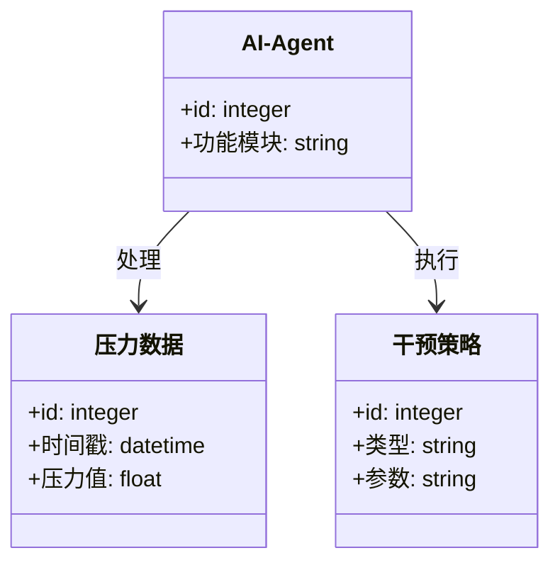
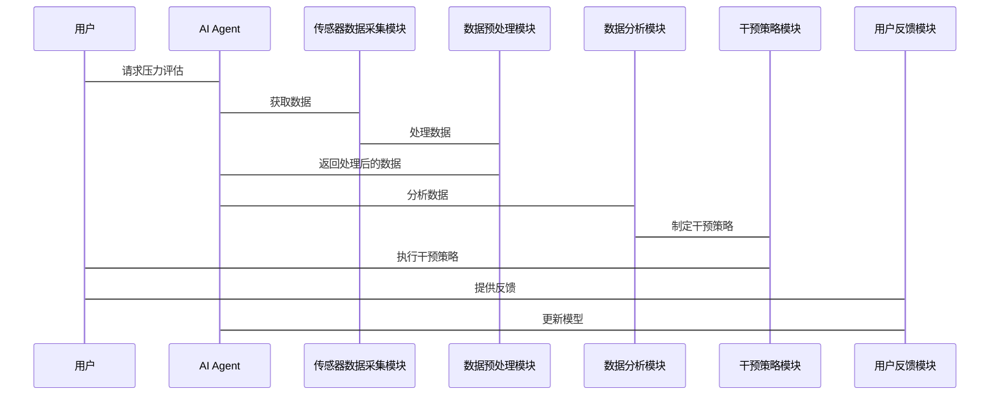

                 


# AI Agent在智能手表中的压力管理系统

> **关键词**：AI Agent，智能手表，压力管理，健康监测，人工智能，算法实现

> **摘要**：本文详细探讨了AI Agent在智能手表中的压力管理系统的设计与实现。从压力管理的现状出发，分析了AI Agent的核心概念与功能，介绍了系统的算法原理与数学模型，并通过项目实战展示了系统的实现过程。本文旨在为读者提供一个全面的技术视角，帮助理解AI Agent在智能手表中的应用潜力。

---

# 第一部分: AI Agent在智能手表中的压力管理系统概述

## 第1章: 背景介绍

### 1.1 压力管理的现状与挑战

#### 1.1.1 现代社会压力问题的普遍性
在现代快节奏的生活中，压力已成为许多人面临的主要健康问题。长期的压力会导致多种身体和心理问题，如焦虑、失眠、高血压等。因此，有效的压力管理变得尤为重要。

#### 1.1.2 智能手表在健康监测中的作用
智能手表作为一种便携式设备，具备多种健康监测功能，如心率监测、睡眠监测和运动监测等。这些功能为压力管理提供了丰富的数据来源。

#### 1.1.3 AI Agent在压力管理中的潜力
AI Agent（人工智能代理）是一种能够自主决策和执行任务的智能实体。通过结合智能手表的传感器数据，AI Agent可以实时监测用户的压力水平，并提供个性化的干预策略。

### 1.2 AI Agent的基本概念

#### 1.2.1 什么是AI Agent
AI Agent是一种能够感知环境、做出决策并执行任务的智能实体。它可以基于传感器数据和用户行为，动态调整其行为以实现目标。

#### 1.2.2 AI Agent的核心功能与特点
- **感知环境**：通过传感器数据和用户输入，获取实时信息。
- **决策与推理**：利用算法对数据进行分析，生成决策。
- **自主执行**：根据决策结果，执行相应的操作。

#### 1.2.3 AI Agent与传统算法的区别
AI Agent不仅能够处理数据，还能根据环境变化动态调整其行为，具有更强的适应性和自主性。

### 1.3 智能手表的技术基础

#### 1.3.1 智能手表的硬件组成
智能手表通常包括以下硬件组件：
- 加速度计
- 心率传感器
- 陀螺仪
- 气压计
- 蓝牙/Wi-Fi模块

#### 1.3.2 智能手表的操作系统与开发平台
主流的智能手表操作系统包括：
- Apple Watch OS
- Google Wear OS
- Samsung Tizen

#### 1.3.3 智能手表的传感器与数据采集技术
智能手表通过多种传感器采集数据，如心率、加速度、陀螺仪等，这些数据为压力管理提供了基础信息。

### 1.4 本章小结
本章介绍了压力管理的现状与挑战，阐述了AI Agent的基本概念及其在智能手表中的潜力，为后续内容奠定了基础。

---

## 第2章: AI Agent与压力管理系统的核心概念

### 2.1 压力管理系统的结构与功能

#### 2.1.1 压力监测模块
压力监测模块通过传感器数据和用户输入，实时评估用户的压力水平。

#### 2.1.2 数据分析模块
数据分析模块利用机器学习算法对压力数据进行分析，生成压力评估结果。

#### 2.1.3 干预策略模块
干预策略模块根据压力评估结果，制定个性化的干预策略，如放松训练、提醒休息等。

### 2.2 AI Agent在压力管理中的角色

#### 2.2.1 数据采集与处理
AI Agent通过智能手表的传感器，实时采集用户的生理数据和行为数据。

#### 2.2.2 压力评估与预测
基于历史数据和实时数据，AI Agent利用算法模型预测用户的压力水平。

#### 2.2.3 个性化干预策略
AI Agent根据用户的个性特征和压力水平，制定个性化的干预策略。

### 2.3 核心概念的ER实体关系图

```mermaid
er
    entity AI-Agent {
        id
       功能模块
    }
    entity 压力数据 {
        id
        时间戳
        压力值
    }
    entity 干预策略 {
        id
        类型
        参数
    }
    AI-Agent --> 压力数据: 处理
    AI-Agent --> 干预策略: 执行
```

---

## 第3章: 算法原理与数学模型

### 3.1 压力监测的算法原理

#### 3.1.1 数据采集与预处理
数据预处理包括数据清洗、归一化和特征提取等步骤。

#### 3.1.2 基于生理数据的压力评估模型
压力评估模型可以采用机器学习算法，如支持向量机（SVM）或随机森林（Random Forest）。

#### 3.1.3 深度学习模型的应用
深度学习模型，如LSTM（长短期记忆网络），可以用于时间序列数据的分析和预测。

### 3.2 AI Agent的算法实现

#### 3.2.1 强化学习的基本原理
强化学习是一种通过试错机制来优化决策的算法。AI Agent通过与环境的交互，学习最优策略。

#### 3.2.2 基于强化学习的干预策略优化
通过强化学习，AI Agent可以动态调整干预策略，以最小化用户的压力水平。

#### 3.2.3 算法的数学模型与公式

**强化学习的Q-learning算法：**

$$ Q(s, a) = Q(s, a) + \alpha \left( r + \gamma \max_{a'} Q(s', a') - Q(s, a) \right) $$

其中：
- \( Q(s, a) \)：状态s下动作a的Q值
- \( \alpha \)：学习率
- \( r \)：奖励
- \( \gamma \)：折扣因子

---

## 第4章: 系统分析与架构设计

### 4.1 问题场景介绍

智能手表用户在日常生活中面临各种压力源，如工作压力、情绪波动等。通过AI Agent实时监测用户的生理数据和行为数据，提供个性化的压力管理方案。

### 4.2 系统功能设计

#### 4.2.1 领域模型mermaid类图



### 4.3 系统架构设计

#### 4.3.1 系统架构mermaid架构图


### 4.4 系统接口设计

系统接口包括：
- 传感器数据接口
- 用户输入接口
- 干预策略执行接口

### 4.5 系统交互mermaid序列图



---

## 第5章: 项目实战

### 5.1 环境安装

#### 5.1.1 开发环境
- 操作系统：Windows/Mac/Linux
- 开发工具：Python 3.8+
- 依赖库：TensorFlow、Keras、scikit-learn

### 5.2 系统核心实现源代码

#### 5.2.1 数据预处理模块

```python
import numpy as np
import pandas as pd

def preprocess_data(data):
    # 数据清洗
    data = data.dropna()
    # 数据归一化
    data = (data - data.mean()) / data.std()
    return data
```

#### 5.2.2 AI Agent算法实现

```python
import numpy as np
from sklearn.ensemble import RandomForestClassifier

class AIAgent:
    def __init__(self):
        self.model = RandomForestClassifier()

    def train(self, X, y):
        self.model.fit(X, y)

    def predict(self, X):
        return self.model.predict(X)
```

### 5.3 代码应用解读与分析

- 数据预处理模块：对传感器数据进行清洗和归一化处理，确保数据适合模型训练。
- AI Agent算法实现：使用随机森林算法进行分类，预测用户的压力水平。

### 5.4 实际案例分析

通过实际数据集，展示AI Agent在压力管理中的应用效果。

---

## 第6章: 最佳实践、小结、注意事项与拓展阅读

### 6.1 最佳实践

- 定期更新模型，保持系统的准确性。
- 提供多样的干预策略，满足不同用户的需求。

### 6.2 小结

本文详细介绍了AI Agent在智能手表中的压力管理系统的设计与实现，从背景介绍到算法实现，再到系统架构设计，为读者提供了全面的技术视角。

### 6.3 注意事项

- 数据隐私保护至关重要，需确保用户数据的安全性。
- 系统的可扩展性设计，便于未来功能的扩展。

### 6.4 拓展阅读

- 探索更多AI技术在健康监测中的应用，如心率变异性（HRV）分析。
- 研究更先进的算法，如图神经网络（Graph Neural Network）在压力管理中的应用。

---

# 小结

本文通过系统化的分析和实践，展示了AI Agent在智能手表中的压力管理系统的潜力和实现过程。希望读者通过本文能够深入了解AI Agent的核心概念和算法原理，并能够在实际项目中加以应用。

---

**作者：AI天才研究院/AI Genius Institute & 禅与计算机程序设计艺术 /Zen And The Art of Computer Programming**

