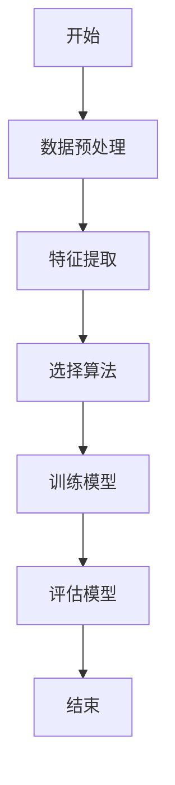
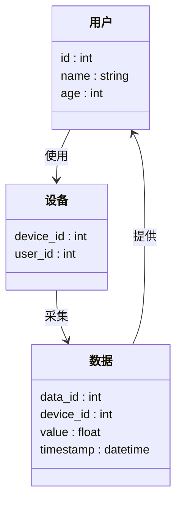
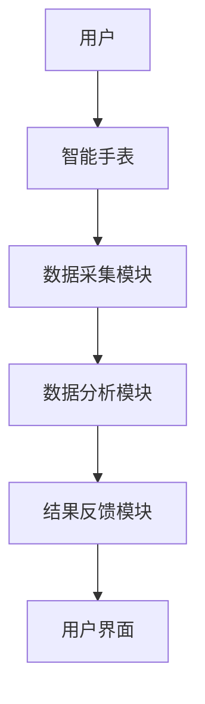

                 


# AI Agent在智能手表中的心理健康监测功能

> 关键词：AI Agent, 智能手表, 心理健康监测, 机器学习, 自然语言处理

> 摘要：本文深入探讨了AI Agent在智能手表中用于心理健康监测的功能，从背景介绍、核心概念、算法原理、系统架构到项目实战，全面解析了如何利用AI技术实时监测用户的心理健康状态，并提供了实际应用的解决方案和最佳实践。

---

# 第一部分: AI Agent在智能手表中的心理健康监测功能概述

# 第1章: 背景介绍

## 1.1 心理健康监测的重要性

心理健康问题日益成为现代生活中的重要议题。智能手表作为一种普及的可穿戴设备，具备实时监测和数据分析的能力，为心理健康监测提供了新的可能性。

### 1.1.1 心理健康问题的普遍性

现代社会的工作压力、生活节奏加快，心理健康问题变得越来越普遍。世界卫生组织指出，超过9.7亿人（占全球总人口的13%）受到心理健康问题的影响。

### 1.1.2 智能手表在健康监测中的独特优势

智能手表通过传感器可以实时采集心率、皮肤温度、运动数据等生理指标，结合用户的日常行为数据，为心理健康监测提供了丰富的数据源。

### 1.1.3 AI Agent在心理健康监测中的作用

AI Agent（智能体）通过分析智能手表收集的数据，能够实时识别用户的心理状态变化，提供个性化的建议和干预，帮助用户维护心理健康。

## 1.2 AI Agent的基本概念

AI Agent是一种能够感知环境、自主决策并采取行动的智能实体，能够在智能手表中实现心理健康监测的多种功能。

### 1.2.1 什么是AI Agent

AI Agent是人工智能的核心概念，具有自主性、反应性、目标导向和社交能力等特性。在心理健康监测中，AI Agent能够实时分析用户数据，提供实时反馈。

### 1.2.2 AI Agent的核心功能与特点

AI Agent在心理健康监测中的核心功能包括数据采集与分析、情绪识别、个性化建议生成和实时干预。其特点包括实时性、个性化和主动性。

### 1.2.3 AI Agent在智能手表中的应用场景

在智能手表中，AI Agent可以实时监测用户的心率、运动数据、睡眠质量等生理指标，结合用户的日常行为数据，识别潜在的心理健康问题。

## 1.3 本章小结

本章介绍了心理健康监测的重要性，分析了智能手表在健康监测中的独特优势，并详细阐述了AI Agent的基本概念及其在心理健康监测中的作用。

---

# 第二部分: 核心概念与联系

# 第2章: 心理健康监测的核心概念

## 2.1 心理健康监测的原理

心理健康监测通过分析用户的行为数据和生理数据，识别潜在的心理健康问题。

### 2.1.1 数据采集与分析

智能手表通过传感器采集心率、皮肤温度、运动数据等生理指标，结合用户的日常行为数据，形成全面的用户画像。

### 2.1.2 心理健康指标的定义与计算

心理健康指标包括焦虑指数、抑郁指数、压力指数等，AI Agent通过机器学习算法对这些指标进行计算和预测。

## 2.2 AI Agent的核心算法

AI Agent在心理健康监测中主要使用机器学习算法，包括支持向量机（SVM）、随机森林（Random Forest）和神经网络（Neural Network）等。

### 2.2.1 机器学习算法在心理健康监测中的应用

机器学习算法可以对用户的数据进行分类和预测，帮助识别潜在的心理健康问题。

### 2.2.2 自然语言处理在情绪分析中的作用

自然语言处理技术可以分析用户的文本数据，如社交媒体帖子、短信等，提取情绪信息，帮助识别用户的心理状态。

## 2.3 核心概念对比表

以下是一些核心概念的对比表：

| 比较维度 | 心理健康指标 | 生理指标 |
|----------|--------------|----------|
| 数据来源 | 用户行为数据 | 传感器数据 |
| 数据类型 | 文本、行为数据 | 心理指标 |
| 分析目标 | 心理健康状态 | 生理健康状态 |

## 2.4 ER实体关系图

以下是心理健康监测系统的ER实体关系图：

```mermaid
erDiagram
    user [用户] {
        id : int
        name : string
        age : int
    }
    device [智能手表] {
        device_id : int
        user_id : int
        data_type : string
    }
    data [数据] {
        data_id : int
        device_id : int
        value : float
        timestamp : datetime
    }
    user --> device : 使用
    device --> data : 采集
    data --> user : 提供
```

## 2.5 本章小结

本章详细介绍了心理健康监测的核心概念，包括数据采集与分析、机器学习算法的应用以及自然语言处理在情绪分析中的作用，并通过对比表和ER实体关系图展示了系统的数据模型。

---

# 第三部分: 算法原理讲解

# 第3章: 心理健康监测的算法原理

## 3.1 数据预处理与特征提取

### 3.1.1 数据清洗与标准化

数据清洗是去除噪声数据和异常值，确保数据的准确性。标准化是将数据归一化，方便后续算法处理。

### 3.1.2 心理健康相关特征的提取

从用户的行为数据中提取有用的特征，如心率变异、步频变化、睡眠质量等，用于心理健康预测。

## 3.2 基于机器学习的分类算法

### 3.2.1 支持向量机（SVM）算法

支持向量机是一种监督学习算法，适用于小规模数据集的分类问题。其核心思想是将数据映射到高维空间，找到一个超平面将数据分为两类。

### 3.2.2 随机森林（Random Forest）算法

随机森林是一种基于决策树的集成学习算法，适用于数据量较大的场景。它通过构建多个决策树并进行投票来提高分类准确率。

### 3.2.3 神经网络（Neural Network）算法

神经网络是一种深度学习算法，适用于复杂数据模式的识别。通过多层神经网络结构，可以自动提取数据特征。

## 3.3 算法流程图

以下是心理健康监测算法的流程图：



## 3.4 本章小结

本章详细讲解了心理健康监测的算法原理，包括数据预处理、特征提取以及三种主流机器学习算法（SVM、Random Forest、Neural Network）的应用，并通过流程图展示了算法的整体流程。

---

# 第四部分: 系统分析与架构设计方案

# 第4章: 系统分析与架构设计

## 4.1 问题场景介绍

### 4.1.1 用户需求分析

用户希望通过智能手表实时监测自己的心理健康状态，获得个性化的建议和干预。

### 4.1.2 系统功能需求

系统需要具备数据采集、数据分析、结果反馈等功能，能够实时识别用户的心理健康问题。

## 4.2 系统功能设计

### 4.2.1 领域模型类图

以下是系统的领域模型类图：



### 4.2.2 系统功能模块划分

系统功能模块包括数据采集、数据分析、结果反馈和用户界面四个部分。

## 4.3 系统架构设计

### 4.3.1 系统架构图

以下是系统的架构图：



## 4.4 系统接口设计

### 4.4.1 API接口设计

系统需要提供RESTful API接口，用于数据采集、数据分析和结果反馈。

### 4.4.2 接口交互流程图

以下是接口交互流程图：


## 4.5 本章小结

本章详细分析了心理健康监测系统的应用场景，设计了系统的功能模块和架构，并通过类图和流程图展示了系统的整体结构。

---

# 第五部分: 项目实战

# 第5章: 项目实战

## 5.1 环境安装与配置

### 5.1.1 Python环境安装

安装Python 3.8及以上版本，安装必要的库如pandas、scikit-learn、tensorflow等。

### 5.1.2 智能手表数据接口配置

配置智能手表的数据采集接口，确保设备能够与系统正常通信。

## 5.2 核心功能实现

### 5.2.1 数据采集与预处理

编写Python代码，采集用户数据并进行预处理。

```python
import pandas as pd

# 数据加载
data = pd.read_csv('health_data.csv')

# 数据清洗
data.dropna(inplace=True)

# 数据标准化
data = (data - data.mean()) / data.std()
```

### 5.2.2 心理健康预测模型训练

训练机器学习模型，预测用户的心理健康状态。

```python
from sklearn.model import SVC

# 训练模型
model = SVC()
model.fit(X_train, y_train)

# 模型预测
y_pred = model.predict(X_test)
```

### 5.2.3 模型评估与优化

评估模型的准确率、召回率和F1分数，并进行超参数调优。

```python
from sklearn.metrics import accuracy_score, recall_score, f1_score

# 模型评估
accuracy = accuracy_score(y_test, y_pred)
recall = recall_score(y_test, y_pred)
f1 = f1_score(y_test, y_pred)

print(f'Accuracy: {accuracy}\nRecall: {recall}\nF1: {f1}')
```

### 5.2.4 系统集成与部署

将模型部署到智能手表中，实现实时监测和反馈。

## 5.3 项目小结

本章通过实际案例展示了如何在智能手表中实现心理健康监测功能，从环境配置到数据采集、模型训练和系统集成，详细讲解了整个过程。

---

# 第六部分: 最佳实践与总结

# 第6章: 最佳实践

## 6.1 项目实施中的注意事项

在项目实施中，需要注意数据隐私保护、模型的实时性和准确性、用户界面的友好性等问题。

## 6.2 心理健康监测的未来发展方向

未来的心理健康监测将更加智能化和个性化，AI Agent将与更多传感器和数据源结合，提供更精准的监测和干预。

## 6.3 本章小结

本章总结了项目实施中的注意事项，展望了心理健康监测的未来发展方向。

---

# 作者：AI天才研究院 & 禅与计算机程序设计艺术

---

通过以上内容，我们系统地介绍了AI Agent在智能手表中的心理健康监测功能，从理论到实践，全面解析了实现这一功能的关键技术与方法。希望本文能为相关领域的研究者和开发者提供有价值的参考与启发。

