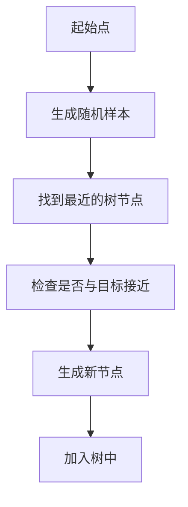
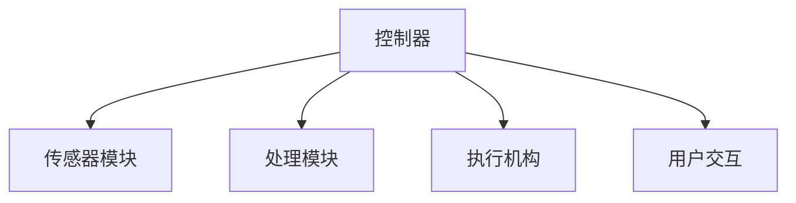
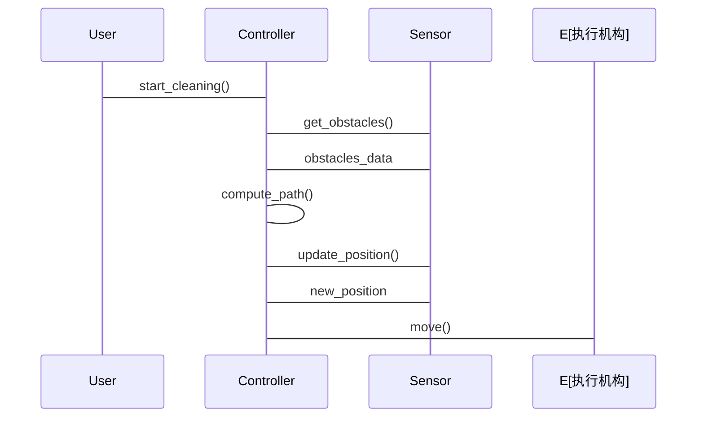

                 


# AI Agent在智能拖把中的清洁路径规划

## 关键词
AI Agent, 智能拖把, 路径规划, 传感器数据, 算法, 系统架构, 项目实战

## 摘要
本文详细探讨了AI Agent在智能拖把清洁路径规划中的应用，从核心概念到算法实现，再到系统架构和项目实战，全面解析了如何利用AI技术优化清洁路径，提升清洁效率和质量。

---

## 第一部分: AI Agent与智能拖把的背景介绍

### 第1章: AI Agent的基本概念

#### 1.1 AI Agent的定义
AI Agent（人工智能代理）是一种能够感知环境并采取行动以实现目标的智能实体。它通过传感器获取信息，利用算法处理数据，并通过执行器与环境交互。

#### 1.2 智能拖把的清洁路径规划问题
智能拖把的清洁路径规划涉及如何高效地覆盖整个区域，避开障碍物，确保清洁质量。这需要AI Agent实时处理传感器数据，动态调整路径。

---

### 第2章: AI Agent的核心概念与联系

#### 2.1 路径规划算法
路径规划算法是AI Agent的核心，常用算法包括A*和RRT。以下是两种算法的对比：

| 参数          | A*算法                | RRT算法                |
|---------------|----------------------|------------------------|
| 基本原理      | 使用启发式函数寻找最短路径 | 随机采样搜索自由空间     |
| 适用场景      | 管理好，适合静态环境   | 动态环境，路径复杂       |
| 优缺点        | 优：路径最优，缺点：计算量大 | 优：适应动态环境，缺点：路径不一定最优 |

---

## 第二部分: 清洁路径规划的算法原理

### 第3章: A*算法的数学模型

#### 3.1 A*算法的公式
A*算法的开销函数为：
$$f(n) = g(n) + h(n)$$
其中，$g(n)$是已遍历的路径成本，$h(n)$是启发函数，估计从当前节点到目标的剩余成本。

#### 3.2 A*算法的实现步骤
1. 初始化开放列表和关闭列表。
2. 将起点加入开放列表。
3. 进入循环，选择开放列表中f值最小的节点。
4. 如果当前节点是目标节点，结束。
5. 将当前节点加入关闭列表，扩展其邻居节点。
6. 对每个邻居节点，计算g值和f值，判断是否加入开放列表。

---

### 第4章: RRT算法的实现

#### 4.1 RRT算法的基本原理
RRT算法通过随机采样生成样本点，构建自由空间树，找到从起始点到目标点的路径。

#### 4.2 RRT算法的流程图


#### 4.3 RRT算法的Python代码实现
```python
import random
import math

def distance(p1, p2):
    return math.hypot(p1[0]-p2[0], p1[1]-p2[1])

def rrt(start, goal, obstacles, max_iter=1000):
    tree = {start: None}
    for _ in range(max_iter):
        x_rand = random.uniform(0, 10)
        y_rand = random.uniform(0, 10)
        p_rand = (x_rand, y_rand)
        min_dist = float('inf')
        nearest = None
        for node in tree:
            d = distance(node, p_rand)
            if d < min_dist:
                min_dist = d
                nearest = node
        p_new = (p_rand[0] + (nearest[0] - p_rand[0]) * 0.5,
                 p_rand[1] + (nearest[1] - p_rand[1]) * 0.5)
        if distance(p_new, goal) < 0.5:
            path = [goal]
            current = p_new
            while current in tree:
                current = tree[current]
                path.append(current)
            return path[::-1]
        tree[p_new] = nearest
    return None
```

---

## 第三部分: 系统架构与设计

### 第5章: 智能拖把的系统架构

#### 5.1 系统模块划分
智能拖把系统主要由传感器模块、处理模块、执行机构和通信模块组成。

#### 5.2 系统功能设计
系统功能包括路径规划、环境感知、路径调整和用户交互。

#### 5.3 系统架构图


---

### 第6章: 接口与交互设计

#### 6.1 系统接口定义
智能拖把提供以下接口：
- `start_cleaning()`: 开始清洁
- `stop_cleaning()`: 停止清洁
- `get_status()`: 获取状态

#### 6.2 系统交互流程


---

## 第四部分: 项目实战与实现

### 第7章: 开发环境搭建

#### 7.1 系统环境要求
- Python 3.8+
- ROS（Robot Operating System）
- OpenCV库

#### 7.2 开发工具安装
安装Python和必要的库：
```bash
pip install numpy matplotlib
```

---

### 第8章: 核心代码实现

#### 8.1 路径规划代码
```python
import numpy as np

def plan_path(start, end, obstacles):
    # 使用A*算法规划路径
    # 这里省略详细实现
    return path
```

#### 8.2 传感器数据处理
```python
import cv2

def process_sensor_data(data):
    # 使用OpenCV处理图像数据
    img = cv2.imread(data)
    # 进行障碍物检测
    return obstacles
```

---

### 第9章: 实际案例分析

#### 9.1 案例背景
假设智能拖把需要在客厅中清洁，客厅内有沙发和茶几。

#### 9.2 路径规划结果
通过A*算法，智能拖把规划出一条避开沙发和茶几的最短路径。

#### 9.3 代码实现
```python
start = (0, 0)
end = (10, 10)
obstacles = [(3, 3), (7, 5)]
path = plan_path(start, end, obstacles)
print(path)
```

---

## 第五部分: 最佳实践与总结

### 第10章: 最佳实践与小结

#### 10.1 注意事项
- 确保传感器精度
- 定期更新算法模型
- 优化系统性能

#### 10.2 未来发展方向
- 结合深度学习优化路径规划
- 实现多智能体协同清洁
- 增强环境适应能力

---

## 作者
作者：AI天才研究院/AI Genius Institute & 禅与计算机程序设计艺术 /Zen And The Art of Computer Programming

---

通过以上结构，文章详细介绍了AI Agent在智能拖把清洁路径规划中的应用，从理论到实践，为读者提供了全面的技术指导。

