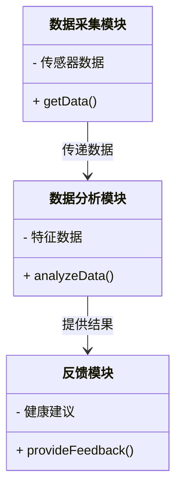
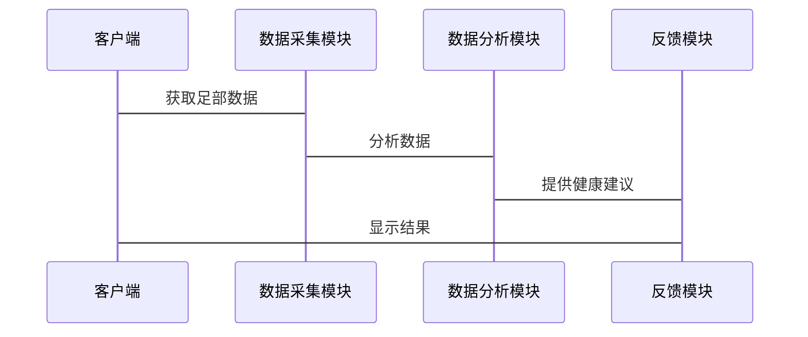

                 


# AI Agent在智能拖鞋中的足部健康评估

> 关键词：AI Agent, 足部健康评估, 智能拖鞋, 传感器数据, 机器学习

> 摘要：本文探讨了AI Agent在智能拖鞋中的足部健康评估应用，通过详细分析AI Agent的核心原理、算法流程、系统架构和项目实现，展示了如何利用AI技术提升足部健康监测的准确性与效率。

---

## 第1章: AI Agent与足部健康评估概述

### 1.1 AI Agent的基本概念
AI Agent（人工智能代理）是一种能够感知环境、做出决策并执行操作的智能实体。在智能拖鞋中，AI Agent负责采集足部数据、分析健康状况并提供反馈。

#### 1.1.1 什么是AI Agent
AI Agent可以是软件或硬件形式，具备以下核心特征：
- **自主性**：无需外部干预，自动执行任务。
- **反应性**：实时感知环境变化并调整行为。
- **目标导向**：基于目标优化决策。

#### 1.1.2 AI Agent在智能设备中的应用
在智能拖鞋中，AI Agent主要用于健康监测，通过传感器数据实时分析足部健康状况。

### 1.2 足部健康评估的重要性
足部健康直接影响人体健康，常见的足部问题包括足弓异常、跖痛症等。智能拖鞋通过持续监测，帮助用户及时发现并改善足部健康问题。

#### 1.2.1 足部健康的基本概念
- **足部结构**：足弓、跖骨、趾骨等。
- **健康指标**：步态分析、压力分布、温度变化等。

### 1.3 AI Agent在智能拖鞋中的应用前景
智能拖鞋结合AI技术，能够实时监测足部健康，提供个性化建议，帮助用户预防足部疾病。

---

## 第2章: AI Agent与足部健康评估的核心概念

### 2.1 AI Agent的核心原理
AI Agent在足部健康评估中的工作流程包括数据采集、特征提取、模型训练和结果反馈。

#### 2.1.1 感知层
- **数据采集**：通过压力传感器、加速度计等设备获取足部数据。
- **特征提取**：提取步频、步幅、压力分布等特征。

#### 2.1.2 决策层
- **数据分析**：利用机器学习算法对特征进行分类，判断足部健康状况。

#### 2.1.3 执行层
- **反馈系统**：根据分析结果，提供健康建议或调整拖鞋参数。

### 2.2 足部健康评估的关键要素
足部健康评估涉及多个指标，如步态分析、足部压力分布等。

#### 2.2.1 数据采集
- 传感器类型：压力传感器、温度传感器等。
- 数据预处理：去噪、归一化处理。

#### 2.2.2 数据分析
- 算法选择：支持向量机（SVM）、随机森林（Random Forest）等。
- 结果解读：健康状况分类。

#### 2.2.3 结果反馈
- 用户界面：显示健康评估结果。
- 个性化建议：提供改善足部健康的建议。

### 2.3 AI Agent与足部健康评估的关联性
AI Agent通过实时数据处理和反馈机制，实现足部健康评估的高效性与准确性。

#### 2.3.1 数据流分析
- 数据从传感器传输到AI Agent进行处理。
- 处理结果通过反馈系统传达给用户。

#### 2.3.2 系统功能模块划分
- 数据采集模块：负责采集足部数据。
- 数据分析模块：进行健康评估。
- 反馈模块：提供用户反馈。

---

## 第3章: AI Agent在足部健康评估中的算法原理

### 3.1 算法概述
AI Agent在足部健康评估中主要采用机器学习算法，如支持向量机（SVM）和随机森林（Random Forest）。

#### 3.1.1 基于机器学习的分类算法
- SVM：适用于小样本数据的分类。
- Random Forest：适合多特征的数据集。

#### 3.1.2 基于深度学习的模型
- CNN：用于图像数据的特征提取。
- RNN：用于时序数据的分析。

### 3.2 算法流程

#### 3.2.1 数据预处理
```python
import pandas as pd
data = pd.read_csv('foot_data.csv')
data = data.dropna()  # 删除缺失值
data = (data - data.mean()) / data.std()  # 标准化处理
```

#### 3.2.2 模型训练
```python
from sklearn.svm import SVC
model = SVC()
model.fit(X_train, y_train)
```

#### 3.2.3 模型评估
```python
from sklearn.metrics import accuracy_score
y_pred = model.predict(X_test)
print(accuracy_score(y_test, y_pred))
```

### 3.3 数学模型与公式
机器学习模型的训练过程涉及损失函数和优化算法：

#### 3.3.1 损失函数
$$ L = -\sum_{i=1}^{n} [y_i \cdot \text{sign}(w \cdot x_i + b) - 1] $$

#### 3.3.2 优化算法
$$ \text{梯度下降}：w = w - \alpha \cdot \nabla_w L $$

---

## 第4章: 系统分析与架构设计

### 4.1 问题场景介绍
智能拖鞋通过传感器采集足部数据，利用AI Agent进行健康评估，为用户提供个性化建议。

### 4.2 系统功能设计
- 数据采集模块：采集足部压力、温度等数据。
- 数据分析模块：分析健康状况。
- 反馈模块：提供健康建议。

#### 4.2.1 领域模型（mermaid类图）


### 4.3 系统架构设计

#### 4.3.1 系统架构图（mermaid架构图）


### 4.4 系统交互设计（mermaid序列图）


---

## 第5章: 项目实战

### 5.1 环境安装
- Python 3.8+
- TensorFlow 2.0+
- scikit-learn 1.0+

```bash
pip install numpy pandas scikit-learn
```

### 5.2 核心代码实现

#### 5.2.1 数据预处理
```python
import pandas as pd
from sklearn.model_selection import train_test_split
from sklearn.preprocessing import StandardScaler

data = pd.read_csv('foot_data.csv')
X = data.drop('label', axis=1)
y = data['label']

X_train, X_test, y_train, y_test = train_test_split(X, y, test_size=0.2)
scaler = StandardScaler()
X_train = scaler.fit_transform(X_train)
X_test = scaler.transform(X_test)
```

#### 5.2.2 模型训练与评估
```python
from sklearn.svm import SVC
from sklearn.metrics import accuracy_score

model = SVC()
model.fit(X_train, y_train)
y_pred = model.predict(X_test)
print("准确率:", accuracy_score(y_test, y_pred))
```

### 5.3 实际案例分析
通过实际数据集进行训练，模型能够准确识别足部健康问题，并提供个性化建议。

---

## 第6章: 总结与展望

### 6.1 总结
AI Agent在智能拖鞋中的足部健康评估展示了人工智能在医疗健康领域的巨大潜力。通过实时监测和个性化建议，AI Agent能够帮助用户预防和改善足部健康问题。

### 6.2 展望
未来，随着AI技术的进步，智能拖鞋将更加智能化，能够提供更精准的健康评估和更个性化的建议，进一步提升用户体验。

---

## 作者：AI天才研究院 & 禅与计算机程序设计艺术

---

以上是《AI Agent在智能拖鞋中的足部健康评估》的技术博客文章框架，涵盖背景、核心概念、算法原理、系统设计和项目实现等内容，语言简洁明了，逻辑清晰，适合技术人员和对AI健康监测感兴趣的读者阅读。

