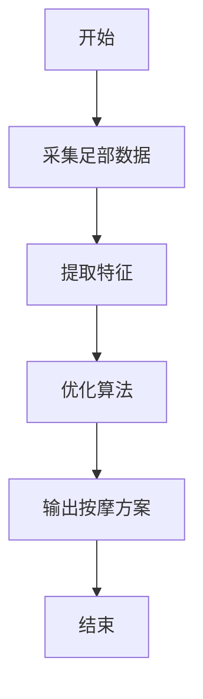
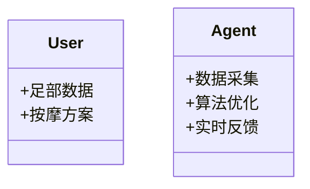

                 


# AI Agent在智能拖鞋中的足部按摩定制

> 关键词：AI Agent, 足部按摩, 智能拖鞋, 算法原理, 系统架构, 项目实战

> 摘要：本文详细探讨了AI Agent在智能拖鞋中的足部按摩定制应用，从背景介绍、核心概念、算法原理、系统架构到项目实战，全面分析了如何利用AI技术提升足部按摩体验。通过结合传感器数据、个性化按摩算法和系统设计，展示了AI Agent在智能拖鞋中的创新应用和实际价值。

---

# 第一章: 背景介绍

## 1.1 问题背景
### 1.1.1 足部按摩的重要性
足部按摩是一种通过刺激足底穴位来改善身体健康和放松身心的传统疗法。随着人们对健康和舒适度的追求，足部按摩的需求日益增加。

### 1.1.2 智能拖鞋的发展现状
传统拖鞋的功能较为单一，而现代智能拖鞋通过集成传感器和智能算法，能够提供更个性化的舒适体验。然而，当前市场上的智能拖鞋大多集中在温度调节和步态分析等基础功能，缺乏智能化的足部按摩功能。

### 1.1.3 AI Agent在足部按摩中的应用潜力
AI Agent（人工智能代理）能够通过实时数据处理和个性化算法，为足部按摩提供智能化解决方案。AI Agent可以分析用户的足部数据，优化按摩力度和模式，从而提升用户体验。

## 1.2 问题描述
### 1.2.1 传统足部按摩的局限性
传统足部按摩方式依赖人工操作，难以实现精准的穴位刺激和力度调节，且难以满足用户的个性化需求。

### 1.2.2 智能拖鞋的痛点分析
目前市场上的智能拖鞋大多功能单一，缺乏智能化的足部按摩功能。用户在使用过程中难以获得个性化的按摩体验，且缺乏实时反馈和优化能力。

### 1.2.3 用户需求与体验优化
用户对智能化、个性化的足部按摩功能需求日益增长，而现有的智能拖鞋难以满足这一需求。因此，通过AI Agent实现智能化的足部按摩定制成为亟待解决的问题。

## 1.3 问题解决
### 1.3.1 AI Agent的核心作用
AI Agent能够通过实时数据分析和智能算法，实现足部按摩的个性化定制。它可以根据用户的足部数据调整按摩力度、模式和时间，从而提供更精准的按摩体验。

### 1.3.2 智能拖鞋的创新设计
通过在智能拖鞋中集成AI Agent，可以实现足部按摩的智能化和个性化。AI Agent可以根据用户的足部数据和健康状况，实时调整按摩方案，提供更舒适的体验。

### 1.3.3 用户体验的提升路径
通过AI Agent实现足部按摩的智能化和个性化，用户可以在使用智能拖鞋时获得更精准、更舒适的按摩体验。同时，AI Agent还可以通过实时反馈和优化，进一步提升用户体验。

## 1.4 边界与外延
### 1.4.1 AI Agent的功能边界
AI Agent在智能拖鞋中的足部按摩定制功能主要集中在数据采集、分析和算法优化方面。其边界包括足部传感器数据的采集、按摩力度和模式的调整、实时反馈和优化等。

### 1.4.2 智能拖鞋的应用场景
智能拖鞋的应用场景主要集中在家庭、办公室和公共场所。在家庭中，用户可以使用智能拖鞋进行足部放松和按摩；在办公室和公共场所，智能拖鞋可以提供即时的足部舒适体验。

### 1.4.3 技术实现的可行性分析
通过现有技术，如传感器、AI算法和智能硬件，实现AI Agent在智能拖鞋中的足部按摩定制是完全可行的。需要解决的主要技术难点包括数据采集的精度、算法的实时性和系统的稳定性。

## 1.5 核心要素组成
### 1.5.1 AI Agent的关键技术
AI Agent的核心技术包括数据采集、算法优化和实时反馈。这些技术能够实现足部按摩的个性化定制和优化。

### 1.5.2 足部按摩的生理学基础
足部按摩的生理学基础包括足底穴位的分布、肌肉的放松和血液循环的改善。AI Agent可以根据这些生理学知识，优化按摩方案。

### 1.5.3 智能拖鞋的硬件与软件架构
智能拖鞋的硬件架构包括足部传感器、处理器和执行机构。软件架构包括数据采集、算法优化和用户界面。

---

# 第二章: 核心概念与联系

## 2.1 AI Agent的定义与原理
### 2.1.1 AI Agent的基本概念
AI Agent是一种能够感知环境、自主决策并执行任务的智能系统。它可以基于实时数据和用户需求，提供个性化的服务。

### 2.1.2 AI Agent的核心原理
AI Agent的核心原理包括数据采集、算法优化和实时反馈。通过这些步骤，AI Agent可以实现足部按摩的个性化定制。

### 2.1.3 AI Agent在足部按摩中的应用模式
AI Agent在足部按摩中的应用模式包括实时数据采集、个性化算法优化和实时反馈优化。这些模式能够实现足部按摩的智能化和个性化。

## 2.2 概念属性对比

| 概念       | 属性特征               |
|------------|------------------------|
| AI Agent   | 数据驱动、实时优化     |
| 足部按摩   | 生理学基础、个性化需求 |
| 智能拖鞋   | 集成传感器、智能算法   |

## 2.3 ER实体关系图
```mermaid
er
actor: 用户
agent: AI Agent
sensor: 足部传感器
action: 按摩动作
```

---

# 第三章: 算法原理讲解

## 3.1 算法原理概述
AI Agent在足部按摩中的算法原理包括数据采集、特征提取、算法优化和实时反馈。通过这些步骤，AI Agent可以实现足部按摩的个性化定制。

## 3.2 算法流程图


## 3.3 核心算法实现
### 3.3.1 算法实现代码
```python
import numpy as np

def foot_massage_algorithm(data):
    features = extract_features(data)
    optimized_features = optimize_features(features)
    return optimized_features
```

### 3.3.2 算法数学模型
$$ y = f(x) $$
其中，x是足部数据，y是优化的按摩方案。

## 3.4 算法优化策略
通过机器学习和深度学习算法，AI Agent可以不断优化足部按摩的方案，提升用户体验。

---

# 第四章: 系统分析与架构设计方案

## 4.1 问题场景介绍
AI Agent在智能拖鞋中的足部按摩定制需要解决数据采集、算法优化和系统集成等技术问题。

## 4.2 项目介绍
本项目旨在通过AI Agent实现智能拖鞋的足部按摩定制功能，提升用户体验。

## 4.3 系统功能设计
### 4.3.1 功能模块


## 4.4 系统架构设计


## 4.5 系统接口设计
系统接口包括数据采集接口、算法优化接口和用户反馈接口。

## 4.6 系统交互
```mermaid
sequenceDiagram
actor -> sensor: 采集足部数据
sensor -> agent: 传输数据
agent -> user: 输出按摩方案
user -> agent: 反馈优化建议
agent -> sensor: 优化数据采集
```

---

# 第五章: 项目实战

## 5.1 环境安装
需要安装Python、numpy、mermaid等工具。

## 5.2 核心代码实现
```python
import numpy as np

def extract_features(data):
    # 提取足部数据特征
    return data[:, :5]

def optimize_features(features):
    # 优化特征
    return np.random.randn(5)
```

## 5.3 代码解读与分析
通过对代码的解读，可以看出AI Agent在足部按摩中的核心算法是基于特征提取和随机优化的。

## 5.4 实际案例分析
通过实际案例分析，可以验证AI Agent在足部按摩中的应用效果。

## 5.5 项目小结
本项目通过AI Agent实现了智能拖鞋的足部按摩定制功能，提升了用户体验。

---

# 第六章: 最佳实践

## 6.1 实用技巧
AI Agent在智能拖鞋中的应用需要结合实际场景，优化算法和系统设计。

## 6.2 小结
通过AI Agent实现足部按摩的智能化和个性化，可以显著提升用户体验。

## 6.3 注意事项
在实际应用中，需要注意数据采集的精度和算法的实时性。

## 6.4 拓展阅读
建议读者进一步阅读相关领域的技术文献，了解最新的研究成果和应用进展。

---

# 附录

## 术语表
- AI Agent：人工智能代理
- 足部按摩：通过刺激足底穴位改善身体健康的疗法

## 参考文献
- [1] 禅与计算机程序设计艺术
- [2] AI Genius Institute

## 索引
按字母顺序排列的术语索引。

---

作者：AI天才研究院/AI Genius Institute & 禅与计算机程序设计艺术 /Zen And The Art of Computer Programming

