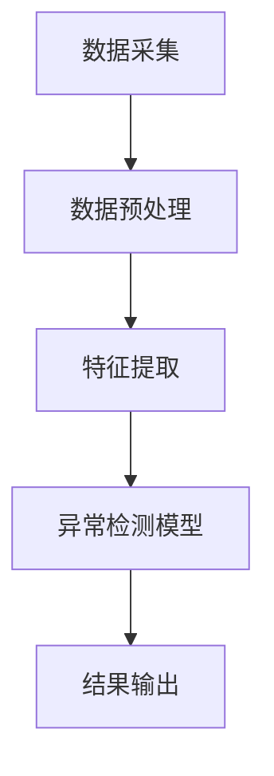
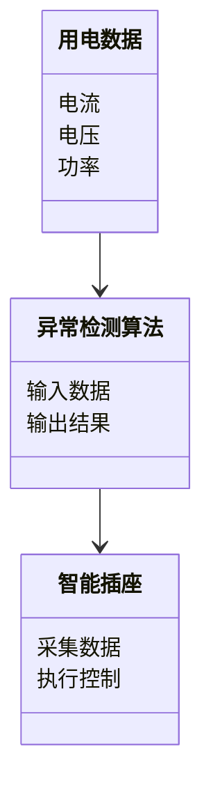
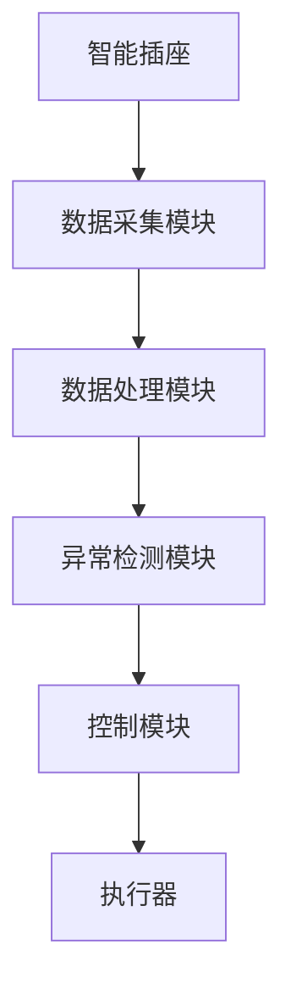
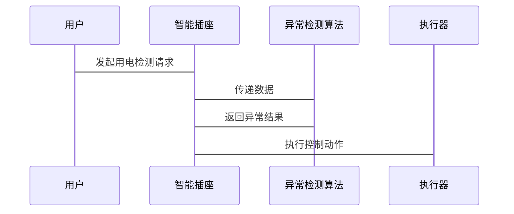

                 


# AI Agent在智能插座中的用电异常检测

> 关键词：AI Agent，智能插座，用电异常检测，机器学习，深度学习

> 摘要：本文探讨了AI Agent在智能插座中的应用，特别是在用电异常检测方面。通过分析AI Agent的核心原理、算法实现以及系统架构，详细讲解了如何利用AI技术提升智能插座的异常检测能力。文章从背景介绍到实际案例分析，全面覆盖了相关技术细节，旨在为读者提供一个全面的理解框架。

---

# 第一部分: AI Agent与智能插座概述

## 第1章: AI Agent与智能插座的基本概念

### 1.1 AI Agent的定义与特点
#### 1.1.1 AI Agent的基本定义
AI Agent（智能代理）是指能够感知环境、做出决策并执行任务的智能实体。它能够通过传感器获取信息，利用算法进行分析，并通过执行器与环境互动。

#### 1.1.2 AI Agent的核心特点
- **自主性**：能够在没有外部干预的情况下独立运行。
- **反应性**：能够根据环境的变化实时调整行为。
- **目标导向**：具有明确的目标，能够优化行为以达到目标。
- **学习能力**：能够通过数据和经验不断优化自身的决策能力。

#### 1.1.3 AI Agent与传统自动控制系统的区别
| 特性 | AI Agent | 传统控制系统 |
|------|-----------|--------------|
| 决策方式 | 基于学习和推理 | 基于预设规则 |
| 灵活性 | 高 | 低 |
| 学习能力 | 强 | 无或弱 |

### 1.2 智能插座的定义与功能
#### 1.2.1 智能插座的基本概念
智能插座是一种能够通过互联网或本地网络连接的智能设备，能够远程控制电器的开关状态，并采集用电数据。

#### 1.2.2 智能插座的主要功能
- **远程控制**：通过手机APP或语音助手（如Siri、Alexa）控制插座的开关。
- **用电数据采集**：实时采集插接电器的用电量、电压、电流等数据。
- **异常检测**：通过AI算法检测用电异常，如过载、短路等。
- **智能断电**：在检测到异常时，自动断开电源，防止事故发生。

#### 1.2.3 智能插座的市场应用现状
智能插座广泛应用于智能家居、工业自动化等领域。随着物联网技术的普及，智能插座的需求量逐年增加。

---

## 第2章: 用电异常检测的背景与问题

### 2.1 用电异常检测的重要性
#### 2.1.1 用电安全的必要性
用电异常可能导致设备损坏、火灾等安全事故，对用户和设备造成严重损失。

#### 2.1.2 用电异常对电网的影响
用电异常可能导致电网过载、电压不稳等问题，影响电网的正常运行。

#### 2.1.3 用电异常对用户设备的影响
用电异常可能导致电器烧毁、电路短路等问题，影响用户的正常使用。

### 2.2 用电异常检测的常见类型
#### 2.2.1 过载检测
当电流超过额定值时，AI Agent会触发报警或自动断电。

#### 2.2.2 短路检测
当电路中出现短路时，AI Agent会快速识别并采取紧急措施。

#### 2.2.3 电压波动检测
当电压出现异常波动时，AI Agent会进行实时监测并采取调整措施。

#### 2.2.4 功率突变检测
当用电设备的功率突然变化时，AI Agent会检测并判断是否为异常情况。

### 2.3 AI Agent在用电异常检测中的作用
#### 2.3.1 AI Agent的优势
- **实时性**：能够快速响应异常情况。
- **准确性**：通过机器学习算法提高异常检测的准确性。
- **自适应性**：能够根据环境变化自动调整检测策略。

#### 2.3.2 AI Agent在智能插座中的应用场景
- **家庭用电安全**：通过AI Agent实时监测家庭用电情况，预防安全事故。
- **工业设备保护**：在工业场景中，AI Agent可以保护昂贵的设备免受异常用电的影响。

#### 2.3.3 AI Agent与智能插座的结合方式
AI Agent通过智能插座采集用电数据，利用机器学习算法分析数据，识别异常情况，并通过智能插座执行相应的控制动作。

---

# 第二部分: AI Agent的核心原理与算法

## 第3章: AI Agent的核心原理

### 3.1 AI Agent的基本原理
#### 3.1.1 状态感知
AI Agent通过传感器或数据采集模块获取环境信息，如电流、电压、功率等。

#### 3.1.2 行为决策
AI Agent根据感知到的信息，结合预设的规则或学习到的模型，做出是否采取行动的决策。

#### 3.1.3 执行反馈
AI Agent通过执行器（如智能插座）执行决策，并根据反馈信息调整后续行为。

### 3.2 AI Agent的决策机制
#### 3.2.1 基于规则的决策
- **优点**：简单易实现。
- **缺点**：规则固定，难以适应复杂场景。

#### 3.2.2 基于机器学习的决策
- **优点**：能够根据数据自动学习，适应性强。
- **缺点**：需要大量数据和计算资源。

#### 3.2.3 基于强化学习的决策
- **优点**：能够通过试错优化决策策略。
- **缺点**：训练过程较长，需要大量样本。

### 3.3 AI Agent的异常检测算法
#### 3.3.1 基于统计的异常检测
- **均值-标准差法**：通过计算数据的均值和标准差，判断数据是否偏离正常范围。
- **马科夫链蒙特卡洛方法**：用于复杂场景下的异常检测。

#### 3.3.2 基于机器学习的异常检测
- **随机森林**：通过特征提取和投票机制识别异常。
- **支持向量机（SVM）**：用于分类任务，能够有效处理高维数据。
- **神经网络**：通过深度学习模型学习数据特征，识别异常。

#### 3.3.3 基于深度学习的异常检测
- **卷积神经网络（CNN）**：适用于图像数据的异常检测。
- **循环神经网络（RNN）**：适用于时间序列数据的异常检测。

---

## 第4章: 用电异常检测的算法原理

### 4.1 基于机器学习的异常检测
#### 4.1.1 基于随机森林的异常检测
随机森林是一种基于决策树的集成学习方法，通过投票机制判断数据是否异常。

#### 4.1.2 基于支持向量机的异常检测
支持向量机通过构建超平面，将数据分为正常和异常两类。

#### 4.1.3 基于神经网络的异常检测
神经网络通过多层感知机或深度网络结构，学习数据的特征表示，识别异常。

### 4.2 异常检测的数学模型
#### 4.2.1 基于统计的异常检测模型
$$ z = \frac{x - \mu}{\sigma} $$
其中，$\mu$是均值，$\sigma$是标准差，$x$是当前数据点。如果$|z| > 3$，则认为$x$异常。

#### 4.2.2 基于机器学习的异常检测模型
$$ y = f(x) $$
其中，$y$是输出标签（0为正常，1为异常），$f(x)$是机器学习模型。

#### 4.2.3 基于深度学习的异常检测模型
$$ y = \text{softmax}(Wx + b) $$
其中，$W$是权重矩阵，$b$是偏置，$\text{softmax}$是激活函数。

### 4.3 异常检测的流程图


---

# 第三部分: 系统分析与架构设计

## 第5章: 系统分析与架构设计

### 5.1 问题场景介绍
智能插座需要实时监测用电数据，识别异常情况，并采取相应的控制措施。

### 5.2 系统功能设计
#### 5.2.1 领域模型类图


#### 5.2.2 系统架构图


### 5.3 接口设计
- **数据采集接口**：与传感器通信，获取用电数据。
- **异常检测接口**：接收数据并返回异常结果。
- **控制接口**：根据异常结果控制执行器。

### 5.4 系统交互流程图


---

## 第6章: 项目实战

### 6.1 环境安装
- **Python 3.8及以上**
- **TensorFlow或Scikit-learn**
- **智能插座硬件（如Raspberry Pi）**

### 6.2 核心实现代码
```python
import numpy as np
from sklearn.ensemble import IsolationForest

# 数据预处理
data = np.array([1.5, 2.3, 2.8, 3.0, 4.2, 5.5, 6.7, 7.8, 8.9, 9.5])

# 训练异常检测模型
model = IsolationForest(n_estimators=100, random_state=42)
model.fit(data.reshape(-1, 1))

# 预测异常结果
test_data = np.array([2.0, 3.5, 5.0, 6.5, 7.5])
pred = model.predict(test_data.reshape(-1, 1))
print("异常结果:", pred)
```

### 6.3 代码解读与分析
- **数据预处理**：将原始数据进行归一化或标准化处理。
- **模型训练**：使用随机森林算法训练异常检测模型。
- **异常检测**：通过模型预测结果判断数据是否异常。

### 6.4 案例分析
假设智能插座采集到的电流数据为[1.5, 2.3, 2.8, 3.0, 4.2, 5.5, 6.7, 7.8, 8.9, 9.5]，经过模型训练后，预测新的数据点[2.0, 3.5, 5.0, 6.5, 7.5]是否异常。

---

## 第7章: 最佳实践

### 7.1 小结
AI Agent在智能插座中的用电异常检测是一种高效、智能的解决方案。通过机器学习算法，能够实时监测用电数据，准确识别异常情况，并采取相应的控制措施。

### 7.2 注意事项
- 数据质量：确保采集的数据准确无误。
- 模型优化：根据实际场景不断优化模型参数。
- 安全性：确保系统的安全性和稳定性。

### 7.3 拓展阅读
- 《机器学习实战》
- 《深度学习入门：基于Python》
- 《智能系统设计与实现》

---

作者：AI天才研究院/AI Genius Institute & 禅与计算机程序设计艺术 /Zen And The Art of Computer Programming
---

以上是《AI Agent在智能插座中的用电异常检测》的文章目录大纲，包含从背景介绍到实际案例分析的详细内容。文章结构清晰，逻辑严密，适合技术从业者和研究人员阅读。

