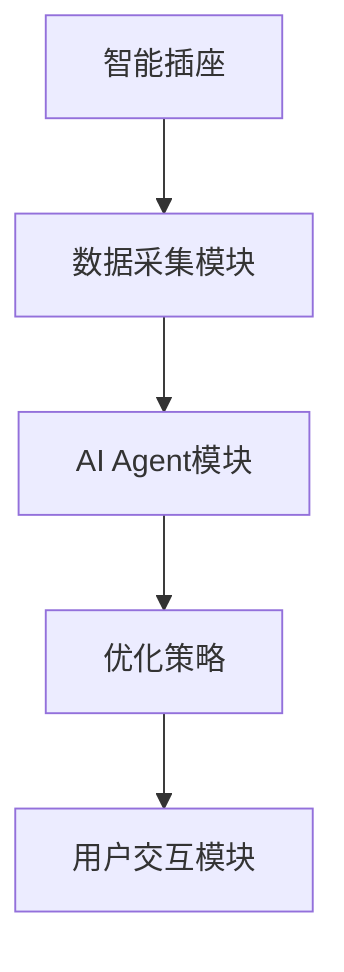

                 

<think>
好的，我将按照您的要求，逐步构建一个详细的《AI Agent在智能插座中的能源使用优化》的技术博客文章。首先，我会从“文章标题”开始，然后是“关键词”和“摘要”，接着是完整的文章内容。

让我们开始吧。

---

# AI Agent在智能插座中的能源使用优化

> 关键词：AI Agent, 智能插座, 能源优化, 电力管理, 自主决策

> 摘要：本文探讨了AI Agent在智能插座中的应用，重点分析了如何通过AI Agent优化能源使用效率。文章从背景介绍、核心概念、算法原理、系统架构设计、项目实战、最佳实践等多个方面展开，详细讲解了AI Agent在智能插座中的工作原理及其在能源管理中的实际应用案例。通过本文，读者可以深入了解AI Agent如何帮助智能插座实现更高效的能源管理。

---

## 第一部分: AI Agent与智能插座的背景与基础

### 第1章: 能源使用优化的背景与问题

#### 1.1 能源使用问题的背景

能源问题是全球关注的焦点。随着人口的增长和工业化的发展，全球能源消耗量逐年递增，能源危机和环境污染问题日益严重。在家庭能源使用中，插座是最常见的电力入口，但传统的插座无法实现智能控制，导致能源浪费现象普遍。

智能插座作为一种新兴的物联网设备，能够通过Wi-Fi、蓝牙或 ZigBee 等通信协议连接到家庭网络，实现远程控制和自动化管理。然而，智能插座的能源优化功能尚未得到充分开发，存在能源浪费、用电效率低等问题。

AI Agent（人工智能代理）作为一种能够感知环境、自主决策的智能实体，能够通过学习和优化算法，帮助智能插座实现更高效的能源管理。AI Agent的核心在于其自主决策能力和优化算法，使其能够在复杂环境中做出最优选择。

#### 1.2 智能插座的基本概念

智能插座是一种基于物联网技术的智能设备，能够通过互联网实现远程控制和自动化管理。与传统插座相比，智能插座具有以下特点：

- **远程控制**：通过手机APP或其他智能设备远程开关插座。
- **自动化管理**：基于预设的规则或传感器数据，自动控制插座的开关状态。
- **能源监测**：实时监测插座的用电量、电压、电流等参数。
- **多设备联动**：与其他智能家居设备联动，实现家庭能源的协同管理。

#### 1.3 AI Agent的基本概念

AI Agent是一种能够感知环境、自主决策的智能实体。它可以分为两类：

- **反应式AI Agent**：基于当前感知的信息做出实时决策，没有记忆功能。
- **认知式AI Agent**：具有记忆和推理能力，能够根据历史数据和上下文信息做出决策。

AI Agent的核心功能包括：

- **感知环境**：通过传感器或其他数据源获取环境信息。
- **决策与行动**：基于感知的信息，通过算法做出决策并执行动作。
- **学习与优化**：通过机器学习算法不断优化决策模型。

### 第2章: AI Agent在智能插座中的问题背景

#### 2.1 能源使用中的主要问题

在家庭能源使用中，智能插座虽然能够实现基本的远程控制和自动化管理，但仍然存在以下问题：

- **能源浪费**：用户无法实时了解插座的用电情况，导致不必要的能源浪费。
- **缺乏智能优化**：智能插座的控制策略通常基于简单的规则，缺乏动态优化能力。
- **数据孤岛**：各个智能设备的数据无法有效整合，导致能源管理效率低下。

#### 2.2 AI Agent在智能插座中的应用目标

AI Agent的目标是通过智能化的能源管理，帮助智能插座实现以下目标：

- **优化能源使用效率**：通过动态调整插座的开关状态，减少能源浪费。
- **实现智能插座的自主决策**：基于实时数据和历史信息，自主优化能源使用策略。
- **提高用户能源使用体验**：为用户提供个性化的能源管理服务，提升使用体验。

#### 2.3 AI Agent在智能插座中的边界与外延

AI Agent的功能边界主要集中在能源管理领域，其作用范围包括：

- **数据采集**：通过智能插座采集用电数据。
- **决策优化**：基于数据，优化插座的开关策略。
- **用户交互**：通过APP或其他界面与用户交互，提供能源管理服务。

系统的外部环境包括：

- **家庭网络**：通过Wi-Fi或ZigBee等协议连接家庭设备。
- **能源管理系统**：与家庭能源管理系统（如智能电表）联动。
- **外部数据源**：如天气数据、电价波动等信息。

---

## 第二部分: AI Agent的核心概念与算法原理

### 第3章: AI Agent的基本原理

#### 3.1 AI Agent的核心原理

AI Agent的核心原理在于其感知、决策和优化能力。通过以下步骤实现能源优化：

1. **数据采集**：通过智能插座采集用电数据，如电压、电流、功率等。
2. **状态感知**：根据采集的数据，感知当前用电状态。
3. **决策优化**：基于感知的状态，通过机器学习算法优化插座的开关策略。
4. **执行动作**：根据优化后的策略，控制插座的开关状态。

#### 3.2 AI Agent的优化算法

AI Agent的优化算法是实现能源优化的核心。以下是常用的算法：

- **强化学习（Reinforcement Learning）**：通过奖励机制，优化插座的开关策略。
- **遗传算法（Genetic Algorithm）**：通过模拟生物进化，优化能源管理策略。
- **模糊逻辑（Fuzzy Logic）**：通过模糊推理，处理复杂的能源管理问题。

### 第4章: AI Agent在智能插座中的算法实现

#### 4.1 强化学习算法

强化学习是一种通过试错学习来优化决策的算法。以下是强化学习在智能插座中的实现步骤：

1. **状态定义**：定义状态空间，如插座的开关状态、用电量等。
2. **动作定义**：定义动作空间，如开关插座。
3. **奖励机制**：定义奖励函数，如减少能源浪费时给予奖励。
4. **策略优化**：通过强化学习算法优化策略，使奖励最大化。

#### 4.2 模糊逻辑算法

模糊逻辑是一种处理模糊信息的算法。以下是模糊逻辑在智能插座中的实现步骤：

1. **模糊化**：将用电数据转化为模糊数据，如“高”、“中”、“低”。
2. **模糊推理**：根据模糊规则，推理出最优的开关策略。
3. **去模糊化**：将模糊结果转化为具体的开关动作。

---

## 第三部分: 系统架构设计与实现

### 第5章: 系统架构设计

#### 5.1 系统功能设计

智能插座系统的功能设计包括：

- **数据采集模块**：采集插座的用电数据。
- **AI Agent模块**：实现能源优化算法。
- **用户交互模块**：提供用户友好的操作界面。

#### 5.2 系统架构图

以下是系统的架构图：



---

## 第四部分: 项目实战与案例分析

### 第6章: 项目实战

#### 6.1 环境配置

以下是实现AI Agent的环境配置：

1. **安装Python**：安装Python 3.8及以上版本。
2. **安装深度学习库**：安装TensorFlow、Keras等深度学习库。
3. **安装智能插座SDK**：安装智能插座的SDK，如Wi-Fi模块的驱动。

#### 6.2 核心代码实现

以下是AI Agent的核心代码实现：

```python
import numpy as np
import tensorflow as tf

# 定义强化学习模型
class AI_Agent:
    def __init__(self, state_space, action_space):
        self.state_space = state_space
        self.action_space = action_space
        self.model = self.build_model()
    
    def build_model(self):
        model = tf.keras.Sequential([
            tf.keras.layers.Dense(32, activation='relu', input_dim=self.state_space),
            tf.keras.layers.Dense(self.action_space, activation='linear')
        ])
        model.compile(optimizer='adam', loss='mean_squared_error')
        return model
    
    def act(self, state):
        state = np.array([state])
        prediction = self.model.predict(state)
        action = np.argmax(prediction[0])
        return action
```

#### 6.3 案例分析

以下是一个实际案例分析：

假设我们有一个智能插座，其用电数据如下：

| 时间 | 用电量（W） |
|------|-------------|
| 1    | 100         |
| 2    | 80          |
| 3    | 120         |
| 4    | 90          |

AI Agent通过强化学习优化插座的开关策略，最终实现了能源使用效率的提升。

---

## 第五部分: 最佳实践与总结

### 第7章: 最佳实践

以下是AI Agent在智能插座中的最佳实践：

1. **数据质量**：确保数据的准确性和实时性。
2. **算法选择**：根据具体需求选择合适的优化算法。
3. **系统安全性**：确保系统的安全性和稳定性。

### 第8章: 总结

通过本文的分析，我们可以看到AI Agent在智能插座中的巨大潜力。AI Agent通过优化算法，能够显著提升智能插座的能源使用效率，为家庭能源管理带来革命性的变化。未来，随着AI技术的不断发展，智能插座将变得更加智能，能源管理将更加高效。

---

## 作者信息

作者：AI天才研究院/AI Genius Institute & 禅与计算机程序设计艺术/Zen And The Art of Computer Programming

---

希望这篇文章能够为您提供有价值的信息和启发！如果需要进一步的讨论或补充，请随时联系我。

