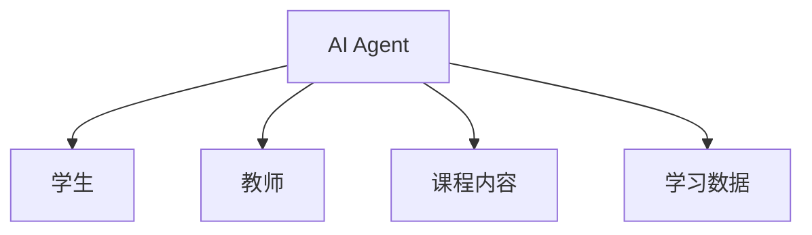
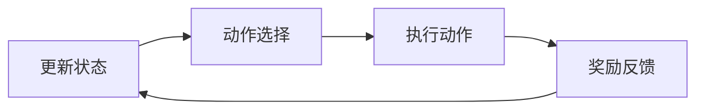
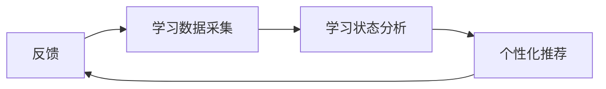
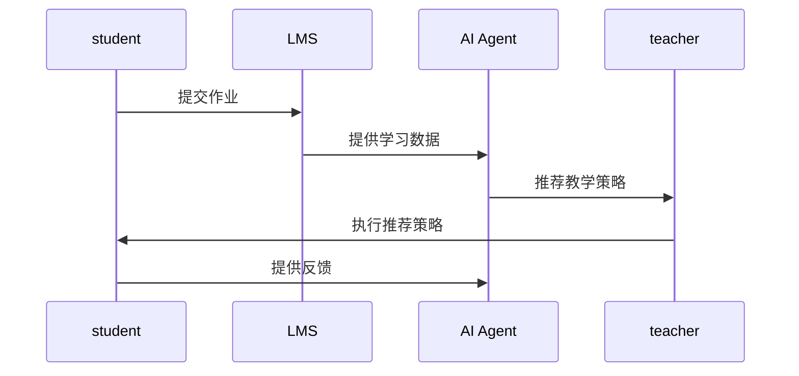

                 


# AI Agent在智能教育系统中的应用

> 关键词：AI Agent, 智能教育系统, 教育技术, 强化学习, 推荐算法, 系统架构

> 摘要：本文详细探讨了AI Agent在智能教育系统中的应用，从基本概念到系统架构，从算法原理到项目实战，全面分析了AI Agent在教育领域的潜力与挑战，为教育技术的创新提供了新的思路。

---

## 第1章: AI Agent的基本概念与教育应用背景

### 1.1 AI Agent的定义与核心原理

AI Agent（人工智能代理）是指能够感知环境并采取行动以实现目标的智能实体。它通过接收输入、处理信息、做出决策并执行操作来与环境交互。AI Agent的核心原理包括感知、推理、决策和执行四个步骤。

- **感知**：通过传感器或其他输入方式获取环境信息。
- **推理**：基于知识库和逻辑推理，理解输入信息的意义。
- **决策**：根据目标和当前状态，选择最优行动方案。
- **执行**：通过执行机构或接口将决策转化为实际操作。

AI Agent在教育中的应用，主要体现在自适应学习、个性化教学和智能辅导等方面。

### 1.2 教育领域的现状与挑战

传统教育系统存在以下问题：
1. **个性化不足**：大规模班级中难以满足每个学生的个性化需求。
2. **效率低下**：教学资源和时间分配不均，部分学生得不到足够的关注。
3. **反馈延迟**：学生在学习过程中难以及时获得反馈，影响学习效果。

AI Agent通过实时数据处理和个性化推荐，可以有效解决这些问题。

### 1.3 AI Agent在教育中的应用前景

AI Agent在教育中的典型应用场景包括：
1. **自适应学习系统**：根据学生的学习进度和能力，动态调整教学内容。
2. **智能辅导系统**：提供即时的答疑和指导，帮助学生解决学习中的难点。
3. **教育资源优化**：通过数据分析，优化课程安排和资源分配。

AI Agent的优势在于其智能化和个性化，但其局限性也在于对数据的依赖和算法的复杂性。

---

## 第2章: AI Agent的核心概念与系统架构

### 2.1 AI Agent的组成与功能模块

AI Agent在教育系统中的组成模块如下：
1. **知识库模块**：存储课程内容、学生信息和教学策略。
2. **行为推理模块**：负责分析学生行为并生成相应的教学建议。
3. **交互接口模块**：提供与学生和教师交互的界面。

### 2.2 AI Agent与教育系统的实体关系图

以下是AI Agent与教育系统实体的关系图：



### 2.3 AI Agent的核心算法与实现原理

AI Agent的核心算法包括强化学习和推荐算法。以下是强化学习的基本流程：



### 2.4 AI Agent的数学模型与公式

强化学习的基本公式如下：

$$ R = r_1 + r_2 + ... + r_n $$

Q-learning算法的更新公式为：

$$ Q(s, a) = Q(s, a) + \alpha (r + \gamma \max Q(s', a')) $$

---

## 第3章: 教育场景中的AI Agent算法设计

### 3.1 基于强化学习的教育AI Agent设计

- **状态空间定义**：学生的当前学习状态，如掌握程度、学习进度。
- **动作空间设计**：推荐的学习策略，如调整教学内容、改变教学速度。
- **奖励函数设计**：根据学生的学习效果给予奖励，如正确回答问题给予正向反馈。

### 3.2 基于推荐算法的教育AI Agent实现

- **协同过滤算法**：通过学生行为数据，推荐相似学生的教学策略。
- **内容推荐算法**：基于课程内容的特征，推荐相关学习资源。

### 3.3 教育AI Agent的数学模型与公式

协同过滤算法的公式为：

$$ sim(i,j) = \frac{\sum_{k=1}^n r_{ik} r_{jk}}{\sqrt{\sum_{k=1}^n r_{ik}^2} \sqrt{\sum_{k=1}^n r_{jk}^2}} $$

---

## 第4章: 系统分析与架构设计方案

### 4.1 问题场景介绍

教育系统中，学生的学习效果参差不齐，教师难以实时掌握每个学生的学习情况。

### 4.2 系统功能设计

系统功能包括：
1. **学生信息采集**：收集学生的学习数据。
2. **学习状态分析**：分析学生的学习进度和能力。
3. **个性化推荐**：推荐适合的学习内容和策略。

### 4.3 系统架构设计

以下是系统的架构图：



### 4.4 系统接口设计

系统接口包括：
1. **数据接口**：与学习管理系统（LMS）对接，获取学生数据。
2. **用户接口**：提供教师和学生的交互界面。

### 4.5 系统交互设计

以下是系统交互流程：



---

## 第5章: 项目实战

### 5.1 环境安装

安装必要的依赖：
```bash
pip install numpy scikit-learn
```

### 5.2 核心代码实现

以下是基于协同过滤的推荐算法实现：

```python
import numpy as np
from sklearn.metrics.pairwise import cosine_similarity

def collaborative_filtering(user_data):
    user_similarity = cosine_similarity(user_data)
    user_recommended = np.argmax(user_similarity, axis=1)
    return user_recommended
```

### 5.3 案例分析

以一个学生的学习数据为例，分析其学习状态并推荐教学策略。

---

## 第6章: 最佳实践与小结

### 6.1 最佳实践

- **数据质量**：确保数据的准确性和完整性。
- **模型优化**：定期更新模型，适应新的数据和需求。
- **用户体验**：设计直观易用的交互界面，提升用户体验。

### 6.2 小结

本文详细探讨了AI Agent在智能教育系统中的应用，从核心概念到系统架构，从算法实现到项目实战，全面分析了其在教育领域的潜力。未来，随着技术的发展，AI Agent将在教育中发挥更大的作用。

---

## 作者：AI天才研究院 & 禅与计算机程序设计艺术

