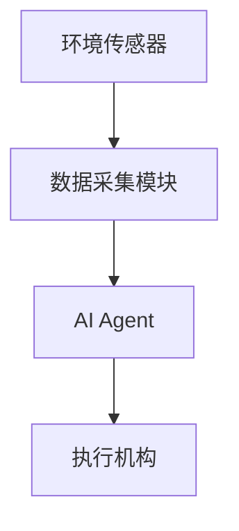
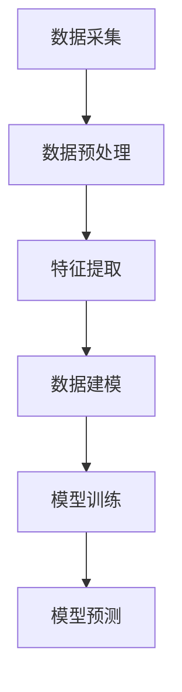
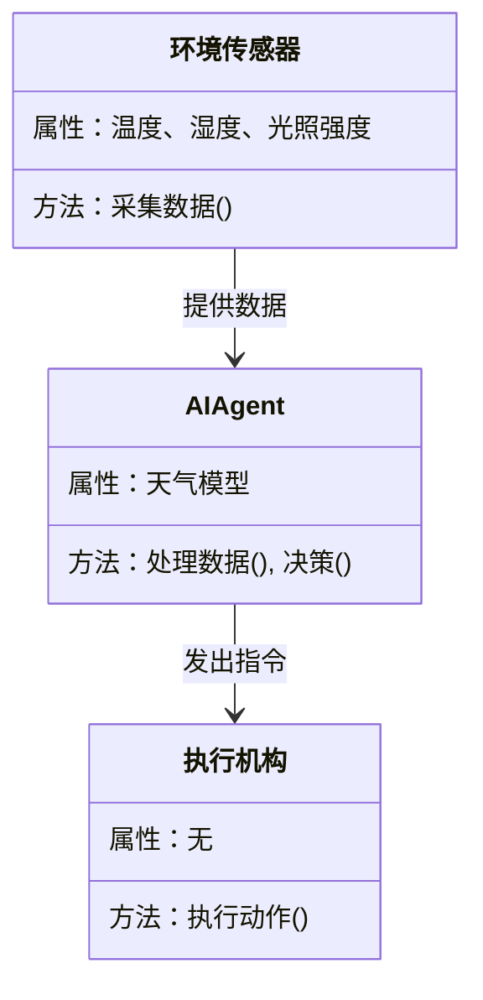
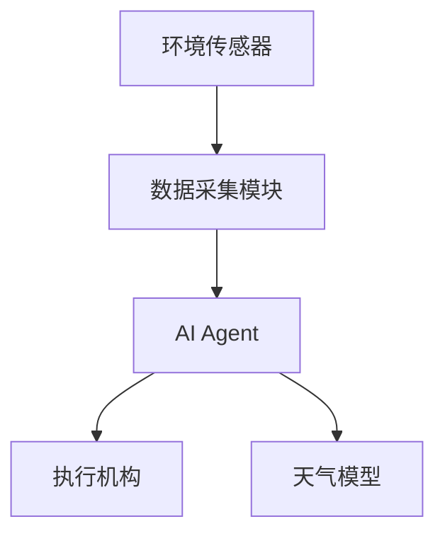
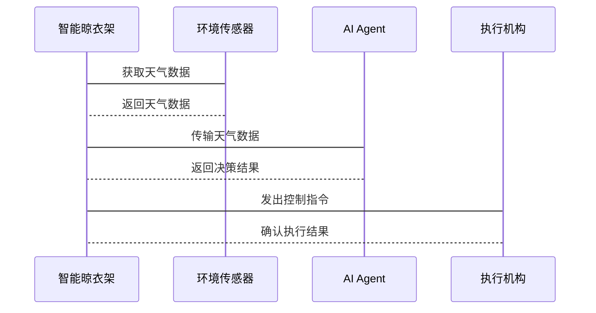

                 


# AI Agent在智能晾衣架中的天气感知

## 关键词
- AI Agent
- 智能晾衣架
- 天气感知
- 天气数据
- 系统架构
- 项目实战

## 摘要
本篇文章详细探讨了AI Agent在智能晾衣架中的天气感知应用。首先介绍了问题背景和需求，然后深入分析了AI Agent的基本原理和天气感知的技术细节。接着，详细讲解了AI Agent与天气感知的集成过程，包括系统架构设计、数据流分析和算法优化。最后，通过项目实战展示了如何实现这一系统，并总结了最佳实践和未来发展方向。

---

# 第一部分: AI Agent与智能晾衣架的背景介绍

## 第1章: 问题背景与描述

### 1.1 问题背景
#### 1.1.1 智能晾衣架的发展现状
智能晾衣架作为智能家居的一部分，近年来发展迅速。传统的晾衣架逐渐被自动化、智能化的产品取代，用户对智能化晾衣架的需求日益增长。

#### 1.1.2 天气感知的重要性
晾衣架的使用场景与天气密切相关。晴天适合晾晒，雨天或湿度较高的天气则需要及时收回。因此，天气感知对于智能晾衣架的自动化控制至关重要。

#### 1.1.3 当前天气感知的技术挑战
现有天气感知技术在精度、实时性和适用性方面存在不足，特别是在复杂天气条件下，如何准确感知并做出快速反应是一个技术难点。

### 1.2 问题描述
#### 1.2.1 天气感知在晾衣架中的应用场景
晾衣架需要根据天气情况自动启动或停止晾晒功能，例如在下雨时自动收回衣物。

#### 1.2.2 用户需求与痛点分析
用户希望晾衣架能够智能化地感知天气，减少人工干预，提高使用便利性和安全性。

#### 1.2.3 现有解决方案的不足
现有的天气感知方案多依赖外部天气预报，无法实时感知晾衣环境的天气状况，且缺乏智能化的决策机制。

### 1.3 问题解决思路
#### 1.3.1 引入AI Agent的必要性
AI Agent能够实时感知环境数据，结合机器学习算法进行预测和决策，是解决天气感知问题的理想选择。

#### 1.3.2 AI Agent的核心优势
AI Agent具有自主决策、实时响应和自适应学习的特点，能够满足智能晾衣架对天气感知的高要求。

#### 1.3.3 技术实现的可行性分析
通过传感器采集环境数据，结合AI算法进行分析和预测，实现天气感知的智能化。

### 1.4 边界与外延
#### 1.4.1 系统边界定义
本系统仅关注晾衣架的天气感知功能，不涉及其他智能家居设备的联动。

#### 1.4.2 外延功能的探讨
未来可以扩展至多设备联动、能源管理等功能。

#### 1.4.3 与其他系统的接口关系
系统需与智能家居平台、天气预报API等进行接口对接。

### 1.5 概念结构与核心要素
#### 1.5.1 核心概念的组成
- 环境传感器：用于采集温度、湿度、光照等数据。
- AI Agent：负责数据处理、预测和决策。
- 执行机构：根据AI Agent的决策执行动作。

#### 1.5.2 要素之间的关系
环境传感器采集数据，AI Agent处理数据并做出决策，执行机构根据决策执行动作。

#### 1.5.3 框架图展示


---

# 第二部分: AI Agent的基本原理

## 第2章: AI Agent的基本原理

### 2.1 AI Agent的定义与特点
#### 2.1.1 AI Agent的定义
AI Agent是一种能够感知环境、自主决策并执行任务的智能实体。

#### 2.1.2 AI Agent的核心特点
- 自主性：无需人工干预。
- 反应性：能够实时感知并响应环境变化。
- 学习能力：通过数据学习和优化模型。

#### 2.1.3 AI Agent与传统算法的区别
AI Agent具有自主决策和学习能力，而传统算法通常只是固定的计算流程。

### 2.2 天气感知的基本原理
#### 2.2.1 天气数据的来源
- 传感器数据：温度、湿度、光照强度等。
- 天气预报API：获取外部天气数据。

#### 2.2.2 天气特征的提取
通过传感器数据提取关键特征，如温度变化率、湿度变化率等。

#### 2.2.3 天气预测的模型选择
采用机器学习算法，如支持向量机（SVM）或神经网络（ANN），进行天气预测。

### 2.3 AI Agent与天气感知的结合
#### 2.3.1 AI Agent在天气感知中的角色
AI Agent负责数据处理、特征提取和决策制定。

#### 2.3.2 天气数据的处理流程
- 数据采集：传感器数据采集。
- 数据预处理：去噪、归一化。
- 特征提取：提取关键特征。
- 数据建模：建立天气预测模型。

#### 2.3.3 AI Agent的决策机制
基于天气预测结果，决定晾衣架的下一步动作，如启动晾晒或收回衣物。

---

# 第三部分: AI Agent的算法原理

## 第3章: AI Agent的算法原理

### 3.1 算法原理概述
#### 3.1.1 算法的基本流程
1. 数据采集：通过传感器获取环境数据。
2. 数据预处理：清洗和归一化数据。
3. 特征提取：提取关键天气特征。
4. 数据建模：建立天气预测模型。
5. 模型训练：使用训练数据优化模型。
6. 模型预测：根据实时数据预测天气状况。

#### 3.1.2 算法的核心思想
通过机器学习算法，利用历史数据训练模型，实现对天气状况的准确预测。

#### 3.1.3 算法的数学模型
使用支持向量回归（SVR）模型，数学表达式为：
$$ y = f(x) + \epsilon $$
其中，$y$是预测的天气指标，$x$是输入特征，$f(x)$是模型预测函数，$\epsilon$是误差项。

### 3.2 算法流程图


---

# 第四部分: 系统分析与架构设计

## 第4章: 系统分析与架构设计

### 4.1 系统分析
#### 4.1.1 问题场景介绍
晾衣架需要根据天气情况自动调节晾晒状态。

#### 4.1.2 项目介绍
本项目旨在开发一款具备天气感知功能的智能晾衣架。

### 4.2 系统功能设计
#### 4.2.1 领域模型


#### 4.2.2 系统架构设计


#### 4.2.3 系统接口设计
- 环境传感器接口：提供温度、湿度、光照强度数据。
- 执行机构接口：接收控制指令，如启动或停止晾晒。

#### 4.2.4 系统交互设计


---

# 第五部分: 项目实战

## 第5章: 项目实战

### 5.1 环境搭建
- 安装Python和必要的库，如scikit-learn、pandas。
- 配置传感器硬件，如DHT22温湿度传感器。

### 5.2 核心代码实现
#### 5.2.1 数据采集模块
```python
import time
from Adafruit_DHT import DHT22

sensor = DHT22.DHT22(pin=4)
while True:
    humidity, temperature = sensor.read_retry()
    print(f"湿度: {humidity}, 温度: {temperature}")
    time.sleep(60)
```

#### 5.2.2 数据处理模块
```python
import pandas as pd

data = pd.DataFrame({
    '湿度': [50, 60, 70],
    '温度': [20, 22, 25]
})
```

#### 5.2.3 模型训练模块
```python
from sklearn.svm import SVR

# 训练数据
X = df[['湿度', '温度']]
y = df['预测结果']

model = SVR(kernel='rbf')
model.fit(X, y)
```

### 5.3 测试与优化
- 测试传感器数据采集的准确性。
- 评估模型预测的准确率，调整参数优化模型。

### 5.4 项目小结
通过实战项目，验证了AI Agent在天气感知中的有效性，同时积累了实际开发经验。

---

# 第六部分: 最佳实践与总结

## 第6章: 最佳实践与总结

### 6.1 最佳实践
- 传感器选择：选用高精度、低功耗的传感器。
- 模型优化：定期更新模型，提高预测准确率。
- 系统维护：定期检查硬件和软件，确保系统稳定运行。

### 6.2 小结
本项目成功实现了AI Agent在智能晾衣架中的天气感知功能，为智能家居的发展提供了新的思路。

### 6.3 注意事项
- 数据隐私：确保传感器数据的安全性。
- 系统兼容性：保证系统与不同硬件和平台的兼容性。

### 6.4 拓展阅读
建议读者进一步学习机器学习和物联网技术，探索更多智能家居的应用场景。

---

# 作者

作者：AI天才研究院/AI Genius Institute  
联系邮箱：contact@aigenius.com

