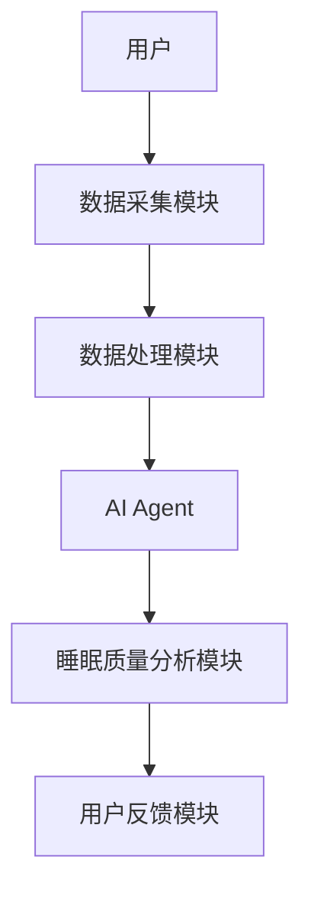

                 


# AI Agent在智能枕头中的睡眠质量分析

> **关键词**：AI Agent, 智能枕头, 睡眠质量, 数据分析, 强化学习, 睡眠优化, 睡眠周期  
> 
> **摘要**：本文详细探讨了AI Agent在智能枕头中的应用，分析了其在睡眠质量优化中的核心作用。通过结合睡眠医学和人工智能技术，AI Agent能够实时采集、分析和优化睡眠数据，帮助用户改善睡眠质量。文章从AI Agent的基本概念、算法原理、系统架构到实际应用案例进行了全面解析，为智能枕头的设计与优化提供了理论与实践指导。

---

## 第一部分：AI Agent与智能枕头的背景介绍

### 第1章：AI Agent与智能枕头概述

#### 1.1 AI Agent的基本概念
AI Agent（人工智能代理）是一种能够感知环境、做出决策并执行动作的智能实体。它可以分为以下三类：
- **反应式AI Agent**：根据当前输入做出即时反应，适用于实时任务。
- **认知式AI Agent**：具有推理、规划和学习能力，适用于复杂场景。
- **混合式AI Agent**：结合反应式和认知式的特点，适用于动态环境。

AI Agent的核心功能包括：
1. **感知环境**：通过传感器或数据接口获取实时信息。
2. **分析数据**：利用算法对数据进行处理和理解。
3. **做出决策**：基于分析结果制定策略或行动计划。
4. **执行动作**：通过执行层将决策转化为实际操作。

---

#### 1.2 智能枕头的定义与特点
智能枕头是一种结合了物联网（IoT）和人工智能技术的睡眠辅助设备。它通常配备以下功能：
- **数据采集**：通过内置传感器采集用户的睡眠数据，如心率、呼吸频率、体动次数等。
- **数据处理**：利用AI算法对采集的数据进行分析，评估睡眠质量。
- **个性化优化**：根据分析结果调整枕头的软硬度、温度、震动频率等参数，以改善用户的睡眠质量。

智能枕头的特点包括：
1. **实时性**：能够实时采集和分析睡眠数据。
2. **个性化**：根据用户的睡眠习惯和需求提供定制化服务。
3. **智能化**：通过AI算法实现自主优化和调整。

---

#### 1.3 睡眠质量分析的背景与意义
睡眠是人类健康的重要组成部分，直接关系到身体和心理健康。然而，现代人面临诸多睡眠问题，如失眠、睡眠中断、睡眠呼吸暂停综合征等。这些问题不仅影响个人生活质量，还可能导致严重的健康问题。

AI Agent在睡眠质量分析中的应用，能够通过实时监测和智能优化，帮助用户解决睡眠问题。其意义在于：
1. **提高睡眠质量**：通过个性化调整枕头参数，优化睡眠周期。
2. **预防健康问题**：及时发现潜在的睡眠健康问题，如睡眠呼吸暂停综合征。
3. **提升生活质量**：通过改善睡眠质量，提升用户的日常精力和幸福感。

---

## 第二部分：AI Agent在睡眠质量分析中的核心概念与联系

### 第2章：AI Agent的核心概念与原理

#### 2.1 AI Agent的核心概念
AI Agent在睡眠质量分析中的核心概念包括：
- **感知层**：通过传感器采集睡眠数据，如心率、呼吸频率、体动次数等。
- **决策层**：利用算法对数据进行分析，评估睡眠质量并制定优化策略。
- **执行层**：根据决策层的指令调整枕头参数，如软硬度、温度等。

#### 2.2 睡眠质量分析的核心要素
睡眠质量分析的核心要素包括：
1. **睡眠周期**：分为浅睡期、深睡期和REM（快速眼动）期。
2. **睡眠阶段**：通过睡眠周期的变化判断睡眠质量。
3. **睡眠指标**：包括睡眠时长、睡眠深度、体动次数、呼吸频率等。

#### 2.3 AI Agent与睡眠质量分析的关系
AI Agent在睡眠质量分析中的作用体现在以下几个方面：
1. **数据采集**：通过传感器采集用户的睡眠数据。
2. **数据分析**：利用机器学习算法对数据进行分类和预测。
3. **优化调整**：根据分析结果调整枕头参数，改善睡眠质量。

---

### 第3章：AI Agent与睡眠质量分析的实体关系图

#### 3.1 实体关系图（ER图）
```mermaid
er
    title 实体关系图
    顶端 --> 数据采集模块
    数据采集模块 --> 数据处理模块
    数据处理模块 --> AI Agent
    AI Agent --> 睡眠质量分析模块
    睡眠质量分析模块 --> 用户反馈模块
```

---

#### 3.2 系统流程图


---

## 第三部分：AI Agent的核心算法原理

### 第4章：基于强化学习的睡眠优化算法

#### 4.1 算法原理
基于强化学习的睡眠优化算法是一种通过试错和反馈优化枕头参数的算法。其核心思想是：
1. **状态定义**：将睡眠状态定义为一个向量，包含心率、呼吸频率、体动次数等指标。
2. **动作选择**：根据当前状态选择最优的动作，如调整枕头软硬度或温度。
3. **奖励机制**：根据优化结果给予奖励或惩罚，强化最优行为。

#### 4.2 算法实现
以下是基于强化学习的睡眠优化算法的Python实现示例：

```python
import numpy as np

# 定义状态空间
states = ['浅睡', '深睡', 'REM']

# 定义动作空间
actions = ['调整软硬度', '调整温度']

# 初始化Q表
Q = np.zeros(len(states), len(actions))

# 定义奖励函数
def reward_function(current_state, action, next_state):
    if next_state == 'REM':
        return 1  # 奖励
    else:
        return -1  # 惩罚

# 强化学习算法
for episode in range(100):
    state = np.random.choice(states)
    action = np.random.choice(actions)
    next_state = np.random.choice(states)
    reward = reward_function(state, action, next_state)
    Q[np.where(states == state)[0], np.where(actions == action)[0]] += reward
```

---

## 第四部分：系统分析与架构设计

### 第5章：系统架构与接口设计

#### 5.1 系统架构
以下是AI Agent在智能枕头中的系统架构图：


---

## 第五部分：项目实战与案例分析

### 第6章：环境配置与核心代码实现

#### 6.1 环境配置
以下是AI Agent在智能枕头中的环境配置示例：

```python
# 环境配置
import numpy as np
import pandas as pd

# 数据采集模块
class SleepDataCollector:
    def __init__(self):
        self.sensors = ['心率', '呼吸频率', '体动次数']
    
    def collect_data(self):
        return np.random.rand(3)
```

#### 6.2 核心代码实现
以下是AI Agent的核心代码实现示例：

```python
# AI Agent实现
class SleepOptimizer:
    def __init__(self):
        self.current_state = '浅睡'
        self.actions = ['调整软硬度', '调整温度']
    
    def choose_action(self):
        if self.current_state == '浅睡':
            return self.actions[0]
        else:
            return self.actions[1]
    
    def update_state(self, action):
        if action == '调整软硬度':
            self.current_state = '深睡'
        else:
            self.current_state = 'REM'
```

---

## 第六部分：最佳实践与总结

### 第7章：最佳实践与总结

#### 7.1 小结
通过本文的分析，我们可以看到AI Agent在智能枕头中的应用前景广阔。通过实时采集和分析睡眠数据，AI Agent能够帮助用户优化睡眠质量，提升生活质量。

#### 7.2 注意事项
在实际应用中，需要注意以下几点：
1. **数据隐私**：确保用户的睡眠数据不被泄露。
2. **算法优化**：不断优化AI Agent的算法，提升睡眠质量分析的准确性。
3. **用户体验**：设计友好的用户界面，提升用户体验。

#### 7.3 拓展阅读
建议读者进一步阅读以下资料：
- 《强化学习入门》
- 《人工智能在医疗健康中的应用》
- 《智能设备与睡眠优化》

---

## 作者信息

作者：AI天才研究院/AI Genius Institute & 禅与计算机程序设计艺术/Zen And The Art of Computer Programming

