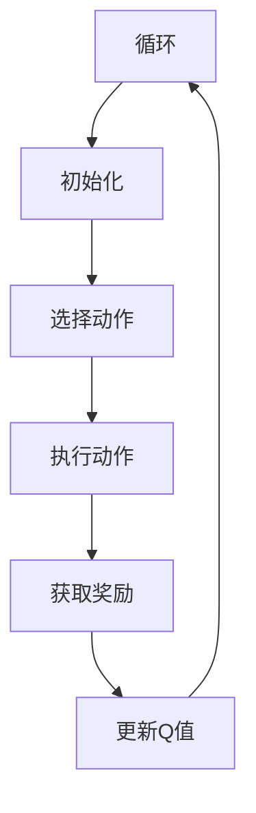
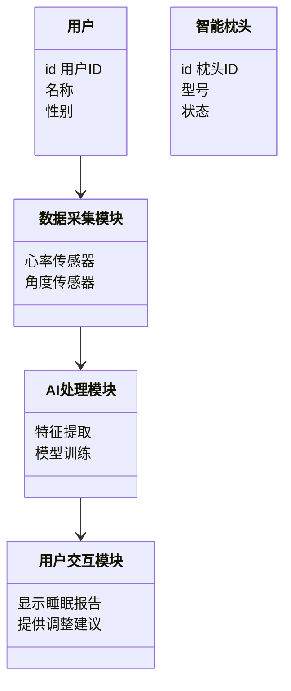
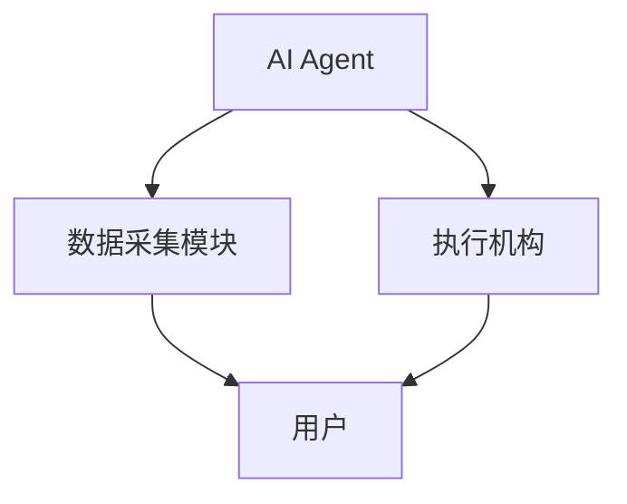

                 


# AI Agent在智能枕头中的颈椎保护

> 关键词：AI Agent, 智能枕头, 颈椎保护, 强化学习, 智能健康, 睡眠监测

> 摘要：本文深入探讨了AI Agent在智能枕头中的应用，特别是如何通过AI技术实现颈椎保护。从背景介绍到算法原理，再到系统设计和项目实战，详细分析了AI Agent在智能枕头中的核心作用，展示了如何通过技术创新改善颈椎健康问题。

---

# 第一部分：AI Agent与智能枕头的背景与概念

## 第1章：颈椎健康与AI Agent的引入

### 1.1 颈椎健康的重要性

#### 1.1.1 颈椎的功能与健康问题
颈椎是人体的重要部位，负责支撑头部、保护神经和血管。现代生活方式，尤其是长时间的久坐和不良姿势，导致颈椎问题日益严重，如颈椎病、椎间盘突出等。

#### 1.1.2 现代生活方式对颈椎的影响
随着科技的发展，人们越来越依赖电子设备，长时间低头导致颈椎压力增加，颈椎健康问题逐渐年轻化。

#### 1.1.3 颈椎健康与智能技术的结合
智能技术的快速发展为颈椎健康提供了新的解决方案。通过智能设备监测颈椎健康，结合AI技术进行个性化调整，成为未来健康管理的重要方向。

### 1.2 AI Agent的基本概念

#### 1.2.1 什么是AI Agent
AI Agent（智能代理）是一种能够感知环境、自主决策并执行任务的智能系统。它可以理解用户需求，主动提供解决方案。

#### 1.2.2 AI Agent的核心功能与特点
- **感知环境**：通过传感器或数据接口获取环境信息。
- **自主决策**：基于获取的信息，通过算法做出决策。
- **执行任务**：根据决策结果执行相应的操作。
- **学习优化**：通过反馈不断优化自身算法。

#### 1.2.3 AI Agent在智能设备中的应用
AI Agent广泛应用于智能家居、医疗设备、自动驾驶等领域。在智能枕头中，AI Agent主要用于监测睡眠状态、调整枕头参数，以保护颈椎健康。

## 第2章：智能枕头的设计与需求分析

### 2.1 智能枕头的功能需求

#### 2.1.1 睡眠监测与分析
智能枕头需要监测用户的睡眠状态，包括心率、呼吸频率、翻身次数等。

#### 2.1.2 颈椎健康评估
通过监测颈椎的压力和姿势，评估用户的颈椎健康状况。

#### 2.1.3 智能调节与反馈
根据监测数据，智能调节枕头的硬度、高度和角度，提供个性化的睡眠解决方案。

### 2.2 AI Agent在智能枕头中的角色

#### 2.2.1 数据采集与处理
AI Agent通过传感器采集用户的生理数据和睡眠环境数据。

#### 2.2.2 AI算法与决策
基于采集的数据，AI Agent利用机器学习算法分析用户的需求，做出最优决策。

#### 2.2.3 用户反馈与优化
根据用户的反馈，AI Agent不断优化自身的算法和决策模型。

---

# 第二部分：AI Agent的核心技术与算法

## 第3章：AI Agent的核心算法原理

### 3.1 基于强化学习的决策算法

#### 3.1.1 强化学习的基本原理
强化学习是一种通过试错机制来优化决策的算法。智能体通过与环境互动，学习最优策略。

#### 3.1.2 Q-learning算法的数学模型
Q-learning的数学模型如下：
$$ Q(s, a) = Q(s, a) + \alpha (r + \gamma \max_{a'} Q(s', a') - Q(s, a)) $$
其中：
- \( Q(s, a) \) 表示状态 \( s \) 下动作 \( a \) 的价值。
- \( \alpha \) 是学习率。
- \( r \) 是奖励。
- \( \gamma \) 是折扣因子。

#### 3.1.3 算法流程图（Mermaid）


### 3.2 算法实现与优化

#### 3.2.1 算法实现的Python代码
```python
import numpy as np

class AI-Agent:
    def __init__(self, state_space, action_space):
        self.state_space = state_space
        self.action_space = action_space
        self.Q = np.zeros((state_space, action_space))
        self.learning_rate = 0.1
        self.gamma = 0.9

    def choose_action(self, state):
        if np.random.random() < 0.1:
            return np.random.randint(self.action_space)
        else:
            return np.argmax(self.Q[state])

    def update_Q(self, state, action, reward, next_state):
        self.Q[state, action] += self.learning_rate * (reward + self.gamma * np.max(self.Q[next_state]) - self.Q[state, action])

# 示例用法
agent = AI-Agent(5, 3)
agent.choose_action(0)
agent.update_Q(0, 0, 1, 1)
```

#### 3.2.2 算法优化策略
- **经验重放**：将历史数据存储起来，随机抽取进行训练，避免重复样本。
- **网络结构**：使用深度神经网络替代传统Q表，提高算法效率。

---

## 第4章：AI Agent与智能枕头的实体关系图

### 4.1 实体关系分析

#### 4.1.1 用户与智能枕头的关系
- 用户通过智能枕头进行睡眠监测和调整。
- AI Agent根据用户的睡眠数据提供个性化服务。

#### 4.1.2 AI Agent与数据采集模块的关系
- AI Agent接收数据采集模块的信号。
- 数据采集模块包括心率传感器、角度传感器等。

#### 4.1.3 AI Agent与执行机构的关系
- AI Agent根据决策结果，驱动执行机构调整枕头参数。
- 执行机构包括电机、气囊等。

### 4.2 ER实体关系图（Mermaid）
```mermaid
er
    entity 用户 {
        id 用户ID
        名称
        性别
    }
    
    entity 智能枕头 {
        id 枕头ID
        型号
        状态
    }
    
    entity AI Agent {
        id AgentID
        类型
        状态
    }
    
    relationship 用户-智能枕头 {
        用户拥有智能枕头
    }
    
    relationship AI Agent-智能枕头 {
        AI Agent控制智能枕头
    }
```

---

# 第三部分：系统架构与实现

## 第5章：智能枕头的系统架构设计

### 5.1 系统功能模块划分

#### 5.1.1 数据采集模块
- 采集用户的生理数据和环境数据。
- 包括心率传感器、角度传感器等。

#### 5.1.2 AI处理模块
- 对数据进行分析和处理。
- 包括特征提取、模型训练等。

#### 5.1.3 用户交互模块
- 提供用户界面，显示睡眠报告和调整建议。
- 包括LED显示、语音反馈等。

### 5.2 系统功能设计（领域模型Mermaid类图）



---

## 第6章：AI Agent与智能枕头的交互设计

### 6.1 系统架构设计（Mermaid架构图）



### 6.2 系统接口设计

#### 6.2.1 数据接口
- 传感器数据接口：提供心率、角度等数据。
- 用户数据接口：提供用户基本信息。

#### 6.2.2 控制接口
- AI Agent通过控制接口驱动执行机构调整枕头参数。

---

## 第7章：项目实战

### 7.1 环境安装

#### 7.1.1 系统需求
- 操作系统：Windows 10/ macOS 10.15/ Ubuntu 20.04
- 硬件需求：支持AI处理的芯片，如GPU
- 软件需求：Python 3.8+, TensorFlow, scikit-learn

### 7.2 核心代码实现

#### 7.2.1 数据采集模块
```python
import serial

class DataCollector:
    def __init__(self, port):
        self.serial = serial.Serial(port, 9600)
    
    def collect_data(self):
        data = self.serial.readline().decode()
        return data
```

#### 7.2.2 AI处理模块
```python
import tensorflow as tf

model = tf.keras.Sequential([
    tf.keras.layers.Dense(64, activation='relu'),
    tf.keras.layers.Dense(1, activation='sigmoid')
])
model.compile(optimizer='adam', loss='binary_crossentropy')
model.fit(X_train, y_train, epochs=10)
```

### 7.3 代码解读与分析

#### 7.3.1 数据采集模块
- 使用串口接收传感器数据。
- 数据格式化后返回。

#### 7.3.2 AI处理模块
- 构建神经网络模型。
- 训练模型以分类睡眠状态。

---

## 第8章：应用案例与优化

### 8.1 应用案例分析
- **案例1**：用户A长期低头工作，颈椎压力大。
- **AI Agent**：根据监测数据调整枕头高度，改善睡眠质量。

### 8.2 优化方向

#### 8.2.1 多模态数据融合
- 结合心率、血压等多种数据，提高监测精度。

#### 8.2.2 边缘计算优化
- 将部分计算任务转移到边缘设备，降低延迟。

---

## 第9章：总结与展望

### 9.1 总结
本文详细探讨了AI Agent在智能枕头中的应用，展示了如何通过AI技术改善颈椎健康问题。

### 9.2 展望
未来，AI Agent在智能健康领域的应用将更加广泛，结合物联网技术，实现更智能、更个性化的健康解决方案。

---

# 作者：AI天才研究院/AI Genius Institute & 禅与计算机程序设计艺术 /Zen And The Art of Computer Programming

---

通过以上结构，您可以根据需要进一步扩展和补充内容，确保文章的完整性和深度。

